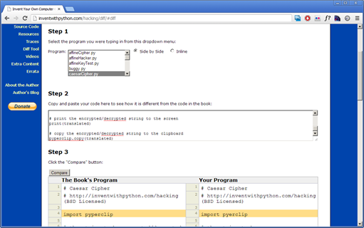
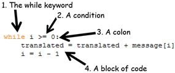

###第五章 反向密码    
本章将介绍：   
·         len()函数    
·         while循环    
·         Boolean数据类型    
·         比较操作符    
·         条件    
·         块        

“每个人的身边都会有一群自发的间谍。”
    

简·奥斯丁
    

###反向密码
反向密码加密的方法就是将消息以反向的方式输出。于是“Hello world!”就会被加密为“!dlrow olleH”。解密的时候，只要将反向的消息再做一次反向就可以了。加密和解密的步骤是一样的。    

反向加密是一种非常弱的加密方法。事实上只要稍微留意看一下就会发现密文只不过是明文的反向显示而已。么什是的说它出看够能是还能可很你，了密加被经已话句这然虽，说如比    

不过用于反向加密的程序很容易解释并理解，于是我决定用它来作为我们的第一个密码程序。    

###反向密码程序源代码    
在IDLE中，选择File ► New Window来打开一个新的文件编辑窗口。在里面输入下面的程序，保存为reverseCipher.py。然后按下<kbd>F5</kbd>运行这个程序（记住咯，不要输入每一行开始的行号）    

Source code for reverseCipher.py

 1. # Reverse Cipher

 2. <spa class=SourceCodeComment># http://inventwithpython.com/hacking (BSD Licensed)

 3. 

 4. message = 'Three can keep a secret, if two of them are dead.'

 5. translated = ''

 6. 

 7. i = len(message) - 1

 8. while i &gt;= 0:

 9.     translated = translated + message[i]

10.     i = i - 1

11. 

12. print(translated)

###运行反向加密程序
运行这个程序得到下面的结果：    

.daed era meht fo owt fi ,terces a peek nac eerhT

解密的时候，将“.daed era meht fo owt fi ,terces a peek nac eerhT”复制到剪贴板（<a>http://invpy.com/copypast</a>有如何复制黏贴的教程）然后再黏贴到第4行中作为字符串message的值。注意，在字符串的开始和结尾要有单引号把字符串包围起来。新的第4行就像下面一样（改动的部分用 *加粗* 表示）      

reverseCipher.py 

 4. message = <strong>'.daed era meht fo owt fi ,terces a peek nac eerhT'</strong>

再次运行reverseCipher.py这个程序，输出的结果将会是解密后的原文。    

Three can keep a secret, if two of them are dead.

###用在线的Diff工具来检查源代码    
尽管可以在本书的网站中复制黏贴或者下载代码，自己动手输入源代码对于学习来说还是很有用的。这样做可以帮助你更好的理解这些代码。不过，手动输入的时候有可能会出现输入的错误。    

可以使用本书网站上的diff工具来比较你自己输入的代码。将你的代码复制并在浏览器中打开<a>http://invpy.com/hackingdiff</a>。把复制的代码黏贴在网页的文本框中，然后点击Compare按钮。这个diff工具就会显示出你输入的代码和本书中的代码中的任何差别。这样就可以很简单的找到导致程序出错的错误输入了。    

图 5-1. <u>http://invpy/hackingdiff</u>中的在线diff工具

###代码是如何工作的

reverseCipher.py 

 1. # Reverse Cipher

 2. # http://inventwithpython.com/hacking (BSD Licensed)

头两行是注释，用来说明程序做什么用，以及可以找到这段程序的网站链接。“BSD Licensed”这一部分指的是任何人都可以免费拷贝或是修改这段代码，只要保留原作者的著作权信息就可以（对于这段代码而言，这个信息就是本书网站的网址<a>http://inventwithpython.com/hacking</a>）（Berkeley Software Distribution，BSD， licence的全文可以在<a>http://invpy.com/bsd</a>找到）。我把这段信息放在文件中，这样做是为了当别人在网上拷贝到这段程序的时候可以知道去哪里找到它的原始版本。也可以让他人知道这段代码是开源的软件，可以免费的使用及传播。   

reverseCipher.py 

4. message = 'Three can keep a secret, if two of them are dead.'

第4行将我们要加密的字符串储存在名为message的变量中。以后要加密新的字符串的时候，只需要把该字符串直接输入到第4行中的代码作为message的值就可以了。（本书中的程序不会调用input()函数，而是要求用户在代码中输入要加密的字符串。【译者：为什么呐？】如果需要加密不一样的字符串，读者只要在运行程序之前在源代码中输入该字符串就可以了）。    

reverseCipher.py 

5. translated = ''

变量translated将用来存储反向加密过后的字符串。在程序开始的时候，它是一个空串。（注意空串是用两个单引号表示的，而不是一个双引号哦）。    

###len()函数   

reverseCipher.py 

7. i = len(message) - 1

第6行只是一个空白行，Python直接忽视。下一行程序在第7行。这一行程序只是一个赋值语句，将len(message) - 1表达式的值计算出来并存储在一个叫做i的变量中。    
表达式的第一部分是len(message)，是对len()函数的一个调用。在这里len()函数接受一个字符串类型的参数（就像print()函数一样），然后返回一个整数值：输入字符串的字符数（也就是那个字符串的长度）。在这里，我们将message传给len()，所以len(message)就会告诉我们有多少个字符在message所表示的字符串中。    
我们可以在命令行中试用以下这个len()函数。输入下面的语句：    

&gt;&gt;&gt; len('Hello')

5

&gt;&gt;&gt; len('')

0

&gt;&gt;&gt; spam = 'Al'

&gt;&gt;&gt;
len(spam)

2

&gt;&gt;&gt; len('Hello' + ' ' + 'world!')

12

&gt;&gt;&gt;&nbsp;

由len()的返回值我们得知，字符串’Hello’有5个字符，空字符串有0个字符。把‘A1’存在变量中并把该变量传递给len()，就会得到2。如果将表达式’Hello’ + ‘ ‘ + ‘world!’交给len()函数，就会得到返回值12。这是因为’Hello’ + ‘ ‘ + ‘world!’会计算出字符串结果‘Hello world!’，正好有个12个字符。（其中空格和感叹号也算是字符）    
第7行中我们得到了message中的字符数，减去1，然后把这个数字保存在变量i中。这将作为message字符串中最后一个字符的索引值。     

###认识while循环

reverseCipher.py 

 8. while i &gt;= 0:

上面的代码是一种新的Python指令，叫做while循环，或者while声明。while循环由4部分组成：    
1. while这个关键词    
2. 表达式（也称为条件表达式），它将通过计算得出一个布尔值True或者是False。（布尔值将在下一章中介绍）    
3. 冒号：    
4. 跟随在冒号之后的用缩进表示的一段代码，也就是第9和第10行。（代码段将在本章稍后介绍）    

图 5-2. while循环的组成部分

要理解while循环，首先要了解布尔值，比较操作符，以及代码段。   

###布尔类型
布尔类型只有两个值：True和False。这两个值是大小写敏感的（使用的时候T和F一定要大写，其他的一定要小写）。它们不是字符串值，因此不需要用引号‘把True或者False包括起来。