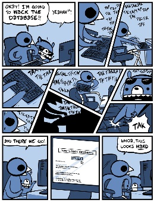

#用Python破译密码

Al Sweigart 著

Justin Huang 译

---

2013 版权所有 Al Sweigart 
保留部分版权。本书的授权基于许可证Creative Common Attribution-Noncommercial-Share Alike 3.0 United States License。

只要满足以下条件：   
* 姓名标示：本书的著作权属于作者，对本书的任何形式使用必须遵守许可证的要求予以注明。（但这不代表已经获得作者批准）（这包括这对本书的任何引用中注明书名以及作者的名字）  
* 非商业性：不得将本书用于任何商业用途  
* 相关分享：只要对本书中内容进行修改、变化或是基于本书内容完成的作品，必须以相同的许可证（license）分享发布。

任何人可以免费  
* 分享：包括拷贝、传播、展示以及使用书中的内容  
* 加工：结合本书中的内容制作相关的产品   

以上描述也可以在这个链接中找到： http://creativecommons.org/licenses/by-nc-sa/3.0/us/ 。对本书的正常使用以及读者的其他权益不会受到上述条例的影响。对于本书用到的许可证，有一份容易理解的总结可以中这个链接中找到：http://creativecommons.org/licenses/by-nc-sa/3.0/us/legalcode 。  

关于第三版   
在此特别鸣谢Ari Lacenski。非常感谢她。如果没有她的帮助，基本上书中的每一页都有拼写错误。  
感谢Jason Kibbe。   
封面中锁的相片来自“walknboston”的 http://www.flickr.com/photos/walkn/3859852351/ 。   
罗密欧与朱丽叶等已经发表的文字则是取自Project Gutenberg这一项目。  
有很多图片来自Wikipedia。  
布满皱痕的纸张图片是Pink Sherbet的摄影作品，在 http://www.flickr.com/photos/pinksherbet/2978651767/ 。  
书中计算机用户的图标是Katzenbaer的作品。   

#####如果您通过BT下载了本书，很可能它已经过时了。请到 http://inventwithpython.com/hacking 去下载本书的最新版本。  

ISBN 978-1482614374   
第一版

---

Nedroid Picture Diary by Anthony Clark, http://nedroid.com

在电影或是电视里面看到大虾们黑掉人家的电脑总是很热血的：疯狂地敲键盘，然后一堆毫无意义的1和0在屏幕上狂飙。这些影视作品让人们觉得黑客技术(hecking)非天才不能学之：简直就是魔术。   

**可是它并不是魔术。hecking是基于计算机的技术，而计算机所做的一切都是有逻辑原理根据的，学习并搞懂了这些原理，也就掌握了hacking这门技术。**哪怕有时候不了解当中的原理或者是计算机的所作所为让人摸不着头脑，也一定、肯定、必定会有其原因可以追寻。    
而且这些东东也不难学。本书一开始就假设你对密码学甚至编写程序一无所知，然后让你一点一点地学习如何编写破解加密信息的程序。希望你能快乐学习，同时也祝你好运咯！   

---

本书产生的100%利润都会捐献给Electronic Frontier Foundation，the Creative Commons以及Tor Project项目。

---

以此献给Aaron Swartz，1986-2013

“Aaron曾经是我们军队的一员。他们坚信：只有人民认识到什么是自己的权利和义务的时候，民主才能得以实现。他们也坚信：必须让所有人共同拥有正义和知识。不能只让那些出身显贵或是拥有权力的人独享。唯有如此我们每一个人才能更明智的把握自己的未来。   

每当我看到我们的军队，我都会因为想起Aaron Swartz而心碎：一位那么好的天使确实已经离开了我们。”   

- C.M.

---

关于这本书
--

已经有很多书籍传授初学者如何用密码加密信息。也已经有很多书籍告诉人们破解这些密码的方法。而据我所知，目前为止还没有一本书教人怎样编写程序破解密码的。这本书将填补这个空白。   

本书写给那些对信息加密，hacking或是密码学一无所知的人。书中提到的密码（除了最后一章中的RSA密码）都是几个世纪前的技术。现代计算机已经有足够的运算能力去破解他们加密的信息。因此，不会有哪一个当代的机构或者是个人还会使用这些加密方法。所以也没有什么理由会让你因为学习了本书而陷入什么法律纠纷【译者：您老怎么不早说？！开个玩笑】  

本书也是写给那些之前完全没有接触过计算机程序的读者的。书中用Python这门语言教授基本的编程概念。Python是初学程序者的最佳入门语言：简单易读兼具强大的功能，就连职业的软件工程师也都在用它。Python的运行软件可以在 http://python.org 免费下载，在Linux，Windows，OS X以及Raspberry Pi上都可以运行。  

关于“黑客”（hacker）有两种定义：一种是指那些对某个系统（比如一种加密方法或是一个软件）进行了深入的学习而有很好理解的人，他们不再受限于系统常规的条条框框，能够创造性的修改系统使其以新的方式运作。   

另一种“黑客”则是指那些入侵计算机系统的罪犯。他们侵犯他人的隐私并肆意破坏。   
本书中的黑客指的是第一种。 **黑客很酷。而罪犯则是那些自以为是地制造破坏来证明自己聪明的人。**

就我个人来说，软件工程师的职位带给我的收入要比写个病毒或是垃圾邮件程序多得多，而且我的工作量相比做这些坏事也少不少。   

另外，不要将书中的任何加密程序应用于实际文件。这些程序玩玩是挺好的，但是它们不是真正安全的加密手段。而一般而言，你也不应该信赖你自己创造的加密方法。加密界的传奇人物Bruce Schneier这样说过：“任何人，不论莽撞的新手还是最优秀的加密大师，都能够创造出他自己无法破译的加密算法。真正难的，是如何创造出所有人经过多年的研究都无法破解的算法。而要证明这一点，唯一的方法就是让其他加解密高手对你创造的算法进行多年的分析和研究。”【译者：看到这里我想死的心都有了……】  

本书基于Creative Commons license发布。可以免费的拷贝传播（只要你不拿它收钱）。在它的网站 http://invetwithpython.com/hacking 有免费下载。如果你有关于书中程序如何工作的任何问题，欢迎电邮 al@inventwithpython.com 给我。  
【译者：本书的中文版在 https://github.com/justinyhuang/Hacking-Secret-Ciphers-with-Python-cn 有最新的版本提供下载，如果你有关于本书翻译的任何问题和建议，欢迎电邮 yang.huang@ymail.com 给我 :)】

