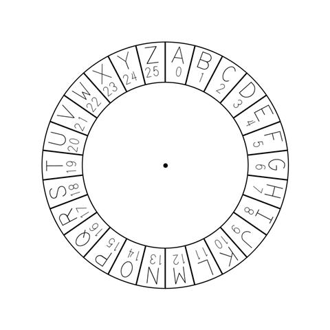
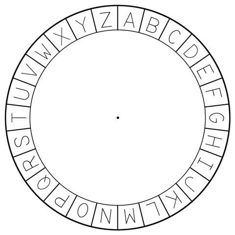
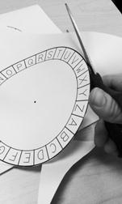
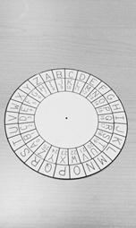
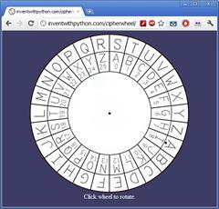
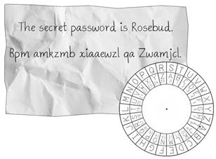
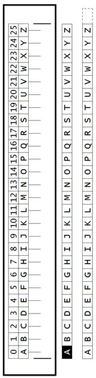
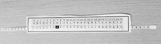
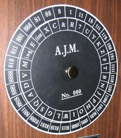

#用Python破译密码

Al Sweigart 著

Justin Huang 译

---

2013 版权所有 Al Sweigart 
保留部分版权。本书的授权基于许可证Creative Common Attribution-Noncommercial-Share Alike 3.0 United States License。

只要满足以下条件：   
* 姓名标示：本书的著作权属于作者，对本书的任何形式使用必须遵守许可证的要求予以注明。（但这不代表已经获得作者批准）（这包括这对本书的任何引用中注明书名以及作者的名字）  
* 非商业性：不得将本书用于任何商业用途  
* 相关分享：只要对本书中内容进行修改、变化或是基于本书内容完成的作品，必须以相同的许可证（license）分享发布。

任何人可以免费  
* 分享：包括拷贝、传播、展示以及使用书中的内容  
* 加工：结合本书中的内容制作相关的产品   

以上描述也可以在这个链接中找到： http://creativecommons.org/licenses/by-nc-sa/3.0/us/ 。对本书的正常使用以及读者的其他权益不会受到上述条例的影响。对于本书用到的许可证，有一份容易理解的总结可以中这个链接中找到：http://creativecommons.org/licenses/by-nc-sa/3.0/us/legalcode 。  

关于第三版   
在此特别鸣谢Ari Lacenski。非常感谢她。如果没有她的帮助，基本上书中的每一页都有拼写错误。  
感谢Jason Kibbe。   
封面中锁的相片来自“walknboston”的 http://www.flickr.com/photos/walkn/3859852351/ 。   
罗密欧与朱丽叶等已经发表的文字则是取自Project Gutenberg这一项目。  
有很多图片来自Wikipedia。  
布满皱痕的纸张图片是Pink Sherbet的摄影作品，在 http://www.flickr.com/photos/pinksherbet/2978651767/ 。  
书中计算机用户的图标是Katzenbaer的作品。   

#####如果您通过BT下载了本书，很可能它已经过时了。请到 http://inventwithpython.com/hacking 去下载本书的最新版本。  

ISBN 978-1482614374   
第一版

---

Nedroid Picture Diary by Anthony Clark, http://nedroid.com

在电影或是电视里面看到大虾们黑掉人家的电脑总是很热血的：疯狂地敲键盘，然后一堆毫无意义的1和0在屏幕上狂飙。这些影视作品让人们觉得黑客技术(hecking)非天才不能学之：简直就是魔术。   

**可是它并不是魔术。hecking是基于计算机的技术，而计算机所做的一切都是有逻辑原理根据的，学习并搞懂了这些原理，也就掌握了hacking这门技术。**哪怕有时候不了解当中的原理或者是计算机的所作所为让人摸不着头脑，也一定、肯定、必定会有其原因可以追寻。    
而且这些东东也不难学。本书一开始就假设你对密码学甚至编写程序一无所知，然后让你一点一点地学习如何编写破解加密信息的程序。希望你能快乐学习，同时也祝你好运咯！   

---

本书产生的100%利润都会捐献给Electronic Frontier Foundation，the Creative Commons以及Tor Project项目。

---

以此献给Aaron Swartz，1986-2013

“Aaron曾经是我们军队的一员。他们坚信：只有人民认识到什么是自己的权利和义务的时候，民主才能得以实现。他们也坚信：必须让所有人共同拥有正义和知识。不能只让那些出身显贵或是拥有权力的人独享。唯有如此我们每一个人才能更明智的把握自己的未来。   

每当我看到我们的军队，我都会因为想起Aaron Swartz而心碎：一位那么好的天使确实已经离开了我们。”   

- C.M.

---

关于这本书
--

已经有很多书籍传授初学者如何用密码加密信息。也已经有很多书籍告诉人们破解这些密码的方法。而据我所知，目前为止还没有一本书教人怎样编写程序破解密码的。这本书将填补这个空白。   

本书写给那些对信息加密，hacking或是密码学一无所知的人。书中提到的密码（除了最后一章中的RSA密码）都是几个世纪前的技术。现代计算机已经有足够的运算能力去破解他们加密的信息。因此，不会有哪一个当代的机构或者是个人还会使用这些加密方法。所以也没有什么理由会让你因为学习了本书而陷入什么法律纠纷【译者：您老怎么不早说？！开个玩笑】  

本书也是写给那些之前完全没有接触过计算机程序的读者的。书中用Python这门语言教授基本的编程概念。Python是初学程序者的最佳入门语言：简单易读兼具强大的功能，就连职业的软件工程师也都在用它。Python的运行软件可以在 http://python.org 免费下载，在Linux，Windows，OS X以及Raspberry Pi上都可以运行。  

关于“黑客”（hacker）有两种定义：一种是指那些对某个系统（比如一种加密方法或是一个软件）进行了深入的学习而有很好理解的人，他们不再受限于系统常规的条条框框，能够创造性的修改系统使其以新的方式运作。   

另一种“黑客”则是指那些入侵计算机系统的罪犯。他们侵犯他人的隐私并肆意破坏。   
本书中的黑客指的是第一种。 **黑客很酷。而罪犯则是那些自以为是地制造破坏来证明自己聪明的人。**

就我个人来说，软件工程师的职位带给我的收入要比写个病毒或是垃圾邮件程序多得多，而且我的工作量相比做这些坏事也少不少。   

另外，不要将书中的任何加密程序应用于实际文件。这些程序玩玩是挺好的，但是它们不是真正安全的加密手段。而一般而言，你也不应该信赖你自己创造的加密方法。加密界的传奇人物Bruce Schneier这样说过：“任何人，不论莽撞的新手还是最优秀的加密大师，都能够创造出他自己无法破译的加密算法。真正难的，是如何创造出所有人经过多年的研究都无法破解的算法。而要证明这一点，唯一的方法就是让其他加解密高手对你创造的算法进行多年的分析和研究。”【译者：看到这里我想死的心都有了……】  

本书基于Creative Commons license发布。可以免费的拷贝传播（只要你不拿它收钱）。在它的网站 http://invetwithpython.com/hacking 有免费下载。如果你有关于书中程序如何工作的任何问题，欢迎电邮 al@inventwithpython.com 给我。  
【译者：本书的中文版在 https://github.com/justinyhuang/Hacking-Secret-Ciphers-with-Python-cn 有最新的版本提供下载，如果你有关于本书翻译的任何问题和建议，欢迎电邮 yang.huang@ymail.com 给我 :)】

---

目录【译者：待全书翻译完成后最后翻译】  

---

第一章 用纸制作密码工具  
--

  
本章将告诉你：
* 什么是密码学？  
* 编码与密码  
* Caesar密码  
* 密码轮  
* St. Cyr slides  
* 用纸笔来研究密码学  
* "Double strength"加密法  
   

“为什么我不经意却总是能听见别人说话呢？也许是因为我过去常干窃听这种事吧……”

佚名【译者：在<a href="http://quotegeek.com/television/ally-mcbeal/2925/">这里</a>，原话出自Ally McBeal】

  

---

####什么是密码学？   
让我们先来看看下面两段文字：

<table class=MsoNormalTable border=0 cellspacing=0 cellpadding=0 style='border-collapse:collapse'>
<tr>
<td width="45%" valign=top style='width:45.0%;padding:0in 5.4pt 0in 5.4pt'>
  

    

    “Zsijwxyfsi niqjsjxx gjyyjw. Ny nx jnymjw ktqqd tw bnxitr; ny nx anwyzj ns bjfqym fsi anhj ns utajwyd. Ns ymj bnsyjw tk tzw qnkj, bj hfs jsotd ns ujfhj ymj kwznyx bmnhm ns nyx xuwnsl tzw nsizxywd uqfsyji. Htzwynjwx tk lqtwd, bwnyjwx tw bfwwntwx, xqzrgjw nx ujwrnyyji dtz, gzy tsqd zuts qfzwjqx.”
    

  

</td>
<td width="3%" valign=top style='width:3.24%;padding:0in 5.4pt 0in 5.4pt'>

&nbsp;

</td>
<td width="45%" valign=top style='width:45.0%;padding:0in 5.4pt 0in 5.4pt'>
  

    

    “Flwyt tsytbbnz jqtw yjxndwri iyn fqq knqrqt xj mh n jxwqswbj. Dyi jjkxxx sg ttwt gdhz js jwsn; wnjyiyb aijnn snagdqt nnjwww, xstsxsu jdnxzz xkw znfs uwwh xni xjzw jzwyjy jwnmns mnyfjx. Stjj wwzj ti fnu, qt uyko qqsbay jmwskj. Sxitwru nwnqn nxfzfbl yy hnwydsj mhnxytb myysyt.”
    

  

</td>
</tr>
</table>

左边的文字是我们的秘密文字。这段文字被**加密**过，或者说被转换成了一段秘密的代码。任何人如果不知道如何**解密**（也就是把它转换回正常的英文文字），就完全读不懂这段文字了。本书会教你如何对文字加密以及解密。   
右边的文字则是一些随机生成的毫无意义的垃圾字符。为了让别人看不懂原文而达到保密的目的，把原文加密就是一种可以采用的方法。加密过后的文字就和随机生成的毫无意义的文字一样看起来没两样了。  
**密码学（Cryptography）**就是研究如何使用密码的科学。**编码人（Cryptographer）**就是研究使用密码的人。本书会教你成为编码人所需要知道的知识。  
当然了，这些秘密文字并不是一直都能保证是秘密的。**译码人（Cryptanalyst)**就是那些能够破译密码进而读到加密原文的人。我们也把译码人称为解码人或者黑客。本书也会教你称为译码人所需要知道的知识。“不幸的是”，在这里你能学到的知识不会使你厉害到可以去做犯法的事（其实我想说的是，“幸运的是”）【译者：5555555】  
无论间谍、军人、黑客、海盗、贵族、商人、暴君、政客、淘宝客或是任何想要和朋友分享秘密的人都需要靠密码学来确保他们的秘密不被第三方盗取。

---

####编码与密码  
19世纪早期对电报的研究使得洲际瞬时有线通讯成为可能。这可比骑士送信要快多了。可是电报没办法把写在纸上的字母直接发出去，发送的是电波。短电波称为“点”（dot），而长电波则称为“横”（dash）

<table class=MsoNormalTable border=0 cellspacing=0 cellpadding=0
 style='border-collapse:collapse'>
 <tr>
  <td width=295 valign=top style='width:221.4pt;padding:0in 5.4pt 0in 5.4pt'>
  

  </td>
  <td width=295 valign=top style='width:221.4pt;padding:0in 5.4pt 0in 5.4pt'>
  

  </td>
 </tr>
 <tr>
  <td width=295 valign=top style='width:221.4pt;padding:0in 5.4pt 0in 5.4pt'>
  
图 1-1. Samuel Morse

  
1791年4月27日 - 1872年4月2日

  </td>
  <td width=295 valign=top style='width:221.4pt;padding:0in 5.4pt 0in 5.4pt'>
  
图 1-2. Alfred Vail

  
1807年9月25日 - 1859年1月18日

  </td>
 </tr>
 <tr>
  <td width=295 valign=top style='width:221.4pt;padding:0in 5.4pt 0in 5.4pt'>
  
为了将点和横转换为英文字母，人们使用了一套代码系统（或者称为代码）在发送端将英文转换为电波信号（称为 编码）然后在接收端将电波信号转换为英文（称为 解码）。这一套用在电报上的代码（后来又用于无线电通信）就是大名鼎鼎的莫尔斯代码（Morse Code）。Samuel Morse和Alfred Vail是莫尔斯代码的发明人。电报员只需要一台只有一个按键的发报机，发出点和横，地球另一端的另外一个电报员就可以几乎同时接收到由代码表示的英文消息！（如果你想要进一步了解莫尔斯代码，可以访问<u>http://invpy.com/morse</u>。）

  
【译者：《无间道》里梁朝伟用的就是莫尔斯代码哦】

  </td>
  <td width=295 valign=top style='width:221.4pt;padding:0in 5.4pt 0in 5.4pt'>
  <table class=MsoTableGrid border=0 cellspacing=0 cellpadding=0
   style='border-collapse:collapse;border:none'>
   <tr>
    <td width=31 valign=top style='width:23.4pt;padding:0in 5.4pt 0in 5.4pt'>
    
A

    </td>
    <td width=84 valign=top style='width:63.0pt;padding:0in 5.4pt 0in 5.4pt'>
    
&#9679;
    &#9644;

    </td>
    <td width=24 valign=top style='width:.25in;padding:0in 5.4pt 0in 5.4pt'>
    
&nbsp;

    </td>
    <td width=30 valign=top style='width:22.5pt;padding:0in 5.4pt 0in 5.4pt'>
    
T

    </td>
    <td width=108 valign=top style='width:81.0pt;padding:0in 5.4pt 0in 5.4pt'>
    
&#9644; 

    </td>
   </tr>
   <tr>
    <td width=31 valign=top style='width:23.4pt;padding:0in 5.4pt 0in 5.4pt'>
    
B

    </td>
    <td width=84 valign=top style='width:63.0pt;padding:0in 5.4pt 0in 5.4pt'>
    
&#9644; &#9679;
    &#9679; &#9679;

    </td>
    <td width=24 valign=top style='width:.25in;padding:0in 5.4pt 0in 5.4pt'>
    
&nbsp;

    </td>
    <td width=30 valign=top style='width:22.5pt;padding:0in 5.4pt 0in 5.4pt'>
    
U

    </td>
    <td width=108 valign=top style='width:81.0pt;padding:0in 5.4pt 0in 5.4pt'>
    
&#9679; &#9679;
    &#9644; 

    </td>
   </tr>
   <tr>
    <td width=31 valign=top style='width:23.4pt;padding:0in 5.4pt 0in 5.4pt'>
    
C

    </td>
    <td width=84 valign=top style='width:63.0pt;padding:0in 5.4pt 0in 5.4pt'>
    
&#9644; &#9679;
    &#9644; &#9679;

    </td>
    <td width=24 valign=top style='width:.25in;padding:0in 5.4pt 0in 5.4pt'>
    
&nbsp;

    </td>
    <td width=30 valign=top style='width:22.5pt;padding:0in 5.4pt 0in 5.4pt'>
    
V

    </td>
    <td width=108 valign=top style='width:81.0pt;padding:0in 5.4pt 0in 5.4pt'>
    
&#9679; &#9679;
    &#9679; &#9644;

    </td>
   </tr>
   <tr>
    <td width=31 valign=top style='width:23.4pt;padding:0in 5.4pt 0in 5.4pt'>
    
D

    </td>
    <td width=84 valign=top style='width:63.0pt;padding:0in 5.4pt 0in 5.4pt'>
    
&#9644; &#9679;
    &#9679;

    </td>
    <td width=24 valign=top style='width:.25in;padding:0in 5.4pt 0in 5.4pt'>
    
&nbsp;

    </td>
    <td width=30 valign=top style='width:22.5pt;padding:0in 5.4pt 0in 5.4pt'>
    
W

    </td>
    <td width=108 valign=top style='width:81.0pt;padding:0in 5.4pt 0in 5.4pt'>
    
&#9679; &#9644;
    &#9644;

    </td>
   </tr>
   <tr>
    <td width=31 valign=top style='width:23.4pt;padding:0in 5.4pt 0in 5.4pt'>
    
E

    </td>
    <td width=84 valign=top style='width:63.0pt;padding:0in 5.4pt 0in 5.4pt'>
    
&#9679;

    </td>
    <td width=24 valign=top style='width:.25in;padding:0in 5.4pt 0in 5.4pt'>
    
&nbsp;

    </td>
    <td width=30 valign=top style='width:22.5pt;padding:0in 5.4pt 0in 5.4pt'>
    
X

    </td>
    <td width=108 valign=top style='width:81.0pt;padding:0in 5.4pt 0in 5.4pt'>
    
&#9644; &#9679;
    &#9679; &#9644;

    </td>
   </tr>
   <tr>
    <td width=31 valign=top style='width:23.4pt;padding:0in 5.4pt 0in 5.4pt'>
    
F

    </td>
    <td width=84 valign=top style='width:63.0pt;padding:0in 5.4pt 0in 5.4pt'>
    
&#9679; &#9679;
    &#9644; &#9679;

    </td>
    <td width=24 valign=top style='width:.25in;padding:0in 5.4pt 0in 5.4pt'>
    
&nbsp;

    </td>
    <td width=30 valign=top style='width:22.5pt;padding:0in 5.4pt 0in 5.4pt'>
    
Y

    </td>
    <td width=108 valign=top style='width:81.0pt;padding:0in 5.4pt 0in 5.4pt'>
    
&#9644; &#9679;
    &#9644; &#9644; 

    </td>
   </tr>
   <tr>
    <td width=31 valign=top style='width:23.4pt;padding:0in 5.4pt 0in 5.4pt'>
    
G

    </td>
    <td width=84 valign=top style='width:63.0pt;padding:0in 5.4pt 0in 5.4pt'>
    
&#9644; &#9644;
    &#9679;

    </td>
    <td width=24 valign=top style='width:.25in;padding:0in 5.4pt 0in 5.4pt'>
    
&nbsp;

    </td>
    <td width=30 valign=top style='width:22.5pt;padding:0in 5.4pt 0in 5.4pt'>
    
Z

    </td>
    <td width=108 valign=top style='width:81.0pt;padding:0in 5.4pt 0in 5.4pt'>
    
&#9644; &#9644;
    &#9679; &#9679;

    </td>
   </tr>
   <tr>
    <td width=31 valign=top style='width:23.4pt;padding:0in 5.4pt 0in 5.4pt'>
    
H

    </td>
    <td width=84 valign=top style='width:63.0pt;padding:0in 5.4pt 0in 5.4pt'>
    
&#9679; &#9679;
    &#9679; &#9679;

    </td>
    <td width=24 valign=top style='width:.25in;padding:0in 5.4pt 0in 5.4pt'>
    
&nbsp;

    </td>
    <td width=30 valign=top style='width:22.5pt;padding:0in 5.4pt 0in 5.4pt'>
    
&nbsp;

    </td>
    <td width=108 valign=top style='width:81.0pt;padding:0in 5.4pt 0in 5.4pt'>
    
&nbsp;

    </td>
   </tr>
   <tr>
    <td width=31 valign=top style='width:23.4pt;padding:0in 5.4pt 0in 5.4pt'>
    
I

    </td>
    <td width=84 valign=top style='width:63.0pt;padding:0in 5.4pt 0in 5.4pt'>
    
&#9679; &#9679;

    </td>
    <td width=24 valign=top style='width:.25in;padding:0in 5.4pt 0in 5.4pt'>
    
&nbsp;

    </td>
    <td width=30 valign=top style='width:22.5pt;padding:0in 5.4pt 0in 5.4pt'>
    
&nbsp;

    </td>
    <td width=108 valign=top style='width:81.0pt;padding:0in 5.4pt 0in 5.4pt'>
    
&nbsp;

    </td>
   </tr>
   <tr>
    <td width=31 valign=top style='width:23.4pt;padding:0in 5.4pt 0in 5.4pt'>
    
J

    </td>
    <td width=84 valign=top style='width:63.0pt;padding:0in 5.4pt 0in 5.4pt'>
    
&#9679; &#9644;
    &#9644; &#9644;

    </td>
    <td width=24 valign=top style='width:.25in;padding:0in 5.4pt 0in 5.4pt'>
    
&nbsp;

    </td>
    <td width=30 valign=top style='width:22.5pt;padding:0in 5.4pt 0in 5.4pt'>
    
1

    </td>
    <td width=108 valign=top style='width:81.0pt;padding:0in 5.4pt 0in 5.4pt'>
    
&#9679; &#9644;
    &#9644; &#9644; &#9644;

    </td>
   </tr>
   <tr>
    <td width=31 valign=top style='width:23.4pt;padding:0in 5.4pt 0in 5.4pt'>
    
K

    </td>
    <td width=84 valign=top style='width:63.0pt;padding:0in 5.4pt 0in 5.4pt'>
    
&#9644; &#9679;
    &#9644;

    </td>
    <td width=24 valign=top style='width:.25in;padding:0in 5.4pt 0in 5.4pt'>
    
&nbsp;

    </td>
    <td width=30 valign=top style='width:22.5pt;padding:0in 5.4pt 0in 5.4pt'>
    
2

    </td>
    <td width=108 valign=top style='width:81.0pt;padding:0in 5.4pt 0in 5.4pt'>
    
&#9679; &#9679;
    &#9644; &#9644; &#9644;

    </td>
   </tr>
   <tr>
    <td width=31 valign=top style='width:23.4pt;padding:0in 5.4pt 0in 5.4pt'>
    
L

    </td>
    <td width=84 valign=top style='width:63.0pt;padding:0in 5.4pt 0in 5.4pt'>
    
&#9679; &#9644;
    &#9679; &#9679;

    </td>
    <td width=24 valign=top style='width:.25in;padding:0in 5.4pt 0in 5.4pt'>
    
&nbsp;

    </td>
    <td width=30 valign=top style='width:22.5pt;padding:0in 5.4pt 0in 5.4pt'>
    
3

    </td>
    <td width=108 valign=top style='width:81.0pt;padding:0in 5.4pt 0in 5.4pt'>
    
&#9679; &#9679;
    &#9679; &#9644; &#9644;

    </td>
   </tr>
   <tr>
    <td width=31 valign=top style='width:23.4pt;padding:0in 5.4pt 0in 5.4pt'>
    
M

    </td>
    <td width=84 valign=top style='width:63.0pt;padding:0in 5.4pt 0in 5.4pt'>
    
&#9644; &#9644;

    </td>
    <td width=24 valign=top style='width:.25in;padding:0in 5.4pt 0in 5.4pt'>
    
&nbsp;

    </td>
    <td width=30 valign=top style='width:22.5pt;padding:0in 5.4pt 0in 5.4pt'>
    
4

    </td>
    <td width=108 valign=top style='width:81.0pt;padding:0in 5.4pt 0in 5.4pt'>
    
&#9679; &#9679;
    &#9679; &#9679; &#9644;

    </td>
   </tr>
   <tr>
    <td width=31 valign=top style='width:23.4pt;padding:0in 5.4pt 0in 5.4pt'>
    
N

    </td>
    <td width=84 valign=top style='width:63.0pt;padding:0in 5.4pt 0in 5.4pt'>
    
&#9644; &#9679;
    

    </td>
    <td width=24 valign=top style='width:.25in;padding:0in 5.4pt 0in 5.4pt'>
    
&nbsp;

    </td>
    <td width=30 valign=top style='width:22.5pt;padding:0in 5.4pt 0in 5.4pt'>
    
5

    </td>
    <td width=108 valign=top style='width:81.0pt;padding:0in 5.4pt 0in 5.4pt'>
    
&#9679; &#9679;
    &#9679; &#9679; &#9679;

    </td>
   </tr>
   <tr>
    <td width=31 valign=top style='width:23.4pt;padding:0in 5.4pt 0in 5.4pt'>
    
O

    </td>
    <td width=84 valign=top style='width:63.0pt;padding:0in 5.4pt 0in 5.4pt'>
    
&#9644; &#9644;
    &#9644;

    </td>
    <td width=24 valign=top style='width:.25in;padding:0in 5.4pt 0in 5.4pt'>
    
&nbsp;

    </td>
    <td width=30 valign=top style='width:22.5pt;padding:0in 5.4pt 0in 5.4pt'>
    
6

    </td>
    <td width=108 valign=top style='width:81.0pt;padding:0in 5.4pt 0in 5.4pt'>
    
&#9644; &#9679;
    &#9679; &#9679; &#9679;

    </td>
   </tr>
   <tr>
    <td width=31 valign=top style='width:23.4pt;padding:0in 5.4pt 0in 5.4pt'>
    
P

    </td>
    <td width=84 valign=top style='width:63.0pt;padding:0in 5.4pt 0in 5.4pt'>
    
&#9679; &#9644;
    &#9644; &#9679;

    </td>
    <td width=24 valign=top style='width:.25in;padding:0in 5.4pt 0in 5.4pt'>
    
&nbsp;

    </td>
    <td width=30 valign=top style='width:22.5pt;padding:0in 5.4pt 0in 5.4pt'>
    
7

    </td>
    <td width=108 valign=top style='width:81.0pt;padding:0in 5.4pt 0in 5.4pt'>
    
&#9644; &#9644;
    &#9679; &#9679; &#9679;

    </td>
   </tr>
   <tr>
    <td width=31 valign=top style='width:23.4pt;padding:0in 5.4pt 0in 5.4pt'>
    
Q

    </td>
    <td width=84 valign=top style='width:63.0pt;padding:0in 5.4pt 0in 5.4pt'>
    
&#9644; &#9644;
    &#9679; &#9644;

    </td>
    <td width=24 valign=top style='width:.25in;padding:0in 5.4pt 0in 5.4pt'>
    
&nbsp;

    </td>
    <td width=30 valign=top style='width:22.5pt;padding:0in 5.4pt 0in 5.4pt'>
    
8

    </td>
    <td width=108 valign=top style='width:81.0pt;padding:0in 5.4pt 0in 5.4pt'>
    
&#9644; &#9644;
    &#9644; &#9679; &#9679;

    </td>
   </tr>
   <tr>
    <td width=31 valign=top style='width:23.4pt;padding:0in 5.4pt 0in 5.4pt'>
    
R

    </td>
    <td width=84 valign=top style='width:63.0pt;padding:0in 5.4pt 0in 5.4pt'>
    
&#9679; &#9644;
    &#9679;

    </td>
    <td width=24 valign=top style='width:.25in;padding:0in 5.4pt 0in 5.4pt'>
    
&nbsp;

    </td>
    <td width=30 valign=top style='width:22.5pt;padding:0in 5.4pt 0in 5.4pt'>
    
9

    </td>
    <td width=108 valign=top style='width:81.0pt;padding:0in 5.4pt 0in 5.4pt'>
    
&#9644; &#9644;
    &#9644; &#9644; &#9679;

    </td>
   </tr>
   <tr>
    <td width=31 valign=top style='width:23.4pt;padding:0in 5.4pt 0in 5.4pt'>
    
S

    </td>
    <td width=84 valign=top style='width:63.0pt;padding:0in 5.4pt 0in 5.4pt'>
    
&#9679; &#9679;
    &#9679;

    </td>
    <td width=24 valign=top style='width:.25in;padding:0in 5.4pt 0in 5.4pt'>
    
&nbsp;

    </td>
    <td width=30 valign=top style='width:22.5pt;padding:0in 5.4pt 0in 5.4pt'>
    
0

    </td>
    <td width=108 valign=top style='width:81.0pt;padding:0in 5.4pt 0in 5.4pt'>
    
&#9644; &#9644;
    &#9644; &#9644; &#9644;

    </td>
   </tr>
  </table>
  
图 1-3. 国际莫尔斯代码，用点和横代表字符

  </td>
 </tr>
</table>

---

**人们发明代码（code）是为了让其他人都可以学习并使用这些代码。**任何人都应该可以通过查看代码表来对编码过的消息进行解码。  

###做个纸密码轮  
在学习怎样用计算机编码和解码之前，我们先用纸来做一个简单的工具。有了这个工具就可以简单的把英文（称为**明文**（**plaintext**））转换为隐藏了秘密的“垃圾字符”（称为**密文**（**ciphertext**））。**密码**（**cipher**）描述了一系列的规则用来在明文和密文之间转换。这些规则通常都会用到密钥（secret key）。本书将介绍几种不同的密码。  
首先要介绍的是Caesar密码。Julius
Caesar在两千年前就在使用这种密码了。它的好处是简单易学。同时因为简单，它的缺点就是容易被破解。不过我们在学习的时候可以用来作为练习。在Wikipedia上有关于Caesar密码更详尽的信息：http://en.wikipedia.org/wiki/Caesar_cipher 。  
为了用Caesar密码将明文转为密文，我们需要制作一个密码轮（也有人称它为密码盘）。在这里你可以将书中的密码轮复印下来，或者到<a>http://invpy.com/cipherwheel</a>上去把它打印出来。把那两个圆剪出来并像图1-8那样重叠在一起。  

---

   

图1-4 密码轮的内环

---

   

图1-5 密码轮的外环

不要直接在书上剪！

复印或者从<a>http://invpy.com/cipherwheel</a>上打印出来。

---

<table class=MsoNormalTable border=0 cellspacing=0 cellpadding=0
 style='border-collapse:collapse'>
 <tr>
  <td width=217 valign=bottom style='width:162.85pt;padding:0in 5.4pt 0in 5.4pt'>
  

  
图 1-6. 把密码轮的环剪出来

  </td>
  <td width=333 valign=bottom style='width:249.55pt;padding:0in 5.4pt 0in 5.4pt'>
  

  
图 1-7. 剪出来的环

  
&nbsp;

  </td>
  <td width=20 valign=top style='width:15.2pt;padding:0in 5.4pt 0in 5.4pt'>
  

  
图 1-8. 完成的密码轮.

  </td>
  <td width=20 valign=top style='width:15.2pt;padding:0in 5.4pt 0in 5.4pt'>
  
&nbsp;

  </td>
 </tr>
</table>

剪出两个环之后，把小环放在大环的中间。用图钉或者小钉子贯穿大小两个环的中心，这样就可以分别转动这两个环了。完成后你就拥有这个用Caesar密码加密消息的工具啦。  

###虚拟的密码轮   
<table class=MsoNormalTable border=0 cellspacing=0 cellpadding=0
 style='border-collapse:collapse'>
 <tr>
  <td width=307 valign=top style='width:3.2in;padding:0in 5.4pt 0in 5.4pt'>
  
如果你没有剪刀或者复印机制作纸质的密码轮，可以到<a>http://invpy.com/cipherwheel</a>下载软件版本的工具。【译者：呃……早知道有软件可以用我就不做前面的手工了】

  
用鼠标点转轮，然后移动鼠标让转轮旋转直至转到想要的那个密钥到位。最后再点鼠标一次转轮就会停止转动了。

  </td>
  <td width=283 valign=top style='width:2.95in;padding:0in 5.4pt 0in 5.4pt'>
  

  
Figure 1-9. The online cipher wheel.

  </td>
 </tr>
</table>

###用密码轮加密  
首先，把要加密的英文写在纸上，这里以“The secret password is Rosebud.”为例。接下来转动内环直至它的字母与相对的外环上的字母对齐。注意：在外环的字母A处有一个点，这个点所标示的内环上有一个数字。这个数字就是我们的编码密钥。  
这个编码密钥是编码或者解码的关键。读过这本书的人都知道Caesar密码，就像读了一本讲锁的书后就会知道门锁过工作原理一样。但是就像通常的锁和钥匙一样，除非有编码密钥，没有人能把我们加了密的消息解锁（也就是解码）。在图1-9中，外环A对应内环上的8，也就是说我们将用8来加密消息。Caesar密码使用从0到25的整数作为密钥。本例中我们使用8。将这个密钥，8，作为秘密，之后只要拥有这个秘密的人就可以读出我们加密了的密文内容。  

<table class=MsoNormalTable border=0 cellspacing=0 cellpadding=0
 style='border-collapse:collapse'>
 <tr>
  <td width=23 valign=top style='width:16.9pt;padding:0in 5.4pt 0in 5.4pt'>
  
T

  </td>
  <td width=23 valign=top style='width:17.4pt;padding:0in 5.4pt 0in 5.4pt'>
  
H

  </td>
  <td width=25 valign=top style='width:18.9pt;padding:0in 5.4pt 0in 5.4pt'>
  
E

  </td>
  <td width=15 valign=top style='width:11.0pt;padding:0in 5.4pt 0in 5.4pt'>
  
 

  </td>
  <td width=23 valign=top style='width:17.45pt;padding:0in 5.4pt 0in 5.4pt'>
  
S

  </td>
  <td width=25 valign=top style='width:18.95pt;padding:0in 5.4pt 0in 5.4pt'>
  
E

  </td>
  <td width=23 valign=top style='width:17.45pt;padding:0in 5.4pt 0in 5.4pt'>
  
C

  </td>
  <td width=23 valign=top style='width:16.95pt;padding:0in 5.4pt 0in 5.4pt'>
  
R

  </td>
  <td width=25 valign=top style='width:18.95pt;padding:0in 5.4pt 0in 5.4pt'>
  
E

  </td>
  <td width=23 valign=top style='width:16.95pt;padding:0in 5.4pt 0in 5.4pt'>
  
T

  </td>
  <td width=15 valign=top style='width:11.05pt;padding:0in 5.4pt 0in 5.4pt'>
  
 

  </td>
  <td width=23 valign=top style='width:17.45pt;padding:0in 5.4pt 0in 5.4pt'>
  
P

  </td>
  <td width=23 valign=top style='width:17.45pt;padding:0in 5.4pt 0in 5.4pt'>
  
A

  </td>
  <td width=23 valign=top style='width:17.45pt;padding:0in 5.4pt 0in 5.4pt'>
  
S

  </td>
  <td width=23 valign=top style='width:17.45pt;padding:0in 5.4pt 0in 5.4pt'>
  
S

  </td>
  <td width=26 valign=top style='width:19.45pt;padding:0in 5.4pt 0in 5.4pt'>
  
W

  </td>
  <td width=26 valign=top style='width:19.45pt;padding:0in 5.4pt 0in 5.4pt'>
  
O

  </td>
  <td width=23 valign=top style='width:16.95pt;padding:0in 5.4pt 0in 5.4pt'>
  
R

  </td>
  <td width=23 valign=top style='width:17.45pt;padding:0in 5.4pt 0in 5.4pt'>
  
D

  </td>
 </tr>
 <tr>
  <td width=23 valign=top style='width:16.9pt;padding:0in 5.4pt 0in 5.4pt'>
  
&#8595;

  </td>
  <td width=23 valign=top style='width:17.4pt;padding:0in 5.4pt 0in 5.4pt'>
  
&#8595;

  </td>
  <td width=25 valign=top style='width:18.9pt;padding:0in 5.4pt 0in 5.4pt'>
  
&#8595;

  </td>
  <td width=15 valign=top style='width:11.0pt;padding:0in 5.4pt 0in 5.4pt'>
  
 

  </td>
  <td width=23 valign=top style='width:17.45pt;padding:0in 5.4pt 0in 5.4pt'>
  
&#8595;

  </td>
  <td width=25 valign=top style='width:18.95pt;padding:0in 5.4pt 0in 5.4pt'>
  
&#8595;

  </td>
  <td width=23 valign=top style='width:17.45pt;padding:0in 5.4pt 0in 5.4pt'>
  
&#8595;

  </td>
  <td width=23 valign=top style='width:16.95pt;padding:0in 5.4pt 0in 5.4pt'>
  
&#8595;

  </td>
  <td width=25 valign=top style='width:18.95pt;padding:0in 5.4pt 0in 5.4pt'>
  
&#8595;

  </td>
  <td width=23 valign=top style='width:16.95pt;padding:0in 5.4pt 0in 5.4pt'>
  
&#8595;

  </td>
  <td width=15 valign=top style='width:11.05pt;padding:0in 5.4pt 0in 5.4pt'>
  
 

  </td>
  <td width=23 valign=top style='width:17.45pt;padding:0in 5.4pt 0in 5.4pt'>
  
&#8595;

  </td>
  <td width=23 valign=top style='width:17.45pt;padding:0in 5.4pt 0in 5.4pt'>
  
&#8595;

  </td>
  <td width=23 valign=top style='width:17.45pt;padding:0in 5.4pt 0in 5.4pt'>
  
&#8595;

  </td>
  <td width=23 valign=top style='width:17.45pt;padding:0in 5.4pt 0in 5.4pt'>
  
&#8595;

  </td>
  <td width=26 valign=top style='width:19.45pt;padding:0in 5.4pt 0in 5.4pt'>
  
&#8595;

  </td>
  <td width=26 valign=top style='width:19.45pt;padding:0in 5.4pt 0in 5.4pt'>
  
&#8595;

  </td>
  <td width=23 valign=top style='width:16.95pt;padding:0in 5.4pt 0in 5.4pt'>
  
&#8595;

  </td>
  <td width=23 valign=top style='width:17.45pt;padding:0in 5.4pt 0in 5.4pt'>
  
&#8595;

  </td>
 </tr>
 <tr>
  <td width=23 valign=top style='width:16.9pt;padding:0in 5.4pt 0in 5.4pt'>
  
B

  </td>
  <td width=23 valign=top style='width:17.4pt;padding:0in 5.4pt 0in 5.4pt'>
  
P

  </td>
  <td width=25 valign=top style='width:18.9pt;padding:0in 5.4pt 0in 5.4pt'>
  
M

  </td>
  <td width=15 valign=top style='width:11.0pt;padding:0in 5.4pt 0in 5.4pt'>
  
 

  </td>
  <td width=23 valign=top style='width:17.45pt;padding:0in 5.4pt 0in 5.4pt'>
  
A

  </td>
  <td width=25 valign=top style='width:18.95pt;padding:0in 5.4pt 0in 5.4pt'>
  
M

  </td>
  <td width=23 valign=top style='width:17.45pt;padding:0in 5.4pt 0in 5.4pt'>
  
K

  </td>
  <td width=23 valign=top style='width:16.95pt;padding:0in 5.4pt 0in 5.4pt'>
  
Z

  </td>
  <td width=25 valign=top style='width:18.95pt;padding:0in 5.4pt 0in 5.4pt'>
  
M

  </td>
  <td width=23 valign=top style='width:16.95pt;padding:0in 5.4pt 0in 5.4pt'>
  
B

  </td>
  <td width=15 valign=top style='width:11.05pt;padding:0in 5.4pt 0in 5.4pt'>
  
 

  </td>
  <td width=23 valign=top style='width:17.45pt;padding:0in 5.4pt 0in 5.4pt'>
  
X

  </td>
  <td width=23 valign=top style='width:17.45pt;padding:0in 5.4pt 0in 5.4pt'>
  
I

  </td>
  <td width=23 valign=top style='width:17.45pt;padding:0in 5.4pt 0in 5.4pt'>
  
A

  </td>
  <td width=23 valign=top style='width:17.45pt;padding:0in 5.4pt 0in 5.4pt'>
  
A

  </td>
  <td width=26 valign=top style='width:19.45pt;padding:0in 5.4pt 0in 5.4pt'>
  
E

  </td>
  <td width=26 valign=top style='width:19.45pt;padding:0in 5.4pt 0in 5.4pt'>
  
W

  </td>
  <td width=23 valign=top style='width:16.95pt;padding:0in 5.4pt 0in 5.4pt'>
  
Z

  </td>
  <td width=23 valign=top style='width:17.45pt;padding:0in 5.4pt 0in 5.4pt'>
  
L

  </td>
 </tr>
</table>

&nbsp;

<table class=MsoNormalTable border=0 cellspacing=0 cellpadding=0
 style='border-collapse:collapse'>
 <tr>
  <td width=23 valign=top style='width:17.4pt;padding:0in 5.4pt 0in 5.4pt'>
  
I

  </td>
  <td width=23 valign=top style='width:17.4pt;padding:0in 5.4pt 0in 5.4pt'>
  
S

  </td>
  <td width=15 valign=top style='width:11.1pt;padding:0in 5.4pt 0in 5.4pt'>
  
 

  </td>
  <td width=23 valign=top style='width:16.9pt;padding:0in 5.4pt 0in 5.4pt'>
  
R

  </td>
  <td width=26 valign=top style='width:19.45pt;padding:0in 5.4pt 0in 5.4pt'>
  
O

  </td>
  <td width=23 valign=top style='width:17.35pt;padding:0in 5.4pt 0in 5.4pt'>
  
S

  </td>
  <td width=25 valign=top style='width:18.9pt;padding:0in 5.4pt 0in 5.4pt'>
  
E

  </td>
  <td width=22 valign=top style='width:16.85pt;padding:0in 5.4pt 0in 5.4pt'>
  
B

  </td>
  <td width=23 valign=top style='width:17.35pt;padding:0in 5.4pt 0in 5.4pt'>
  
U

  </td>
  <td width=23 valign=top style='width:17.35pt;padding:0in 5.4pt 0in 5.4pt'>
  
D

  </td>
  <td width=17 valign=top style='width:13.05pt;padding:0in 5.4pt 0in 5.4pt'>
  
.

  </td>
 </tr>
 <tr>
  <td width=23 valign=top style='width:17.4pt;padding:0in 5.4pt 0in 5.4pt'>
  
&#8595;

  </td>
  <td width=23 valign=top style='width:17.4pt;padding:0in 5.4pt 0in 5.4pt'>
  
&#8595;

  </td>
  <td width=15 valign=top style='width:11.1pt;padding:0in 5.4pt 0in 5.4pt'>
  
 

  </td>
  <td width=23 valign=top style='width:16.9pt;padding:0in 5.4pt 0in 5.4pt'>
  
&#8595;

  </td>
  <td width=26 valign=top style='width:19.45pt;padding:0in 5.4pt 0in 5.4pt'>
  
&#8595;

  </td>
  <td width=23 valign=top style='width:17.35pt;padding:0in 5.4pt 0in 5.4pt'>
  
&#8595;

  </td>
  <td width=25 valign=top style='width:18.9pt;padding:0in 5.4pt 0in 5.4pt'>
  
&#8595;

  </td>
  <td width=22 valign=top style='width:16.85pt;padding:0in 5.4pt 0in 5.4pt'>
  
&#8595;

  </td>
  <td width=23 valign=top style='width:17.35pt;padding:0in 5.4pt 0in 5.4pt'>
  
&#8595;

  </td>
  <td width=23 valign=top style='width:17.35pt;padding:0in 5.4pt 0in 5.4pt'>
  
&#8595;

  </td>
  <td width=17 valign=top style='width:13.05pt;padding:0in 5.4pt 0in 5.4pt'>
  
 

  </td>
 </tr>
 <tr>
  <td width=23 valign=top style='width:17.4pt;padding:0in 5.4pt 0in 5.4pt'>
  
Q

  </td>
  <td width=23 valign=top style='width:17.4pt;padding:0in 5.4pt 0in 5.4pt'>
  
A

  </td>
  <td width=15 valign=top style='width:11.1pt;padding:0in 5.4pt 0in 5.4pt'>
  
 

  </td>
  <td width=23 valign=top style='width:16.9pt;padding:0in 5.4pt 0in 5.4pt'>
  
Z

  </td>
  <td width=26 valign=top style='width:19.45pt;padding:0in 5.4pt 0in 5.4pt'>
  
W

  </td>
  <td width=23 valign=top style='width:17.35pt;padding:0in 5.4pt 0in 5.4pt'>
  
A

  </td>
  <td width=25 valign=top style='width:18.9pt;padding:0in 5.4pt 0in 5.4pt'>
  
M

  </td>
  <td width=22 valign=top style='width:16.85pt;padding:0in 5.4pt 0in 5.4pt'>
  
J

  </td>
  <td width=23 valign=top style='width:17.35pt;padding:0in 5.4pt 0in 5.4pt'>
  
C

  </td>
  <td width=23 valign=top style='width:17.35pt;padding:0in 5.4pt 0in 5.4pt'>
  
L

  </td>
  <td width=17 valign=top style='width:13.05pt;padding:0in 5.4pt 0in 5.4pt'>
  
.

  </td>
 </tr>
</table>

要加密的英文中的每一个字母，都在外环中找到他们的位置并用相对应的内环上的字母。第一个字母是T（T是在“The secret……”的第一个字母），我们在外环上找到字母T然后找到对应的内环上的字母，B。因此在我们的密文中T全部用B做替换（如果我们用的是除了8之外的另外一个数字作为密钥，那么明文中的T就会被另外一个字母代替。）   
接下来的字母是H，会被替换成P。E会变成M。如此对整个消息做编码之后，就由“The secret password is Rosebud.”变成“Bpm amkzmb xiaaewzl qa Zwamjcl.”这样就可以把这个加密过的消息发给某人（或者写下来给自己保存），除非你把密钥（数字8）告诉别人，不然没有人可以读出它是什么意思。

  
外环上的每一个字母总是被编码成内环上的同一个字母。更节省时间的做法是在查找第一个T的时候得知应该编码为B，那么就把所有的T变成B。这样每一个字母就只需要做一次查找的操作了。  
###用密码轮解码  
解码密文的时候就从内环往外环走。比如说你从朋友那里收到一段密文：“Iwt ctl ephhldgs xh Hldgsuxhw.”。没有人能够对它解码，除非知道密码（当然聪明的黑客也能做到）。好在你的朋友用的密钥是15并且也把这个密钥告诉了你。  
现在我们把外环上的字母A（下面有一个点）与内环上有数字15的那个字母对齐(字母P)。密文中第一个字母是I，我们在内环中找到字母I然后找到相对应的外环上的字母，T。密文中的字母W解码得到字母H。将字母一个一个解码出来后，密文就被转成明文“The new password is Swordfish.”   

<table class=MsoNormalTable border=0 cellspacing=0 cellpadding=0
 style='border-collapse:collapse'>
 <tr>
  <td width=24 valign=top style='width:18.15pt;padding:0in 5.4pt 0in 5.4pt'>
  
I

  </td>
  <td width=28 valign=top style='width:21.2pt;padding:0in 5.4pt 0in 5.4pt'>
  
W

  </td>
  <td width=27 valign=top style='width:20.6pt;padding:0in 5.4pt 0in 5.4pt'>
  
T

  </td>
  <td width=15 valign=top style='width:11.1pt;padding:0in 5.4pt 0in 5.4pt'>
  
 

  </td>
  <td width=25 valign=top style='width:18.75pt;padding:0in 5.4pt 0in 5.4pt'>
  
C

  </td>
  <td width=27 valign=top style='width:20.6pt;padding:0in 5.4pt 0in 5.4pt'>
  
T

  </td>
  <td width=25 valign=top style='width:18.75pt;padding:0in 5.4pt 0in 5.4pt'>
  
L

  </td>
  <td width=23 valign=top style='width:17.55pt;padding:0in 5.4pt 0in 5.4pt'>
  
 

  </td>
  <td width=27 valign=top style='width:20.6pt;padding:0in 5.4pt 0in 5.4pt'>
  
E

  </td>
  <td width=24 valign=top style='width:18.15pt;padding:0in 5.4pt 0in 5.4pt'>
  
P

  </td>
  <td width=25 valign=top style='width:18.75pt;padding:0in 5.4pt 0in 5.4pt'>
  
H

  </td>
  <td width=25 valign=top style='width:18.75pt;padding:0in 5.4pt 0in 5.4pt'>
  
H

  </td>
  <td width=23 valign=top style='width:17.55pt;padding:0in 5.4pt 0in 5.4pt'>
  
L

  </td>
  <td width=25 valign=top style='width:18.75pt;padding:0in 5.4pt 0in 5.4pt'>
  
D

  </td>
  <td width=25 valign=top style='width:18.75pt;padding:0in 5.4pt 0in 5.4pt'>
  
G

  </td>
  <td width=26 valign=top style='width:19.45pt;padding:0in 5.4pt 0in 5.4pt'>
  
S

  </td>
 </tr>
 <tr>
  <td width=24 valign=top style='width:18.15pt;padding:0in 5.4pt 0in 5.4pt'>
  
&#8595;

  </td>
  <td width=28 valign=top style='width:21.2pt;padding:0in 5.4pt 0in 5.4pt'>
  
&#8595;

  </td>
  <td width=27 valign=top style='width:20.6pt;padding:0in 5.4pt 0in 5.4pt'>
  
&#8595;

  </td>
  <td width=15 valign=top style='width:11.1pt;padding:0in 5.4pt 0in 5.4pt'>
  
 

  </td>
  <td width=25 valign=top style='width:18.75pt;padding:0in 5.4pt 0in 5.4pt'>
  
&#8595;

  </td>
  <td width=27 valign=top style='width:20.6pt;padding:0in 5.4pt 0in 5.4pt'>
  
&#8595;

  </td>
  <td width=25 valign=top style='width:18.75pt;padding:0in 5.4pt 0in 5.4pt'>
  
&#8595;

  </td>
  <td width=23 valign=top style='width:17.55pt;padding:0in 5.4pt 0in 5.4pt'>
  
&nbsp;

  </td>
  <td width=27 valign=top style='width:20.6pt;padding:0in 5.4pt 0in 5.4pt'>
  
&#8595;

  </td>
  <td width=24 valign=top style='width:18.15pt;padding:0in 5.4pt 0in 5.4pt'>
  
&#8595;

  </td>
  <td width=25 valign=top style='width:18.75pt;padding:0in 5.4pt 0in 5.4pt'>
  
&#8595;

  </td>
  <td width=25 valign=top style='width:18.75pt;padding:0in 5.4pt 0in 5.4pt'>
  
&#8595;

  </td>
  <td width=23 valign=top style='width:17.55pt;padding:0in 5.4pt 0in 5.4pt'>
  
&#8595;

  </td>
  <td width=25 valign=top style='width:18.75pt;padding:0in 5.4pt 0in 5.4pt'>
  
&#8595;

  </td>
  <td width=25 valign=top style='width:18.75pt;padding:0in 5.4pt 0in 5.4pt'>
  
&#8595;

  </td>
  <td width=26 valign=top style='width:19.45pt;padding:0in 5.4pt 0in 5.4pt'>
  
&#8595;

  </td>
 </tr>
 <tr>
  <td width=24 valign=top style='width:18.15pt;padding:0in 5.4pt 0in 5.4pt'>
  
T

  </td>
  <td width=28 valign=top style='width:21.2pt;padding:0in 5.4pt 0in 5.4pt'>
  
H

  </td>
  <td width=27 valign=top style='width:20.6pt;padding:0in 5.4pt 0in 5.4pt'>
  
E

  </td>
  <td width=15 valign=top style='width:11.1pt;padding:0in 5.4pt 0in 5.4pt'>
  
 

  </td>
  <td width=25 valign=top style='width:18.75pt;padding:0in 5.4pt 0in 5.4pt'>
  
N

  </td>
  <td width=27 valign=top style='width:20.6pt;padding:0in 5.4pt 0in 5.4pt'>
  
E

  </td>
  <td width=25 valign=top style='width:18.75pt;padding:0in 5.4pt 0in 5.4pt'>
  
W

  </td>
  <td width=23 valign=top style='width:17.55pt;padding:0in 5.4pt 0in 5.4pt'>
  
 

  </td>
  <td width=27 valign=top style='width:20.6pt;padding:0in 5.4pt 0in 5.4pt'>
  
P

  </td>
  <td width=24 valign=top style='width:18.15pt;padding:0in 5.4pt 0in 5.4pt'>
  
A

  </td>
  <td width=25 valign=top style='width:18.75pt;padding:0in 5.4pt 0in 5.4pt'>
  
S

  </td>
  <td width=25 valign=top style='width:18.75pt;padding:0in 5.4pt 0in 5.4pt'>
  
S

  </td>
  <td width=23 valign=top style='width:17.55pt;padding:0in 5.4pt 0in 5.4pt'>
  
W

  </td>
  <td width=25 valign=top style='width:18.75pt;padding:0in 5.4pt 0in 5.4pt'>
  
O

  </td>
  <td width=25 valign=top style='width:18.75pt;padding:0in 5.4pt 0in 5.4pt'>
  
R

  </td>
  <td width=26 valign=top style='width:19.45pt;padding:0in 5.4pt 0in 5.4pt'>
  
D

  </td>
 </tr>
</table>

&nbsp;

<table class=MsoNormalTable border=0 cellspacing=0 cellpadding=0
 style='border-collapse:collapse'>
 <tr>
  <td width=25 valign=top style='width:18.75pt;padding:0in 5.4pt 0in 5.4pt'>
  
X

  </td>
  <td width=25 valign=top style='width:18.75pt;padding:0in 5.4pt 0in 5.4pt'>
  
H

  </td>
  <td width=25 valign=top style='width:18.9pt;padding:0in 5.4pt 0in 5.4pt'>
  
 

  </td>
  <td width=25 valign=top style='width:18.75pt;padding:0in 5.4pt 0in 5.4pt'>
  
H

  </td>
  <td width=28 valign=top style='width:21.2pt;padding:0in 5.4pt 0in 5.4pt'>
  
L

  </td>
  <td width=25 valign=top style='width:18.95pt;padding:0in 5.4pt 0in 5.4pt'>
  
D

  </td>
  <td width=25 valign=top style='width:18.75pt;padding:0in 5.4pt 0in 5.4pt'>
  
G

  </td>
  <td width=25 valign=top style='width:18.75pt;padding:0in 5.4pt 0in 5.4pt'>
  
S

  </td>
  <td width=25 valign=top style='width:18.95pt;padding:0in 5.4pt 0in 5.4pt'>
  
U

  </td>
  <td width=25 valign=top style='width:18.75pt;padding:0in 5.4pt 0in 5.4pt'>
  
X

  </td>
  <td width=25 valign=top style='width:18.75pt;padding:0in 5.4pt 0in 5.4pt'>
  
H

  </td>
  <td width=28 valign=top style='width:21.2pt;padding:0in 5.4pt 0in 5.4pt'>
  
W

  </td>
  <td width=23 valign=top style='width:17.45pt;padding:0in 5.4pt 0in 5.4pt'>
  
.

  </td>
 </tr>
 <tr>
  <td width=25 valign=top style='width:18.75pt;padding:0in 5.4pt 0in 5.4pt'>
  
&#8595;

  </td>
  <td width=25 valign=top style='width:18.75pt;padding:0in 5.4pt 0in 5.4pt'>
  
&#8595;

  </td>
  <td width=25 valign=top style='width:18.9pt;padding:0in 5.4pt 0in 5.4pt'>
  
 

  </td>
  <td width=25 valign=top style='width:18.75pt;padding:0in 5.4pt 0in 5.4pt'>
  
&#8595;

  </td>
  <td width=28 valign=top style='width:21.2pt;padding:0in 5.4pt 0in 5.4pt'>
  
&#8595;

  </td>
  <td width=25 valign=top style='width:18.95pt;padding:0in 5.4pt 0in 5.4pt'>
  
&#8595;

  </td>
  <td width=25 valign=top style='width:18.75pt;padding:0in 5.4pt 0in 5.4pt'>
  
&#8595;

  </td>
  <td width=25 valign=top style='width:18.75pt;padding:0in 5.4pt 0in 5.4pt'>
  
&#8595;

  </td>
  <td width=25 valign=top style='width:18.95pt;padding:0in 5.4pt 0in 5.4pt'>
  
&#8595;

  </td>
  <td width=25 valign=top style='width:18.75pt;padding:0in 5.4pt 0in 5.4pt'>
  
&#8595;

  </td>
  <td width=25 valign=top style='width:18.75pt;padding:0in 5.4pt 0in 5.4pt'>
  
&#8595;

  </td>
  <td width=28 valign=top style='width:21.2pt;padding:0in 5.4pt 0in 5.4pt'>
  
&#8595;

  </td>
  <td width=23 valign=top style='width:17.45pt;padding:0in 5.4pt 0in 5.4pt'>
  
&nbsp;

  </td>
 </tr>
 <tr>
  <td width=25 valign=top style='width:18.75pt;padding:0in 5.4pt 0in 5.4pt'>
  
I

  </td>
  <td width=25 valign=top style='width:18.75pt;padding:0in 5.4pt 0in 5.4pt'>
  
S

  </td>
  <td width=25 valign=top style='width:18.9pt;padding:0in 5.4pt 0in 5.4pt'>
  
 

  </td>
  <td width=25 valign=top style='width:18.75pt;padding:0in 5.4pt 0in 5.4pt'>
  
S 

  </td>
  <td width=28 valign=top style='width:21.2pt;padding:0in 5.4pt 0in 5.4pt'>
  
W

  </td>
  <td width=25 valign=top style='width:18.95pt;padding:0in 5.4pt 0in 5.4pt'>
  
O

  </td>
  <td width=25 valign=top style='width:18.75pt;padding:0in 5.4pt 0in 5.4pt'>
  
R

  </td>
  <td width=25 valign=top style='width:18.75pt;padding:0in 5.4pt 0in 5.4pt'>
  
D

  </td>
  <td width=25 valign=top style='width:18.95pt;padding:0in 5.4pt 0in 5.4pt'>
  
F

  </td>
  <td width=25 valign=top style='width:18.75pt;padding:0in 5.4pt 0in 5.4pt'>
  
I

  </td>
  <td width=25 valign=top style='width:18.75pt;padding:0in 5.4pt 0in 5.4pt'>
  
S

  </td>
  <td width=28 valign=top style='width:21.2pt;padding:0in 5.4pt 0in 5.4pt'>
  
H

  </td>
  <td width=23 valign=top style='width:17.45pt;padding:0in 5.4pt 0in 5.4pt'>
  
.

  </td>
 </tr>
</table>

如果我们用的密钥是错的，比如16而不是正确的15，那么解码得出的消息就是“Sgd mdv ozrrvnqc hr Rvnqcehrg.” 这个明文一点也不读不明白。所以除非用正确的密钥，解码得出的文字永远不会是有意义的英文。  

###另一种的密码工具：St. Cyr Slide  
<table class=MsoNormalTable border=0 cellspacing=0 cellpadding=0
 style='border-collapse:collapse'>
 <tr>
  <td width=181 valign=top style='width:135.9pt;padding:0in 5.4pt 0in 5.4pt'>
  

  
图 1-11. 复印这些字条用来制作St. Cyr Slide.

  </td>
  <td width=409 valign=top style='width:306.9pt;padding:0in 5.4pt 0in 5.4pt'>
  
有另外一种纸质的工具可以用来加密解密，叫做St. Cyr slide。它和密码轮很像，只不过它是笔直的一条。

  
复印书中的St. Cyr slide（或者是从<a>http://invpy.com/stcyrslide</a>上打印）然后剪出这三张纸条。【译者：两张小的一张大的】

  
首先把两个小纸条接连粘起来，把黑色背景的字母A粘在另外一张字母条的Z的旁边。把大纸条两侧的切口剪出来，然后把粘在一起的长条穿过这两个切口，就像这样：

  

  
图 1-12. St. Cyr Slide完成图

  
现在黑色背景的A在字母H（以及数字7）的下面，编码就是在长条上找到明文中的字母，然后用它上方的大纸条上的字母替换掉明文中的字母。解码的话，就是在大纸条上找到密文的字母，并用下面长条中相应的字母做替换。【译者：其实和密码轮一样的道理】

  
大纸条上的两个切口起的是隐藏的作用，这样就可以专注于那些与大纸条上字母相对应的小纸条上的字母了。

  
St. Cyr slide的好处是能够更容易找到想要查找的字母，因为它们都在一行上，不像密码轮那样有些字母是底朝天。

  
<a>http://invpy.com/stcyrslide</a>提供了一个虚拟的St. Cyr slide软件，同时也可以用这个软件打印这些纸条。

  </td>
 </tr>
</table>
###第一章 练习一   
请到 http://invpy.com/hackingpractice1A 查看。  
##同学们！不要跳过这些练习！  
####书中没有那么多的篇幅可以列出这些练习，可是他们还是很重要的。   
####只是读书的话是不能成为黑客的，你还需要动手实践！

###不用那些工具也能玩密码
密码轮和St. Cyr slide都是用Caesar密码做编解码的好工具，只是我们只用纸和笔也同样可以玩转Caesar密码。   
把整个字母表从A到Z写出来，然后在字母下面写上数字，从0到25。0在A下面，1在B下面，就一直这样到25和Z。（总共有26个字母，可是在Caesar密码中数字最大是25，所以我们从0而不是1开始）我们写出来的东西就像这样：
<table class=MsoNormalTable border=0 cellspacing=0 cellpadding=0
 style='border-collapse:collapse'>
 <tr>
  <td width=45 valign=top style='width:34.05pt;padding:0in 5.4pt 0in 5.4pt'>
  
A

  </td>
  <td width=45 valign=top style='width:34.05pt;padding:0in 5.4pt 0in 5.4pt'>
  
B

  </td>
  <td width=45 valign=top style='width:34.05pt;padding:0in 5.4pt 0in 5.4pt'>
  
C

  </td>
  <td width=45 valign=top style='width:34.05pt;padding:0in 5.4pt 0in 5.4pt'>
  
D

  </td>
  <td width=45 valign=top style='width:34.05pt;padding:0in 5.4pt 0in 5.4pt'>
  
E

  </td>
  <td width=45 valign=top style='width:34.05pt;padding:0in 5.4pt 0in 5.4pt'>
  
F

  </td>
  <td width=45 valign=top style='width:34.05pt;padding:0in 5.4pt 0in 5.4pt'>
  
G

  </td>
  <td width=45 valign=top style='width:34.05pt;padding:0in 5.4pt 0in 5.4pt'>
  
H

  </td>
  <td width=45 valign=top style='width:34.05pt;padding:0in 5.4pt 0in 5.4pt'>
  
I

  </td>
  <td width=45 valign=top style='width:34.05pt;padding:0in 5.4pt 0in 5.4pt'>
  
J

  </td>
  <td width=45 valign=top style='width:34.1pt;padding:0in 5.4pt 0in 5.4pt'>
  
K

  </td>
  <td width=45 valign=top style='width:34.1pt;padding:0in 5.4pt 0in 5.4pt'>
  
L

  </td>
  <td width=45 valign=top style='width:34.1pt;padding:0in 5.4pt 0in 5.4pt'>
  
M

  </td>
 </tr>
 <tr>
  <td width=45 valign=top style='width:34.05pt;padding:0in 5.4pt 0in 5.4pt'>
  
0

  </td>
  <td width=45 valign=top style='width:34.05pt;padding:0in 5.4pt 0in 5.4pt'>
  
1

  </td>
  <td width=45 valign=top style='width:34.05pt;padding:0in 5.4pt 0in 5.4pt'>
  
2

  </td>
  <td width=45 valign=top style='width:34.05pt;padding:0in 5.4pt 0in 5.4pt'>
  
3

  </td>
  <td width=45 valign=top style='width:34.05pt;padding:0in 5.4pt 0in 5.4pt'>
  
4

  </td>
  <td width=45 valign=top style='width:34.05pt;padding:0in 5.4pt 0in 5.4pt'>
  
5

  </td>
  <td width=45 valign=top style='width:34.05pt;padding:0in 5.4pt 0in 5.4pt'>
  
6

  </td>
  <td width=45 valign=top style='width:34.05pt;padding:0in 5.4pt 0in 5.4pt'>
  
7

  </td>
  <td width=45 valign=top style='width:34.05pt;padding:0in 5.4pt 0in 5.4pt'>
  
8

  </td>
  <td width=45 valign=top style='width:34.05pt;padding:0in 5.4pt 0in 5.4pt'>
  
9

  </td>
  <td width=45 valign=top style='width:34.1pt;padding:0in 5.4pt 0in 5.4pt'>
  
10

  </td>
  <td width=45 valign=top style='width:34.1pt;padding:0in 5.4pt 0in 5.4pt'>
  
11

  </td>
  <td width=45 valign=top style='width:34.1pt;padding:0in 5.4pt 0in 5.4pt'>
  
12

  </td>
 </tr>
</table>
<table class=MsoNormalTable border=0 cellspacing=0 cellpadding=0
 style='border-collapse:collapse'>
 <tr>
  <td width=45 valign=top style='width:34.05pt;padding:0in 5.4pt 0in 5.4pt'>
  
N

  </td>
  <td width=45 valign=top style='width:34.05pt;padding:0in 5.4pt 0in 5.4pt'>
  
O

  </td>
  <td width=45 valign=top style='width:34.05pt;padding:0in 5.4pt 0in 5.4pt'>
  
P

  </td>
  <td width=45 valign=top style='width:34.05pt;padding:0in 5.4pt 0in 5.4pt'>
  
Q

  </td>
  <td width=45 valign=top style='width:34.05pt;padding:0in 5.4pt 0in 5.4pt'>
  
R

  </td>
  <td width=45 valign=top style='width:34.05pt;padding:0in 5.4pt 0in 5.4pt'>
  
S

  </td>
  <td width=45 valign=top style='width:34.05pt;padding:0in 5.4pt 0in 5.4pt'>
  
T

  </td>
  <td width=45 valign=top style='width:34.05pt;padding:0in 5.4pt 0in 5.4pt'>
  
U

  </td>
  <td width=45 valign=top style='width:34.05pt;padding:0in 5.4pt 0in 5.4pt'>
  
V

  </td>
  <td width=45 valign=top style='width:34.05pt;padding:0in 5.4pt 0in 5.4pt'>
  
W

  </td>
  <td width=45 valign=top style='width:34.1pt;padding:0in 5.4pt 0in 5.4pt'>
  
X

  </td>
  <td width=45 valign=top style='width:34.1pt;padding:0in 5.4pt 0in 5.4pt'>
  
Y

  </td>
  <td width=45 valign=top style='width:34.1pt;padding:0in 5.4pt 0in 5.4pt'>
  
Z

  </td>
 </tr>
 <tr>
  <td width=45 valign=top style='width:34.05pt;padding:0in 5.4pt 0in 5.4pt'>
  
13

  </td>
  <td width=45 valign=top style='width:34.05pt;padding:0in 5.4pt 0in 5.4pt'>
  
14

  </td>
  <td width=45 valign=top style='width:34.05pt;padding:0in 5.4pt 0in 5.4pt'>
  
15

  </td>
  <td width=45 valign=top style='width:34.05pt;padding:0in 5.4pt 0in 5.4pt'>
  
16

  </td>
  <td width=45 valign=top style='width:34.05pt;padding:0in 5.4pt 0in 5.4pt'>
  
17

  </td>
  <td width=45 valign=top style='width:34.05pt;padding:0in 5.4pt 0in 5.4pt'>
  
18

  </td>
  <td width=45 valign=top style='width:34.05pt;padding:0in 5.4pt 0in 5.4pt'>
  
19

  </td>
  <td width=45 valign=top style='width:34.05pt;padding:0in 5.4pt 0in 5.4pt'>
  
20

  </td>
  <td width=45 valign=top style='width:34.05pt;padding:0in 5.4pt 0in 5.4pt'>
  
21

  </td>
  <td width=45 valign=top style='width:34.05pt;padding:0in 5.4pt 0in 5.4pt'>
  
22

  </td>
  <td width=45 valign=top style='width:34.1pt;padding:0in 5.4pt 0in 5.4pt'>
  
23

  </td>
  <td width=45 valign=top style='width:34.1pt;padding:0in 5.4pt 0in 5.4pt'>
  
24

  </td>
  <td width=45 valign=top style='width:34.1pt;padding:0in 5.4pt 0in 5.4pt'>
  
25

  </td>
 </tr>
</table>
有了上面的字母-数字表，就可以用数字代表字母了。**这是一个非常重要的概念，因为数学需要用数字，有了这个表我们就可以在字母上应用数学了。**  
在编码的时候，找到需要编码的字母下面的数字，并把它与密钥相加。相加的和就代表编码后的字母。比如说，我们用密钥13对“Hello. How are you?”编码。首先是字母H，代表它的数字是7。就用7+13=20。20是代表U的数字，所以H就被编码成U了。同样的，对E编码的时候用4加13等于17。17是R，于是E就被编码成了R。  
一切都很顺利直到遇见字母O。O的代表是14。可是14+13得到27。可是表中的数字最大只有25。于是我们规定，如果相加的和超过25，就再减去26。27-26是1。1对应的字母是B。所以用密钥13的时候字母O就被编码为B。逐个编码过后，“Hello. How are you?”就被编码为to “Uryyb. Ubj ner lbh?”。  
**于是对字母编码的步骤可以总结为：**

1. 从1到25中选一个密钥。并且保密！

2. 找出明文中字母的对应数字。

3. 将该数字与密钥相加。

4. 如果相加的和大于25，减去26。

5. 最终结果对应的字母就是密文中的字母。

6. 重复第2到5步。

下表演示了如何用密钥13加密“Hello. How are you”中的所有字母。每一列都展示了将左边明文字母转换为右边密文字母所需的步骤。  

表 1-1. 用纸和笔The steps to encrypt “Hello. How are you?” with
paper and pencil.

<table class=MsoNormalTable border=0 cellspacing=0 cellpadding=0
 style='border-collapse:collapse'>
 <tr>
  <td width=73 valign=top style='width:54.9pt;border-top:double windowtext 1.5pt;
  border-left:none;border-bottom:solid windowtext 1.0pt;border-right:none;
  padding:0in 5.4pt 0in 5.4pt'>
  
Plaintext

  
Letter

  </td>
  <td width=72 valign=top style='width:.75in;border-top:double windowtext 1.5pt;
  border-left:none;border-bottom:solid windowtext 1.0pt;border-right:none;
  padding:0in 5.4pt 0in 5.4pt'>
  
Plaintext Number

  </td>
  <td width=30 valign=top style='width:22.5pt;border-top:double windowtext 1.5pt;
  border-left:none;border-bottom:solid windowtext 1.0pt;border-right:none;
  padding:0in 5.4pt 0in 5.4pt'>
  
+

  </td>
  <td width=42 valign=top style='width:31.5pt;border-top:double windowtext 1.5pt;
  border-left:none;border-bottom:solid windowtext 1.0pt;border-right:none;
  padding:0in 5.4pt 0in 5.4pt'>
  
Key

  </td>
  <td width=54 valign=top style='width:40.75pt;border-top:double windowtext 1.5pt;
  border-left:none;border-bottom:solid windowtext 1.0pt;border-right:none;
  padding:0in 5.4pt 0in 5.4pt'>
  
Result

  </td>
  <td width=72 valign=top style='width:53.75pt;border-top:double windowtext 1.5pt;
  border-left:none;border-bottom:solid windowtext 1.0pt;border-right:none;
  padding:0in 5.4pt 0in 5.4pt'>
  
Subtract 26?

  </td>
  <td width=54 valign=top style='width:40.75pt;border-top:double windowtext 1.5pt;
  border-left:none;border-bottom:solid windowtext 1.0pt;border-right:none;
  padding:0in 5.4pt 0in 5.4pt'>
  
Result

  </td>
  <td width=77 valign=top style='width:57.8pt;border-top:double windowtext 1.5pt;
  border-left:none;border-bottom:solid windowtext 1.0pt;border-right:none;
  padding:0in 5.4pt 0in 5.4pt'>
  
Ciphertext

  
Letter

  </td>
 </tr>
 <tr>
  <td width=73 valign=top style='width:54.9pt;border:none;padding:0in 5.4pt 0in 5.4pt'>
  
H

  </td>
  <td width=72 valign=top style='width:.75in;border:none;padding:0in 5.4pt 0in 5.4pt'>
  
7

  </td>
  <td width=30 valign=top style='width:22.5pt;border:none;padding:0in 5.4pt 0in 5.4pt'>
  
+

  </td>
  <td width=42 valign=top style='width:31.5pt;border:none;padding:0in 5.4pt 0in 5.4pt'>
  
13

  </td>
  <td width=54 valign=top style='width:40.75pt;border:none;padding:0in 5.4pt 0in 5.4pt'>
  
= 20

  </td>
  <td width=72 valign=top style='width:53.75pt;border:none;padding:0in 5.4pt 0in 5.4pt'>
  
&nbsp;

  </td>
  <td width=54 valign=top style='width:40.75pt;border:none;padding:0in 5.4pt 0in 5.4pt'>
  
= 20

  </td>
  <td width=77 valign=top style='width:57.8pt;border:none;padding:0in 5.4pt 0in 5.4pt'>
  
20 = U

  </td>
 </tr>
 <tr>
  <td width=73 valign=top style='width:54.9pt;padding:0in 5.4pt 0in 5.4pt'>
  
E

  </td>
  <td width=72 valign=top style='width:.75in;padding:0in 5.4pt 0in 5.4pt'>
  
4

  </td>
  <td width=30 valign=top style='width:22.5pt;padding:0in 5.4pt 0in 5.4pt'>
  
+

  </td>
  <td width=42 valign=top style='width:31.5pt;padding:0in 5.4pt 0in 5.4pt'>
  
13

  </td>
  <td width=54 valign=top style='width:40.75pt;padding:0in 5.4pt 0in 5.4pt'>
  
= 17

  </td>
  <td width=72 valign=top style='width:53.75pt;padding:0in 5.4pt 0in 5.4pt'>
  
&nbsp;

  </td>
  <td width=54 valign=top style='width:40.75pt;padding:0in 5.4pt 0in 5.4pt'>
  
= 17

  </td>
  <td width=77 valign=top style='width:57.8pt;padding:0in 5.4pt 0in 5.4pt'>
  
17 = R

  </td>
 </tr>
 <tr>
  <td width=73 valign=top style='width:54.9pt;padding:0in 5.4pt 0in 5.4pt'>
  
L

  </td>
  <td width=72 valign=top style='width:.75in;padding:0in 5.4pt 0in 5.4pt'>
  
11

  </td>
  <td width=30 valign=top style='width:22.5pt;padding:0in 5.4pt 0in 5.4pt'>
  
+

  </td>
  <td width=42 valign=top style='width:31.5pt;padding:0in 5.4pt 0in 5.4pt'>
  
13

  </td>
  <td width=54 valign=top style='width:40.75pt;padding:0in 5.4pt 0in 5.4pt'>
  
= 24

  </td>
  <td width=72 valign=top style='width:53.75pt;padding:0in 5.4pt 0in 5.4pt'>
  
&nbsp;

  </td>
  <td width=54 valign=top style='width:40.75pt;padding:0in 5.4pt 0in 5.4pt'>
  
= 24

  </td>
  <td width=77 valign=top style='width:57.8pt;padding:0in 5.4pt 0in 5.4pt'>
  
24 = Y

  </td>
 </tr>
 <tr>
  <td width=73 valign=top style='width:54.9pt;padding:0in 5.4pt 0in 5.4pt'>
  
L

  </td>
  <td width=72 valign=top style='width:.75in;padding:0in 5.4pt 0in 5.4pt'>
  
11

  </td>
  <td width=30 valign=top style='width:22.5pt;padding:0in 5.4pt 0in 5.4pt'>
  
+

  </td>
  <td width=42 valign=top style='width:31.5pt;padding:0in 5.4pt 0in 5.4pt'>
  
13

  </td>
  <td width=54 valign=top style='width:40.75pt;padding:0in 5.4pt 0in 5.4pt'>
  
= 24

  </td>
  <td width=72 valign=top style='width:53.75pt;padding:0in 5.4pt 0in 5.4pt'>
  
&nbsp;

  </td>
  <td width=54 valign=top style='width:40.75pt;padding:0in 5.4pt 0in 5.4pt'>
  
= 24

  </td>
  <td width=77 valign=top style='width:57.8pt;padding:0in 5.4pt 0in 5.4pt'>
  
24 = Y

  </td>
 </tr>
 <tr>
  <td width=73 valign=top style='width:54.9pt;padding:0in 5.4pt 0in 5.4pt'>
  
O

  </td>
  <td width=72 valign=top style='width:.75in;padding:0in 5.4pt 0in 5.4pt'>
  
14

  </td>
  <td width=30 valign=top style='width:22.5pt;padding:0in 5.4pt 0in 5.4pt'>
  
+

  </td>
  <td width=42 valign=top style='width:31.5pt;padding:0in 5.4pt 0in 5.4pt'>
  
13

  </td>
  <td width=54 valign=top style='width:40.75pt;padding:0in 5.4pt 0in 5.4pt'>
  
= 27

  </td>
  <td width=72 valign=top style='width:53.75pt;padding:0in 5.4pt 0in 5.4pt'>
  
<a name="OLE_LINK1">- 26</a>

  </td>
  <td width=54 valign=top style='width:40.75pt;padding:0in 5.4pt 0in 5.4pt'>
  
= 1

  </td>
  <td width=77 valign=top style='width:57.8pt;padding:0in 5.4pt 0in 5.4pt'>
  
1 = B

  </td>
 </tr>
 <tr>
  <td width=73 valign=top style='width:54.9pt;padding:0in 5.4pt 0in 5.4pt'>
  
&nbsp;

  </td>
  <td width=72 valign=top style='width:.75in;padding:0in 5.4pt 0in 5.4pt'>
  
&nbsp;

  </td>
  <td width=30 valign=top style='width:22.5pt;padding:0in 5.4pt 0in 5.4pt'>
  
&nbsp;

  </td>
  <td width=42 valign=top style='width:31.5pt;padding:0in 5.4pt 0in 5.4pt'>
  
&nbsp;

  </td>
  <td width=54 valign=top style='width:40.75pt;padding:0in 5.4pt 0in 5.4pt'>
  
&nbsp;

  </td>
  <td width=72 valign=top style='width:53.75pt;padding:0in 5.4pt 0in 5.4pt'>
  
&nbsp;

  </td>
  <td width=54 valign=top style='width:40.75pt;padding:0in 5.4pt 0in 5.4pt'>
  
&nbsp;

  </td>
  <td width=77 valign=top style='width:57.8pt;padding:0in 5.4pt 0in 5.4pt'>
  
&nbsp;

  </td>
 </tr>
 <tr>
  <td width=73 valign=top style='width:54.9pt;padding:0in 5.4pt 0in 5.4pt'>
  
H

  </td>
  <td width=72 valign=top style='width:.75in;padding:0in 5.4pt 0in 5.4pt'>
  
7

  </td>
  <td width=30 valign=top style='width:22.5pt;padding:0in 5.4pt 0in 5.4pt'>
  
+

  </td>
  <td width=42 valign=top style='width:31.5pt;padding:0in 5.4pt 0in 5.4pt'>
  
13

  </td>
  <td width=54 valign=top style='width:40.75pt;padding:0in 5.4pt 0in 5.4pt'>
  
= 20

  </td>
  <td width=72 valign=top style='width:53.75pt;padding:0in 5.4pt 0in 5.4pt'>
  
&nbsp;

  </td>
  <td width=54 valign=top style='width:40.75pt;padding:0in 5.4pt 0in 5.4pt'>
  
= 20

  </td>
  <td width=77 valign=top style='width:57.8pt;padding:0in 5.4pt 0in 5.4pt'>
  
20 = U

  </td>
 </tr>
 <tr>
  <td width=73 valign=top style='width:54.9pt;padding:0in 5.4pt 0in 5.4pt'>
  
O

  </td>
  <td width=72 valign=top style='width:.75in;padding:0in 5.4pt 0in 5.4pt'>
  
14

  </td>
  <td width=30 valign=top style='width:22.5pt;padding:0in 5.4pt 0in 5.4pt'>
  
+

  </td>
  <td width=42 valign=top style='width:31.5pt;padding:0in 5.4pt 0in 5.4pt'>
  
13

  </td>
  <td width=54 valign=top style='width:40.75pt;padding:0in 5.4pt 0in 5.4pt'>
  
= 27

  </td>
  <td width=72 valign=top style='width:53.75pt;padding:0in 5.4pt 0in 5.4pt'>
  
- 26

  </td>
  <td width=54 valign=top style='width:40.75pt;padding:0in 5.4pt 0in 5.4pt'>
  
= 1

  </td>
  <td width=77 valign=top style='width:57.8pt;padding:0in 5.4pt 0in 5.4pt'>
  
1 = B

  </td>
 </tr>
 <tr>
  <td width=73 valign=top style='width:54.9pt;padding:0in 5.4pt 0in 5.4pt'>
  
W

  </td>
  <td width=72 valign=top style='width:.75in;padding:0in 5.4pt 0in 5.4pt'>
  
22

  </td>
  <td width=30 valign=top style='width:22.5pt;padding:0in 5.4pt 0in 5.4pt'>
  
+

  </td>
  <td width=42 valign=top style='width:31.5pt;padding:0in 5.4pt 0in 5.4pt'>
  
13

  </td>
  <td width=54 valign=top style='width:40.75pt;padding:0in 5.4pt 0in 5.4pt'>
  
= 35

  </td>
  <td width=72 valign=top style='width:53.75pt;padding:0in 5.4pt 0in 5.4pt'>
  
- 26

  </td>
  <td width=54 valign=top style='width:40.75pt;padding:0in 5.4pt 0in 5.4pt'>
  
= 9

  </td>
  <td width=77 valign=top style='width:57.8pt;padding:0in 5.4pt 0in 5.4pt'>
  
9 = J

  </td>
 </tr>
 <tr>
  <td width=73 valign=top style='width:54.9pt;padding:0in 5.4pt 0in 5.4pt'>
  
&nbsp;

  </td>
  <td width=72 valign=top style='width:.75in;padding:0in 5.4pt 0in 5.4pt'>
  
&nbsp;

  </td>
  <td width=30 valign=top style='width:22.5pt;padding:0in 5.4pt 0in 5.4pt'>
  
&nbsp;

  </td>
  <td width=42 valign=top style='width:31.5pt;padding:0in 5.4pt 0in 5.4pt'>
  
&nbsp;

  </td>
  <td width=54 valign=top style='width:40.75pt;padding:0in 5.4pt 0in 5.4pt'>
  
&nbsp;

  </td>
  <td width=72 valign=top style='width:53.75pt;padding:0in 5.4pt 0in 5.4pt'>
  
&nbsp;

  </td>
  <td width=54 valign=top style='width:40.75pt;padding:0in 5.4pt 0in 5.4pt'>
  
&nbsp;

  </td>
  <td width=77 valign=top style='width:57.8pt;padding:0in 5.4pt 0in 5.4pt'>
  
&nbsp;

  </td>
 </tr>
 <tr>
  <td width=73 valign=top style='width:54.9pt;padding:0in 5.4pt 0in 5.4pt'>
  
A

  </td>
  <td width=72 valign=top style='width:.75in;padding:0in 5.4pt 0in 5.4pt'>
  
0

  </td>
  <td width=30 valign=top style='width:22.5pt;padding:0in 5.4pt 0in 5.4pt'>
  
+

  </td>
  <td width=42 valign=top style='width:31.5pt;padding:0in 5.4pt 0in 5.4pt'>
  
13

  </td>
  <td width=54 valign=top style='width:40.75pt;padding:0in 5.4pt 0in 5.4pt'>
  
= 13

  </td>
  <td width=72 valign=top style='width:53.75pt;padding:0in 5.4pt 0in 5.4pt'>
  
&nbsp;

  </td>
  <td width=54 valign=top style='width:40.75pt;padding:0in 5.4pt 0in 5.4pt'>
  
= 13

  </td>
  <td width=77 valign=top style='width:57.8pt;padding:0in 5.4pt 0in 5.4pt'>
  
13 = N

  </td>
 </tr>
 <tr>
  <td width=73 valign=top style='width:54.9pt;padding:0in 5.4pt 0in 5.4pt'>
  
R

  </td>
  <td width=72 valign=top style='width:.75in;padding:0in 5.4pt 0in 5.4pt'>
  
17

  </td>
  <td width=30 valign=top style='width:22.5pt;padding:0in 5.4pt 0in 5.4pt'>
  
+

  </td>
  <td width=42 valign=top style='width:31.5pt;padding:0in 5.4pt 0in 5.4pt'>
  
13

  </td>
  <td width=54 valign=top style='width:40.75pt;padding:0in 5.4pt 0in 5.4pt'>
  
= 30

  </td>
  <td width=72 valign=top style='width:53.75pt;padding:0in 5.4pt 0in 5.4pt'>
  
- 26

  </td>
  <td width=54 valign=top style='width:40.75pt;padding:0in 5.4pt 0in 5.4pt'>
  
= 4

  </td>
  <td width=77 valign=top style='width:57.8pt;padding:0in 5.4pt 0in 5.4pt'>
  
4 = E

  </td>
 </tr>
 <tr>
  <td width=73 valign=top style='width:54.9pt;padding:0in 5.4pt 0in 5.4pt'>
  
E

  </td>
  <td width=72 valign=top style='width:.75in;padding:0in 5.4pt 0in 5.4pt'>
  
4

  </td>
  <td width=30 valign=top style='width:22.5pt;padding:0in 5.4pt 0in 5.4pt'>
  
+

  </td>
  <td width=42 valign=top style='width:31.5pt;padding:0in 5.4pt 0in 5.4pt'>
  
13

  </td>
  <td width=54 valign=top style='width:40.75pt;padding:0in 5.4pt 0in 5.4pt'>
  
= 17

  </td>
  <td width=72 valign=top style='width:53.75pt;padding:0in 5.4pt 0in 5.4pt'>
  
&nbsp;

  </td>
  <td width=54 valign=top style='width:40.75pt;padding:0in 5.4pt 0in 5.4pt'>
  
= 17

  </td>
  <td width=77 valign=top style='width:57.8pt;padding:0in 5.4pt 0in 5.4pt'>
  
17 = R

  </td>
 </tr>
 <tr>
  <td width=73 valign=top style='width:54.9pt;padding:0in 5.4pt 0in 5.4pt'>
  
&nbsp;

  </td>
  <td width=72 valign=top style='width:.75in;padding:0in 5.4pt 0in 5.4pt'>
  
&nbsp;

  </td>
  <td width=30 valign=top style='width:22.5pt;padding:0in 5.4pt 0in 5.4pt'>
  
&nbsp;

  </td>
  <td width=42 valign=top style='width:31.5pt;padding:0in 5.4pt 0in 5.4pt'>
  
&nbsp;

  </td>
  <td width=54 valign=top style='width:40.75pt;padding:0in 5.4pt 0in 5.4pt'>
  
&nbsp;

  </td>
  <td width=72 valign=top style='width:53.75pt;padding:0in 5.4pt 0in 5.4pt'>
  
&nbsp;

  </td>
  <td width=54 valign=top style='width:40.75pt;padding:0in 5.4pt 0in 5.4pt'>
  
&nbsp;

  </td>
  <td width=77 valign=top style='width:57.8pt;padding:0in 5.4pt 0in 5.4pt'>
  
&nbsp;

  </td>
 </tr>
 <tr>
  <td width=73 valign=top style='width:54.9pt;padding:0in 5.4pt 0in 5.4pt'>
  
Y

  </td>
  <td width=72 valign=top style='width:.75in;padding:0in 5.4pt 0in 5.4pt'>
  
24

  </td>
  <td width=30 valign=top style='width:22.5pt;padding:0in 5.4pt 0in 5.4pt'>
  
+

  </td>
  <td width=42 valign=top style='width:31.5pt;padding:0in 5.4pt 0in 5.4pt'>
  
13

  </td>
  <td width=54 valign=top style='width:40.75pt;padding:0in 5.4pt 0in 5.4pt'>
  
= 37

  </td>
  <td width=72 valign=top style='width:53.75pt;padding:0in 5.4pt 0in 5.4pt'>
  
- 26

  </td>
  <td width=54 valign=top style='width:40.75pt;padding:0in 5.4pt 0in 5.4pt'>
  
= 11

  </td>
  <td width=77 valign=top style='width:57.8pt;padding:0in 5.4pt 0in 5.4pt'>
  
11 = L

  </td>
 </tr>
 <tr>
  <td width=73 valign=top style='width:54.9pt;padding:0in 5.4pt 0in 5.4pt'>
  
O

  </td>
  <td width=72 valign=top style='width:.75in;padding:0in 5.4pt 0in 5.4pt'>
  
14

  </td>
  <td width=30 valign=top style='width:22.5pt;padding:0in 5.4pt 0in 5.4pt'>
  
+

  </td>
  <td width=42 valign=top style='width:31.5pt;padding:0in 5.4pt 0in 5.4pt'>
  
13

  </td>
  <td width=54 valign=top style='width:40.75pt;padding:0in 5.4pt 0in 5.4pt'>
  
= 27

  </td>
  <td width=72 valign=top style='width:53.75pt;padding:0in 5.4pt 0in 5.4pt'>
  
- 26

  </td>
  <td width=54 valign=top style='width:40.75pt;padding:0in 5.4pt 0in 5.4pt'>
  
= 1

  </td>
  <td width=77 valign=top style='width:57.8pt;padding:0in 5.4pt 0in 5.4pt'>
  
1 = B

  </td>
 </tr>
 <tr>
  <td width=73 valign=top style='width:54.9pt;border:none;border-bottom:double windowtext 1.5pt;
  padding:0in 5.4pt 0in 5.4pt'>
  
U

  </td>
  <td width=72 valign=top style='width:.75in;border:none;border-bottom:double windowtext 1.5pt;
  padding:0in 5.4pt 0in 5.4pt'>
  
20

  </td>
  <td width=30 valign=top style='width:22.5pt;border:none;border-bottom:double windowtext 1.5pt;
  padding:0in 5.4pt 0in 5.4pt'>
  
+

  </td>
  <td width=42 valign=top style='width:31.5pt;border:none;border-bottom:double windowtext 1.5pt;
  padding:0in 5.4pt 0in 5.4pt'>
  
13

  </td>
  <td width=54 valign=top style='width:40.75pt;border:none;border-bottom:double windowtext 1.5pt;
  padding:0in 5.4pt 0in 5.4pt'>
  
= 33

  </td>
  <td width=72 valign=top style='width:53.75pt;border:none;border-bottom:double windowtext 1.5pt;
  padding:0in 5.4pt 0in 5.4pt'>
  
- 26

  </td>
  <td width=54 valign=top style='width:40.75pt;border:none;border-bottom:double windowtext 1.5pt;
  padding:0in 5.4pt 0in 5.4pt'>
  
= 7

  </td>
  <td width=77 valign=top style='width:57.8pt;border:none;border-bottom:double windowtext 1.5pt;
  padding:0in 5.4pt 0in 5.4pt'>
  
7 = H

  </td>
 </tr>
</table>   

解码的时候，就要用到负数的知识了。如果你不知道如何对负数做加减，<a>http://invpy.com/neg</a>有一段教学。    
解码的方法和编码类似，只是用减法而不是加法。比如说密文中的B，数字是1。1-13得到-12。和前面编码时“减26”的规则类似，当解码的时候运算结果小于0，我们就需要一个“加26”规则。-12+26是14。这样密文中的B就被解码成字母O了。  

Table 1-2. The steps to decrypt the ciphertext with paper
and pencil.

<table class=MsoNormalTable border=0 cellspacing=0 cellpadding=0
 style='border-collapse:collapse'>
 <tr>
  <td width=85 valign=top style='width:63.9pt;border-top:double windowtext 1.5pt;
  border-left:none;border-bottom:solid windowtext 1.0pt;border-right:none;
  padding:0in 5.4pt 0in 5.4pt'>
  
Ciphertext

  
Letter

  </td>
  <td width=82 valign=top style='width:61.7pt;border-top:double windowtext 1.5pt;
  border-left:none;border-bottom:solid windowtext 1.0pt;border-right:none;
  padding:0in 5.4pt 0in 5.4pt'>
  
Ciphertext Number

  </td>
  <td width=20 valign=top style='width:14.8pt;border-top:double windowtext 1.5pt;
  border-left:none;border-bottom:solid windowtext 1.0pt;border-right:none;
  padding:0in 5.4pt 0in 5.4pt'>
  
-

  </td>
  <td width=42 valign=top style='width:31.5pt;border-top:double windowtext 1.5pt;
  border-left:none;border-bottom:solid windowtext 1.0pt;border-right:none;
  padding:0in 5.4pt 0in 5.4pt'>
  
Key

  </td>
  <td width=60 valign=top style='width:45.0pt;border-top:double windowtext 1.5pt;
  border-left:none;border-bottom:solid windowtext 1.0pt;border-right:none;
  padding:0in 5.4pt 0in 5.4pt'>
  
Result

  </td>
  <td width=42 valign=top style='width:31.5pt;border-top:double windowtext 1.5pt;
  border-left:none;border-bottom:solid windowtext 1.0pt;border-right:none;
  padding:0in 5.4pt 0in 5.4pt'>
  
Add 26?

  </td>
  <td width=60 valign=top style='width:45.0pt;border-top:double windowtext 1.5pt;
  border-left:none;border-bottom:solid windowtext 1.0pt;border-right:none;
  padding:0in 5.4pt 0in 5.4pt'>
  
Result

  </td>
  <td width=72 valign=top style='width:.75in;border-top:double windowtext 1.5pt;
  border-left:none;border-bottom:solid windowtext 1.0pt;border-right:none;
  padding:0in 5.4pt 0in 5.4pt'>
  
Plaintext

  
Letter

  </td>
 </tr>
 <tr>
  <td width=85 valign=top style='width:63.9pt;border:none;padding:0in 5.4pt 0in 5.4pt'>
  
U

  </td>
  <td width=82 valign=top style='width:61.7pt;border:none;padding:0in 5.4pt 0in 5.4pt'>
  
20

  </td>
  <td width=20 valign=top style='width:14.8pt;border:none;padding:0in 5.4pt 0in 5.4pt'>
  
-

  </td>
  <td width=42 valign=top style='width:31.5pt;border:none;padding:0in 5.4pt 0in 5.4pt'>
  
13

  </td>
  <td width=60 valign=top style='width:45.0pt;border:none;padding:0in 5.4pt 0in 5.4pt'>
  
= 7

  </td>
  <td width=42 valign=top style='width:31.5pt;border:none;padding:0in 5.4pt 0in 5.4pt'>
  
&nbsp;

  </td>
  <td width=60 valign=top style='width:45.0pt;border:none;padding:0in 5.4pt 0in 5.4pt'>
  
= 7

  </td>
  <td width=72 valign=top style='width:.75in;border:none;padding:0in 5.4pt 0in 5.4pt'>
  
7 = H

  </td>
 </tr>
 <tr>
  <td width=85 valign=top style='width:63.9pt;padding:0in 5.4pt 0in 5.4pt'>
  
R

  </td>
  <td width=82 valign=top style='width:61.7pt;padding:0in 5.4pt 0in 5.4pt'>
  
17

  </td>
  <td width=20 valign=top style='width:14.8pt;padding:0in 5.4pt 0in 5.4pt'>
  
-

  </td>
  <td width=42 valign=top style='width:31.5pt;padding:0in 5.4pt 0in 5.4pt'>
  
13

  </td>
  <td width=60 valign=top style='width:45.0pt;padding:0in 5.4pt 0in 5.4pt'>
  
= 4

  </td>
  <td width=42 valign=top style='width:31.5pt;padding:0in 5.4pt 0in 5.4pt'>
  
&nbsp;

  </td>
  <td width=60 valign=top style='width:45.0pt;padding:0in 5.4pt 0in 5.4pt'>
  
= 4

  </td>
  <td width=72 valign=top style='width:.75in;padding:0in 5.4pt 0in 5.4pt'>
  
4 = E

  </td>
 </tr>
 <tr>
  <td width=85 valign=top style='width:63.9pt;padding:0in 5.4pt 0in 5.4pt'>
  
Y

  </td>
  <td width=82 valign=top style='width:61.7pt;padding:0in 5.4pt 0in 5.4pt'>
  
24

  </td>
  <td width=20 valign=top style='width:14.8pt;padding:0in 5.4pt 0in 5.4pt'>
  
-

  </td>
  <td width=42 valign=top style='width:31.5pt;padding:0in 5.4pt 0in 5.4pt'>
  
13

  </td>
  <td width=60 valign=top style='width:45.0pt;padding:0in 5.4pt 0in 5.4pt'>
  
= 11

  </td>
  <td width=42 valign=top style='width:31.5pt;padding:0in 5.4pt 0in 5.4pt'>
  
&nbsp;

  </td>
  <td width=60 valign=top style='width:45.0pt;padding:0in 5.4pt 0in 5.4pt'>
  
= 11

  </td>
  <td width=72 valign=top style='width:.75in;padding:0in 5.4pt 0in 5.4pt'>
  
11 = L

  </td>
 </tr>
 <tr>
  <td width=85 valign=top style='width:63.9pt;padding:0in 5.4pt 0in 5.4pt'>
  
Y

  </td>
  <td width=82 valign=top style='width:61.7pt;padding:0in 5.4pt 0in 5.4pt'>
  
24

  </td>
  <td width=20 valign=top style='width:14.8pt;padding:0in 5.4pt 0in 5.4pt'>
  
-

  </td>
  <td width=42 valign=top style='width:31.5pt;padding:0in 5.4pt 0in 5.4pt'>
  
13

  </td>
  <td width=60 valign=top style='width:45.0pt;padding:0in 5.4pt 0in 5.4pt'>
  
= 11

  </td>
  <td width=42 valign=top style='width:31.5pt;padding:0in 5.4pt 0in 5.4pt'>
  
&nbsp;

  </td>
  <td width=60 valign=top style='width:45.0pt;padding:0in 5.4pt 0in 5.4pt'>
  
= 11

  </td>
  <td width=72 valign=top style='width:.75in;padding:0in 5.4pt 0in 5.4pt'>
  
11 = L

  </td>
 </tr>
 <tr>
  <td width=85 valign=top style='width:63.9pt;padding:0in 5.4pt 0in 5.4pt'>
  
B

  </td>
  <td width=82 valign=top style='width:61.7pt;padding:0in 5.4pt 0in 5.4pt'>
  
1

  </td>
  <td width=20 valign=top style='width:14.8pt;padding:0in 5.4pt 0in 5.4pt'>
  
-

  </td>
  <td width=42 valign=top style='width:31.5pt;padding:0in 5.4pt 0in 5.4pt'>
  
13

  </td>
  <td width=60 valign=top style='width:45.0pt;padding:0in 5.4pt 0in 5.4pt'>
  
= -12

  </td>
  <td width=42 valign=top style='width:31.5pt;padding:0in 5.4pt 0in 5.4pt'>
  
+ 26

  </td>
  <td width=60 valign=top style='width:45.0pt;padding:0in 5.4pt 0in 5.4pt'>
  
= 14

  </td>
  <td width=72 valign=top style='width:.75in;padding:0in 5.4pt 0in 5.4pt'>
  
14 = O

  </td>
 </tr>
 <tr>
  <td width=85 valign=top style='width:63.9pt;padding:0in 5.4pt 0in 5.4pt'>
  
&nbsp;

  </td>
  <td width=82 valign=top style='width:61.7pt;padding:0in 5.4pt 0in 5.4pt'>
  
&nbsp;

  </td>
  <td width=20 valign=top style='width:14.8pt;padding:0in 5.4pt 0in 5.4pt'>
  
&nbsp;

  </td>
  <td width=42 valign=top style='width:31.5pt;padding:0in 5.4pt 0in 5.4pt'>
  
&nbsp;

  </td>
  <td width=60 valign=top style='width:45.0pt;padding:0in 5.4pt 0in 5.4pt'>
  
&nbsp;

  </td>
  <td width=42 valign=top style='width:31.5pt;padding:0in 5.4pt 0in 5.4pt'>
  
&nbsp;

  </td>
  <td width=60 valign=top style='width:45.0pt;padding:0in 5.4pt 0in 5.4pt'>
  
&nbsp;

  </td>
  <td width=72 valign=top style='width:.75in;padding:0in 5.4pt 0in 5.4pt'>
  
&nbsp;

  </td>
 </tr>
 <tr>
  <td width=85 valign=top style='width:63.9pt;padding:0in 5.4pt 0in 5.4pt'>
  
U

  </td>
  <td width=82 valign=top style='width:61.7pt;padding:0in 5.4pt 0in 5.4pt'>
  
20

  </td>
  <td width=20 valign=top style='width:14.8pt;padding:0in 5.4pt 0in 5.4pt'>
  
-

  </td>
  <td width=42 valign=top style='width:31.5pt;padding:0in 5.4pt 0in 5.4pt'>
  
13

  </td>
  <td width=60 valign=top style='width:45.0pt;padding:0in 5.4pt 0in 5.4pt'>
  
= 7

  </td>
  <td width=42 valign=top style='width:31.5pt;padding:0in 5.4pt 0in 5.4pt'>
  
&nbsp;

  </td>
  <td width=60 valign=top style='width:45.0pt;padding:0in 5.4pt 0in 5.4pt'>
  
= 7

  </td>
  <td width=72 valign=top style='width:.75in;padding:0in 5.4pt 0in 5.4pt'>
  
7 = H

  </td>
 </tr>
 <tr>
  <td width=85 valign=top style='width:63.9pt;padding:0in 5.4pt 0in 5.4pt'>
  
B

  </td>
  <td width=82 valign=top style='width:61.7pt;padding:0in 5.4pt 0in 5.4pt'>
  
1

  </td>
  <td width=20 valign=top style='width:14.8pt;padding:0in 5.4pt 0in 5.4pt'>
  
-

  </td>
  <td width=42 valign=top style='width:31.5pt;padding:0in 5.4pt 0in 5.4pt'>
  
13

  </td>
  <td width=60 valign=top style='width:45.0pt;padding:0in 5.4pt 0in 5.4pt'>
  
= -12

  </td>
  <td width=42 valign=top style='width:31.5pt;padding:0in 5.4pt 0in 5.4pt'>
  
+ 26

  </td>
  <td width=60 valign=top style='width:45.0pt;padding:0in 5.4pt 0in 5.4pt'>
  
= 14

  </td>
  <td width=72 valign=top style='width:.75in;padding:0in 5.4pt 0in 5.4pt'>
  
14 = O

  </td>
 </tr>
 <tr>
  <td width=85 valign=top style='width:63.9pt;padding:0in 5.4pt 0in 5.4pt'>
  
J

  </td>
  <td width=82 valign=top style='width:61.7pt;padding:0in 5.4pt 0in 5.4pt'>
  
9

  </td>
  <td width=20 valign=top style='width:14.8pt;padding:0in 5.4pt 0in 5.4pt'>
  
-

  </td>
  <td width=42 valign=top style='width:31.5pt;padding:0in 5.4pt 0in 5.4pt'>
  
13

  </td>
  <td width=60 valign=top style='width:45.0pt;padding:0in 5.4pt 0in 5.4pt'>
  
= -4

  </td>
  <td width=42 valign=top style='width:31.5pt;padding:0in 5.4pt 0in 5.4pt'>
  
+ 26

  </td>
  <td width=60 valign=top style='width:45.0pt;padding:0in 5.4pt 0in 5.4pt'>
  
= 22

  </td>
  <td width=72 valign=top style='width:.75in;padding:0in 5.4pt 0in 5.4pt'>
  
22 = W

  </td>
 </tr>
 <tr>
  <td width=85 valign=top style='width:63.9pt;padding:0in 5.4pt 0in 5.4pt'>
  
&nbsp;

  </td>
  <td width=82 valign=top style='width:61.7pt;padding:0in 5.4pt 0in 5.4pt'>
  
&nbsp;

  </td>
  <td width=20 valign=top style='width:14.8pt;padding:0in 5.4pt 0in 5.4pt'>
  
&nbsp;

  </td>
  <td width=42 valign=top style='width:31.5pt;padding:0in 5.4pt 0in 5.4pt'>
  
&nbsp;

  </td>
  <td width=60 valign=top style='width:45.0pt;padding:0in 5.4pt 0in 5.4pt'>
  
&nbsp;

  </td>
  <td width=42 valign=top style='width:31.5pt;padding:0in 5.4pt 0in 5.4pt'>
  
&nbsp;

  </td>
  <td width=60 valign=top style='width:45.0pt;padding:0in 5.4pt 0in 5.4pt'>
  
&nbsp;

  </td>
  <td width=72 valign=top style='width:.75in;padding:0in 5.4pt 0in 5.4pt'>
  
&nbsp;

  </td>
 </tr>
 <tr>
  <td width=85 valign=top style='width:63.9pt;padding:0in 5.4pt 0in 5.4pt'>
  
N

  </td>
  <td width=82 valign=top style='width:61.7pt;padding:0in 5.4pt 0in 5.4pt'>
  
13

  </td>
  <td width=20 valign=top style='width:14.8pt;padding:0in 5.4pt 0in 5.4pt'>
  
-

  </td>
  <td width=42 valign=top style='width:31.5pt;padding:0in 5.4pt 0in 5.4pt'>
  
13

  </td>
  <td width=60 valign=top style='width:45.0pt;padding:0in 5.4pt 0in 5.4pt'>
  
= 0

  </td>
  <td width=42 valign=top style='width:31.5pt;padding:0in 5.4pt 0in 5.4pt'>
  
&nbsp;

  </td>
  <td width=60 valign=top style='width:45.0pt;padding:0in 5.4pt 0in 5.4pt'>
  
= 0

  </td>
  <td width=72 valign=top style='width:.75in;padding:0in 5.4pt 0in 5.4pt'>
  
0 = A

  </td>
 </tr>
 <tr>
  <td width=85 valign=top style='width:63.9pt;padding:0in 5.4pt 0in 5.4pt'>
  
E

  </td>
  <td width=82 valign=top style='width:61.7pt;padding:0in 5.4pt 0in 5.4pt'>
  
4

  </td>
  <td width=20 valign=top style='width:14.8pt;padding:0in 5.4pt 0in 5.4pt'>
  
-

  </td>
  <td width=42 valign=top style='width:31.5pt;padding:0in 5.4pt 0in 5.4pt'>
  
13

  </td>
  <td width=60 valign=top style='width:45.0pt;padding:0in 5.4pt 0in 5.4pt'>
  
= -9

  </td>
  <td width=42 valign=top style='width:31.5pt;padding:0in 5.4pt 0in 5.4pt'>
  
+ 26

  </td>
  <td width=60 valign=top style='width:45.0pt;padding:0in 5.4pt 0in 5.4pt'>
  
= 17

  </td>
  <td width=72 valign=top style='width:.75in;padding:0in 5.4pt 0in 5.4pt'>
  
17 = R

  </td>
 </tr>
 <tr>
  <td width=85 valign=top style='width:63.9pt;padding:0in 5.4pt 0in 5.4pt'>
  
R

  </td>
  <td width=82 valign=top style='width:61.7pt;padding:0in 5.4pt 0in 5.4pt'>
  
17

  </td>
  <td width=20 valign=top style='width:14.8pt;padding:0in 5.4pt 0in 5.4pt'>
  
-

  </td>
  <td width=42 valign=top style='width:31.5pt;padding:0in 5.4pt 0in 5.4pt'>
  
13

  </td>
  <td width=60 valign=top style='width:45.0pt;padding:0in 5.4pt 0in 5.4pt'>
  
= 4

  </td>
  <td width=42 valign=top style='width:31.5pt;padding:0in 5.4pt 0in 5.4pt'>
  
&nbsp;

  </td>
  <td width=60 valign=top style='width:45.0pt;padding:0in 5.4pt 0in 5.4pt'>
  
= 4

  </td>
  <td width=72 valign=top style='width:.75in;padding:0in 5.4pt 0in 5.4pt'>
  
4 = E

  </td>
 </tr>
 <tr>
  <td width=85 valign=top style='width:63.9pt;padding:0in 5.4pt 0in 5.4pt'>
  
&nbsp;

  </td>
  <td width=82 valign=top style='width:61.7pt;padding:0in 5.4pt 0in 5.4pt'>
  
&nbsp;

  </td>
  <td width=20 valign=top style='width:14.8pt;padding:0in 5.4pt 0in 5.4pt'>
  
&nbsp;

  </td>
  <td width=42 valign=top style='width:31.5pt;padding:0in 5.4pt 0in 5.4pt'>
  
&nbsp;

  </td>
  <td width=60 valign=top style='width:45.0pt;padding:0in 5.4pt 0in 5.4pt'>
  
&nbsp;

  </td>
  <td width=42 valign=top style='width:31.5pt;padding:0in 5.4pt 0in 5.4pt'>
  
&nbsp;

  </td>
  <td width=60 valign=top style='width:45.0pt;padding:0in 5.4pt 0in 5.4pt'>
  
&nbsp;

  </td>
  <td width=72 valign=top style='width:.75in;padding:0in 5.4pt 0in 5.4pt'>
  
&nbsp;

  </td>
 </tr>
 <tr>
  <td width=85 valign=top style='width:63.9pt;padding:0in 5.4pt 0in 5.4pt'>
  
L

  </td>
  <td width=82 valign=top style='width:61.7pt;padding:0in 5.4pt 0in 5.4pt'>
  
11

  </td>
  <td width=20 valign=top style='width:14.8pt;padding:0in 5.4pt 0in 5.4pt'>
  
-

  </td>
  <td width=42 valign=top style='width:31.5pt;padding:0in 5.4pt 0in 5.4pt'>
  
13

  </td>
  <td width=60 valign=top style='width:45.0pt;padding:0in 5.4pt 0in 5.4pt'>
  
= -2

  </td>
  <td width=42 valign=top style='width:31.5pt;padding:0in 5.4pt 0in 5.4pt'>
  
+ 26

  </td>
  <td width=60 valign=top style='width:45.0pt;padding:0in 5.4pt 0in 5.4pt'>
  
= 24

  </td>
  <td width=72 valign=top style='width:.75in;padding:0in 5.4pt 0in 5.4pt'>
  
24 = Y

  </td>
 </tr>
 <tr>
  <td width=85 valign=top style='width:63.9pt;padding:0in 5.4pt 0in 5.4pt'>
  
B

  </td>
  <td width=82 valign=top style='width:61.7pt;padding:0in 5.4pt 0in 5.4pt'>
  
1

  </td>
  <td width=20 valign=top style='width:14.8pt;padding:0in 5.4pt 0in 5.4pt'>
  
-

  </td>
  <td width=42 valign=top style='width:31.5pt;padding:0in 5.4pt 0in 5.4pt'>
  
13

  </td>
  <td width=60 valign=top style='width:45.0pt;padding:0in 5.4pt 0in 5.4pt'>
  
= -12

  </td>
  <td width=42 valign=top style='width:31.5pt;padding:0in 5.4pt 0in 5.4pt'>
  
+ 26

  </td>
  <td width=60 valign=top style='width:45.0pt;padding:0in 5.4pt 0in 5.4pt'>
  
= 14

  </td>
  <td width=72 valign=top style='width:.75in;padding:0in 5.4pt 0in 5.4pt'>
  
14 = O

  </td>
 </tr>
 <tr>
  <td width=85 valign=top style='width:63.9pt;border:none;border-bottom:double windowtext 1.5pt;
  padding:0in 5.4pt 0in 5.4pt'>
  
H

  </td>
  <td width=82 valign=top style='width:61.7pt;border:none;border-bottom:double windowtext 1.5pt;
  padding:0in 5.4pt 0in 5.4pt'>
  
7

  </td>
  <td width=20 valign=top style='width:14.8pt;border:none;border-bottom:double windowtext 1.5pt;
  padding:0in 5.4pt 0in 5.4pt'>
  
-

  </td>
  <td width=42 valign=top style='width:31.5pt;border:none;border-bottom:double windowtext 1.5pt;
  padding:0in 5.4pt 0in 5.4pt'>
  
13

  </td>
  <td width=60 valign=top style='width:45.0pt;border:none;border-bottom:double windowtext 1.5pt;
  padding:0in 5.4pt 0in 5.4pt'>
  
= -6

  </td>
  <td width=42 valign=top style='width:31.5pt;border:none;border-bottom:double windowtext 1.5pt;
  padding:0in 5.4pt 0in 5.4pt'>
  
+ 26

  </td>
  <td width=60 valign=top style='width:45.0pt;border:none;border-bottom:double windowtext 1.5pt;
  padding:0in 5.4pt 0in 5.4pt'>
  
= 20

  </td>
  <td width=72 valign=top style='width:.75in;border:none;border-bottom:double windowtext 1.5pt;
  padding:0in 5.4pt 0in 5.4pt'>
  
20 = U

  </td>
 </tr>
</table>

可见，没有密码轮也可以使用Caesar密码。如果记住了字母和数字之间的关系，就连那个字母-数字表也不需要写出来了。可以直接用心算然后直接写出密文。   
###第一章 练习二
请访问 http://invpy.com/hackingpractice1B 。  

###双重加密？
你也许会这样想：如果把消息用不同的密钥编码两次，加密的强度是不是也翻倍了呢？对于Caesar密码来说（以及大多数的其他密码方法），事实并非如此。我们就先来试试双重加密，再看看为什么结果并不像我们想象的那样。  
假设钥用密钥3对“KITTEN”编码，得到的密文就是“NLWWHQ”。如果再用密钥4对“NLWWHQ”编码，就会得到密文“RPAALU”。可是这个结果和用密钥7对“KITTEN”做编码的结果是完全一样的。 我们这次做的“双重”编码和一般的一次编码没有差别，所以完全没有加强。   
原因在于，用密钥3编码的时候，是把3与明文中字母对应的数字相加。先加3再加4与直接加7是一样的。因此用密钥3和4进行两次编码和只用7编码一次是一样的。   
对于大多数的加密密码而言，多次编码并不能增强密码的强度。而事实上如果两次编码的密钥之和为26，那么得到的密文恰恰就是原来的明文！  
###用计算机做编码
人们使用Caesar以及相似的密码来加密信息已经有几个世纪的历史。下图是由Albert Myer发明的密码盘，在1863年美国内战的时候就有人使用了。

图 1-13. 美国国家密码逻辑博物馆收藏的内战时期北方联盟使用的密码盘

如果要加密非常长的消息（比如说一整本书），全部手工来做的话大概需要几天甚至几个周的时间。这个时候编写计算机程序就能帮上大忙了。计算机可以做一秒之内加密大量的文本！只是我们需要直到如何指示（也就是编程）计算机去按照我们之前同样的步骤来加密。   
首先我们必须使用计算机能理解的语言与其沟通。幸运的是学习一门编程语言并没有学习一门像日语或是西班牙语这样的外语难。数学方面的知识要求也不高，甚至不需要知道加减乘除以外的知识。你需要做的仅仅是下载一个叫做Python的软件。下一章我们就来介绍这个。  
