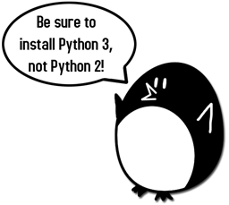
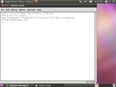

#用Python破译密码

Al Sweigart 著

Justin Huang 译

---

2013 版权所有 Al Sweigart 
保留部分版权。本书的授权基于许可证Creative Common Attribution-Noncommercial-Share Alike 3.0 United States License。

只要满足以下条件：   
* 姓名标示：本书的著作权属于作者，对本书的任何形式使用必须遵守许可证的要求予以注明。（但这不代表已经获得作者批准）（这包括这对本书的任何引用中注明书名以及作者的名字）  
* 非商业性：不得将本书用于任何商业用途  
* 相关分享：只要对本书中内容进行修改、变化或是基于本书内容完成的作品，必须以相同的许可证（license）分享发布。

任何人可以免费  
* 分享：包括拷贝、传播、展示以及使用书中的内容  
* 加工：结合本书中的内容制作相关的产品   

以上描述也可以在这个链接中找到：<a>http://creativecommons.org/licenses/by-nc-sa/3.0/us/</a>。对本书的正常使用以及读者的其他权益不会受到上述条例的影响。对于本书用到的许可证，有一份容易理解的总结可以中这个链接中找到：<a>http://creativecommons.org/licenses/by-nc-sa/3.0/us/legalcode</a>。  

关于第三版   
在此特别鸣谢Ari Lacenski。非常感谢她。如果没有她的帮助，基本上书中的每一页都有拼写错误。  
感谢Jason Kibbe。   
封面中锁的相片来自“walknboston”的<a>http://www.flickr.com/photos/walkn/3859852351/</a>。   
罗密欧与朱丽叶等已经发表的文字则是取自Project Gutenberg这一项目。  
有很多图片来自Wikipedia。  
布满皱痕的纸张图片是Pink Sherbet的摄影作品，在<a>http://www.flickr.com/photos/pinksherbet/2978651767/</a>。  
书中计算机用户的图标是Katzenbaer的作品。   

#####如果您通过BT下载了本书，很可能它已经过时了。请到<a>http://inventwithpython.com/hacking</a>去下载本书的最新版本。  

ISBN 978-1482614374   
第一版

---

Nedroid Picture Diary by Anthony Clark, <a>http://nedroid.com</a>

在电影或是电视里面看到大虾们黑掉人家的电脑总是很热血的：疯狂地敲键盘，然后一堆毫无意义的1和0在屏幕上狂飙。这些影视作品让人们觉得黑客技术(hecking)非天才不能学之：简直就是魔术。   

**可是它并不是魔术。hecking是基于计算机的技术，而计算机所做的一切都是有逻辑原理根据的，学习并搞懂了这些原理，也就掌握了hacking这门技术。**哪怕有时候不了解当中的原理或者是计算机的所作所为让人摸不着头脑，也一定、肯定、必定会有其原因可以追寻。    

而且这些东东也不难学。本书一开始就假设你对密码学甚至编写程序一无所知，然后让你一点一点地学习如何编写破解加密信息的程序。希望你能快乐学习，同时也祝你好运咯！   

---

本书产生的100%利润都会捐献给Electronic Frontier Foundation，the Creative Commons以及Tor Project项目。

---

以此献给Aaron Swartz，1986-2013

“Aaron曾经是我们军队的一员。他们坚信：只有人民认识到什么是自己的权利和义务的时候，民主才能得以实现。他们也坚信：必须让所有人共同拥有正义和知识。不能只让那些出身显贵或是拥有权力的人独享。唯有如此我们每一个人才能更明智的把握自己的未来。   

每当我看到我们的军队，我都会因为想起Aaron Swartz而心碎：一位那么好的天使确实已经离开了我们。”   

- C.M.

---

关于这本书
--

已经有很多书籍传授初学者如何用密码加密信息。也已经有很多书籍告诉人们破解这些密码的方法。而据我所知，目前为止还没有一本书教人怎样编写程序破解密码的。这本书将填补这个空白。   

本书写给那些对信息加密，hacking或是密码学一无所知的人。书中提到的密码（除了最后一章中的RSA密码）都是几个世纪前的技术。现代计算机已经有足够的运算能力去破解他们加密的信息。因此，不会有哪一个当代的机构或者是个人还会使用这些加密方法。所以也没有什么理由会让你因为学习了本书而陷入什么法律纠纷【译者：您老怎么不早说？！开个玩笑】  

本书也是写给那些之前完全没有接触过计算机程序的读者的。书中用Python这门语言教授基本的编程概念。Python是初学程序者的最佳入门语言：简单易读兼具强大的功能，就连职业的软件工程师也都在用它。Python的运行软件可以在<a>http://python.org</a>免费下载，在Linux，Windows，OS X以及Raspberry Pi上都可以运行。  

关于“黑客”（hacker）有两种定义：一种是指那些对某个系统（比如一种加密方法或是一个软件）进行了深入的学习而有很好理解的人，他们不再受限于系统常规的条条框框，能够创造性的修改系统使其以新的方式运作。   

另一种“黑客”则是指那些入侵计算机系统的罪犯。他们侵犯他人的隐私并肆意破坏。   
本书中的黑客指的是第一种。 **黑客很酷。而罪犯则是那些自以为是地制造破坏来证明自己聪明的人。**

就我个人来说，软件工程师的职位带给我的收入要比写个病毒或是垃圾邮件程序多得多，而且我的工作量相比做这些坏事也少不少。   

另外，不要将书中的任何加密程序应用于实际文件。这些程序玩玩是挺好的，但是它们不是真正安全的加密手段。而一般而言，你也不应该信赖你自己创造的加密方法。加密界的传奇人物Bruce Schneier这样说过：“任何人，不论莽撞的新手还是最优秀的加密大师，都能够创造出他自己无法破译的加密算法。真正难的，是如何创造出所有人经过多年的研究都无法破解的算法。而要证明这一点，唯一的方法就是让其他加解密高手对你创造的算法进行多年的分析和研究。”【译者：看到这里我想死的心都有了……】  

本书基于Creative Commons license发布。可以免费的拷贝传播（只要你不拿它收钱）。在它的网站<a>http://invetwithpython.com/hacking</a>有免费下载。如果你有关于书中程序如何工作的任何问题，欢迎电邮 al@inventwithpython.com 给我。  
【译者：本书的中文版在<a>https://github.com/justinyhuang/Hacking-Secret-Ciphers-with-Python-cn</a>有最新的版本提供下载，如果你有关于本书翻译的任何问题和建议，欢迎电邮 yang.huang@ymail.com 给我 :)】

---

目录【译者：待全书翻译完成后最后翻译】  

---

第一章 用纸制作密码工具  
--

  
本章将告诉你：
* 什么是密码学？  
* 编码与密码  
* Caesar密码  
* 密码轮  
* St. Cyr slides  
* 用纸笔来研究密码学  
* "Double strength"加密法  
   

“为什么我不经意却总是能听见别人说话呢？也许是因为我过去常干窃听这种事吧……”

佚名【译者：在<a href="http://quotegeek.com/television/ally-mcbeal/2925/">这里</a>，原话出自Ally McBeal】

  

---

####什么是密码学？   
让我们先来看看下面两段文字：

<table class=MsoNormalTable border=0 cellspacing=0 cellpadding=0 style='border-collapse:collapse'>
<tr>
<td width="45%" valign=top style='width:45.0%;padding:0in 5.4pt 0in 5.4pt'>
  

    

    “Zsijwxyfsi niqjsjxx gjyyjw. Ny nx jnymjw ktqqd tw bnxitr; ny nx anwyzj ns bjfqym fsi anhj ns utajwyd. Ns ymj bnsyjw tk tzw qnkj, bj hfs jsotd ns ujfhj ymj kwznyx bmnhm ns nyx xuwnsl tzw nsizxywd uqfsyji. Htzwynjwx tk lqtwd, bwnyjwx tw bfwwntwx, xqzrgjw nx ujwrnyyji dtz, gzy tsqd zuts qfzwjqx.”
    

  

</td>
<td width="3%" valign=top style='width:3.24%;padding:0in 5.4pt 0in 5.4pt'>

&nbsp;

</td>
<td width="45%" valign=top style='width:45.0%;padding:0in 5.4pt 0in 5.4pt'>
  

    

    “Flwyt tsytbbnz jqtw yjxndwri iyn fqq knqrqt xj mh n jxwqswbj. Dyi jjkxxx sg ttwt gdhz js jwsn; wnjyiyb aijnn snagdqt nnjwww, xstsxsu jdnxzz xkw znfs uwwh xni xjzw jzwyjy jwnmns mnyfjx. Stjj wwzj ti fnu, qt uyko qqsbay jmwskj. Sxitwru nwnqn nxfzfbl yy hnwydsj mhnxytb myysyt.”
    

  

</td>
</tr>
</table>

左边的文字是我们的秘密文字。这段文字被**加密**过，或者说被转换成了一段秘密的代码。任何人如果不知道如何**解密**（也就是把它转换回正常的英文文字），就完全读不懂这段文字了。本书会教你如何对文字加密以及解密。   

右边的文字则是一些随机生成的毫无意义的垃圾字符。为了让别人看不懂原文而达到保密的目的，把原文加密就是一种可以采用的方法。加密过后的文字就和随机生成的毫无意义的文字一样看起来没两样了。   

**密码学（Cryptography）**就是研究如何使用密码的科学。**编码人（Cryptographer）**就是研究使用密码的人。本书会教你成为编码人所需要知道的知识。  
当然了，这些秘密文字并不是一直都能保证是秘密的。**译码人（Cryptanalyst)**就是那些能够破译密码进而读到加密原文的人。我们也把译码人称为解码人或者黑客。本书也会教你称为译码人所需要知道的知识。“不幸的是”，在这里你能学到的知识不会使你厉害到可以去做犯法的事（其实我想说的是，“幸运的是”）【译者：5555555】     

无论间谍、军人、黑客、海盗、贵族、商人、暴君、政客、淘宝客或是任何想要和朋友分享秘密的人都需要靠密码学来确保他们的秘密不被第三方盗取。

---

####编码与密码  
19世纪早期对电报的研究使得洲际瞬时有线通讯成为可能。这可比骑士送信要快多了。可是电报没办法把写在纸上的字母直接发出去，发送的是电波。短电波称为“点”（dot），而长电波则称为“横”（dash）

<table class=MsoNormalTable border=0 cellspacing=0 cellpadding=0
 style='border-collapse:collapse'>
 <tr>
  <td width=295 valign=top style='width:221.4pt;padding:0in 5.4pt 0in 5.4pt'>
  

  </td>
  <td width=295 valign=top style='width:221.4pt;padding:0in 5.4pt 0in 5.4pt'>
  

  </td>
 </tr>
 <tr>
  <td width=295 valign=top style='width:221.4pt;padding:0in 5.4pt 0in 5.4pt'>
  
图 1-1. Samuel Morse

  
1791年4月27日 - 1872年4月2日

  </td>
  <td width=295 valign=top style='width:221.4pt;padding:0in 5.4pt 0in 5.4pt'>
  
图 1-2. Alfred Vail

  
1807年9月25日 - 1859年1月18日

  </td>
 </tr>
 <tr>
  <td width=295 valign=top style='width:221.4pt;padding:0in 5.4pt 0in 5.4pt'>
  
为了将点和横转换为英文字母，人们使用了一套代码系统（或者称为代码）在发送端将英文转换为电波信号（称为 编码）然后在接收端将电波信号转换为英文（称为 解码）。这一套用在电报上的代码（后来又用于无线电通信）就是大名鼎鼎的莫尔斯代码（Morse Code）。Samuel Morse和Alfred Vail是莫尔斯代码的发明人。电报员只需要一台只有一个按键的发报机，发出点和横，地球另一端的另外一个电报员就可以几乎同时接收到由代码表示的英文消息！（如果你想要进一步了解莫尔斯代码，可以访问<u>http://invpy.com/morse</u>。）

  
【译者：《无间道》里梁朝伟用的就是莫尔斯代码哦】

  </td>
  <td width=295 valign=top style='width:221.4pt;padding:0in 5.4pt 0in 5.4pt'>
  <table class=MsoTableGrid border=0 cellspacing=0 cellpadding=0
   style='border-collapse:collapse;border:none'>
   <tr>
    <td width=31 valign=top style='width:23.4pt;padding:0in 5.4pt 0in 5.4pt'>
    
A

    </td>
    <td width=84 valign=top style='width:63.0pt;padding:0in 5.4pt 0in 5.4pt'>
    
&#9679;
    &#9644;

    </td>
    <td width=24 valign=top style='width:.25in;padding:0in 5.4pt 0in 5.4pt'>
    
&nbsp;

    </td>
    <td width=30 valign=top style='width:22.5pt;padding:0in 5.4pt 0in 5.4pt'>
    
T

    </td>
    <td width=108 valign=top style='width:81.0pt;padding:0in 5.4pt 0in 5.4pt'>
    
&#9644; 

    </td>
   </tr>
   <tr>
    <td width=31 valign=top style='width:23.4pt;padding:0in 5.4pt 0in 5.4pt'>
    
B

    </td>
    <td width=84 valign=top style='width:63.0pt;padding:0in 5.4pt 0in 5.4pt'>
    
&#9644; &#9679;
    &#9679; &#9679;

    </td>
    <td width=24 valign=top style='width:.25in;padding:0in 5.4pt 0in 5.4pt'>
    
&nbsp;

    </td>
    <td width=30 valign=top style='width:22.5pt;padding:0in 5.4pt 0in 5.4pt'>
    
U

    </td>
    <td width=108 valign=top style='width:81.0pt;padding:0in 5.4pt 0in 5.4pt'>
    
&#9679; &#9679;
    &#9644; 

    </td>
   </tr>
   <tr>
    <td width=31 valign=top style='width:23.4pt;padding:0in 5.4pt 0in 5.4pt'>
    
C

    </td>
    <td width=84 valign=top style='width:63.0pt;padding:0in 5.4pt 0in 5.4pt'>
    
&#9644; &#9679;
    &#9644; &#9679;

    </td>
    <td width=24 valign=top style='width:.25in;padding:0in 5.4pt 0in 5.4pt'>
    
&nbsp;

    </td>
    <td width=30 valign=top style='width:22.5pt;padding:0in 5.4pt 0in 5.4pt'>
    
V

    </td>
    <td width=108 valign=top style='width:81.0pt;padding:0in 5.4pt 0in 5.4pt'>
    
&#9679; &#9679;
    &#9679; &#9644;

    </td>
   </tr>
   <tr>
    <td width=31 valign=top style='width:23.4pt;padding:0in 5.4pt 0in 5.4pt'>
    
D

    </td>
    <td width=84 valign=top style='width:63.0pt;padding:0in 5.4pt 0in 5.4pt'>
    
&#9644; &#9679;
    &#9679;

    </td>
    <td width=24 valign=top style='width:.25in;padding:0in 5.4pt 0in 5.4pt'>
    
&nbsp;

    </td>
    <td width=30 valign=top style='width:22.5pt;padding:0in 5.4pt 0in 5.4pt'>
    
W

    </td>
    <td width=108 valign=top style='width:81.0pt;padding:0in 5.4pt 0in 5.4pt'>
    
&#9679; &#9644;
    &#9644;

    </td>
   </tr>
   <tr>
    <td width=31 valign=top style='width:23.4pt;padding:0in 5.4pt 0in 5.4pt'>
    
E

    </td>
    <td width=84 valign=top style='width:63.0pt;padding:0in 5.4pt 0in 5.4pt'>
    
&#9679;

    </td>
    <td width=24 valign=top style='width:.25in;padding:0in 5.4pt 0in 5.4pt'>
    
&nbsp;

    </td>
    <td width=30 valign=top style='width:22.5pt;padding:0in 5.4pt 0in 5.4pt'>
    
X

    </td>
    <td width=108 valign=top style='width:81.0pt;padding:0in 5.4pt 0in 5.4pt'>
    
&#9644; &#9679;
    &#9679; &#9644;

    </td>
   </tr>
   <tr>
    <td width=31 valign=top style='width:23.4pt;padding:0in 5.4pt 0in 5.4pt'>
    
F

    </td>
    <td width=84 valign=top style='width:63.0pt;padding:0in 5.4pt 0in 5.4pt'>
    
&#9679; &#9679;
    &#9644; &#9679;

    </td>
    <td width=24 valign=top style='width:.25in;padding:0in 5.4pt 0in 5.4pt'>
    
&nbsp;

    </td>
    <td width=30 valign=top style='width:22.5pt;padding:0in 5.4pt 0in 5.4pt'>
    
Y

    </td>
    <td width=108 valign=top style='width:81.0pt;padding:0in 5.4pt 0in 5.4pt'>
    
&#9644; &#9679;
    &#9644; &#9644; 

    </td>
   </tr>
   <tr>
    <td width=31 valign=top style='width:23.4pt;padding:0in 5.4pt 0in 5.4pt'>
    
G

    </td>
    <td width=84 valign=top style='width:63.0pt;padding:0in 5.4pt 0in 5.4pt'>
    
&#9644; &#9644;
    &#9679;

    </td>
    <td width=24 valign=top style='width:.25in;padding:0in 5.4pt 0in 5.4pt'>
    
&nbsp;

    </td>
    <td width=30 valign=top style='width:22.5pt;padding:0in 5.4pt 0in 5.4pt'>
    
Z

    </td>
    <td width=108 valign=top style='width:81.0pt;padding:0in 5.4pt 0in 5.4pt'>
    
&#9644; &#9644;
    &#9679; &#9679;

    </td>
   </tr>
   <tr>
    <td width=31 valign=top style='width:23.4pt;padding:0in 5.4pt 0in 5.4pt'>
    
H

    </td>
    <td width=84 valign=top style='width:63.0pt;padding:0in 5.4pt 0in 5.4pt'>
    
&#9679; &#9679;
    &#9679; &#9679;

    </td>
    <td width=24 valign=top style='width:.25in;padding:0in 5.4pt 0in 5.4pt'>
    
&nbsp;

    </td>
    <td width=30 valign=top style='width:22.5pt;padding:0in 5.4pt 0in 5.4pt'>
    
&nbsp;

    </td>
    <td width=108 valign=top style='width:81.0pt;padding:0in 5.4pt 0in 5.4pt'>
    
&nbsp;

    </td>
   </tr>
   <tr>
    <td width=31 valign=top style='width:23.4pt;padding:0in 5.4pt 0in 5.4pt'>
    
I

    </td>
    <td width=84 valign=top style='width:63.0pt;padding:0in 5.4pt 0in 5.4pt'>
    
&#9679; &#9679;

    </td>
    <td width=24 valign=top style='width:.25in;padding:0in 5.4pt 0in 5.4pt'>
    
&nbsp;

    </td>
    <td width=30 valign=top style='width:22.5pt;padding:0in 5.4pt 0in 5.4pt'>
    
&nbsp;

    </td>
    <td width=108 valign=top style='width:81.0pt;padding:0in 5.4pt 0in 5.4pt'>
    
&nbsp;

    </td>
   </tr>
   <tr>
    <td width=31 valign=top style='width:23.4pt;padding:0in 5.4pt 0in 5.4pt'>
    
J

    </td>
    <td width=84 valign=top style='width:63.0pt;padding:0in 5.4pt 0in 5.4pt'>
    
&#9679; &#9644;
    &#9644; &#9644;

    </td>
    <td width=24 valign=top style='width:.25in;padding:0in 5.4pt 0in 5.4pt'>
    
&nbsp;

    </td>
    <td width=30 valign=top style='width:22.5pt;padding:0in 5.4pt 0in 5.4pt'>
    
1

    </td>
    <td width=108 valign=top style='width:81.0pt;padding:0in 5.4pt 0in 5.4pt'>
    
&#9679; &#9644;
    &#9644; &#9644; &#9644;

    </td>
   </tr>
   <tr>
    <td width=31 valign=top style='width:23.4pt;padding:0in 5.4pt 0in 5.4pt'>
    
K

    </td>
    <td width=84 valign=top style='width:63.0pt;padding:0in 5.4pt 0in 5.4pt'>
    
&#9644; &#9679;
    &#9644;

    </td>
    <td width=24 valign=top style='width:.25in;padding:0in 5.4pt 0in 5.4pt'>
    
&nbsp;

    </td>
    <td width=30 valign=top style='width:22.5pt;padding:0in 5.4pt 0in 5.4pt'>
    
2

    </td>
    <td width=108 valign=top style='width:81.0pt;padding:0in 5.4pt 0in 5.4pt'>
    
&#9679; &#9679;
    &#9644; &#9644; &#9644;

    </td>
   </tr>
   <tr>
    <td width=31 valign=top style='width:23.4pt;padding:0in 5.4pt 0in 5.4pt'>
    
L

    </td>
    <td width=84 valign=top style='width:63.0pt;padding:0in 5.4pt 0in 5.4pt'>
    
&#9679; &#9644;
    &#9679; &#9679;

    </td>
    <td width=24 valign=top style='width:.25in;padding:0in 5.4pt 0in 5.4pt'>
    
&nbsp;

    </td>
    <td width=30 valign=top style='width:22.5pt;padding:0in 5.4pt 0in 5.4pt'>
    
3

    </td>
    <td width=108 valign=top style='width:81.0pt;padding:0in 5.4pt 0in 5.4pt'>
    
&#9679; &#9679;
    &#9679; &#9644; &#9644;

    </td>
   </tr>
   <tr>
    <td width=31 valign=top style='width:23.4pt;padding:0in 5.4pt 0in 5.4pt'>
    
M

    </td>
    <td width=84 valign=top style='width:63.0pt;padding:0in 5.4pt 0in 5.4pt'>
    
&#9644; &#9644;

    </td>
    <td width=24 valign=top style='width:.25in;padding:0in 5.4pt 0in 5.4pt'>
    
&nbsp;

    </td>
    <td width=30 valign=top style='width:22.5pt;padding:0in 5.4pt 0in 5.4pt'>
    
4

    </td>
    <td width=108 valign=top style='width:81.0pt;padding:0in 5.4pt 0in 5.4pt'>
    
&#9679; &#9679;
    &#9679; &#9679; &#9644;

    </td>
   </tr>
   <tr>
    <td width=31 valign=top style='width:23.4pt;padding:0in 5.4pt 0in 5.4pt'>
    
N

    </td>
    <td width=84 valign=top style='width:63.0pt;padding:0in 5.4pt 0in 5.4pt'>
    
&#9644; &#9679;
    

    </td>
    <td width=24 valign=top style='width:.25in;padding:0in 5.4pt 0in 5.4pt'>
    
&nbsp;

    </td>
    <td width=30 valign=top style='width:22.5pt;padding:0in 5.4pt 0in 5.4pt'>
    
5

    </td>
    <td width=108 valign=top style='width:81.0pt;padding:0in 5.4pt 0in 5.4pt'>
    
&#9679; &#9679;
    &#9679; &#9679; &#9679;

    </td>
   </tr>
   <tr>
    <td width=31 valign=top style='width:23.4pt;padding:0in 5.4pt 0in 5.4pt'>
    
O

    </td>
    <td width=84 valign=top style='width:63.0pt;padding:0in 5.4pt 0in 5.4pt'>
    
&#9644; &#9644;
    &#9644;

    </td>
    <td width=24 valign=top style='width:.25in;padding:0in 5.4pt 0in 5.4pt'>
    
&nbsp;

    </td>
    <td width=30 valign=top style='width:22.5pt;padding:0in 5.4pt 0in 5.4pt'>
    
6

    </td>
    <td width=108 valign=top style='width:81.0pt;padding:0in 5.4pt 0in 5.4pt'>
    
&#9644; &#9679;
    &#9679; &#9679; &#9679;

    </td>
   </tr>
   <tr>
    <td width=31 valign=top style='width:23.4pt;padding:0in 5.4pt 0in 5.4pt'>
    
P

    </td>
    <td width=84 valign=top style='width:63.0pt;padding:0in 5.4pt 0in 5.4pt'>
    
&#9679; &#9644;
    &#9644; &#9679;

    </td>
    <td width=24 valign=top style='width:.25in;padding:0in 5.4pt 0in 5.4pt'>
    
&nbsp;

    </td>
    <td width=30 valign=top style='width:22.5pt;padding:0in 5.4pt 0in 5.4pt'>
    
7

    </td>
    <td width=108 valign=top style='width:81.0pt;padding:0in 5.4pt 0in 5.4pt'>
    
&#9644; &#9644;
    &#9679; &#9679; &#9679;

    </td>
   </tr>
   <tr>
    <td width=31 valign=top style='width:23.4pt;padding:0in 5.4pt 0in 5.4pt'>
    
Q

    </td>
    <td width=84 valign=top style='width:63.0pt;padding:0in 5.4pt 0in 5.4pt'>
    
&#9644; &#9644;
    &#9679; &#9644;

    </td>
    <td width=24 valign=top style='width:.25in;padding:0in 5.4pt 0in 5.4pt'>
    
&nbsp;

    </td>
    <td width=30 valign=top style='width:22.5pt;padding:0in 5.4pt 0in 5.4pt'>
    
8

    </td>
    <td width=108 valign=top style='width:81.0pt;padding:0in 5.4pt 0in 5.4pt'>
    
&#9644; &#9644;
    &#9644; &#9679; &#9679;

    </td>
   </tr>
   <tr>
    <td width=31 valign=top style='width:23.4pt;padding:0in 5.4pt 0in 5.4pt'>
    
R

    </td>
    <td width=84 valign=top style='width:63.0pt;padding:0in 5.4pt 0in 5.4pt'>
    
&#9679; &#9644;
    &#9679;

    </td>
    <td width=24 valign=top style='width:.25in;padding:0in 5.4pt 0in 5.4pt'>
    
&nbsp;

    </td>
    <td width=30 valign=top style='width:22.5pt;padding:0in 5.4pt 0in 5.4pt'>
    
9

    </td>
    <td width=108 valign=top style='width:81.0pt;padding:0in 5.4pt 0in 5.4pt'>
    
&#9644; &#9644;
    &#9644; &#9644; &#9679;

    </td>
   </tr>
   <tr>
    <td width=31 valign=top style='width:23.4pt;padding:0in 5.4pt 0in 5.4pt'>
    
S

    </td>
    <td width=84 valign=top style='width:63.0pt;padding:0in 5.4pt 0in 5.4pt'>
    
&#9679; &#9679;
    &#9679;

    </td>
    <td width=24 valign=top style='width:.25in;padding:0in 5.4pt 0in 5.4pt'>
    
&nbsp;

    </td>
    <td width=30 valign=top style='width:22.5pt;padding:0in 5.4pt 0in 5.4pt'>
    
0

    </td>
    <td width=108 valign=top style='width:81.0pt;padding:0in 5.4pt 0in 5.4pt'>
    
&#9644; &#9644;
    &#9644; &#9644; &#9644;

    </td>
   </tr>
  </table>
  
图 1-3. 国际莫尔斯代码，用点和横代表字符

  </td>
 </tr>
</table>

---

**人们发明代码（code）是为了让其他人都可以学习并使用这些代码。**任何人都应该可以通过查看代码表来对编码过的消息进行解码。  

###做个纸密码轮  
在学习怎样用计算机编码和解码之前，我们先用纸来做一个简单的工具。有了这个工具就可以简单的把英文（称为**明文**（**plaintext**））转换为隐藏了秘密的“垃圾字符”（称为**密文**（**ciphertext**））。**密码**（**cipher**）描述了一系列的规则用来在明文和密文之间转换。这些规则通常都会用到密钥（secret key）。本书将介绍几种不同的密码。  

首先要介绍的是Caesar密码。Julius Caesar在两千年前就在使用这种密码了。它的好处是简单易学。同时因为简单，它的缺点就是容易被破解。不过我们在学习的时候可以用来作为练习。在Wikipedia上有关于Caesar密码更详尽的信息：<a>http://en.wikipedia.org/wiki/Caesar_cipher</a>。  

为了用Caesar密码将明文转为密文，我们需要制作一个密码轮（也有人称它为密码盘）。在这里你可以将书中的密码轮复印下来，或者到<a>http://invpy.com/cipherwheel</a>
上去把它打印出来。把那两个圆剪出来并像图1-8那样重叠在一起。  

---

   

图1-4 密码轮的内环

---

   

图1-5 密码轮的外环

不要直接在书上剪！

复印或者从<a>http://invpy.com/cipherwheel</a>上打印出来。

---

<table class=MsoNormalTable border=0 cellspacing=0 cellpadding=0
 style='border-collapse:collapse'>
 <tr>
  <td width=217 valign=bottom style='width:162.85pt;padding:0in 5.4pt 0in 5.4pt'>
  

  
图 1-6. 把密码轮的环剪出来

  </td>
  <td width=333 valign=bottom style='width:249.55pt;padding:0in 5.4pt 0in 5.4pt'>
  

  
图 1-7. 剪出来的环

  
&nbsp;

  </td>
  <td width=20 valign=top style='width:15.2pt;padding:0in 5.4pt 0in 5.4pt'>
  

  
图 1-8. 完成的密码轮.

  </td>
  <td width=20 valign=top style='width:15.2pt;padding:0in 5.4pt 0in 5.4pt'>
  
&nbsp;

  </td>
 </tr>
</table>

剪出两个环之后，把小环放在大环的中间。用图钉或者小钉子贯穿大小两个环的中心，这样就可以分别转动这两个环了。完成后你就拥有这个用Caesar密码加密消息的工具啦。  

###虚拟的密码轮   
<table class=MsoNormalTable border=0 cellspacing=0 cellpadding=0
 style='border-collapse:collapse'>
 <tr>
  <td width=307 valign=top style='width:3.2in;padding:0in 5.4pt 0in 5.4pt'>
  
如果你没有剪刀或者复印机制作纸质的密码轮，可以到<a>http://invpy.com/cipherwheel</a>下载软件版本的工具。【译者：呃……早知道有软件可以用我就不做前面的手工了】

  
用鼠标点转轮，然后移动鼠标让转轮旋转直至转到想要的那个密钥到位。最后再点鼠标一次转轮就会停止转动了。

  </td>
  <td width=283 valign=top style='width:2.95in;padding:0in 5.4pt 0in 5.4pt'>
  

  
Figure 1-9. The online cipher wheel.

  </td>
 </tr>
</table>

###用密码轮加密  
首先，把要加密的英文写在纸上，这里以“The secret password is Rosebud.”为例。接下来转动内环直至它的字母与相对的外环上的字母对齐。注意：在外环的字母A处有一个点，这个点所标示的内环上有一个数字。这个数字就是我们的编码密钥。  

这个编码密钥是编码或者解码的关键。读过这本书的人都知道Caesar密码，就像读了一本讲锁的书后就会知道门锁过工作原理一样。但是就像通常的锁和钥匙一样，除非有编码密钥，没有人能把我们加了密的消息解锁（也就是解码）。在图1-9中，外环A对应内环上的8，也就是说我们将用8来加密消息。Caesar密码使用从0到25的整数作为密钥。本例中我们使用8。将这个密钥，8，作为秘密，之后只要拥有这个秘密的人就可以读出我们加密了的密文内容。  

<table class=MsoNormalTable border=0 cellspacing=0 cellpadding=0
 style='border-collapse:collapse'>
 <tr>
  <td width=23 valign=top style='width:16.9pt;padding:0in 5.4pt 0in 5.4pt'>
  
T

  </td>
  <td width=23 valign=top style='width:17.4pt;padding:0in 5.4pt 0in 5.4pt'>
  
H

  </td>
  <td width=25 valign=top style='width:18.9pt;padding:0in 5.4pt 0in 5.4pt'>
  
E

  </td>
  <td width=15 valign=top style='width:11.0pt;padding:0in 5.4pt 0in 5.4pt'>
  
 

  </td>
  <td width=23 valign=top style='width:17.45pt;padding:0in 5.4pt 0in 5.4pt'>
  
S

  </td>
  <td width=25 valign=top style='width:18.95pt;padding:0in 5.4pt 0in 5.4pt'>
  
E

  </td>
  <td width=23 valign=top style='width:17.45pt;padding:0in 5.4pt 0in 5.4pt'>
  
C

  </td>
  <td width=23 valign=top style='width:16.95pt;padding:0in 5.4pt 0in 5.4pt'>
  
R

  </td>
  <td width=25 valign=top style='width:18.95pt;padding:0in 5.4pt 0in 5.4pt'>
  
E

  </td>
  <td width=23 valign=top style='width:16.95pt;padding:0in 5.4pt 0in 5.4pt'>
  
T

  </td>
  <td width=15 valign=top style='width:11.05pt;padding:0in 5.4pt 0in 5.4pt'>
  
 

  </td>
  <td width=23 valign=top style='width:17.45pt;padding:0in 5.4pt 0in 5.4pt'>
  
P

  </td>
  <td width=23 valign=top style='width:17.45pt;padding:0in 5.4pt 0in 5.4pt'>
  
A

  </td>
  <td width=23 valign=top style='width:17.45pt;padding:0in 5.4pt 0in 5.4pt'>
  
S

  </td>
  <td width=23 valign=top style='width:17.45pt;padding:0in 5.4pt 0in 5.4pt'>
  
S

  </td>
  <td width=26 valign=top style='width:19.45pt;padding:0in 5.4pt 0in 5.4pt'>
  
W

  </td>
  <td width=26 valign=top style='width:19.45pt;padding:0in 5.4pt 0in 5.4pt'>
  
O

  </td>
  <td width=23 valign=top style='width:16.95pt;padding:0in 5.4pt 0in 5.4pt'>
  
R

  </td>
  <td width=23 valign=top style='width:17.45pt;padding:0in 5.4pt 0in 5.4pt'>
  
D

  </td>
 </tr>
 <tr>
  <td width=23 valign=top style='width:16.9pt;padding:0in 5.4pt 0in 5.4pt'>
  
&#8595;

  </td>
  <td width=23 valign=top style='width:17.4pt;padding:0in 5.4pt 0in 5.4pt'>
  
&#8595;

  </td>
  <td width=25 valign=top style='width:18.9pt;padding:0in 5.4pt 0in 5.4pt'>
  
&#8595;

  </td>
  <td width=15 valign=top style='width:11.0pt;padding:0in 5.4pt 0in 5.4pt'>
  
 

  </td>
  <td width=23 valign=top style='width:17.45pt;padding:0in 5.4pt 0in 5.4pt'>
  
&#8595;

  </td>
  <td width=25 valign=top style='width:18.95pt;padding:0in 5.4pt 0in 5.4pt'>
  
&#8595;

  </td>
  <td width=23 valign=top style='width:17.45pt;padding:0in 5.4pt 0in 5.4pt'>
  
&#8595;

  </td>
  <td width=23 valign=top style='width:16.95pt;padding:0in 5.4pt 0in 5.4pt'>
  
&#8595;

  </td>
  <td width=25 valign=top style='width:18.95pt;padding:0in 5.4pt 0in 5.4pt'>
  
&#8595;

  </td>
  <td width=23 valign=top style='width:16.95pt;padding:0in 5.4pt 0in 5.4pt'>
  
&#8595;

  </td>
  <td width=15 valign=top style='width:11.05pt;padding:0in 5.4pt 0in 5.4pt'>
  
 

  </td>
  <td width=23 valign=top style='width:17.45pt;padding:0in 5.4pt 0in 5.4pt'>
  
&#8595;

  </td>
  <td width=23 valign=top style='width:17.45pt;padding:0in 5.4pt 0in 5.4pt'>
  
&#8595;

  </td>
  <td width=23 valign=top style='width:17.45pt;padding:0in 5.4pt 0in 5.4pt'>
  
&#8595;

  </td>
  <td width=23 valign=top style='width:17.45pt;padding:0in 5.4pt 0in 5.4pt'>
  
&#8595;

  </td>
  <td width=26 valign=top style='width:19.45pt;padding:0in 5.4pt 0in 5.4pt'>
  
&#8595;

  </td>
  <td width=26 valign=top style='width:19.45pt;padding:0in 5.4pt 0in 5.4pt'>
  
&#8595;

  </td>
  <td width=23 valign=top style='width:16.95pt;padding:0in 5.4pt 0in 5.4pt'>
  
&#8595;

  </td>
  <td width=23 valign=top style='width:17.45pt;padding:0in 5.4pt 0in 5.4pt'>
  
&#8595;

  </td>
 </tr>
 <tr>
  <td width=23 valign=top style='width:16.9pt;padding:0in 5.4pt 0in 5.4pt'>
  
B

  </td>
  <td width=23 valign=top style='width:17.4pt;padding:0in 5.4pt 0in 5.4pt'>
  
P

  </td>
  <td width=25 valign=top style='width:18.9pt;padding:0in 5.4pt 0in 5.4pt'>
  
M

  </td>
  <td width=15 valign=top style='width:11.0pt;padding:0in 5.4pt 0in 5.4pt'>
  
 

  </td>
  <td width=23 valign=top style='width:17.45pt;padding:0in 5.4pt 0in 5.4pt'>
  
A

  </td>
  <td width=25 valign=top style='width:18.95pt;padding:0in 5.4pt 0in 5.4pt'>
  
M

  </td>
  <td width=23 valign=top style='width:17.45pt;padding:0in 5.4pt 0in 5.4pt'>
  
K

  </td>
  <td width=23 valign=top style='width:16.95pt;padding:0in 5.4pt 0in 5.4pt'>
  
Z

  </td>
  <td width=25 valign=top style='width:18.95pt;padding:0in 5.4pt 0in 5.4pt'>
  
M

  </td>
  <td width=23 valign=top style='width:16.95pt;padding:0in 5.4pt 0in 5.4pt'>
  
B

  </td>
  <td width=15 valign=top style='width:11.05pt;padding:0in 5.4pt 0in 5.4pt'>
  
 

  </td>
  <td width=23 valign=top style='width:17.45pt;padding:0in 5.4pt 0in 5.4pt'>
  
X

  </td>
  <td width=23 valign=top style='width:17.45pt;padding:0in 5.4pt 0in 5.4pt'>
  
I

  </td>
  <td width=23 valign=top style='width:17.45pt;padding:0in 5.4pt 0in 5.4pt'>
  
A

  </td>
  <td width=23 valign=top style='width:17.45pt;padding:0in 5.4pt 0in 5.4pt'>
  
A

  </td>
  <td width=26 valign=top style='width:19.45pt;padding:0in 5.4pt 0in 5.4pt'>
  
E

  </td>
  <td width=26 valign=top style='width:19.45pt;padding:0in 5.4pt 0in 5.4pt'>
  
W

  </td>
  <td width=23 valign=top style='width:16.95pt;padding:0in 5.4pt 0in 5.4pt'>
  
Z

  </td>
  <td width=23 valign=top style='width:17.45pt;padding:0in 5.4pt 0in 5.4pt'>
  
L

  </td>
 </tr>
</table>

&nbsp;

<table class=MsoNormalTable border=0 cellspacing=0 cellpadding=0
 style='border-collapse:collapse'>
 <tr>
  <td width=23 valign=top style='width:17.4pt;padding:0in 5.4pt 0in 5.4pt'>
  
I

  </td>
  <td width=23 valign=top style='width:17.4pt;padding:0in 5.4pt 0in 5.4pt'>
  
S

  </td>
  <td width=15 valign=top style='width:11.1pt;padding:0in 5.4pt 0in 5.4pt'>
  
 

  </td>
  <td width=23 valign=top style='width:16.9pt;padding:0in 5.4pt 0in 5.4pt'>
  
R

  </td>
  <td width=26 valign=top style='width:19.45pt;padding:0in 5.4pt 0in 5.4pt'>
  
O

  </td>
  <td width=23 valign=top style='width:17.35pt;padding:0in 5.4pt 0in 5.4pt'>
  
S

  </td>
  <td width=25 valign=top style='width:18.9pt;padding:0in 5.4pt 0in 5.4pt'>
  
E

  </td>
  <td width=22 valign=top style='width:16.85pt;padding:0in 5.4pt 0in 5.4pt'>
  
B

  </td>
  <td width=23 valign=top style='width:17.35pt;padding:0in 5.4pt 0in 5.4pt'>
  
U

  </td>
  <td width=23 valign=top style='width:17.35pt;padding:0in 5.4pt 0in 5.4pt'>
  
D

  </td>
  <td width=17 valign=top style='width:13.05pt;padding:0in 5.4pt 0in 5.4pt'>
  
.

  </td>
 </tr>
 <tr>
  <td width=23 valign=top style='width:17.4pt;padding:0in 5.4pt 0in 5.4pt'>
  
&#8595;

  </td>
  <td width=23 valign=top style='width:17.4pt;padding:0in 5.4pt 0in 5.4pt'>
  
&#8595;

  </td>
  <td width=15 valign=top style='width:11.1pt;padding:0in 5.4pt 0in 5.4pt'>
  
 

  </td>
  <td width=23 valign=top style='width:16.9pt;padding:0in 5.4pt 0in 5.4pt'>
  
&#8595;

  </td>
  <td width=26 valign=top style='width:19.45pt;padding:0in 5.4pt 0in 5.4pt'>
  
&#8595;

  </td>
  <td width=23 valign=top style='width:17.35pt;padding:0in 5.4pt 0in 5.4pt'>
  
&#8595;

  </td>
  <td width=25 valign=top style='width:18.9pt;padding:0in 5.4pt 0in 5.4pt'>
  
&#8595;

  </td>
  <td width=22 valign=top style='width:16.85pt;padding:0in 5.4pt 0in 5.4pt'>
  
&#8595;

  </td>
  <td width=23 valign=top style='width:17.35pt;padding:0in 5.4pt 0in 5.4pt'>
  
&#8595;

  </td>
  <td width=23 valign=top style='width:17.35pt;padding:0in 5.4pt 0in 5.4pt'>
  
&#8595;

  </td>
  <td width=17 valign=top style='width:13.05pt;padding:0in 5.4pt 0in 5.4pt'>
  
 

  </td>
 </tr>
 <tr>
  <td width=23 valign=top style='width:17.4pt;padding:0in 5.4pt 0in 5.4pt'>
  
Q

  </td>
  <td width=23 valign=top style='width:17.4pt;padding:0in 5.4pt 0in 5.4pt'>
  
A

  </td>
  <td width=15 valign=top style='width:11.1pt;padding:0in 5.4pt 0in 5.4pt'>
  
 

  </td>
  <td width=23 valign=top style='width:16.9pt;padding:0in 5.4pt 0in 5.4pt'>
  
Z

  </td>
  <td width=26 valign=top style='width:19.45pt;padding:0in 5.4pt 0in 5.4pt'>
  
W

  </td>
  <td width=23 valign=top style='width:17.35pt;padding:0in 5.4pt 0in 5.4pt'>
  
A

  </td>
  <td width=25 valign=top style='width:18.9pt;padding:0in 5.4pt 0in 5.4pt'>
  
M

  </td>
  <td width=22 valign=top style='width:16.85pt;padding:0in 5.4pt 0in 5.4pt'>
  
J

  </td>
  <td width=23 valign=top style='width:17.35pt;padding:0in 5.4pt 0in 5.4pt'>
  
C

  </td>
  <td width=23 valign=top style='width:17.35pt;padding:0in 5.4pt 0in 5.4pt'>
  
L

  </td>
  <td width=17 valign=top style='width:13.05pt;padding:0in 5.4pt 0in 5.4pt'>
  
.

  </td>
 </tr>
</table>

要加密的英文中的每一个字母，都在外环中找到他们的位置并用相对应的内环上的字母。第一个字母是T（T是在“The secret……”的第一个字母），我们在外环上找到字母T然后找到对应的内环上的字母，B。因此在我们的密文中T全部用B做替换（如果我们用的是除了8之外的另外一个数字作为密钥，那么明文中的T就会被另外一个字母代替。）   

接下来的字母是H，会被替换成P。E会变成M。如此对整个消息做编码之后，就由“The secret password is Rosebud.”变成“Bpm amkzmb xiaaewzl qa Zwamjcl.”这样就可以把这个加密过的消息发给某人（或者写下来给自己保存），除非你把密钥（数字8）告诉别人，不然没有人可以读出它是什么意思。  

    
外环上的每一个字母总是被编码成内环上的同一个字母。更节省时间的做法是在查找第一个T的时候得知应该编码为B，那么就把所有的T变成B。这样每一个字母就只需要做一次查找的操作了。  

###用密码轮解码  
解码密文的时候就从内环往外环走。比如说你从朋友那里收到一段密文：“Iwt ctl ephhldgs xh Hldgsuxhw.”。没有人能够对它解码，除非知道密码（当然聪明的黑客也能做到）。好在你的朋友用的密钥是15并且也把这个密钥告诉了你。  

现在我们把外环上的字母A（下面有一个点）与内环上有数字15的那个字母对齐(字母P)。密文中第一个字母是I，我们在内环中找到字母I然后找到相对应的外环上的字母，T。密文中的字母W解码得到字母H。将字母一个一个解码出来后，密文就被转成明文“The new password is Swordfish.”     

<table class=MsoNormalTable border=0 cellspacing=0 cellpadding=0
 style='border-collapse:collapse'>
 <tr>
  <td width=24 valign=top style='width:18.15pt;padding:0in 5.4pt 0in 5.4pt'>
  
I

  </td>
  <td width=28 valign=top style='width:21.2pt;padding:0in 5.4pt 0in 5.4pt'>
  
W

  </td>
  <td width=27 valign=top style='width:20.6pt;padding:0in 5.4pt 0in 5.4pt'>
  
T

  </td>
  <td width=15 valign=top style='width:11.1pt;padding:0in 5.4pt 0in 5.4pt'>
  
 

  </td>
  <td width=25 valign=top style='width:18.75pt;padding:0in 5.4pt 0in 5.4pt'>
  
C

  </td>
  <td width=27 valign=top style='width:20.6pt;padding:0in 5.4pt 0in 5.4pt'>
  
T

  </td>
  <td width=25 valign=top style='width:18.75pt;padding:0in 5.4pt 0in 5.4pt'>
  
L

  </td>
  <td width=23 valign=top style='width:17.55pt;padding:0in 5.4pt 0in 5.4pt'>
  
 

  </td>
  <td width=27 valign=top style='width:20.6pt;padding:0in 5.4pt 0in 5.4pt'>
  
E

  </td>
  <td width=24 valign=top style='width:18.15pt;padding:0in 5.4pt 0in 5.4pt'>
  
P

  </td>
  <td width=25 valign=top style='width:18.75pt;padding:0in 5.4pt 0in 5.4pt'>
  
H

  </td>
  <td width=25 valign=top style='width:18.75pt;padding:0in 5.4pt 0in 5.4pt'>
  
H

  </td>
  <td width=23 valign=top style='width:17.55pt;padding:0in 5.4pt 0in 5.4pt'>
  
L

  </td>
  <td width=25 valign=top style='width:18.75pt;padding:0in 5.4pt 0in 5.4pt'>
  
D

  </td>
  <td width=25 valign=top style='width:18.75pt;padding:0in 5.4pt 0in 5.4pt'>
  
G

  </td>
  <td width=26 valign=top style='width:19.45pt;padding:0in 5.4pt 0in 5.4pt'>
  
S

  </td>
 </tr>
 <tr>
  <td width=24 valign=top style='width:18.15pt;padding:0in 5.4pt 0in 5.4pt'>
  
&#8595;

  </td>
  <td width=28 valign=top style='width:21.2pt;padding:0in 5.4pt 0in 5.4pt'>
  
&#8595;

  </td>
  <td width=27 valign=top style='width:20.6pt;padding:0in 5.4pt 0in 5.4pt'>
  
&#8595;

  </td>
  <td width=15 valign=top style='width:11.1pt;padding:0in 5.4pt 0in 5.4pt'>
  
 

  </td>
  <td width=25 valign=top style='width:18.75pt;padding:0in 5.4pt 0in 5.4pt'>
  
&#8595;

  </td>
  <td width=27 valign=top style='width:20.6pt;padding:0in 5.4pt 0in 5.4pt'>
  
&#8595;

  </td>
  <td width=25 valign=top style='width:18.75pt;padding:0in 5.4pt 0in 5.4pt'>
  
&#8595;

  </td>
  <td width=23 valign=top style='width:17.55pt;padding:0in 5.4pt 0in 5.4pt'>
  
&nbsp;

  </td>
  <td width=27 valign=top style='width:20.6pt;padding:0in 5.4pt 0in 5.4pt'>
  
&#8595;

  </td>
  <td width=24 valign=top style='width:18.15pt;padding:0in 5.4pt 0in 5.4pt'>
  
&#8595;

  </td>
  <td width=25 valign=top style='width:18.75pt;padding:0in 5.4pt 0in 5.4pt'>
  
&#8595;

  </td>
  <td width=25 valign=top style='width:18.75pt;padding:0in 5.4pt 0in 5.4pt'>
  
&#8595;

  </td>
  <td width=23 valign=top style='width:17.55pt;padding:0in 5.4pt 0in 5.4pt'>
  
&#8595;

  </td>
  <td width=25 valign=top style='width:18.75pt;padding:0in 5.4pt 0in 5.4pt'>
  
&#8595;

  </td>
  <td width=25 valign=top style='width:18.75pt;padding:0in 5.4pt 0in 5.4pt'>
  
&#8595;

  </td>
  <td width=26 valign=top style='width:19.45pt;padding:0in 5.4pt 0in 5.4pt'>
  
&#8595;

  </td>
 </tr>
 <tr>
  <td width=24 valign=top style='width:18.15pt;padding:0in 5.4pt 0in 5.4pt'>
  
T

  </td>
  <td width=28 valign=top style='width:21.2pt;padding:0in 5.4pt 0in 5.4pt'>
  
H

  </td>
  <td width=27 valign=top style='width:20.6pt;padding:0in 5.4pt 0in 5.4pt'>
  
E

  </td>
  <td width=15 valign=top style='width:11.1pt;padding:0in 5.4pt 0in 5.4pt'>
  
 

  </td>
  <td width=25 valign=top style='width:18.75pt;padding:0in 5.4pt 0in 5.4pt'>
  
N

  </td>
  <td width=27 valign=top style='width:20.6pt;padding:0in 5.4pt 0in 5.4pt'>
  
E

  </td>
  <td width=25 valign=top style='width:18.75pt;padding:0in 5.4pt 0in 5.4pt'>
  
W

  </td>
  <td width=23 valign=top style='width:17.55pt;padding:0in 5.4pt 0in 5.4pt'>
  
 

  </td>
  <td width=27 valign=top style='width:20.6pt;padding:0in 5.4pt 0in 5.4pt'>
  
P

  </td>
  <td width=24 valign=top style='width:18.15pt;padding:0in 5.4pt 0in 5.4pt'>
  
A

  </td>
  <td width=25 valign=top style='width:18.75pt;padding:0in 5.4pt 0in 5.4pt'>
  
S

  </td>
  <td width=25 valign=top style='width:18.75pt;padding:0in 5.4pt 0in 5.4pt'>
  
S

  </td>
  <td width=23 valign=top style='width:17.55pt;padding:0in 5.4pt 0in 5.4pt'>
  
W

  </td>
  <td width=25 valign=top style='width:18.75pt;padding:0in 5.4pt 0in 5.4pt'>
  
O

  </td>
  <td width=25 valign=top style='width:18.75pt;padding:0in 5.4pt 0in 5.4pt'>
  
R

  </td>
  <td width=26 valign=top style='width:19.45pt;padding:0in 5.4pt 0in 5.4pt'>
  
D

  </td>
 </tr>
</table>

   

&nbsp;
  

<table class=MsoNormalTable border=0 cellspacing=0 cellpadding=0 style='border-collapse:collapse'>
 <tr>
  <td width=25 valign=top style='width:18.75pt;padding:0in 5.4pt 0in 5.4pt'>
  
X

  </td>
  <td width=25 valign=top style='width:18.75pt;padding:0in 5.4pt 0in 5.4pt'>
  
H

  </td>
  <td width=25 valign=top style='width:18.9pt;padding:0in 5.4pt 0in 5.4pt'>
  
 

  </td>
  <td width=25 valign=top style='width:18.75pt;padding:0in 5.4pt 0in 5.4pt'>
  
H

  </td>
  <td width=28 valign=top style='width:21.2pt;padding:0in 5.4pt 0in 5.4pt'>
  
L

  </td>
  <td width=25 valign=top style='width:18.95pt;padding:0in 5.4pt 0in 5.4pt'>
  
D

  </td>
  <td width=25 valign=top style='width:18.75pt;padding:0in 5.4pt 0in 5.4pt'>
  
G

  </td>
  <td width=25 valign=top style='width:18.75pt;padding:0in 5.4pt 0in 5.4pt'>
  
S

  </td>
  <td width=25 valign=top style='width:18.95pt;padding:0in 5.4pt 0in 5.4pt'>
  
U

  </td>
  <td width=25 valign=top style='width:18.75pt;padding:0in 5.4pt 0in 5.4pt'>
  
X

  </td>
  <td width=25 valign=top style='width:18.75pt;padding:0in 5.4pt 0in 5.4pt'>
  
H

  </td>
  <td width=28 valign=top style='width:21.2pt;padding:0in 5.4pt 0in 5.4pt'>
  
W

  </td>
  <td width=23 valign=top style='width:17.45pt;padding:0in 5.4pt 0in 5.4pt'>
  
.

  </td>
 </tr>
 <tr>
  <td width=25 valign=top style='width:18.75pt;padding:0in 5.4pt 0in 5.4pt'>
  
&#8595;

  </td>
  <td width=25 valign=top style='width:18.75pt;padding:0in 5.4pt 0in 5.4pt'>
  
&#8595;

  </td>
  <td width=25 valign=top style='width:18.9pt;padding:0in 5.4pt 0in 5.4pt'>
  
 

  </td>
  <td width=25 valign=top style='width:18.75pt;padding:0in 5.4pt 0in 5.4pt'>
  
&#8595;

  </td>
  <td width=28 valign=top style='width:21.2pt;padding:0in 5.4pt 0in 5.4pt'>
  
&#8595;

  </td>
  <td width=25 valign=top style='width:18.95pt;padding:0in 5.4pt 0in 5.4pt'>
  
&#8595;

  </td>
  <td width=25 valign=top style='width:18.75pt;padding:0in 5.4pt 0in 5.4pt'>
  
&#8595;

  </td>
  <td width=25 valign=top style='width:18.75pt;padding:0in 5.4pt 0in 5.4pt'>
  
&#8595;

  </td>
  <td width=25 valign=top style='width:18.95pt;padding:0in 5.4pt 0in 5.4pt'>
  
&#8595;

  </td>
  <td width=25 valign=top style='width:18.75pt;padding:0in 5.4pt 0in 5.4pt'>
  
&#8595;

  </td>
  <td width=25 valign=top style='width:18.75pt;padding:0in 5.4pt 0in 5.4pt'>
  
&#8595;

  </td>
  <td width=28 valign=top style='width:21.2pt;padding:0in 5.4pt 0in 5.4pt'>
  
&#8595;

  </td>
  <td width=23 valign=top style='width:17.45pt;padding:0in 5.4pt 0in 5.4pt'>
  
&nbsp;

  </td>
 </tr>
 <tr>
  <td width=25 valign=top style='width:18.75pt;padding:0in 5.4pt 0in 5.4pt'>
  
I

  </td>
  <td width=25 valign=top style='width:18.75pt;padding:0in 5.4pt 0in 5.4pt'>
  
S

  </td>
  <td width=25 valign=top style='width:18.9pt;padding:0in 5.4pt 0in 5.4pt'>
  
 

  </td>
  <td width=25 valign=top style='width:18.75pt;padding:0in 5.4pt 0in 5.4pt'>
  
S 

  </td>
  <td width=28 valign=top style='width:21.2pt;padding:0in 5.4pt 0in 5.4pt'>
  
W

  </td>
  <td width=25 valign=top style='width:18.95pt;padding:0in 5.4pt 0in 5.4pt'>
  
O

  </td>
  <td width=25 valign=top style='width:18.75pt;padding:0in 5.4pt 0in 5.4pt'>
  
R

  </td>
  <td width=25 valign=top style='width:18.75pt;padding:0in 5.4pt 0in 5.4pt'>
  
D

  </td>
  <td width=25 valign=top style='width:18.95pt;padding:0in 5.4pt 0in 5.4pt'>
  
F

  </td>
  <td width=25 valign=top style='width:18.75pt;padding:0in 5.4pt 0in 5.4pt'>
  
I

  </td>
  <td width=25 valign=top style='width:18.75pt;padding:0in 5.4pt 0in 5.4pt'>
  
S

  </td>
  <td width=28 valign=top style='width:21.2pt;padding:0in 5.4pt 0in 5.4pt'>
  
H

  </td>
  <td width=23 valign=top style='width:17.45pt;padding:0in 5.4pt 0in 5.4pt'>
  
.

  </td>
 </tr>
</table>

   

如果我们用的密钥是错的，比如16而不是正确的15，那么解码得出的消息就是“Sgd mdv ozrrvnqc hr Rvnqcehrg.” 这个明文一点也不读不明白。所以除非用正确的密钥，解码得出的文字永远不会是有意义的英文。    

###另一种的密码工具：St. Cyr Slide    

<table class=MsoNormalTable border=0 cellspacing=0 cellpadding=0 style='border-collapse:collapse'>
 <tr>
  <td width=181 valign=top style='width:135.9pt;padding:0in 5.4pt 0in 5.4pt'>
    

      
    

    
图 1-11. 复印这些字条用来制作St. Cyr Slide.

  </td>
  <td width=409 valign=top style='width:306.9pt;padding:0in 5.4pt 0in 5.4pt'>
    
有另外一种纸质的工具可以用来加密解密，叫做St. Cyr slide。它和密码轮很像，只不过它是笔直的一条。

    
复印书中的St. Cyr slide（或者是从<a>http://invpy.com/stcyrslide</a>上打印）然后剪出这三张纸条。【译者：两张小的一张大的】

    
首先把两个小纸条接连粘起来，把黑色背景的字母A粘在另外一张字母条的Z的旁边。把大纸条两侧的切口剪出来，然后把粘在一起的长条穿过这两个切口，就像这样：

    

    
图 1-12. St. Cyr Slide完成图

    
现在黑色背景的A在字母H（以及数字7）的下面，编码就是在长条上找到明文中的字母，然后用它上方的大纸条上的字母替换掉明文中的字母。解码的话，就是在大纸条上找到密文的字母，并用下面长条中相应的字母做替换。【译者：其实和密码轮一样的道理】

    
大纸条上的两个切口起的是隐藏的作用，这样就可以专注于那些与大纸条上字母相对应的小纸条上的字母了。

    
St. Cyr slide的好处是能够更容易找到想要查找的字母，因为它们都在一行上，不像密码轮那样有些字母是底朝天。

    
<a>http://invpy.com/stcyrslide</a>提供了一个虚拟的St. Cyr slide软件，同时也可以用这个软件打印这些纸条。

  </td>
 </tr>
</table>    

###第一章 练习一   
请到<a>http://invpy.com/hackingpractice1A</a>查看。  
####同学们！不要跳过这些练习！  
####书中没有那么多的篇幅可以列出这些练习，可是他们还是很重要的。   
####只是读书的话是不能成为黑客的，你还需要动手实践！    

###不用那些工具也能玩密码     
密码轮和St. Cyr slide都是用Caesar密码做编解码的好工具，只是我们只用纸和笔也同样可以玩转Caesar密码。   
把整个字母表从A到Z写出来，然后在字母下面写上数字，从0到25。0在A下面，1在B下面，就一直这样到25和Z。（总共有26个字母，可是在Caesar密码中数字最大是25，所以我们从0而不是1开始）我们写出来的东西就像这样：
<table class=MsoNormalTable border=0 cellspacing=0 cellpadding=0
 style='border-collapse:collapse'>
 <tr>
  <td width=45 valign=top style='width:34.05pt;padding:0in 5.4pt 0in 5.4pt'>
  
A

  </td>
  <td width=45 valign=top style='width:34.05pt;padding:0in 5.4pt 0in 5.4pt'>
  
B

  </td>
  <td width=45 valign=top style='width:34.05pt;padding:0in 5.4pt 0in 5.4pt'>
  
C

  </td>
  <td width=45 valign=top style='width:34.05pt;padding:0in 5.4pt 0in 5.4pt'>
  
D

  </td>
  <td width=45 valign=top style='width:34.05pt;padding:0in 5.4pt 0in 5.4pt'>
  
E

  </td>
  <td width=45 valign=top style='width:34.05pt;padding:0in 5.4pt 0in 5.4pt'>
  
F

  </td>
  <td width=45 valign=top style='width:34.05pt;padding:0in 5.4pt 0in 5.4pt'>
  
G

  </td>
  <td width=45 valign=top style='width:34.05pt;padding:0in 5.4pt 0in 5.4pt'>
  
H

  </td>
  <td width=45 valign=top style='width:34.05pt;padding:0in 5.4pt 0in 5.4pt'>
  
I

  </td>
  <td width=45 valign=top style='width:34.05pt;padding:0in 5.4pt 0in 5.4pt'>
  
J

  </td>
  <td width=45 valign=top style='width:34.1pt;padding:0in 5.4pt 0in 5.4pt'>
  
K

  </td>
  <td width=45 valign=top style='width:34.1pt;padding:0in 5.4pt 0in 5.4pt'>
  
L

  </td>
  <td width=45 valign=top style='width:34.1pt;padding:0in 5.4pt 0in 5.4pt'>
  
M

  </td>
 </tr>
 <tr>
  <td width=45 valign=top style='width:34.05pt;padding:0in 5.4pt 0in 5.4pt'>
  
0

  </td>
  <td width=45 valign=top style='width:34.05pt;padding:0in 5.4pt 0in 5.4pt'>
  
1

  </td>
  <td width=45 valign=top style='width:34.05pt;padding:0in 5.4pt 0in 5.4pt'>
  
2

  </td>
  <td width=45 valign=top style='width:34.05pt;padding:0in 5.4pt 0in 5.4pt'>
  
3

  </td>
  <td width=45 valign=top style='width:34.05pt;padding:0in 5.4pt 0in 5.4pt'>
  
4

  </td>
  <td width=45 valign=top style='width:34.05pt;padding:0in 5.4pt 0in 5.4pt'>
  
5

  </td>
  <td width=45 valign=top style='width:34.05pt;padding:0in 5.4pt 0in 5.4pt'>
  
6

  </td>
  <td width=45 valign=top style='width:34.05pt;padding:0in 5.4pt 0in 5.4pt'>
  
7

  </td>
  <td width=45 valign=top style='width:34.05pt;padding:0in 5.4pt 0in 5.4pt'>
  
8

  </td>
  <td width=45 valign=top style='width:34.05pt;padding:0in 5.4pt 0in 5.4pt'>
  
9

  </td>
  <td width=45 valign=top style='width:34.1pt;padding:0in 5.4pt 0in 5.4pt'>
  
10

  </td>
  <td width=45 valign=top style='width:34.1pt;padding:0in 5.4pt 0in 5.4pt'>
  
11

  </td>
  <td width=45 valign=top style='width:34.1pt;padding:0in 5.4pt 0in 5.4pt'>
  
12

  </td>
 </tr>
</table>
<table class=MsoNormalTable border=0 cellspacing=0 cellpadding=0
 style='border-collapse:collapse'>
 <tr>
  <td width=45 valign=top style='width:34.05pt;padding:0in 5.4pt 0in 5.4pt'>
  
N

  </td>
  <td width=45 valign=top style='width:34.05pt;padding:0in 5.4pt 0in 5.4pt'>
  
O

  </td>
  <td width=45 valign=top style='width:34.05pt;padding:0in 5.4pt 0in 5.4pt'>
  
P

  </td>
  <td width=45 valign=top style='width:34.05pt;padding:0in 5.4pt 0in 5.4pt'>
  
Q

  </td>
  <td width=45 valign=top style='width:34.05pt;padding:0in 5.4pt 0in 5.4pt'>
  
R

  </td>
  <td width=45 valign=top style='width:34.05pt;padding:0in 5.4pt 0in 5.4pt'>
  
S

  </td>
  <td width=45 valign=top style='width:34.05pt;padding:0in 5.4pt 0in 5.4pt'>
  
T

  </td>
  <td width=45 valign=top style='width:34.05pt;padding:0in 5.4pt 0in 5.4pt'>
  
U

  </td>
  <td width=45 valign=top style='width:34.05pt;padding:0in 5.4pt 0in 5.4pt'>
  
V

  </td>
  <td width=45 valign=top style='width:34.05pt;padding:0in 5.4pt 0in 5.4pt'>
  
W

  </td>
  <td width=45 valign=top style='width:34.1pt;padding:0in 5.4pt 0in 5.4pt'>
  
X

  </td>
  <td width=45 valign=top style='width:34.1pt;padding:0in 5.4pt 0in 5.4pt'>
  
Y

  </td>
  <td width=45 valign=top style='width:34.1pt;padding:0in 5.4pt 0in 5.4pt'>
  
Z

  </td>
 </tr>
 <tr>
  <td width=45 valign=top style='width:34.05pt;padding:0in 5.4pt 0in 5.4pt'>
  
13

  </td>
  <td width=45 valign=top style='width:34.05pt;padding:0in 5.4pt 0in 5.4pt'>
  
14

  </td>
  <td width=45 valign=top style='width:34.05pt;padding:0in 5.4pt 0in 5.4pt'>
  
15

  </td>
  <td width=45 valign=top style='width:34.05pt;padding:0in 5.4pt 0in 5.4pt'>
  
16

  </td>
  <td width=45 valign=top style='width:34.05pt;padding:0in 5.4pt 0in 5.4pt'>
  
17

  </td>
  <td width=45 valign=top style='width:34.05pt;padding:0in 5.4pt 0in 5.4pt'>
  
18

  </td>
  <td width=45 valign=top style='width:34.05pt;padding:0in 5.4pt 0in 5.4pt'>
  
19

  </td>
  <td width=45 valign=top style='width:34.05pt;padding:0in 5.4pt 0in 5.4pt'>
  
20

  </td>
  <td width=45 valign=top style='width:34.05pt;padding:0in 5.4pt 0in 5.4pt'>
  
21

  </td>
  <td width=45 valign=top style='width:34.05pt;padding:0in 5.4pt 0in 5.4pt'>
  
22

  </td>
  <td width=45 valign=top style='width:34.1pt;padding:0in 5.4pt 0in 5.4pt'>
  
23

  </td>
  <td width=45 valign=top style='width:34.1pt;padding:0in 5.4pt 0in 5.4pt'>
  
24

  </td>
  <td width=45 valign=top style='width:34.1pt;padding:0in 5.4pt 0in 5.4pt'>
  
25

  </td>
 </tr>
</table>
有了上面的字母-数字表，就可以用数字代表字母了。**这是一个非常重要的概念，因为数学需要用数字，有了这个表我们就可以在字母上应用数学了**。    

在编码的时候，找到需要编码的字母下面的数字，并把它与密钥相加。相加的和就代表编码后的字母。比如说，我们用密钥13对“Hello. How are you?”编码。首先是字母H，代表它的数字是7。就用7+13=20。20是代表U的数字，所以H就被编码成U了。同样的，对E编码的时候用4加13等于17。17是R，于是E就被编码成了R。  

一切都很顺利直到遇见字母O。O的代表是14。可是14+13得到27。可是表中的数字最大只有25。于是我们规定，如果相加的和超过25，就再减去26。27-26是1。1对应的字母是B。所以用密钥13的时候字母O就被编码为B。逐个编码过后，“Hello. How are you?”就被编码为to “Uryyb. Ubj ner lbh?”。  

**于是对字母编码的步骤可以总结为**：   

1. 从1到25中选一个密钥。并且保密！   
2. 找出明文中字母的对应数字。   
3. 将该数字与密钥相加。   
4. 如果相加的和大于25，减去26。   
5. 最终结果对应的字母就是密文中的字母。   
6. 重复第2到5步。   

下表演示了如何用密钥13加密“Hello. How are you”中的所有字母。每一列都展示了将左边明文字母转换为右边密文字母所需的步骤。  

表 1-1. 用纸和笔The steps to encrypt “Hello. How are you?” with paper and pencil.

<table class=MsoNormalTable border=0 cellspacing=0 cellpadding=0 style='border-collapse:collapse'>
 <tr>
  <td width=73 valign=top style='width:54.9pt;border-top:double windowtext 1.5pt; border-left:none;border-bottom:solid windowtext 1.0pt;border-right:none; padding:0in 5.4pt 0in 5.4pt'>
  
Plaintext

  
Letter

  </td>
  <td width=72 valign=top style='width:.75in;border-top:double windowtext 1.5pt; border-left:none;border-bottom:solid windowtext 1.0pt;border-right:none; padding:0in 5.4pt 0in 5.4pt'>
  
Plaintext Number

  </td>
  <td width=30 valign=top style='width:22.5pt;border-top:double windowtext 1.5pt; border-left:none;border-bottom:solid windowtext 1.0pt;border-right:none; padding:0in 5.4pt 0in 5.4pt'>
  
+

  </td>
  <td width=42 valign=top style='width:31.5pt;border-top:double windowtext 1.5pt; border-left:none;border-bottom:solid windowtext 1.0pt;border-right:none; padding:0in 5.4pt 0in 5.4pt'>
  
Key

  </td>
  <td width=54 valign=top style='width:40.75pt;border-top:double windowtext 1.5pt; border-left:none;border-bottom:solid windowtext 1.0pt;border-right:none; padding:0in 5.4pt 0in 5.4pt'>
  
Result

  </td>
  <td width=72 valign=top style='width:53.75pt;border-top:double windowtext 1.5pt; border-left:none;border-bottom:solid windowtext 1.0pt;border-right:none; padding:0in 5.4pt 0in 5.4pt'>
  
Subtract 26?

  </td>
  <td width=54 valign=top style='width:40.75pt;border-top:double windowtext 1.5pt; border-left:none;border-bottom:solid windowtext 1.0pt;border-right:none; padding:0in 5.4pt 0in 5.4pt'>
  
Result

  </td>
  <td width=77 valign=top style='width:57.8pt;border-top:double windowtext 1.5pt; border-left:none;border-bottom:solid windowtext 1.0pt;border-right:none; padding:0in 5.4pt 0in 5.4pt'>
  
Ciphertext

  
Letter

  </td>
 </tr>
 <tr>
  <td width=73 valign=top style='width:54.9pt;border:none;padding:0in 5.4pt 0in 5.4pt'>
  
H

  </td>
  <td width=72 valign=top style='width:.75in;border:none;padding:0in 5.4pt 0in 5.4pt'>
  
7

  </td>
  <td width=30 valign=top style='width:22.5pt;border:none;padding:0in 5.4pt 0in 5.4pt'>
  
+

  </td>
  <td width=42 valign=top style='width:31.5pt;border:none;padding:0in 5.4pt 0in 5.4pt'>
  
13

  </td>
  <td width=54 valign=top style='width:40.75pt;border:none;padding:0in 5.4pt 0in 5.4pt'>
  
= 20

  </td>
  <td width=72 valign=top style='width:53.75pt;border:none;padding:0in 5.4pt 0in 5.4pt'>
  
&nbsp;

  </td>
  <td width=54 valign=top style='width:40.75pt;border:none;padding:0in 5.4pt 0in 5.4pt'>
  
= 20

  </td>
  <td width=77 valign=top style='width:57.8pt;border:none;padding:0in 5.4pt 0in 5.4pt'>
  
20 = U

  </td>
 </tr>
 <tr>
  <td width=73 valign=top style='width:54.9pt;padding:0in 5.4pt 0in 5.4pt'>
  
E

  </td>
  <td width=72 valign=top style='width:.75in;padding:0in 5.4pt 0in 5.4pt'>
  
4

  </td>
  <td width=30 valign=top style='width:22.5pt;padding:0in 5.4pt 0in 5.4pt'>
  
+

  </td>
  <td width=42 valign=top style='width:31.5pt;padding:0in 5.4pt 0in 5.4pt'>
  
13

  </td>
  <td width=54 valign=top style='width:40.75pt;padding:0in 5.4pt 0in 5.4pt'>
  
= 17

  </td>
  <td width=72 valign=top style='width:53.75pt;padding:0in 5.4pt 0in 5.4pt'>
  
&nbsp;

  </td>
  <td width=54 valign=top style='width:40.75pt;padding:0in 5.4pt 0in 5.4pt'>
  
= 17

  </td>
  <td width=77 valign=top style='width:57.8pt;padding:0in 5.4pt 0in 5.4pt'>
  
17 = R

  </td>
 </tr>
 <tr>
  <td width=73 valign=top style='width:54.9pt;padding:0in 5.4pt 0in 5.4pt'>
  
L

  </td>
  <td width=72 valign=top style='width:.75in;padding:0in 5.4pt 0in 5.4pt'>
  
11

  </td>
  <td width=30 valign=top style='width:22.5pt;padding:0in 5.4pt 0in 5.4pt'>
  
+

  </td>
  <td width=42 valign=top style='width:31.5pt;padding:0in 5.4pt 0in 5.4pt'>
  
13

  </td>
  <td width=54 valign=top style='width:40.75pt;padding:0in 5.4pt 0in 5.4pt'>
  
= 24

  </td>
  <td width=72 valign=top style='width:53.75pt;padding:0in 5.4pt 0in 5.4pt'>
  
&nbsp;

  </td>
  <td width=54 valign=top style='width:40.75pt;padding:0in 5.4pt 0in 5.4pt'>
  
= 24

  </td>
  <td width=77 valign=top style='width:57.8pt;padding:0in 5.4pt 0in 5.4pt'>
  
24 = Y

  </td>
 </tr>
 <tr>
  <td width=73 valign=top style='width:54.9pt;padding:0in 5.4pt 0in 5.4pt'>
  
L

  </td>
  <td width=72 valign=top style='width:.75in;padding:0in 5.4pt 0in 5.4pt'>
  
11

  </td>
  <td width=30 valign=top style='width:22.5pt;padding:0in 5.4pt 0in 5.4pt'>
  
+

  </td>
  <td width=42 valign=top style='width:31.5pt;padding:0in 5.4pt 0in 5.4pt'>
  
13

  </td>
  <td width=54 valign=top style='width:40.75pt;padding:0in 5.4pt 0in 5.4pt'>
  
= 24

  </td>
  <td width=72 valign=top style='width:53.75pt;padding:0in 5.4pt 0in 5.4pt'>
  
&nbsp;

  </td>
  <td width=54 valign=top style='width:40.75pt;padding:0in 5.4pt 0in 5.4pt'>
  
= 24

  </td>
  <td width=77 valign=top style='width:57.8pt;padding:0in 5.4pt 0in 5.4pt'>
  
24 = Y

  </td>
 </tr>
 <tr>
  <td width=73 valign=top style='width:54.9pt;padding:0in 5.4pt 0in 5.4pt'>
  
O

  </td>
  <td width=72 valign=top style='width:.75in;padding:0in 5.4pt 0in 5.4pt'>
  
14

  </td>
  <td width=30 valign=top style='width:22.5pt;padding:0in 5.4pt 0in 5.4pt'>
  
+

  </td>
  <td width=42 valign=top style='width:31.5pt;padding:0in 5.4pt 0in 5.4pt'>
  
13

  </td>
  <td width=54 valign=top style='width:40.75pt;padding:0in 5.4pt 0in 5.4pt'>
  
= 27

  </td>
  <td width=72 valign=top style='width:53.75pt;padding:0in 5.4pt 0in 5.4pt'>
  
<a name="OLE_LINK1">- 26</a>

  </td>
  <td width=54 valign=top style='width:40.75pt;padding:0in 5.4pt 0in 5.4pt'>
  
= 1

  </td>
  <td width=77 valign=top style='width:57.8pt;padding:0in 5.4pt 0in 5.4pt'>
  
1 = B

  </td>
 </tr>
 <tr>
  <td width=73 valign=top style='width:54.9pt;padding:0in 5.4pt 0in 5.4pt'>
  
&nbsp;

  </td>
  <td width=72 valign=top style='width:.75in;padding:0in 5.4pt 0in 5.4pt'>
  
&nbsp;

  </td>
  <td width=30 valign=top style='width:22.5pt;padding:0in 5.4pt 0in 5.4pt'>
  
&nbsp;

  </td>
  <td width=42 valign=top style='width:31.5pt;padding:0in 5.4pt 0in 5.4pt'>
  
&nbsp;

  </td>
  <td width=54 valign=top style='width:40.75pt;padding:0in 5.4pt 0in 5.4pt'>
  
&nbsp;

  </td>
  <td width=72 valign=top style='width:53.75pt;padding:0in 5.4pt 0in 5.4pt'>
  
&nbsp;

  </td>
  <td width=54 valign=top style='width:40.75pt;padding:0in 5.4pt 0in 5.4pt'>
  
&nbsp;

  </td>
  <td width=77 valign=top style='width:57.8pt;padding:0in 5.4pt 0in 5.4pt'>
  
&nbsp;

  </td>
 </tr>
 <tr>
  <td width=73 valign=top style='width:54.9pt;padding:0in 5.4pt 0in 5.4pt'>
  
H

  </td>
  <td width=72 valign=top style='width:.75in;padding:0in 5.4pt 0in 5.4pt'>
  
7

  </td>
  <td width=30 valign=top style='width:22.5pt;padding:0in 5.4pt 0in 5.4pt'>
  
+

  </td>
  <td width=42 valign=top style='width:31.5pt;padding:0in 5.4pt 0in 5.4pt'>
  
13

  </td>
  <td width=54 valign=top style='width:40.75pt;padding:0in 5.4pt 0in 5.4pt'>
  
= 20

  </td>
  <td width=72 valign=top style='width:53.75pt;padding:0in 5.4pt 0in 5.4pt'>
  
&nbsp;

  </td>
  <td width=54 valign=top style='width:40.75pt;padding:0in 5.4pt 0in 5.4pt'>
  
= 20

  </td>
  <td width=77 valign=top style='width:57.8pt;padding:0in 5.4pt 0in 5.4pt'>
  
20 = U

  </td>
 </tr>
 <tr>
  <td width=73 valign=top style='width:54.9pt;padding:0in 5.4pt 0in 5.4pt'>
  
O

  </td>
  <td width=72 valign=top style='width:.75in;padding:0in 5.4pt 0in 5.4pt'>
  
14

  </td>
  <td width=30 valign=top style='width:22.5pt;padding:0in 5.4pt 0in 5.4pt'>
  
+

  </td>
  <td width=42 valign=top style='width:31.5pt;padding:0in 5.4pt 0in 5.4pt'>
  
13

  </td>
  <td width=54 valign=top style='width:40.75pt;padding:0in 5.4pt 0in 5.4pt'>
  
= 27

  </td>
  <td width=72 valign=top style='width:53.75pt;padding:0in 5.4pt 0in 5.4pt'>
  
- 26

  </td>
  <td width=54 valign=top style='width:40.75pt;padding:0in 5.4pt 0in 5.4pt'>
  
= 1

  </td>
  <td width=77 valign=top style='width:57.8pt;padding:0in 5.4pt 0in 5.4pt'>
  
1 = B

  </td>
 </tr>
 <tr>
  <td width=73 valign=top style='width:54.9pt;padding:0in 5.4pt 0in 5.4pt'>
  
W

  </td>
  <td width=72 valign=top style='width:.75in;padding:0in 5.4pt 0in 5.4pt'>
  
22

  </td>
  <td width=30 valign=top style='width:22.5pt;padding:0in 5.4pt 0in 5.4pt'>
  
+

  </td>
  <td width=42 valign=top style='width:31.5pt;padding:0in 5.4pt 0in 5.4pt'>
  
13

  </td>
  <td width=54 valign=top style='width:40.75pt;padding:0in 5.4pt 0in 5.4pt'>
  
= 35

  </td>
  <td width=72 valign=top style='width:53.75pt;padding:0in 5.4pt 0in 5.4pt'>
  
- 26

  </td>
  <td width=54 valign=top style='width:40.75pt;padding:0in 5.4pt 0in 5.4pt'>
  
= 9

  </td>
  <td width=77 valign=top style='width:57.8pt;padding:0in 5.4pt 0in 5.4pt'>
  
9 = J

  </td>
 </tr>
 <tr>
  <td width=73 valign=top style='width:54.9pt;padding:0in 5.4pt 0in 5.4pt'>
  
&nbsp;

  </td>
  <td width=72 valign=top style='width:.75in;padding:0in 5.4pt 0in 5.4pt'>
  
&nbsp;

  </td>
  <td width=30 valign=top style='width:22.5pt;padding:0in 5.4pt 0in 5.4pt'>
  
&nbsp;

  </td>
  <td width=42 valign=top style='width:31.5pt;padding:0in 5.4pt 0in 5.4pt'>
  
&nbsp;

  </td>
  <td width=54 valign=top style='width:40.75pt;padding:0in 5.4pt 0in 5.4pt'>
  
&nbsp;

  </td>
  <td width=72 valign=top style='width:53.75pt;padding:0in 5.4pt 0in 5.4pt'>
  
&nbsp;

  </td>
  <td width=54 valign=top style='width:40.75pt;padding:0in 5.4pt 0in 5.4pt'>
  
&nbsp;

  </td>
  <td width=77 valign=top style='width:57.8pt;padding:0in 5.4pt 0in 5.4pt'>
  
&nbsp;

  </td>
 </tr>
 <tr>
  <td width=73 valign=top style='width:54.9pt;padding:0in 5.4pt 0in 5.4pt'>
  
A

  </td>
  <td width=72 valign=top style='width:.75in;padding:0in 5.4pt 0in 5.4pt'>
  
0

  </td>
  <td width=30 valign=top style='width:22.5pt;padding:0in 5.4pt 0in 5.4pt'>
  
+

  </td>
  <td width=42 valign=top style='width:31.5pt;padding:0in 5.4pt 0in 5.4pt'>
  
13

  </td>
  <td width=54 valign=top style='width:40.75pt;padding:0in 5.4pt 0in 5.4pt'>
  
= 13

  </td>
  <td width=72 valign=top style='width:53.75pt;padding:0in 5.4pt 0in 5.4pt'>
  
&nbsp;

  </td>
  <td width=54 valign=top style='width:40.75pt;padding:0in 5.4pt 0in 5.4pt'>
  
= 13

  </td>
  <td width=77 valign=top style='width:57.8pt;padding:0in 5.4pt 0in 5.4pt'>
  
13 = N

  </td>
 </tr>
 <tr>
  <td width=73 valign=top style='width:54.9pt;padding:0in 5.4pt 0in 5.4pt'>
  
R

  </td>
  <td width=72 valign=top style='width:.75in;padding:0in 5.4pt 0in 5.4pt'>
  
17

  </td>
  <td width=30 valign=top style='width:22.5pt;padding:0in 5.4pt 0in 5.4pt'>
  
+

  </td>
  <td width=42 valign=top style='width:31.5pt;padding:0in 5.4pt 0in 5.4pt'>
  
13

  </td>
  <td width=54 valign=top style='width:40.75pt;padding:0in 5.4pt 0in 5.4pt'>
  
= 30

  </td>
  <td width=72 valign=top style='width:53.75pt;padding:0in 5.4pt 0in 5.4pt'>
  
- 26

  </td>
  <td width=54 valign=top style='width:40.75pt;padding:0in 5.4pt 0in 5.4pt'>
  
= 4

  </td>
  <td width=77 valign=top style='width:57.8pt;padding:0in 5.4pt 0in 5.4pt'>
  
4 = E

  </td>
 </tr>
 <tr>
  <td width=73 valign=top style='width:54.9pt;padding:0in 5.4pt 0in 5.4pt'>
  
E

  </td>
  <td width=72 valign=top style='width:.75in;padding:0in 5.4pt 0in 5.4pt'>
  
4

  </td>
  <td width=30 valign=top style='width:22.5pt;padding:0in 5.4pt 0in 5.4pt'>
  
+

  </td>
  <td width=42 valign=top style='width:31.5pt;padding:0in 5.4pt 0in 5.4pt'>
  
13

  </td>
  <td width=54 valign=top style='width:40.75pt;padding:0in 5.4pt 0in 5.4pt'>
  
= 17

  </td>
  <td width=72 valign=top style='width:53.75pt;padding:0in 5.4pt 0in 5.4pt'>
  
&nbsp;

  </td>
  <td width=54 valign=top style='width:40.75pt;padding:0in 5.4pt 0in 5.4pt'>
  
= 17

  </td>
  <td width=77 valign=top style='width:57.8pt;padding:0in 5.4pt 0in 5.4pt'>
  
17 = R

  </td>
 </tr>
 <tr>
  <td width=73 valign=top style='width:54.9pt;padding:0in 5.4pt 0in 5.4pt'>
  
&nbsp;

  </td>
  <td width=72 valign=top style='width:.75in;padding:0in 5.4pt 0in 5.4pt'>
  
&nbsp;

  </td>
  <td width=30 valign=top style='width:22.5pt;padding:0in 5.4pt 0in 5.4pt'>
  
&nbsp;

  </td>
  <td width=42 valign=top style='width:31.5pt;padding:0in 5.4pt 0in 5.4pt'>
  
&nbsp;

  </td>
  <td width=54 valign=top style='width:40.75pt;padding:0in 5.4pt 0in 5.4pt'>
  
&nbsp;

  </td>
  <td width=72 valign=top style='width:53.75pt;padding:0in 5.4pt 0in 5.4pt'>
  
&nbsp;

  </td>
  <td width=54 valign=top style='width:40.75pt;padding:0in 5.4pt 0in 5.4pt'>
  
&nbsp;

  </td>
  <td width=77 valign=top style='width:57.8pt;padding:0in 5.4pt 0in 5.4pt'>
  
&nbsp;

  </td>
 </tr>
 <tr>
  <td width=73 valign=top style='width:54.9pt;padding:0in 5.4pt 0in 5.4pt'>
  
Y

  </td>
  <td width=72 valign=top style='width:.75in;padding:0in 5.4pt 0in 5.4pt'>
  
24

  </td>
  <td width=30 valign=top style='width:22.5pt;padding:0in 5.4pt 0in 5.4pt'>
  
+

  </td>
  <td width=42 valign=top style='width:31.5pt;padding:0in 5.4pt 0in 5.4pt'>
  
13

  </td>
  <td width=54 valign=top style='width:40.75pt;padding:0in 5.4pt 0in 5.4pt'>
  
= 37

  </td>
  <td width=72 valign=top style='width:53.75pt;padding:0in 5.4pt 0in 5.4pt'>
  
- 26

  </td>
  <td width=54 valign=top style='width:40.75pt;padding:0in 5.4pt 0in 5.4pt'>
  
= 11

  </td>
  <td width=77 valign=top style='width:57.8pt;padding:0in 5.4pt 0in 5.4pt'>
  
11 = L

  </td>
 </tr>
 <tr>
  <td width=73 valign=top style='width:54.9pt;padding:0in 5.4pt 0in 5.4pt'>
  
O

  </td>
  <td width=72 valign=top style='width:.75in;padding:0in 5.4pt 0in 5.4pt'>
  
14

  </td>
  <td width=30 valign=top style='width:22.5pt;padding:0in 5.4pt 0in 5.4pt'>
  
+

  </td>
  <td width=42 valign=top style='width:31.5pt;padding:0in 5.4pt 0in 5.4pt'>
  
13

  </td>
  <td width=54 valign=top style='width:40.75pt;padding:0in 5.4pt 0in 5.4pt'>
  
= 27

  </td>
  <td width=72 valign=top style='width:53.75pt;padding:0in 5.4pt 0in 5.4pt'>
  
- 26

  </td>
  <td width=54 valign=top style='width:40.75pt;padding:0in 5.4pt 0in 5.4pt'>
  
= 1

  </td>
  <td width=77 valign=top style='width:57.8pt;padding:0in 5.4pt 0in 5.4pt'>
  
1 = B

  </td>
 </tr>
 <tr>
  <td width=73 valign=top style='width:54.9pt;border:none;border-bottom:double windowtext 1.5pt; padding:0in 5.4pt 0in 5.4pt'>
  
U

  </td>
  <td width=72 valign=top style='width:.75in;border:none;border-bottom:double windowtext 1.5pt; padding:0in 5.4pt 0in 5.4pt'>
  
20

  </td>
  <td width=30 valign=top style='width:22.5pt;border:none;border-bottom:double windowtext 1.5pt; padding:0in 5.4pt 0in 5.4pt'>
  
+

  </td>
  <td width=42 valign=top style='width:31.5pt;border:none;border-bottom:double windowtext 1.5pt; padding:0in 5.4pt 0in 5.4pt'>
  
13

  </td>
  <td width=54 valign=top style='width:40.75pt;border:none;border-bottom:double windowtext 1.5pt; padding:0in 5.4pt 0in 5.4pt'>
  
= 33

  </td>
  <td width=72 valign=top style='width:53.75pt;border:none;border-bottom:double windowtext 1.5pt; padding:0in 5.4pt 0in 5.4pt'>
  
- 26

  </td>
  <td width=54 valign=top style='width:40.75pt;border:none;border-bottom:double windowtext 1.5pt; padding:0in 5.4pt 0in 5.4pt'>
  
= 7

  </td>
  <td width=77 valign=top style='width:57.8pt;border:none;border-bottom:double windowtext 1.5pt; padding:0in 5.4pt 0in 5.4pt'>
  
7 = H

  </td>
 </tr>
</table>   

    

解码的时候，就要用到负数的知识了。如果你不知道如何对负数做加减，<a>http://invpy.com/neg</a>有一段教学。    
解码的方法和编码类似，只是用减法而不是加法。比如说密文中的B，数字是1。1-13得到-12。和前面编码时“减26”的规则类似，当解码的时候运算结果小于0，我们就需要一个“加26”规则。-12+26是14。这样密文中的B就被解码成字母O了。  

Table 1-2. The steps to decrypt the ciphertext with paper and pencil.

<table class=MsoNormalTable border=0 cellspacing=0 cellpadding=0 style='border-collapse:collapse'>
 <tr>
  <td width=85 valign=top style='width:63.9pt;border-top:double windowtext 1.5pt; border-left:none;border-bottom:solid windowtext 1.0pt;border-right:none; padding:0in 5.4pt 0in 5.4pt'>
  
Ciphertext

  
Letter

  </td>
  <td width=82 valign=top style='width:61.7pt;border-top:double windowtext 1.5pt; border-left:none;border-bottom:solid windowtext 1.0pt;border-right:none; padding:0in 5.4pt 0in 5.4pt'>
  
Ciphertext Number

  </td>
  <td width=20 valign=top style='width:14.8pt;border-top:double windowtext 1.5pt; border-left:none;border-bottom:solid windowtext 1.0pt;border-right:none; padding:0in 5.4pt 0in 5.4pt'>
  
-

  </td>
  <td width=42 valign=top style='width:31.5pt;border-top:double windowtext 1.5pt; border-left:none;border-bottom:solid windowtext 1.0pt;border-right:none; padding:0in 5.4pt 0in 5.4pt'>
  
Key

  </td>
  <td width=60 valign=top style='width:45.0pt;border-top:double windowtext 1.5pt; border-left:none;border-bottom:solid windowtext 1.0pt;border-right:none; padding:0in 5.4pt 0in 5.4pt'>
  
Result

  </td>
  <td width=42 valign=top style='width:31.5pt;border-top:double windowtext 1.5pt; border-left:none;border-bottom:solid windowtext 1.0pt;border-right:none; padding:0in 5.4pt 0in 5.4pt'>
  
Add 26?

  </td>
  <td width=60 valign=top style='width:45.0pt;border-top:double windowtext 1.5pt; border-left:none;border-bottom:solid windowtext 1.0pt;border-right:none; padding:0in 5.4pt 0in 5.4pt'>
  
Result

  </td>
  <td width=72 valign=top style='width:.75in;border-top:double windowtext 1.5pt; border-left:none;border-bottom:solid windowtext 1.0pt;border-right:none; padding:0in 5.4pt 0in 5.4pt'>
  
Plaintext

  
Letter

  </td>
 </tr>
 <tr>
  <td width=85 valign=top style='width:63.9pt;border:none;padding:0in 5.4pt 0in 5.4pt'>
  
U

  </td>
  <td width=82 valign=top style='width:61.7pt;border:none;padding:0in 5.4pt 0in 5.4pt'>
  
20

  </td>
  <td width=20 valign=top style='width:14.8pt;border:none;padding:0in 5.4pt 0in 5.4pt'>
  
-

  </td>
  <td width=42 valign=top style='width:31.5pt;border:none;padding:0in 5.4pt 0in 5.4pt'>
  
13

  </td>
  <td width=60 valign=top style='width:45.0pt;border:none;padding:0in 5.4pt 0in 5.4pt'>
  
= 7

  </td>
  <td width=42 valign=top style='width:31.5pt;border:none;padding:0in 5.4pt 0in 5.4pt'>
  
&nbsp;

  </td>
  <td width=60 valign=top style='width:45.0pt;border:none;padding:0in 5.4pt 0in 5.4pt'>
  
= 7

  </td>
  <td width=72 valign=top style='width:.75in;border:none;padding:0in 5.4pt 0in 5.4pt'>
  
7 = H

  </td>
 </tr>
 <tr>
  <td width=85 valign=top style='width:63.9pt;padding:0in 5.4pt 0in 5.4pt'>
  
R

  </td>
  <td width=82 valign=top style='width:61.7pt;padding:0in 5.4pt 0in 5.4pt'>
  
17

  </td>
  <td width=20 valign=top style='width:14.8pt;padding:0in 5.4pt 0in 5.4pt'>
  
-

  </td>
  <td width=42 valign=top style='width:31.5pt;padding:0in 5.4pt 0in 5.4pt'>
  
13

  </td>
  <td width=60 valign=top style='width:45.0pt;padding:0in 5.4pt 0in 5.4pt'>
  
= 4

  </td>
  <td width=42 valign=top style='width:31.5pt;padding:0in 5.4pt 0in 5.4pt'>
  
&nbsp;

  </td>
  <td width=60 valign=top style='width:45.0pt;padding:0in 5.4pt 0in 5.4pt'>
  
= 4

  </td>
  <td width=72 valign=top style='width:.75in;padding:0in 5.4pt 0in 5.4pt'>
  
4 = E

  </td>
 </tr>
 <tr>
  <td width=85 valign=top style='width:63.9pt;padding:0in 5.4pt 0in 5.4pt'>
  
Y

  </td>
  <td width=82 valign=top style='width:61.7pt;padding:0in 5.4pt 0in 5.4pt'>
  
24

  </td>
  <td width=20 valign=top style='width:14.8pt;padding:0in 5.4pt 0in 5.4pt'>
  
-

  </td>
  <td width=42 valign=top style='width:31.5pt;padding:0in 5.4pt 0in 5.4pt'>
  
13

  </td>
  <td width=60 valign=top style='width:45.0pt;padding:0in 5.4pt 0in 5.4pt'>
  
= 11

  </td>
  <td width=42 valign=top style='width:31.5pt;padding:0in 5.4pt 0in 5.4pt'>
  
&nbsp;

  </td>
  <td width=60 valign=top style='width:45.0pt;padding:0in 5.4pt 0in 5.4pt'>
  
= 11

  </td>
  <td width=72 valign=top style='width:.75in;padding:0in 5.4pt 0in 5.4pt'>
  
11 = L

  </td>
 </tr>
 <tr>
  <td width=85 valign=top style='width:63.9pt;padding:0in 5.4pt 0in 5.4pt'>
  
Y

  </td>
  <td width=82 valign=top style='width:61.7pt;padding:0in 5.4pt 0in 5.4pt'>
  
24

  </td>
  <td width=20 valign=top style='width:14.8pt;padding:0in 5.4pt 0in 5.4pt'>
  
-

  </td>
  <td width=42 valign=top style='width:31.5pt;padding:0in 5.4pt 0in 5.4pt'>
  
13

  </td>
  <td width=60 valign=top style='width:45.0pt;padding:0in 5.4pt 0in 5.4pt'>
  
= 11

  </td>
  <td width=42 valign=top style='width:31.5pt;padding:0in 5.4pt 0in 5.4pt'>
  
&nbsp;

  </td>
  <td width=60 valign=top style='width:45.0pt;padding:0in 5.4pt 0in 5.4pt'>
  
= 11

  </td>
  <td width=72 valign=top style='width:.75in;padding:0in 5.4pt 0in 5.4pt'>
  
11 = L

  </td>
 </tr>
 <tr>
  <td width=85 valign=top style='width:63.9pt;padding:0in 5.4pt 0in 5.4pt'>
  
B

  </td>
  <td width=82 valign=top style='width:61.7pt;padding:0in 5.4pt 0in 5.4pt'>
  
1

  </td>
  <td width=20 valign=top style='width:14.8pt;padding:0in 5.4pt 0in 5.4pt'>
  
-

  </td>
  <td width=42 valign=top style='width:31.5pt;padding:0in 5.4pt 0in 5.4pt'>
  
13

  </td>
  <td width=60 valign=top style='width:45.0pt;padding:0in 5.4pt 0in 5.4pt'>
  
= -12

  </td>
  <td width=42 valign=top style='width:31.5pt;padding:0in 5.4pt 0in 5.4pt'>
  
+ 26

  </td>
  <td width=60 valign=top style='width:45.0pt;padding:0in 5.4pt 0in 5.4pt'>
  
= 14

  </td>
  <td width=72 valign=top style='width:.75in;padding:0in 5.4pt 0in 5.4pt'>
  
14 = O

  </td>
 </tr>
 <tr>
  <td width=85 valign=top style='width:63.9pt;padding:0in 5.4pt 0in 5.4pt'>
  
&nbsp;

  </td>
  <td width=82 valign=top style='width:61.7pt;padding:0in 5.4pt 0in 5.4pt'>
  
&nbsp;

  </td>
  <td width=20 valign=top style='width:14.8pt;padding:0in 5.4pt 0in 5.4pt'>
  
&nbsp;

  </td>
  <td width=42 valign=top style='width:31.5pt;padding:0in 5.4pt 0in 5.4pt'>
  
&nbsp;

  </td>
  <td width=60 valign=top style='width:45.0pt;padding:0in 5.4pt 0in 5.4pt'>
  
&nbsp;

  </td>
  <td width=42 valign=top style='width:31.5pt;padding:0in 5.4pt 0in 5.4pt'>
  
&nbsp;

  </td>
  <td width=60 valign=top style='width:45.0pt;padding:0in 5.4pt 0in 5.4pt'>
  
&nbsp;

  </td>
  <td width=72 valign=top style='width:.75in;padding:0in 5.4pt 0in 5.4pt'>
  
&nbsp;

  </td>
 </tr>
 <tr>
  <td width=85 valign=top style='width:63.9pt;padding:0in 5.4pt 0in 5.4pt'>
  
U

  </td>
  <td width=82 valign=top style='width:61.7pt;padding:0in 5.4pt 0in 5.4pt'>
  
20

  </td>
  <td width=20 valign=top style='width:14.8pt;padding:0in 5.4pt 0in 5.4pt'>
  
-

  </td>
  <td width=42 valign=top style='width:31.5pt;padding:0in 5.4pt 0in 5.4pt'>
  
13

  </td>
  <td width=60 valign=top style='width:45.0pt;padding:0in 5.4pt 0in 5.4pt'>
  
= 7

  </td>
  <td width=42 valign=top style='width:31.5pt;padding:0in 5.4pt 0in 5.4pt'>
  
&nbsp;

  </td>
  <td width=60 valign=top style='width:45.0pt;padding:0in 5.4pt 0in 5.4pt'>
  
= 7

  </td>
  <td width=72 valign=top style='width:.75in;padding:0in 5.4pt 0in 5.4pt'>
  
7 = H

  </td>
 </tr>
 <tr>
  <td width=85 valign=top style='width:63.9pt;padding:0in 5.4pt 0in 5.4pt'>
  
B

  </td>
  <td width=82 valign=top style='width:61.7pt;padding:0in 5.4pt 0in 5.4pt'>
  
1

  </td>
  <td width=20 valign=top style='width:14.8pt;padding:0in 5.4pt 0in 5.4pt'>
  
-

  </td>
  <td width=42 valign=top style='width:31.5pt;padding:0in 5.4pt 0in 5.4pt'>
  
13

  </td>
  <td width=60 valign=top style='width:45.0pt;padding:0in 5.4pt 0in 5.4pt'>
  
= -12

  </td>
  <td width=42 valign=top style='width:31.5pt;padding:0in 5.4pt 0in 5.4pt'>
  
+ 26

  </td>
  <td width=60 valign=top style='width:45.0pt;padding:0in 5.4pt 0in 5.4pt'>
  
= 14

  </td>
  <td width=72 valign=top style='width:.75in;padding:0in 5.4pt 0in 5.4pt'>
  
14 = O

  </td>
 </tr>
 <tr>
  <td width=85 valign=top style='width:63.9pt;padding:0in 5.4pt 0in 5.4pt'>
  
J

  </td>
  <td width=82 valign=top style='width:61.7pt;padding:0in 5.4pt 0in 5.4pt'>
  
9

  </td>
  <td width=20 valign=top style='width:14.8pt;padding:0in 5.4pt 0in 5.4pt'>
  
-

  </td>
  <td width=42 valign=top style='width:31.5pt;padding:0in 5.4pt 0in 5.4pt'>
  
13

  </td>
  <td width=60 valign=top style='width:45.0pt;padding:0in 5.4pt 0in 5.4pt'>
  
= -4

  </td>
  <td width=42 valign=top style='width:31.5pt;padding:0in 5.4pt 0in 5.4pt'>
  
+ 26

  </td>
  <td width=60 valign=top style='width:45.0pt;padding:0in 5.4pt 0in 5.4pt'>
  
= 22

  </td>
  <td width=72 valign=top style='width:.75in;padding:0in 5.4pt 0in 5.4pt'>
  
22 = W

  </td>
 </tr>
 <tr>
  <td width=85 valign=top style='width:63.9pt;padding:0in 5.4pt 0in 5.4pt'>
  
&nbsp;

  </td>
  <td width=82 valign=top style='width:61.7pt;padding:0in 5.4pt 0in 5.4pt'>
  
&nbsp;

  </td>
  <td width=20 valign=top style='width:14.8pt;padding:0in 5.4pt 0in 5.4pt'>
  
&nbsp;

  </td>
  <td width=42 valign=top style='width:31.5pt;padding:0in 5.4pt 0in 5.4pt'>
  
&nbsp;

  </td>
  <td width=60 valign=top style='width:45.0pt;padding:0in 5.4pt 0in 5.4pt'>
  
&nbsp;

  </td>
  <td width=42 valign=top style='width:31.5pt;padding:0in 5.4pt 0in 5.4pt'>
  
&nbsp;

  </td>
  <td width=60 valign=top style='width:45.0pt;padding:0in 5.4pt 0in 5.4pt'>
  
&nbsp;

  </td>
  <td width=72 valign=top style='width:.75in;padding:0in 5.4pt 0in 5.4pt'>
  
&nbsp;

  </td>
 </tr>
 <tr>
  <td width=85 valign=top style='width:63.9pt;padding:0in 5.4pt 0in 5.4pt'>
  
N

  </td>
  <td width=82 valign=top style='width:61.7pt;padding:0in 5.4pt 0in 5.4pt'>
  
13

  </td>
  <td width=20 valign=top style='width:14.8pt;padding:0in 5.4pt 0in 5.4pt'>
  
-

  </td>
  <td width=42 valign=top style='width:31.5pt;padding:0in 5.4pt 0in 5.4pt'>
  
13

  </td>
  <td width=60 valign=top style='width:45.0pt;padding:0in 5.4pt 0in 5.4pt'>
  
= 0

  </td>
  <td width=42 valign=top style='width:31.5pt;padding:0in 5.4pt 0in 5.4pt'>
  
&nbsp;

  </td>
  <td width=60 valign=top style='width:45.0pt;padding:0in 5.4pt 0in 5.4pt'>
  
= 0

  </td>
  <td width=72 valign=top style='width:.75in;padding:0in 5.4pt 0in 5.4pt'>
  
0 = A

  </td>
 </tr>
 <tr>
  <td width=85 valign=top style='width:63.9pt;padding:0in 5.4pt 0in 5.4pt'>
  
E

  </td>
  <td width=82 valign=top style='width:61.7pt;padding:0in 5.4pt 0in 5.4pt'>
  
4

  </td>
  <td width=20 valign=top style='width:14.8pt;padding:0in 5.4pt 0in 5.4pt'>
  
-

  </td>
  <td width=42 valign=top style='width:31.5pt;padding:0in 5.4pt 0in 5.4pt'>
  
13

  </td>
  <td width=60 valign=top style='width:45.0pt;padding:0in 5.4pt 0in 5.4pt'>
  
= -9

  </td>
  <td width=42 valign=top style='width:31.5pt;padding:0in 5.4pt 0in 5.4pt'>
  
+ 26

  </td>
  <td width=60 valign=top style='width:45.0pt;padding:0in 5.4pt 0in 5.4pt'>
  
= 17

  </td>
  <td width=72 valign=top style='width:.75in;padding:0in 5.4pt 0in 5.4pt'>
  
17 = R

  </td>
 </tr>
 <tr>
  <td width=85 valign=top style='width:63.9pt;padding:0in 5.4pt 0in 5.4pt'>
  
R

  </td>
  <td width=82 valign=top style='width:61.7pt;padding:0in 5.4pt 0in 5.4pt'>
  
17

  </td>
  <td width=20 valign=top style='width:14.8pt;padding:0in 5.4pt 0in 5.4pt'>
  
-

  </td>
  <td width=42 valign=top style='width:31.5pt;padding:0in 5.4pt 0in 5.4pt'>
  
13

  </td>
  <td width=60 valign=top style='width:45.0pt;padding:0in 5.4pt 0in 5.4pt'>
  
= 4

  </td>
  <td width=42 valign=top style='width:31.5pt;padding:0in 5.4pt 0in 5.4pt'>
  
&nbsp;

  </td>
  <td width=60 valign=top style='width:45.0pt;padding:0in 5.4pt 0in 5.4pt'>
  
= 4

  </td>
  <td width=72 valign=top style='width:.75in;padding:0in 5.4pt 0in 5.4pt'>
  
4 = E

  </td>
 </tr>
 <tr>
  <td width=85 valign=top style='width:63.9pt;padding:0in 5.4pt 0in 5.4pt'>
  
&nbsp;

  </td>
  <td width=82 valign=top style='width:61.7pt;padding:0in 5.4pt 0in 5.4pt'>
  
&nbsp;

  </td>
  <td width=20 valign=top style='width:14.8pt;padding:0in 5.4pt 0in 5.4pt'>
  
&nbsp;

  </td>
  <td width=42 valign=top style='width:31.5pt;padding:0in 5.4pt 0in 5.4pt'>
  
&nbsp;

  </td>
  <td width=60 valign=top style='width:45.0pt;padding:0in 5.4pt 0in 5.4pt'>
  
&nbsp;

  </td>
  <td width=42 valign=top style='width:31.5pt;padding:0in 5.4pt 0in 5.4pt'>
  
&nbsp;

  </td>
  <td width=60 valign=top style='width:45.0pt;padding:0in 5.4pt 0in 5.4pt'>
  
&nbsp;

  </td>
  <td width=72 valign=top style='width:.75in;padding:0in 5.4pt 0in 5.4pt'>
  
&nbsp;

  </td>
 </tr>
 <tr>
  <td width=85 valign=top style='width:63.9pt;padding:0in 5.4pt 0in 5.4pt'>
  
L

  </td>
  <td width=82 valign=top style='width:61.7pt;padding:0in 5.4pt 0in 5.4pt'>
  
11

  </td>
  <td width=20 valign=top style='width:14.8pt;padding:0in 5.4pt 0in 5.4pt'>
  
-

  </td>
  <td width=42 valign=top style='width:31.5pt;padding:0in 5.4pt 0in 5.4pt'>
  
13

  </td>
  <td width=60 valign=top style='width:45.0pt;padding:0in 5.4pt 0in 5.4pt'>
  
= -2

  </td>
  <td width=42 valign=top style='width:31.5pt;padding:0in 5.4pt 0in 5.4pt'>
  
+ 26

  </td>
  <td width=60 valign=top style='width:45.0pt;padding:0in 5.4pt 0in 5.4pt'>
  
= 24

  </td>
  <td width=72 valign=top style='width:.75in;padding:0in 5.4pt 0in 5.4pt'>
  
24 = Y

  </td>
 </tr>
 <tr>
  <td width=85 valign=top style='width:63.9pt;padding:0in 5.4pt 0in 5.4pt'>
  
B

  </td>
  <td width=82 valign=top style='width:61.7pt;padding:0in 5.4pt 0in 5.4pt'>
  
1

  </td>
  <td width=20 valign=top style='width:14.8pt;padding:0in 5.4pt 0in 5.4pt'>
  
-

  </td>
  <td width=42 valign=top style='width:31.5pt;padding:0in 5.4pt 0in 5.4pt'>
  
13

  </td>
  <td width=60 valign=top style='width:45.0pt;padding:0in 5.4pt 0in 5.4pt'>
  
= -12

  </td>
  <td width=42 valign=top style='width:31.5pt;padding:0in 5.4pt 0in 5.4pt'>
  
+ 26

  </td>
  <td width=60 valign=top style='width:45.0pt;padding:0in 5.4pt 0in 5.4pt'>
  
= 14

  </td>
  <td width=72 valign=top style='width:.75in;padding:0in 5.4pt 0in 5.4pt'>
  
14 = O

  </td>
 </tr>
 <tr>
  <td width=85 valign=top style='width:63.9pt;border:none;border-bottom:double windowtext 1.5pt; padding:0in 5.4pt 0in 5.4pt'>
  
H

  </td>
  <td width=82 valign=top style='width:61.7pt;border:none;border-bottom:double windowtext 1.5pt; padding:0in 5.4pt 0in 5.4pt'>
  
7

  </td>
  <td width=20 valign=top style='width:14.8pt;border:none;border-bottom:double windowtext 1.5pt; padding:0in 5.4pt 0in 5.4pt'>
  
-

  </td>
  <td width=42 valign=top style='width:31.5pt;border:none;border-bottom:double windowtext 1.5pt; padding:0in 5.4pt 0in 5.4pt'>
  
13

  </td>
  <td width=60 valign=top style='width:45.0pt;border:none;border-bottom:double windowtext 1.5pt; padding:0in 5.4pt 0in 5.4pt'>
  
= -6

  </td>
  <td width=42 valign=top style='width:31.5pt;border:none;border-bottom:double windowtext 1.5pt; padding:0in 5.4pt 0in 5.4pt'>
  
+ 26

  </td>
  <td width=60 valign=top style='width:45.0pt;border:none;border-bottom:double windowtext 1.5pt; padding:0in 5.4pt 0in 5.4pt'>
  
= 20

  </td>
  <td width=72 valign=top style='width:.75in;border:none;border-bottom:double windowtext 1.5pt; padding:0in 5.4pt 0in 5.4pt'>
  
20 = U

  </td>
 </tr>
</table>

    

可见，没有密码轮也可以使用Caesar密码。如果记住了字母和数字之间的关系，就连那个字母-数字表也不需要写出来了。可以直接用心算然后直接写出密文。   

###第一章 练习二
请访问<a>http://invpy.com/hackingpractice1B</a/> 。  

###双重加密？
你也许会这样想：如果把消息用不同的密钥编码两次，加密的强度是不是也翻倍了呢？对于Caesar密码来说（以及大多数的其他密码方法），事实并非如此。我们就先来试试双重加密，再看看为什么结果并不像我们想象的那样。   

假设钥用密钥3对“KITTEN”编码，得到的密文就是“NLWWHQ”。如果再用密钥4对“NLWWHQ”编码，就会得到密文“RPAALU”。可是这个结果和用密钥7对“KITTEN”做编码的结果是完全一样的。 我们这次做的“双重”编码和一般的一次编码没有差别，所以完全没有加强。   

原因在于，用密钥3编码的时候，是把3与明文中字母对应的数字相加。先加3再加4与直接加7是一样的。因此用密钥3和4进行两次编码和只用7编码一次是一样的。
   
对于大多数的加密密码而言，多次编码并不能增强密码的强度。而事实上如果两次编码的密钥之和为26，那么得到的密文恰恰就是原来的明文！  

###用计算机做编码
人们使用Caesar以及相似的密码来加密信息已经有几个世纪的历史。下图是由Albert Myer发明的密码盘，在1863年美国内战的时候就有人使用了。

   

图 1-13. 美国国家密码逻辑博物馆收藏的内战时期北方联盟使用的密码盘
   

如果要加密非常长的消息（比如说一整本书），全部手工来做的话大概需要几天甚至几个周的时间。这个时候编写计算机程序就能帮上大忙了。计算机可以做一秒之内加密大量的文本！只是我们需要直到如何指示（也就是编程）计算机去按照我们之前同样的步骤来加密。   
首先我们必须使用计算机能理解的语言与其沟通。幸运的是学习一门编程语言并没有学习一门像日语或是西班牙语这样的外语难。数学方面的知识要求也不高，甚至不需要知道加减乘除以外的知识。你需要做的仅仅是下载一个叫做Python的软件。下一章我们就来介绍这个。    

第二章 安装Python
--
本章将要介绍：   
* 下载安装Python   
* 下载Pyperclip模块   
* 启动IDLE   
* 本书使用的格式   
* 复制与粘帖  

“开放社会中的隐私也需要密码学。我说的话只想让那些我希望能听到的人听见。如果全世界都能听见你我的话，那么我就没有隐私了。”

Eric Hughes，《加密爱好者宣言》，1993

本章的内容与《Invent Your Own Computer Games with Python》非常相近。对于已经读过那本书或者是已经装好Python的读者，只需要读“Downloading pyperclip.py”这一节就可以了。   

###下载安装Python
在开始学习编程之前，需要先安装一个叫做Python解释器的软件。（你可能需要找一个大人帮忙哦）这个解释器是一种可以理解Python语言指令的程序。如果没有这个解释器，计算机就不能理解Python的指令了。（以后的章节中，“Python”指的就是“Python解释器”）   

我们将用Python语言编写程序，因此我们需要先从Python语言的官方网站，<a>http://www.python.org</a>，下载Python。取决于你的操作系统（Windows, OS X, 或者是像Ubuntu这样的Linux发行版），安装过程可能会有一些不一样。你可以参考<a>http://invpy.com/installing/</a>上的安装演示视频。  
 
**注意！**请务必安装Python3，而不是Python2。本书中的程序适用于Python3，如果在Python2上运行可能会出错。这一步非常重要，下面的小企鹅就是专门用来提醒你别忘记要安装的是Python3。

图2-1. 这只奇怪的企鹅提醒您：“记得装Python3，不是Python2哦！”

###在Windows下安装
在<a>http://www.python.org</a>页面的左边有一排链接。点击Download进入下载页面，找到一个叫做Python3.3.0 Windows Installer（“Windows binary - does not include source”）的文件，点击这个文件链接下载它。（如果已经有比Python 3.3.0 更新的版本，就下载新的版本。）双击python-3.3.0.msi这个下载下来的文件，就会启动Python的安装程序。（如果没有起启动，尝试以下右击该文件，然后在弹出窗口中选择“安装”（Install）。）安装程序启动之后，点击下一步（Next）按钮并在接下来的选项中选择接受（accept）。不需要再做其他什么改动，安装结束后点击结束（Finish）就可以了。   

###在OS X下安装
在OS X下的安装和Windows下差不多。只是要在Python网站下载Mac的安装文件.dmg文件而不是.msi文件。下载该文件的链接在“Download Python Software”页面中，类似“Python 3.3.0 Mac OS X”。 

###在Ubuntu和Linux下安装
如果你在Ubuntu中安装，可以打开一个终端窗口（Terminal）(依次选择 on 应用程序 ► 附件 ► 终端)然后输入sudo apt-get install python3.3， 回车。你可能需要输入管理员密码才能继续安装，如果你不知道密码，就去找这台计算机的所有者来输入。   
我们还需要安装IDLE程序。在终端中输入“sudo apt-get install idel3”。同样的你也需要管理员密码完成安装。   

###下载 pyperclip.py
本书中几乎所有的程序都会用到我写的一个模块，叫做pyperclip.py。利用该模块中的函数可以让你自己的程序从剪贴板中复制内容，也可以把需要复制的内容粘贴到剪贴板中去。Python本身是没有这个模块的。不过在<a>http://invpy.com/pyperclip.py</a>可以下载该模块。   

这个模块文件需要放在你自己写的Python程序文件所在的同一个文件夹中。（文件夹的另外一个名字是目录。）否则你在运行自己程序的时候可能会看到下面的错误信息：    

ImportError: No module named pyperclip

###启动IDLE
我们以后将会在IDLE这个软件中输入并运行程序。IDLE是Interactive DeveLopment Environment（交互式开发环境）的简称。Python是向计算机解释并在计算机上运行你的程序的软件，而IDLE则是你用来写程序的软件。   
如果你用的是Windows XP操作系统，那么你可以这样开始运行Python：点击开始（Start）按钮，选择 程序 ► Python 3.3 ► IDLE（Python GUI）。如果是Windows Vista或者是Windows7的话，点击左下角的Windows按钮，输入“IDLE”然后选择”IDLE（Python GUI）”。【译者：如果是Win8，在键盘上按下Windows键（就是那个有窗口图案的按键），然后输入“IDLE”，选择“IDLE（Python GUI）”即可】   

如果你的操作系统是Mac OS X，在Finder窗口中输入IDLE并点击Applications，然后选择Python 3.3，最后选择“IDLE”图标。   

如果你用的是Ubuntu或者是其他版本的Linux，就选择应用 ► 附件 ► 终端，然后中终端中输入idle3。也可以在“应用”菜单中选择“编程”然后选择IDLE 3。   

	
	
	

   

图 2-2. 在Windows（左），OS X（中），Ubuntu Linux（右）中运行IDLE

软件的窗口几乎就是空白，唯一的内容大概是这样的：   

Python 3.3.0 (v3.3.0:bd8afb90ebf2, Sep 29 2012, 10:57:17) [MSC v.1600 64 bit (AMD64)] on win32

Type &quot;copyright&quot;, &quot;credits&quot; or &quot;license()&quot; for more information.

&gt;&gt;&gt;&nbsp;

这个在运行IDLE之后出现的窗口就是交互命令行（interactive shell）。通过命令行可以对计算机输入指令。通过Python的命令行就可以输入Python的指令并把这些指令发给Python的解释器并运行。在命令行中输入Python指令之后，由于这个命令行是交互式的，计算机就会接受到输入的指令并且立即执行。    

###书中的程序
《用Python破译密码》这本书和其他编程书籍的区别之一，就是我们在这里提供的是完整的程序代码。这本书展示完成的程序并解释它们是如何工作的，而不是告诉读者编程的概念然后让他们自己搞清楚如何写自己的程序。   

在读这本书的时候，希望读者你可以自己在IDLE中输入书中的源代码。不过也可以从本书的网站上下载这些源文件。如果需要下载，到<a>http://invpy.com/hackingsource</a>按其提示下载源文件即可。   

一般来说，建议大家从头读到尾。前面几个章节将介绍编程的基础概念。不过，Python是一种非常易懂的编程语言，因此很可能只要阅读了前面几章就基本上可以猜出来它的代码在做什么了。如果你是直接跳到后面读又发现有些不明白，可以回到前面的章节看看。或者把你的编程问题发邮件给作者，al@inventwithpython.com。   

###行号以及空格
在自己输入程序代码的时候，不要输入每一行前面的行号。比如说如果在书中看到下面的代码：   

	

		1. number = random.randint(1, 20)

	

		2. spam = 42

	

		3. print('Hello world!')

就不需要输入左边的“1.”，以及这个行号之后的空格。只需要输入下面的内容就可以了：   

	
number = random.randint(1, 20)

	
spam = 42

	
print('Hello world!')

这些行号只是为了能在书中具体指明某一行代码才放在代码中的，并不是实际代码的一部分。除了行号，要注意要完全按照示例程序的格式输入，包括字母大小写。在Python程序中，HELLO和hello还有Hello都是不一样的。   

同时需要注意的，程序中的一些行并不是从最左边开始，而是有4个或是8个空格的缩进。切记每一行前面输入正确的空格数。（IDLE中所有字符的宽度都是一样的，所以可以通过对比计数上下行的字数来得出现在行的空格数。）   

举个例子，可以看到第二行有缩进4个空格，因为缩进的空格对比上面一行有4个字符（“whil”）。第三行又缩进了4个空格（多缩进的空格上面有4个字符“if n”）。   

while spam &lt; 10:

    if number == 42:

        print('Hello')

###书中的代码换行   
有一些代码太长以至于无法在一行中写完，那么剩下的代码就会换到下一行继续。当在文本编辑器输入这样的行的时候，把整一行代码在一行内完成，不要在中间按回车键。 
  
可以通过观察代码左边的行号找到一个程序行的开始。下面的例子中，虽然第一行代码太长了不得不换行，但是它实际上只有两行代码。    

	
1. print('This is the first line! xxxxxxxxxxxxxxxxxxxxxxxxxxxxxxxxxxxxxxxxxxx

	
xxxxxxxxxxxxxx’)

	

		2. print('This is the second line!')

###在线追踪程序   
追踪一段程序的过程就是像计算机运行代码一样，一次一行的模拟执行代码。读者可以在<a>http://invpy.com/hackingtraces</a>看到书中每一段程序的追踪过程。这些追踪页面上的每一步还有各种注解和提示解释程序在做什么，以便读者更好的理解程序是如何工作的。   

###用在线Diff工具检查自己输入的代码   
亲自动手输入源代码对于学习Python来说是很有帮助的，可是有时候不经意的错误输入会导致程序崩溃。而且这种输入错误还不是那么容易找出来。    

一种解决办法是将自己输入的程序复制黏贴到本书网站上的在线Diff工具【译者：diff，difference，diff工具就是用来查找文件之间差别的工具】。该Diff工具可以找出手动输入的程序和书中示例程序的任何差别。这样就可以很简单的找出输入的错误了。  
 
这个Diff工具就在<a>http://invpy.com/hackingdiff</a>。同时在<a>http://invpy.com/hackingvideos</a>中还有一段关于如何使用这个工具的教学视频。   

###复制粘贴文本   
复制和粘贴文本是很有用的电脑技巧，尤其在本书中很多用于编码或解码的文本都很长。与其逐个输入，完全可以在本书网站上找到对应部分的电子版本，然后复制下来，直接粘贴到IDLE中去。   

复制和粘贴其实很简单，首先要把鼠标移到想要复制的文本上，选中它，这个时候该文本会变成高亮显示。然后通过选择菜单上的 编辑►复制 选项，或者是（在Windows下）按下 <kbd>Ctrl</kbd>+<kbd>C</kbd> 键（也就是先按下<kbd>Ctrl</kbd>键，然后敲一下<kbd>C</kbd>键，最后松开<kbd>Ctrl</kbd>键）。如果是Mac， 则是按下 <kbd>Command</kbd>+<kbd>C</kbd> （Command就是那个键）。操作完成后高亮显示的文本就会被复制到计算机的内存，或者说剪贴板中。    

要把剪贴板中的内容粘贴到别的地方，只要把鼠标放到想要粘贴文本的地方，选择菜单上的 编辑►粘贴 选项，或者是按下<kbd>Ctrl</kbd>+<kbd>V</kbd>或<kbd>Command</kbd>+<kbd>V</kbd>。粘贴剪贴板中的文本和手动输入文本的效果是一样的。因此复制和粘贴可以节省很多时间，而且还不会像手动输入那样有可能出现输入错误。    

要注意的是，每次复制一段文本到剪贴板的时候，前一段复制的文本在剪贴板中就不存在了。
   
在本书的网站，<a>http://invpy.com/copypaste</a>上有一段关于复制粘贴的教学视频。   

###更多有用的链接   
关于编程和密码学有很多需要学习的东西，但并不是说现在就要全部学会它们。相信读者有时候会希望了解更多相关的细节或是需要更多的解释，而我又不能把它们全部放在这里，否则这本书就会变得非常厚了。涵盖如此多内容的一本厚书还很容易惹上火灾……于是我决定在本书的网站上提供一些链接指向更多有用的内容。学习本书中的知识并不需要掌握这些额外的内容，但它们可以帮助读者更好的学习本书。读者可以在<a>http:/invpy.com</a>找到这些链接（这个短地址就是“Invent with Python”的缩写。）   

最后，虽然我说了本书不太容易招惹火灾，但也请不要动歪脑筋想要烧掉它哦。  

###编程与密码学
编程与密码学是两门不同的学问，然而同时学习他们是会很有用处的：计算机处理密码起来可要比人快多了。举个例子，下面一段文字是威廉·莎士比亚的作品《罗密欧与朱丽叶》经过编码以后的密文：

WUMIU FOT LZNCIB JWUNURZI Dguwzh Bku guzhigunth, qubg fncei co tcrocbx, Co afcw Piwuof, kgiwi ki nfx uzw hdioi, Awum fodciob rwztri qwife bu oik mzbcox, Kgiwi dcpcn qnuut mfeih dcpcn gfoth zodnifo. Awum auwbg bgi afbfn nucoh ua bgihi bku auih F jfcw ua hbfw-dwuhh't nupiwh bfei bgicw ncai; Kguni mchftpiobzwit jcbiuzh upiwbgwukh Tu kcbg bgicw tifbg qzwx bgicw jfwiobh' hbwcai. Bgi aifwazn jfhhfri ua bgicw tifbg-mfwe't nupi, Fot bgi duobcozfodi ua bgicw jfwiobh' wfri, Kgcdg, qzb bgicw dgcntwio'h iot, ouzrgb duznt wimupi, Ch ouk bgi bku guzwh' bwfaacd ua uzw hbfri; Bgi kgcdg ca xuz kcbg jfbciob ifwh fbbiot, Kgfb giwi hgfnn mchh, uzw bucn hgfnn hbwcpi bu miot. WUMIU FOT LZNCIB FDB C HDIOI C Piwuof. F jzqncd jnfdi. [Iobiw HFMJHUO fot RWIRUWX, ua bgi guzhi ua Dfjznib, fwmit kcbg hkuwth fot qzdeniwh] HFMJHUO Rwiruwx, u' mx kuwt, ki'nn oub dfwwx dufnh. RWIRUWX Ou, auw bgio ki hguznt qi dunnciwh. HFMJHUO C mifo, fo ki qi co dguniw, ki'nn twfk.  RWIRUWX Fx, kgcni xuz ncpi, twfk xuzw oide uzb u' bgi dunnfw. HFMJHUO C hbwcei yzcdenx, qicor mupit. RWIRUWX Qzb bguz fwb oub yzcdenx mupit bu hbwcei. HFMJHUO F tur ua bgi guzhi ua Muobfrzi mupih mi. RWIRUWX Bu mupi ch bu hbcw; fot bu qi pfncfob ch bu hbfot: bgiwiauwi, ca bguz fwb mupit, bguz wzoo'hb fkfx. HFMJHUO F tur ua bgfb guzhi hgfnn mupi mi bu hbfot: C kcnn bfei bgi kfnn ua fox mfo uw mfct ua Muobfrzi'h. RWIRUWX Bgfb hgukh bgii f kife hnfpi; auw bgi kifeihb ruih bu bgi kfnn. HFMJHUO Bwzi; fot bgiwiauwi kumio, qicor bgi kifeiw pihhinh, fwi ipiw bgwzhb bu bgi kfnn: bgiwiauwi C kcnn jzhg Muobfrzi'h mio awum bgi kfnn, fot bgwzhb gch mfcth bu bgi kfnn. RWIRUWX Bgi yzfwwin ch qibkiio uzw mfhbiwh fot zh bgicw mio. HFMJHUO 'Bch fnn uoi, C kcnn hguk mxhina f bxwfob: kgio C gfpi auzrgb kcbg bgi mio, C kcnn qi dwzin kcbg bgi mfcth, fot dzb uaa bgicw gifth. RWIRUWX Bgi gifth ua bgi mfcth? HFMJHUO Fx, bgi gifth ua bgi mfcth, uw bgicw mfctiogifth; bfei cb co kgfb hiohi bguz kcnb. RWIRUWX Bgix mzhb bfei cb co hiohi bgfb aiin cb. HFMJHUO Mi bgix hgfnn aiin kgcni C fm fqni bu hbfot: fot 'bch eouko C fm f jwibbx jcidi ua anihg. RWIRUWX 'Bch kinn bguz fwb oub achg; ca bguz gfthb, bguz gfthb qiio juuw Lugo. Twfk bgx buun! giwi dumih bku ua bgi guzhi ua bgi Muobfrzih. HFMJHUO Mx ofeit kifjuo ch uzb: yzfwwin, C kcnn qfde bgii. RWIRUWX Guk! bzwo bgx qfde fot wzo? HFMJHUO Aifw mi oub. RWIRUWX Ou, mfwwx; C aifw bgii! HFMJHUO Nib zh bfei bgi nfk ua uzw hctih; nib bgim qirco.  RWIRUWX C kcnn awuko fh C jfhh qx, fot nib bgim bfei cb fh bgix nchb. HFMJHUO Ofx, fh bgix tfwi. C kcnn qcbi mx bgzmq fb bgim; kgcdg ch f tchrwfdi bu bgim, ca bgix qifw cb. [Iobiw FQWFGFM fot QFNBGFHFW] FQWFGFM Tu xuz qcbi xuzw bgzmq fb zh, hcw? HFMJHUO C tu qcbi mx bgzmq, hcw. FQWFGFM Tu xuz qcbi xuzw bgzmq fb zh, hcw? HFMJHUO [Fhcti bu RWIRUWX] Ch bgi nfk ua uzw hcti, ca C hfx fx?  RWIRUWX Ou. HFMJHUO Ou, hcw, C tu oub qcbi mx bgzmq fb xuz, hcw, qzb C qcbi mx bgzmq, hcw. RWIRUWX Tu xuz yzfwwin, hcw? FQWFGFM Yzfwwin hcw! ou, hcw. HFMJHUO Ca xuz tu, hcw, C fm auw xuz: C hiwpi fh ruut f mfo fh xuz. FQWFGFM Ou qibbiw. HFMJHUO Kinn, hcw. RWIRUWX Hfx 'qibbiw:' giwi dumih uoi ua mx mfhbiw'h ecohmio. HFMJHUO Xih, qibbiw, hcw. FQWFGFM Xuz nci. HFMJHUO Twfk, ca xuz qi mio. Rwiruwx, wimimqiw bgx hkfhgcor qnuk. [Bgix acrgb] [Iobiw QIOPUNCU] QIOPUNCU Jfwb, auunh!  Jzb zj xuzw hkuwth; xuz eouk oub kgfb xuz tu. [Qifbh tuko bgicw hkuwth] [Iobiw BXQFNB] BXQFNB Kgfb, fwb bguz twfko fmuor bgihi gifwbnihh gcoth? Bzwo bgii, Qiopuncu, nuue zjuo bgx tifbg. QIOPUNCU C tu qzb eiij bgi jifdi: jzb zj bgx hkuwt, Uw mfofri cb bu jfwb bgihi mio kcbg mi. BXQFNB Kgfb, twfko, fot bfne ua jifdi! C gfbi bgi kuwt, Fh C gfbi ginn, fnn Muobfrzih, fot bgii: Gfpi fb bgii, dukfwt! [Bgix acrgb] [Iobiw, hipiwfn ua qubg guzhih, kgu luco bgi awfx; bgio iobiw Dcbcvioh, kcbg dnzqh] Acwhb Dcbcvio Dnzqh, qcnnh, fot jfwbchfoh! hbwcei!  qifb bgim tuko! Tuko kcbg bgi Dfjznibh! tuko kcbg bgi Muobfrzih! [Iobiw DFJZNIB co gch ruko, fot NFTX DFJZNIB] DFJZNIB Kgfb ouchi ch bgch? Rcpi mi mx nuor hkuwt, gu! NFTX DFJZNIB F dwzbdg, f dwzbdg! kgx dfnn xuz auw f hkuwt? DFJZNIB Mx hkuwt, C hfx! Unt Muobfrzi ch dumi, Fot anuzwchgih gch qnfti co hjcbi ua mi.  [Iobiw MUOBFRZI fot NFTX MUOBFRZI] MUOBFRZI Bguz pcnnfco Dfjznib,--Gunt mi oub, nib mi ru. NFTX MUOBFRZI Bguz hgfnb oub hbcw f auub bu hiie f aui. [Iobiw JWCODI, kcbg Fbbiotfobh] JWCODI Wiqinncuzh hzqlidbh, ioimcih bu jifdi, Jwuafoiwh ua bgch oicrgquzw-hbfcoit hbiin,-- Kcnn bgix oub gifw? Kgfb, gu! xuz mio, xuz qifhbh, Bgfb yziodg bgi acwi ua xuzw jiwocdcuzh wfri Kcbg jzwjni auzobfcoh chhzcor awum xuzw picoh, Uo jfco ua buwbzwi, awum bguhi qnuutx gfoth Bgwuk xuzw mchbimjiw't kifjuoh bu bgi rwuzot, Fot gifw bgi hiobiodi ua xuzw mupit jwcodi. Bgwii dcpcn qwfknh, qwit ua fo fcwx kuwt, Qx bgii, unt Dfjznib, fot Muobfrzi, Gfpi bgwcdi tchbzwq't bgi yzcib ua uzw hbwiibh, Fot mfti Piwuof'h fodciob dcbcvioh Dfhb qx bgicw rwfpi qihiimcor uwofmiobh, Bu kcint unt jfwbchfoh, co gfoth fh unt, Dfoeiw't kcbg jifdi, bu jfwb xuzw dfoeiw't gfbi: Ca ipiw xuz tchbzwq uzw hbwiibh frfco, Xuzw ncpih hgfnn jfx bgi auwaicb ua bgi jifdi. Auw bgch bcmi, fnn bgi wihb tijfwb fkfx: Xuz Dfjznib; hgfnn ru fnuor kcbg mi: Fot, Muobfrzi, dumi xuz bgch fabiwouuo, Bu eouk uzw azwbgiw jnifhzwi co bgch dfhi, Bu unt Awii-buko, uzw dummuo lztrmiob-jnfdi. Uodi muwi, uo jfco ua tifbg, fnn mio tijfwb. [Isizob fnn qzb MUOBFRZI, NFTX MUOBFRZI, fot QIOPUNCU] MUOBFRZI Kgu hib bgch fodciob yzfwwin oik fqwufdg? Hjife, oijgik, kiwi xuz qx kgio cb qirfo? QIOPUNCU Giwi kiwi bgi hiwpfobh ua xuzw ftpiwhfwx, Fot xuzwh, dnuhi acrgbcor iwi C tct fjjwufdg: C twik bu jfwb bgim: co bgi cohbfob dfmi Bgi aciwx Bxqfnb, kcbg gch hkuwt jwijfwit, Kgcdg, fh gi qwifbgit tiacfodi bu mx ifwh, Gi hkzor fquzb gch gift fot dzb bgi kcoth, Kgu oubgcor gzwb kcbgfn gchh't gcm co hduwo: Kgcni ki kiwi cobiwdgforcor bgwzhbh fot qnukh, Dfmi muwi fot muwi fot auzrgb uo jfwb fot jfwb, Bcnn bgi jwcodi dfmi, kgu jfwbit icbgiw jfwb. NFTX MUOBFRZI U, kgiwi ch Wumiu? hfk xuz gcm bu-tfx? Wcrgb rnft C fm gi kfh oub fb bgch awfx. QIOPUNCU Mftfm, fo guzw qiauwi bgi kuwhgcjj't hzo Jiiw't auwbg bgi runtio kcotuk ua bgi ifhb, F bwuzqnit mcot twfpi mi bu kfne fqwuft; Kgiwi, zotiwoifbg bgi rwupi ua hxdfmuwi Bgfb kihbkfwt wuubibg awum bgi dcbx'h hcti, Hu ifwnx kfnecor tct C hii xuzw huo: Bukfwth gcm C mfti, qzb gi kfh kfwi ua mi Fot hbuni cobu bgi dupiwb ua bgi kuut: C, mifhzwcor gch faaidbcuoh qx mx uko, Bgfb muhb fwi qzhcit kgio bgix'wi muhb fnuoi, Jzwhzit mx gzmuzw oub jzwhzcor gch, Fot rnftnx hgzoo't kgu rnftnx anit awum mi. MUOBFRZI Mfox f muwocor gfbg gi bgiwi qiio hiio, Kcbg bifwh fzrmiobcor bgi awihg muwocor tik. Fttcor bu dnuzth muwi dnuzth kcbg gch tiij hcrgh; Qzb fnn hu huuo fh bgi fnn-dgiiwcor hzo Hguznt co bgi azwbgihb ifhb qirco bu twfk Bgi hgftx dzwbfcoh awum Fzwuwf'h qit, Fkfx awum bgi ncrgb hbifnh gumi mx gifpx huo, Fot jwcpfbi co gch dgfmqiw jioh gcmhina, Hgzbh zj gch kcotukh, nudeh afw tfxncrgb uzb Fot mfeih gcmhina fo fwbcacdcfn ocrgb: Qnfde fot juwbiobuzh mzhb bgch gzmuzw jwupi, Zonihh ruut duzohin mfx bgi dfzhi wimupi. QIOPUNCU Mx ouqni zodni, tu xuz eouk bgi dfzhi? MUOBFRZI C oicbgiw eouk cb ouw dfo nifwo ua gcm.  QIOPUNCU Gfpi xuz cmjuwbzoit gcm qx fox mifoh? MUOBFRZI Qubg qx mxhina fot mfox ubgiw awcioth: Qzb gi, gch uko faaidbcuoh' duzohinnuw, Ch bu gcmhina--C kcnn oub hfx guk bwzi-- Qzb bu gcmhina hu hidwib fot hu dnuhi, Hu afw awum huzotcor fot tchdupiwx, Fh ch bgi qzt qcb kcbg fo iopcuzh kuwm, Iwi gi dfo hjwift gch hkiib nifpih bu bgi fcw, Uw titcdfbi gch qifzbx bu bgi hzo. Duznt ki qzb nifwo awum kgiodi gch huwwukh rwuk. Ki kuznt fh kcnncornx rcpi dzwi fh eouk. [Iobiw WUMIU] QIOPUNCU Hii, kgiwi gi dumih: hu jnifhi xuz, hbij fhcti; C'nn eouk gch rwcipfodi, uw qi mzdg tiocit. MUOBFRZI C kuznt bguz kiwb hu gfjjx qx bgx hbfx, Bu gifw bwzi hgwcab. Dumi, mftfm, nib'h fkfx. [Isizob MUOBFRZI fot NFTX MUOBFRZI] QIOPUNCU Ruut-muwwuk, duzhco. WUMIU Ch bgi tfx hu xuzor? QIOPUNCU Qzb oik hbwzde ocoi. WUMIU Fx mi! hft guzwh hiim nuor. Kfh bgfb mx afbgiw bgfb kiob giodi hu afhb? QIOPUNCU Cb kfh. Kgfb hftoihh niorbgioh Wumiu'h guzwh? WUMIU Oub gfpcor bgfb, kgcdg, gfpcor, mfeih bgim hguwb. QIOPUNCU Co nupi? WUMIU Uzb-- QIOPUNCU Ua nupi? WUMIU Uzb ua giw afpuzw, kgiwi C fm co nupi. QIOPUNCU Fnfh, bgfb nupi, hu riobni co gch pcik, Hguznt qi hu bxwfoouzh fot wuzrg co jwuua!  WUMIU Fnfh, bgfb nupi, kguhi pcik ch mzaanit hbcnn, Hguznt, kcbguzb ixih, hii jfbgkfxh bu gch kcnn! Kgiwi hgfnn ki tcoi? U mi! Kgfb awfx kfh giwi? Xib binn mi oub, auw C gfpi gifwt cb fnn. Giwi'h mzdg bu tu kcbg gfbi, qzb muwi kcbg nupi. Kgx, bgio, U qwfkncor nupi! U nupcor gfbi! U fox bgcor, ua oubgcor acwhb dwifbi! U gifpx ncrgboihh! hiwcuzh pfocbx! Mch-hgfjio dgfuh ua kinn-hiimcor auwmh! Aifbgiw ua nift, qwcrgb hmuei, dunt acwi, hcde gifnbg! Hbcnn-kfecor hniij, bgfb ch oub kgfb cb ch! Bgch nupi aiin C, bgfb aiin ou nupi co bgch.  Tuhb bguz oub nfzrg? QIOPUNCU Ou, duv, C wfbgiw kiij. WUMIU Ruut gifwb, fb kgfb? QIOPUNCU Fb bgx ruut gifwb'h ujjwihhcuo. WUMIU Kgx, hzdg ch nupi'h bwfohrwihhcuo. Rwciah ua mcoi uko nci gifpx co mx qwifhb, Kgcdg bguz kcnb jwujfrfbi, bu gfpi cb jwihb Kcbg muwi ua bgcoi: bgch nupi bgfb bguz gfhb hguko Tubg ftt muwi rwcia bu buu mzdg ua mcoi uko. Nupi ch f hmuei wfchit kcbg bgi azmi ua hcrgh; Qicor jzwrit, f acwi hjfwencor co nupiwh' ixih; Qicor pis't f hif ouzwchg't kcbg nupiwh' bifwh: Kgfb ch cb inhi? f mftoihh muhb tchdwiib, F dguecor rfnn fot f jwihiwpcor hkiib. Afwikinn, mx duv. QIOPUNCU Huab! C kcnn ru fnuor; Fo ca xuz nifpi mi hu, xuz tu mi kwuor. WUMIU Bzb, C gfpi nuhb mxhina; C fm oub giwi; Bgch ch oub Wumiu, gi'h humi ubgiw kgiwi. QIOPUNCU Binn mi co hftoihh, kgu ch bgfb xuz nupi. WUMIU Kgfb, hgfnn C rwufo fot binn bgii?  QIOPUNCU Rwufo! kgx, ou. Qzb hftnx binn mi kgu. WUMIU Qct f hcde mfo co hftoihh mfei gch kcnn: Fg, kuwt cnn zwrit bu uoi bgfb ch hu cnn! Co hftoihh, duzhco, C tu nupi f kumfo. QIOPUNCU C fcm't hu oifw, kgio C hzjjuhit xuz nupit. WUMIU F wcrgb ruut mfwe-mfo! Fot hgi'h afcw C nupi. QIOPUNCU F wcrgb afcw mfwe, afcw duv, ch huuoihb gcb. WUMIU Kinn, co bgfb gcb xuz mchh: hgi'nn oub qi gcb Kcbg Dzjct'h fwwuk; hgi gfbg Tcfo'h kcb; Fot, co hbwuor jwuua ua dgfhbcbx kinn fwm't, Awum nupi'h kife dgcntchg quk hgi ncpih zogfwm't. Hgi kcnn oub hbfx bgi hciri ua nupcor biwmh, Ouw qcti bgi ioduzobiw ua fhhfcncor ixih, Ouw uji giw nfj bu hfcob-hitzdcor runt: U, hgi ch wcdg co qifzbx, uonx juuw, Bgfb kgio hgi tcih kcbg qifzbx tcih giw hbuwi. QIOPUNCU Bgio hgi gfbg hkuwo bgfb hgi kcnn hbcnn ncpi dgfhbi? WUMIU Hgi gfbg, fot co bgfb hjfwcor mfeih gzri kfhbi, Auw qifzbx hbfwpit kcbg giw hipiwcbx Dzbh qifzbx uaa awum fnn juhbiwcbx. Hgi ch buu afcw, buu kchi, kchinx buu afcw, Bu miwcb qnchh qx mfecor mi tihjfcw: Hgi gfbg auwhkuwo bu nupi, fot co bgfb puk Tu C ncpi tift bgfb ncpi bu binn cb ouk.  QIOPUNCU Qi wznit qx mi, auwrib bu bgcoe ua giw. WUMIU U, bifdg mi guk C hguznt auwrib bu bgcoe. QIOPUNCU Qx rcpcor ncqiwbx zobu bgcoi ixih; Isfmcoi ubgiw qifzbcih. WUMIU 'Bch bgi kfx Bu dfnn giwh isyzchcbi, co yzihbcuo muwi: Bgihi gfjjx mfheh bgfb echh afcw nftcih' qwukh Qicor qnfde jzb zh co mcot bgix gcti bgi afcw; Gi bgfb ch hbwzdeio qncot dfooub auwrib Bgi jwidcuzh bwifhzwi ua gch ixihcrgb nuhb: Hguk mi f mchbwihh bgfb ch jfhhcor afcw, Kgfb tubg giw qifzbx hiwpi, qzb fh f oubi Kgiwi C mfx wift kgu jfhh't bgfb jfhhcor afcw? Afwikinn: bguz dfohb oub bifdg mi bu auwrib. QIOPUNCU C'nn jfx bgfb tudbwcoi, uw inhi tci co tiqb. [Isizob] WUMIU FOT LZNCIB FDB C HDIOI CC F hbwiib. [Iobiw DFJZNIB, JFWCH, fot Hiwpfob] DFJZNIB Qzb Muobfrzi ch quzot fh kinn fh C, Co jiofnbx fncei; fot 'bch oub gfwt, C bgcoe, Auw mio hu unt fh ki bu eiij bgi jifdi.  JFWCH Ua guouzwfqni wideuocor fwi xuz qubg; Fot jcbx 'bch xuz ncpit fb utth hu nuor. Qzb ouk, mx nuwt, kgfb hfx xuz bu mx hzcb? DFJZNIB Qzb hfxcor u'iw kgfb C gfpi hfct qiauwi: Mx dgcnt ch xib f hbwforiw co bgi kuwnt; Hgi gfbg oub hiio bgi dgfori ua auzwbiio xifwh, Nib bku muwi hzmmiwh kcbgiw co bgicw jwcti, Iwi ki mfx bgcoe giw wcji bu qi f qwcti. JFWCH Xuzoriw bgfo hgi fwi gfjjx mubgiwh mfti. DFJZNIB Fot buu huuo mfww't fwi bguhi hu ifwnx mfti. Bgi ifwbg gfbg hkfnnuk't fnn mx gujih qzb hgi, Hgi ch bgi gujiazn nftx ua mx ifwbg: Qzb kuu giw, riobni Jfwch, rib giw gifwb, Mx kcnn bu giw duohiob ch qzb f jfwb; Fo hgi frwii, kcbgco giw hduji ua dgucdi Ncih mx duohiob fot afcw fdduwtcor pucdi.  Bgch ocrgb C gunt fo unt fddzhbum't aifhb, Kgiwibu C gfpi copcbit mfox f rzihb, Hzdg fh C nupi; fot xuz, fmuor bgi hbuwi, Uoi muwi, muhb kindumi, mfeih mx ozmqiw muwi. Fb mx juuw guzhi nuue bu qigunt bgch ocrgb Ifwbg-bwiftcor hbfwh bgfb mfei tfwe gifpio ncrgb: Hzdg dumauwb fh tu nzhbx xuzor mio aiin Kgio kinn-fjjfwinn't Fjwcn uo bgi giin Ua ncmjcor kcobiw bwifth, ipio hzdg tincrgb Fmuor awihg aimfni qzth hgfnn xuz bgch ocrgb Cogiwcb fb mx guzhi; gifw fnn, fnn hii, Fot ncei giw muhb kguhi miwcb muhb hgfnn qi: Kgcdg uo muwi pcik, ua mfox mcoi qicor uoi Mfx hbfot co ozmqiw, bguzrg co wideuocor ouoi, Dumi, ru kcbg mi.  [Bu Hiwpfob, rcpcor f jfjiw] Ru, hcwwfg, bwztri fquzb Bgwuzrg afcw Piwuof; acot bguhi jiwhuoh uzb Kguhi ofmih fwi kwcbbio bgiwi, fot bu bgim hfx, Mx guzhi fot kindumi uo bgicw jnifhzwi hbfx. [Isizob DFJZNIB fot JFWCH] Hiwpfob Acot bgim uzb kguhi ofmih fwi kwcbbio giwi! Cb ch kwcbbio, bgfb bgi hguimfeiw hguznt mittni kcbg gch xfwt, fot bgi bfcnuw kcbg gch nfhb, bgi achgiw kcbg gch jiodcn, fot bgi jfcobiw kcbg gch oibh; qzb C fm hiob bu acot bguhi jiwhuoh kguhi ofmih fwi giwi kwcb, fot dfo oipiw acot kgfb ofmih bgi kwcbcor jiwhuo gfbg giwi kwcb.  C mzhb bu bgi nifwoit.--Co ruut bcmi. [Iobiw QIOPUNCU fot WUMIU] QIOPUNCU Bzb, mfo, uoi acwi qzwoh uzb foubgiw'h qzwocor, Uoi jfco ch nihhio't qx foubgiw'h forzchg; Bzwo rcttx, fot qi gunj qx qfdekfwt bzwocor; Uoi tihjiwfbi rwcia dzwih kcbg foubgiw'h nforzchg: Bfei bguz humi oik coaidbcuo bu bgx ixi, Fot bgi wfoe juchuo ua bgi unt kcnn tci. WUMIU Xuzw jnfcobfco-nifa ch isdinniob auw bgfb.  QIOPUNCU Auw kgfb, C jwfx bgii? WUMIU Auw xuzw qwueio hgco. QIOPUNCU Kgx, Wumiu, fwb bguz mft? WUMIU Oub mft, qzb quzot muwi bgfo f mft-mfo ch; Hgzb zj co jwchuo, eijb kcbguzb mx auut, Kgcjj't fot buwmiobit fot--Rut-tio, ruut ainnuk. Hiwpfob Rut rc' rut-tio. C jwfx, hcw, dfo xuz wift? WUMIU Fx, mcoi uko auwbzoi co mx mchiwx. Hiwpfob Jiwgfjh xuz gfpi nifwoit cb kcbguzb quue: qzb, C jwfx, dfo xuz wift fox bgcor xuz hii? WUMIU Fx, ca C eouk bgi nibbiwh fot bgi nforzfri. Hiwpfob Xi hfx guoihbnx: wihb xuz miwwx! WUMIU Hbfx, ainnuk; C dfo wift. [Wifth] 'Hcrocuw Mfwbcou fot gch kcai fot tfzrgbiwh; Duzobx Fohinmi fot gch qifzbiuzh hchbiwh; bgi nftx kctuk ua Pcbwfpcu; Hcrocuw Jnfdiobcu fot gch nupinx ocidih; Miwdzbcu fot gch qwubgiw Pfniobcoi; mcoi zodni Dfjznib, gch kcai fot tfzrgbiwh; mx afcw ocidi Wuhfncoi; Ncpcf; Hcrocuw Pfniobcu fot gch duzhco Bxqfnb, Nzdcu fot bgi ncpinx Giniof.' F afcw fhhimqnx: kgcbgiw hguznt bgix dumi? Hiwpfob Zj. WUMIU Kgcbgiw? Hiwpfob Bu hzjjiw; bu uzw guzhi. WUMIU Kguhi guzhi? Hiwpfob Mx mfhbiw'h. WUMIU Cotiit, C hguznt gfpi fhe't xuz bgfb qiauwi.  Hiwpfob Ouk C'nn binn xuz kcbguzb fhecor: mx mfhbiw ch bgi rwifb wcdg Dfjznib; fot ca xuz qi oub ua bgi guzhi ua Muobfrzih, C jwfx, dumi fot dwzhg f dzj ua kcoi. Wihb xuz miwwx! [Iscb] QIOPUNCU Fb bgch hfmi fodciob aifhb ua Dfjznib'h Hzjh bgi afcw Wuhfncoi kgum bguz hu nupihb, Kcbg fnn bgi ftmcwit qifzbcih ua Piwuof: Ru bgcbgiw; fot, kcbg zofbbfcobit ixi, Dumjfwi giw afdi kcbg humi bgfb C hgfnn hguk, Fot C kcnn mfei bgii bgcoe bgx hkfo f dwuk. WUMIU Kgio bgi tipuzb wincrcuo ua mcoi ixi Mfcobfcoh hzdg afnhiguut, bgio bzwo bifwh bu acwih; Fot bgihi, kgu uabio twuko't duznt oipiw tci, Bwfohjfwiob giwibcdh, qi qzwob auw ncfwh! Uoi afcwiw bgfo mx nupi! bgi fnn-hiicor hzo Oi'iw hfk giw mfbdg hcodi acwhb bgi kuwnt qirzo. QIOPUNCU Bzb, xuz hfk giw afcw, ouoi inhi qicor qx, Giwhina juchit kcbg giwhina co icbgiw ixi: Qzb co bgfb dwxhbfn hdfnih nib bgiwi qi kicrg't Xuzw nftx'h nupi frfcohb humi ubgiw mfct Bgfb C kcnn hguk xuz hgcocor fb bgch aifhb, Fot hgi hgfnn hdfob hguk kinn bgfb ouk hgukh qihb. WUMIU C'nn ru fnuor, ou hzdg hcrgb bu qi hguko, Qzb bu wilucdi co hjniotuw ua mcoi uko. [Isizob] WUMIU FOT LZNCIB FDB C HDIOI CCC F wuum co Dfjznib'h guzhi.  [Iobiw NFTX DFJZNIB fot Ozwhi] NFTX DFJZNIB Ozwhi, kgiwi'h mx tfzrgbiw? dfnn giw auwbg bu mi. Ozwhi Ouk, qx mx mfctiogift, fb bkinpi xifw unt, C qfti giw dumi. Kgfb, nfmq! kgfb, nftxqcwt! Rut auwqct! Kgiwi'h bgch rcwn? Kgfb, Lzncib!  [Iobiw LZNCIB] LZNCIB Guk ouk! kgu dfnnh? Ozwhi Xuzw mubgiw. LZNCIB Mftfm, C fm giwi. Kgfb ch xuzw kcnn? NFTX DFJZNIB Bgch ch bgi mfbbiw:--Ozwhi, rcpi nifpi fkgcni, Ki mzhb bfne co hidwib:--ozwhi, dumi qfde frfco; C gfpi wimimqiw't mi, bguz'h gifw uzw duzohin. Bguz eouk'hb mx tfzrgbiw'h ua f jwibbx fri. Ozwhi Afcbg, C dfo binn giw fri zobu fo guzw. NFTX DFJZNIB Hgi'h oub auzwbiio. Ozwhi C'nn nfx auzwbiio ua mx biibg,-- Fot xib, bu mx biibg qi cb hjueio, C gfpi qzb auzw-- Hgi ch oub auzwbiio. Guk nuor ch cb ouk Bu Nfmmfh-bcti? NFTX DFJZNIB F auwbocrgb fot utt tfxh. Ozwhi Ipio uw utt, ua fnn tfxh co bgi xifw, Dumi Nfmmfh-ipi fb ocrgb hgfnn hgi qi auzwbiio. Hzhfo fot hgi--Rut wihb fnn Dgwchbcfo huznh!-- Kiwi ua fo fri: kinn, Hzhfo ch kcbg Rut; Hgi kfh buu ruut auw mi: qzb, fh C hfct, Uo Nfmmfh-ipi fb ocrgb hgfnn hgi qi auzwbiio; Bgfb hgfnn hgi, mfwwx; C wimimqiw cb kinn. 'Bch hcodi bgi ifwbgyzfei ouk inipio xifwh; Fot hgi kfh kifo't,--C oipiw hgfnn auwrib cb,-- Ua fnn bgi tfxh ua bgi xifw, zjuo bgfb tfx: Auw C gft bgio nfct kuwmkuut bu mx tzr, Hcbbcor co bgi hzo zotiw bgi tupi-guzhi kfnn; Mx nuwt fot xuz kiwi bgio fb Mfobzf:-- Ofx, C tu qifw f qwfco:--qzb, fh C hfct, Kgio cb tct bfhbi bgi kuwmkuut uo bgi ocjjni Ua mx tzr fot ainb cb qcbbiw, jwibbx auun, Bu hii cb bibdgx fot afnn uzb kcbg bgi tzr! Hgfei yzubg bgi tupi-guzhi: 'bkfh ou oiit, C bwuk, Bu qct mi bwztri: Fot hcodi bgfb bcmi cb ch inipio xifwh; Auw bgio hgi duznt hbfot fnuoi; ofx, qx bgi wuut, Hgi duznt gfpi wzo fot kfttnit fnn fquzb; Auw ipio bgi tfx qiauwi, hgi qwuei giw qwuk: Fot bgio mx gzhqfot--Rut qi kcbg gch huzn! F' kfh f miwwx mfo--buue zj bgi dgcnt: 'Xif,' yzubg gi, 'tuhb bguz afnn zjuo bgx afdi? Bguz kcnb afnn qfdekfwt kgio bguz gfhb muwi kcb; Kcnb bguz oub, Lzni?' fot, qx mx gunctfmi, Bgi jwibbx kwibdg niab dwxcor fot hfct 'Fx.' Bu hii, ouk, guk f lihb hgfnn dumi fquzb! C kfwwfob, fo C hguznt ncpi f bguzhfot xifwh, C oipiw hguznt auwrib cb: 'Kcnb bguz oub, Lzni?' yzubg gi; Fot, jwibbx auun, cb hbcobit fot hfct 'Fx.' NFTX DFJZNIB Iouzrg ua bgch; C jwfx bgii, gunt bgx jifdi. Ozwhi Xih, mftfm: xib C dfooub dguuhi qzb nfzrg, Bu bgcoe cb hguznt nifpi dwxcor fot hfx 'Fx.' Fot xib, C kfwwfob, cb gft zjuo cbh qwuk F qzmj fh qcr fh f xuzor dudeiwin'h hbuoi; F jfwnuzh eoude; fot cb dwcit qcbbiwnx: 'Xif,' yzubg mx gzhqfot,'afnn'hb zjuo bgx afdi? Bguz kcnb afnn qfdekfwt kgio bguz dumihb bu fri; Kcnb bguz oub, Lzni?' cb hbcobit fot hfct 'Fx.' LZNCIB Fot hbcob bguz buu, C jwfx bgii, ozwhi, hfx C. Ozwhi Jifdi, C gfpi tuoi. Rut mfwe bgii bu gch rwfdi! Bguz kfhb bgi jwibbcihb qfqi bgfb i'iw C ozwhit: Fo C mcrgb ncpi bu hii bgii mfwwcit uodi, C gfpi mx kchg. NFTX DFJZNIB Mfwwx, bgfb 'mfwwx' ch bgi piwx bgimi C dfmi bu bfne ua. Binn mi, tfzrgbiw Lzncib, Guk hbfoth xuzw tchjuhcbcuo bu qi mfwwcit? LZNCIB Cb ch fo guouzw bgfb C twifm oub ua. Ozwhi Fo guouzw!  kiwi oub C bgcoi uonx ozwhi, C kuznt hfx bguz gfthb hzde't kchtum awum bgx bifb. NFTX DFJZNIB Kinn, bgcoe ua mfwwcfri ouk; xuzoriw bgfo xuz, Giwi co Piwuof, nftcih ua ihbiim, Fwi mfti fnwiftx mubgiwh: qx mx duzob, C kfh xuzw mubgiw mzdg zjuo bgihi xifwh Bgfb xuz fwi ouk f mfct. Bgzh bgio co qwcia: Bgi pfncfob Jfwch hiieh xuz auw gch nupi. Ozwhi F mfo, xuzor nftx! nftx, hzdg f mfo Fh fnn bgi kuwnt--kgx, gi'h f mfo ua kfs. NFTX DFJZNIB Piwuof'h hzmmiw gfbg oub hzdg f anukiw. Ozwhi Ofx, gi'h f anukiw; co afcbg, f piwx anukiw. NFTX DFJZNIB Kgfb hfx xuz? dfo xuz nupi bgi riobnimfo? Bgch ocrgb xuz hgfnn qigunt gcm fb uzw aifhb; Wift u'iw bgi punzmi ua xuzor Jfwch' afdi, Fot acot tincrgb kwcb bgiwi kcbg qifzbx'h jio; Isfmcoi ipiwx mfwwcit ncoifmiob, Fot hii guk uoi foubgiw nioth duobiob Fot kgfb uqhdzwit co bgch afcw punzmi ncih Acot kwcbbio co bgi mfwriob ua gch ixih. Bgch jwidcuzh quue ua nupi, bgch zoquzot nupiw, Bu qifzbcax gcm, uonx nfdeh f dupiw: Bgi achg ncpih co bgi hif, fot 'bch mzdg jwcti Auw afcw kcbguzb bgi afcw kcbgco bu gcti: Bgfb quue co mfox'h ixih tubg hgfwi bgi rnuwx, Bgfb co runt dnfhjh nudeh co bgi runtio hbuwx; Hu hgfnn xuz hgfwi fnn bgfb gi tubg juhhihh, Qx gfpcor gcm, mfecor xuzwhina ou nihh. Ozwhi Ou nihh! ofx, qcrriw; kumio rwuk qx mio. NFTX DFJZNIB Hjife qwcianx, dfo xuz ncei ua Jfwch' nupi? LZNCIB C'nn nuue bu ncei, ca nuuecor ncecor mupi: Qzb ou muwi tiij kcnn C iotfwb mcoi ixi Bgfo xuzw duohiob rcpih hbwiorbg bu mfei cb anx.  [Iobiw f Hiwpfob] Hiwpfob Mftfm, bgi rzihbh fwi dumi, hzjjiw hiwpit zj, xuz dfnnit, mx xuzor nftx fheit auw, bgi ozwhi dzwhit co bgi jfobwx, fot ipiwx bgcor co isbwimcbx. C mzhb giodi bu kfcb; C qihiidg xuz, aunnuk hbwfcrgb. NFTX DFJZNIB Ki aunnuk bgii. [Iscb Hiwpfob] Lzncib, bgi duzobx hbfxh. Ozwhi Ru, rcwn, hiie gfjjx ocrgbh bu gfjjx tfxh. [Isizob] WUMIU FOT LZNCIB FDB C HDIOI CP F hbwiib. [Iobiw WUMIU, MIWDZBCU, QIOPUNCU, kcbg acpi uw hcs Mfheiwh, Buwdg-qifwiwh, fot ubgiwh] WUMIU Kgfb, hgfnn bgch hjiidg qi hjuei auw uzw isdzhi?  Uw hgfnn ki uo kcbguzb f fjunurx? QIOPUNCU Bgi tfbi ch uzb ua hzdg jwuncscbx: Ki'nn gfpi ou Dzjct guutkcoe't kcbg f hdfwa, Qifwcor f Bfwbfw'h jfcobit quk ua nfbg, Hdfwcor bgi nftcih ncei f dwuk-eiijiw; Ouw ou kcbguzb-quue jwunurzi, afcobnx hjuei Fabiw bgi jwumjbiw, auw uzw iobwfodi: Qzb nib bgim mifhzwi zh qx kgfb bgix kcnn; Ki'nn mifhzwi bgim f mifhzwi, fot qi ruoi. WUMIU Rcpi mi f buwdg: C fm oub auw bgch fmqncor; Qicor qzb gifpx, C kcnn qifw bgi ncrgb.  MIWDZBCU Ofx, riobni Wumiu, ki mzhb gfpi xuz tfodi. WUMIU Oub C, qincipi mi: xuz gfpi tfodcor hguih Kcbg ocmqni hunih: C gfpi f huzn ua nift Hu hbfeih mi bu bgi rwuzot C dfooub mupi. MIWDZBCU Xuz fwi f nupiw; quwwuk Dzjct'h kcorh, Fot hufw kcbg bgim fqupi f dummuo quzot. WUMIU C fm buu huwi iojciwdit kcbg gch hgfab Bu hufw kcbg gch ncrgb aifbgiwh, fot hu quzot, C dfooub quzot f jcbdg fqupi tznn kui: Zotiw nupi'h gifpx qzwtio tu C hcoe. MIWDZBCU Fot, bu hcoe co cb, hguznt xuz qzwtio nupi; Buu rwifb ujjwihhcuo auw f biotiw bgcor. WUMIU Ch nupi f biotiw bgcor? cb ch buu wuzrg, Buu wzti, buu quchbiwuzh, fot cb jwcdeh ncei bguwo. MIWDZBCU Ca nupi qi wuzrg kcbg xuz, qi wuzrg kcbg nupi; Jwcde nupi auw jwcdecor, fot xuz qifb nupi tuko. Rcpi mi f dfhi bu jzb mx pchfri co: F pchuw auw f pchuw! kgfb dfwi C Kgfb dzwcuzh ixi tubg yzubi tiauwmcbcih? Giwi fwi bgi qiibni qwukh hgfnn qnzhg auw mi. QIOPUNCU Dumi, eoude fot iobiw; fot ou huuoiw co, Qzb ipiwx mfo qibfei gcm bu gch nirh. WUMIU F buwdg auw mi: nib kfobuoh ncrgb ua gifwb Bcdeni bgi hiohinihh wzhgih kcbg bgicw giinh, Auw C fm jwupiwq't kcbg f rwfothcwi jgwfhi; C'nn qi f dfotni-guntiw, fot nuue uo. Bgi rfmi kfh oi'iw hu afcw, fot C fm tuoi. MIWDZBCU Bzb, tzo'h bgi muzhi, bgi duohbfqni'h uko kuwt: Ca bguz fwb tzo, ki'nn twfk bgii awum bgi mcwi Ua bgch hcw-wipiwiodi nupi, kgiwico bguz hbcde'hb Zj bu bgi ifwh. Dumi, ki qzwo tfxncrgb, gu! WUMIU Ofx, bgfb'h oub hu. MIWDZBCU C mifo, hcw, co tinfx Ki kfhbi uzw ncrgbh co pfco, ncei nfmjh qx tfx. Bfei uzw ruut mifocor, auw uzw lztrmiob hcbh Acpi bcmih co bgfb iwi uodi co uzw acpi kcbh. WUMIU Fot ki mifo kinn co rucor bu bgch mfhe; Qzb 'bch ou kcb bu ru. MIWDZBCU Kgx, mfx uoi fhe? WUMIU C twifm't f twifm bu-ocrgb. MIWDZBCU Fot hu tct C. WUMIU Kinn, kgfb kfh xuzwh?  MIWDZBCU Bgfb twifmiwh uabio nci. WUMIU Co qit fhniij, kgcni bgix tu twifm bgcorh bwzi. MIWDZBCU U, bgio, C hii Yziio Mfq gfbg qiio kcbg xuz. Hgi ch bgi afcwcih' mctkcai, fot hgi dumih Co hgfji ou qcrriw bgfo fo frfbi-hbuoi Uo bgi auwi-acoriw ua fo fntiwmfo, Twfko kcbg f bifm ua ncbbni fbumcih Fbgkfwb mio'h ouhih fh bgix nci fhniij; Giw kfruo-hjueih mfti ua nuor hjctiwh' nirh, Bgi dupiw ua bgi kcorh ua rwfhhgujjiwh, Bgi bwfdih ua bgi hmfnnihb hjctiw'h kiq, Bgi dunnfwh ua bgi muuohgcoi'h kfbiwx qifmh, Giw kgcj ua dwcdeib'h quoi, bgi nfhg ua acnm, Giw kfruoiw f hmfnn rwix-dufbit rofb, Oub hu qcr fh f wuzot ncbbni kuwm Jwcde't awum bgi nfvx acoriw ua f mfct; Giw dgfwcub ch fo imjbx gfvin-ozb Mfti qx bgi lucoiw hyzcwwin uw unt rwzq, Bcmi uzb u' mcot bgi afcwcih' dufdgmfeiwh. Fot co bgch hbfbi hgi rfnnujh ocrgb qx ocrgb Bgwuzrg nupiwh' qwfcoh, fot bgio bgix twifm ua nupi; U'iw duzwbciwh' eoiih, bgfb twifm uo duzwb'hcih hbwfcrgb, U'iw nfkxiwh' acoriwh, kgu hbwfcrgb twifm uo aiih, U'iw nftcih ' ncjh, kgu hbwfcrgb uo echhih twifm, Kgcdg uab bgi forwx Mfq kcbg qnchbiwh jnfrzih, Qidfzhi bgicw qwifbgh kcbg hkiibmifbh bfcobit fwi: Humibcmi hgi rfnnujh u'iw f duzwbciw'h ouhi, Fot bgio twifmh gi ua hminncor uzb f hzcb; Fot humibcmi dumih hgi kcbg f bcbgi-jcr'h bfcn Bcdencor f jfwhuo'h ouhi fh f' ncih fhniij, Bgio twifmh, gi ua foubgiw qioiacdi: Humibcmi hgi twcpibg u'iw f huntciw'h oide, Fot bgio twifmh gi ua dzbbcor auwicro bgwufbh, Ua qwifdgih, fmqzhdftuih, Hjfochg qnftih, Ua gifnbgh acpi-afbgum tiij; fot bgio fouo Twzmh co gch ifw, fb kgcdg gi hbfwbh fot kfeih, Fot qicor bgzh awcrgbit hkifwh f jwfxiw uw bku Fot hniijh frfco. Bgch ch bgfb piwx Mfq Bgfb jnfbh bgi mfoih ua guwhih co bgi ocrgb, Fot qfeih bgi inanudeh co auzn hnzbbchg gfcwh, Kgcdg uodi zobfornit, mzdg mchauwbzoi qutih: Bgch ch bgi gfr, kgio mfcth nci uo bgicw qfdeh, Bgfb jwihhih bgim fot nifwoh bgim acwhb bu qifw, Mfecor bgim kumio ua ruut dfwwcfri: Bgch ch hgi-- WUMIU Jifdi, jifdi, Miwdzbcu, jifdi! Bguz bfne'hb ua oubgcor. MIWDZBCU Bwzi, C bfne ua twifmh, Kgcdg fwi bgi dgcntwio ua fo ctni qwfco, Qirub ua oubgcor qzb pfco afobfhx, Kgcdg ch fh bgco ua hzqhbfodi fh bgi fcw Fot muwi coduohbfob bgfo bgi kcot, kgu kuuih Ipio ouk bgi awuvio quhum ua bgi ouwbg, Fot, qicor foriw't, jzaah fkfx awum bgiodi, Bzwocor gch afdi bu bgi tik-twujjcor huzbg. QIOPUNCU Bgch kcot, xuz bfne ua, qnukh zh awum uzwhinpih; Hzjjiw ch tuoi, fot ki hgfnn dumi buu nfbi. WUMIU C aifw, buu ifwnx: auw mx mcot mchrcpih Humi duohiyziodi xib gforcor co bgi hbfwh Hgfnn qcbbiwnx qirco gch aifwazn tfbi Kcbg bgch ocrgb'h wipinh fot isjcwi bgi biwm Ua f tihjchit ncai dnuhit co mx qwifhb Qx humi pcni auwaicb ua zobcminx tifbg. Qzb Gi, bgfb gfbg bgi hbiiwfri ua mx duzwhi, Tcwidb mx hfcn! Uo, nzhbx riobnimio. QIOPUNCU Hbwcei, twzm. [Isizob] WUMIU FOT LZNCIB FDB C HDIOI P F gfnn co Dfjznib'h guzhi. [Mzhcdcfoh kfcbcor. Iobiw Hiwpcormio kcbg ofjecoh] Acwhb Hiwpfob Kgiwi'h Jubjfo, bgfb gi ginjh oub bu bfei fkfx? Gi hgcab f bwiodgiw? gi hdwfji f bwiodgiw! Hiduot Hiwpfob Kgio ruut mfooiwh hgfnn nci fnn co uoi uw bku mio'h gfoth fot bgix zokfhgit buu, 'bch f auzn bgcor. Acwhb Hiwpfob Fkfx kcbg bgi lucob-hbuunh, wimupi bgi duzwb-dzjqufwt, nuue bu bgi jnfbi. Ruut bguz, hfpi mi f jcidi ua mfwdgjfoi; fot, fh bguz nupihb mi, nib bgi juwbiw nib co Hzhfo Rwcothbuoi fot Oinn. Fobuox, fot Jubjfo! Hiduot Hiwpfob Fx, qux, wiftx. Acwhb Hiwpfob Xuz fwi nuueit auw fot dfnnit auw, fheit auw fot huzrgb auw, co bgi rwifb dgfmqiw. Hiduot Hiwpfob Ki dfooub qi giwi fot bgiwi buu. Dgiiwnx, quxh; qi qwche fkgcni, fot bgi nuoriw ncpiw bfei fnn. [Iobiw DFJZNIB, kcbg LZNCIB fot ubgiwh ua gch guzhi, miibcor bgi Rzihbh fot Mfheiwh] DFJZNIB Kindumi, riobnimio! nftcih bgfb gfpi bgicw buih Zojnfrzit kcbg duwoh kcnn gfpi f quzb kcbg xuz. Fg gf, mx mchbwihhih! kgcdg ua xuz fnn Kcnn ouk tiox bu tfodi? hgi bgfb mfeih tfcobx, Hgi, C'nn hkifw, gfbg duwoh; fm C dumi oifw xi ouk? Kindumi, riobnimio! C gfpi hiio bgi tfx Bgfb C gfpi kuwo f pchuw fot duznt binn F kgchjiwcor bfni co f afcw nftx'h ifw, Hzdg fh kuznt jnifhi: 'bch ruoi, 'bch ruoi, 'bch ruoi: Xuz fwi kindumi, riobnimio! dumi, mzhcdcfoh, jnfx. F gfnn, f gfnn! rcpi wuum! fot auub cb, rcwnh. [Mzhcd jnfxh, fot bgix tfodi] Muwi ncrgb, xuz eofpih; fot bzwo bgi bfqnih zj, Fot yziodg bgi acwi, bgi wuum ch rwuko buu gub. Fg, hcwwfg, bgch zonuue't-auw hjuwb dumih kinn. Ofx, hcb, ofx, hcb, ruut duzhco Dfjznib; Auw xuz fot C fwi jfhb uzw tfodcor tfxh: Guk nuor ch'b ouk hcodi nfhb xuzwhina fot C Kiwi co f mfhe? Hiduot Dfjznib Qx'w nftx, bgcwbx xifwh. DFJZNIB Kgfb, mfo! 'bch oub hu mzdg, 'bch oub hu mzdg: 'Bch hcodi bgi ozjbcfnh ua Nzdiobcu, Dumi jiobiduhb fh yzcdenx fh cb kcnn, Humi acpi fot bkiobx xifwh; fot bgio ki mfhe't. Hiduot Dfjznib 'Bch muwi, 'bch muwi, gch huo ch intiw, hcw; Gch huo ch bgcwbx. DFJZNIB Kcnn xuz binn mi bgfb? Gch huo kfh qzb f kfwt bku xifwh fru. WUMIU [Bu f Hiwpcormfo] Kgfb nftx ch bgfb, kgcdg tubg iowcdg bgi gfot Ua xuotiw eocrgb? Hiwpfob C eouk oub, hcw. WUMIU U, hgi tubg bifdg bgi buwdgih bu qzwo qwcrgb! Cb hiimh hgi gforh zjuo bgi dgiie ua ocrgb Ncei f wcdg likin co fo Ibgcuji'h ifw; Qifzbx buu wcdg auw zhi, auw ifwbg buu tifw! Hu hgukh f houkx tupi bwuujcor kcbg dwukh, Fh xuotiw nftx u'iw giw ainnukh hgukh. Bgi mifhzwi tuoi, C'nn kfbdg giw jnfdi ua hbfot, Fot, buzdgcor giwh, mfei qnihhit mx wzti gfot. Tct mx gifwb nupi bcnn ouk? auwhkifw cb, hcrgb! Auw C oi'iw hfk bwzi qifzbx bcnn bgch ocrgb. BXQFNB Bgch, qx gch pucdi, hguznt qi f Muobfrzi. Aibdg mi mx wfjciw, qux. Kgfb tfwih bgi hnfpi Dumi gcbgiw, dupiw't kcbg fo fobcd afdi, Bu aniiw fot hduwo fb uzw hunimocbx? Ouk, qx bgi hbude fot guouzw ua mx eco, Bu hbwcei gcm tift, C gunt cb oub f hco.  DFJZNIB Kgx, guk ouk, ecohmfo! kgiwiauwi hbuwm xuz hu? BXQFNB Zodni, bgch ch f Muobfrzi, uzw aui, F pcnnfco bgfb ch gcbgiw dumi co hjcbi, Bu hduwo fb uzw hunimocbx bgch ocrgb. DFJZNIB Xuzor Wumiu ch cb? BXQFNB 'Bch gi, bgfb pcnnfco Wumiu. DFJZNIB Duobiob bgii, riobni duv, nib gcm fnuoi; Gi qifwh gcm ncei f juwbnx riobnimfo; Fot, bu hfx bwzbg, Piwuof qwfrh ua gcm Bu qi f pcwbzuzh fot kinn-rupiwo't xuzbg: C kuznt oub auw bgi kifnbg ua fnn bgi buko Giwi co mx guzhi tu gcm tchjfwfrimiob: Bgiwiauwi qi jfbciob, bfei ou oubi ua gcm: Cb ch mx kcnn, bgi kgcdg ca bguz wihjidb, Hguk f afcw jwihiodi fot jzb uaa bgihi awukoh, Fot cnn-qihiimcor himqnfodi auw f aifhb. BXQFNB Cb acbh, kgio hzdg f pcnnfco ch f rzihb: C'nn oub iotzwi gcm. DFJZNIB Gi hgfnn qi iotzwit: Kgfb, ruutmfo qux! C hfx, gi hgfnn: ru bu; Fm C bgi mfhbiw giwi, uw xuz? ru bu. Xuz'nn oub iotzwi gcm! Rut hgfnn miot mx huzn! Xuz'nn mfei f mzbcox fmuor mx rzihbh! Xuz kcnn hib dude-f-guuj! xuz'nn qi bgi mfo! BXQFNB Kgx, zodni, 'bch f hgfmi. DFJZNIB Ru bu, ru bu; Xuz fwi f hfzdx qux: ch'b hu, cotiit? Bgch bwcde mfx dgfodi bu hdfbgi xuz, C eouk kgfb: Xuz mzhb duobwfwx mi! mfwwx, 'bch bcmi. Kinn hfct, mx gifwbh!  Xuz fwi f jwcodus; ru: Qi yzcib, uw--Muwi ncrgb, muwi ncrgb! Auw hgfmi! C'nn mfei xuz yzcib. Kgfb, dgiiwnx, mx gifwbh! BXQFNB Jfbciodi jiwauwdi kcbg kcnazn dguniw miibcor Mfeih mx anihg bwimqni co bgicw tcaaiwiob rwiibcor. C kcnn kcbgtwfk: qzb bgch cobwzhcuo hgfnn Ouk hiimcor hkiib duopiwb bu qcbbiw rfnn.  [Iscb] WUMIU [Bu LZNCIB] Ca C jwuafoi kcbg mx zokuwbgcihb gfot Bgch gunx hgwcoi, bgi riobni acoi ch bgch: Mx ncjh, bku qnzhgcor jcnrwcmh, wiftx hbfot Bu hmuubg bgfb wuzrg buzdg kcbg f biotiw echh. LZNCIB Ruut jcnrwcm, xuz tu kwuor xuzw gfot buu mzdg, Kgcdg mfooiwnx tipubcuo hgukh co bgch; Auw hfcobh gfpi gfoth bgfb jcnrwcmh' gfoth tu buzdg, Fot jfnm bu jfnm ch gunx jfnmiwh' echh.  WUMIU Gfpi oub hfcobh ncjh, fot gunx jfnmiwh buu? LZNCIB Fx, jcnrwcm, ncjh bgfb bgix mzhb zhi co jwfxiw. WUMIU U, bgio, tifw hfcob, nib ncjh tu kgfb gfoth tu; Bgix jwfx, rwfob bguz, nihb afcbg bzwo bu tihjfcw. LZNCIB Hfcobh tu oub mupi, bguzrg rwfob auw jwfxiwh' hfei. WUMIU Bgio mupi oub, kgcni mx jwfxiw'h iaaidb C bfei. Bgzh awum mx ncjh, qx xuzwh, mx hco ch jzwrit. LZNCIB Bgio gfpi mx ncjh bgi hco bgfb bgix gfpi buue. WUMIU Hco awum bgx ncjh? U bwihjfhh hkiibnx zwrit!  Rcpi mi mx hco frfco. LZNCIB Xuz echh qx bgi quue. Ozwhi Mftfm, xuzw mubgiw dwfpih f kuwt kcbg xuz. WUMIU Kgfb ch giw mubgiw? Ozwhi Mfwwx, qfdginuw, Giw mubgiw ch bgi nftx ua bgi guzhi, Fot f ruut nftx, fot f kchi fot pcwbzuzh C ozwhit giw tfzrgbiw, bgfb xuz bfne't kcbgfn; C binn xuz, gi bgfb dfo nfx gunt ua giw Hgfnn gfpi bgi dgcoeh. WUMIU Ch hgi f Dfjznib? U tifw fdduzob! mx ncai ch mx aui'h tiqb. QIOPUNCU Fkfx, qiruoi; bgi hjuwb ch fb bgi qihb. WUMIU Fx, hu C aifw; bgi muwi ch mx zowihb. DFJZNIB Ofx, riobnimio, jwijfwi oub bu qi ruoi; Ki gfpi f bwcancor auunchg qfoyzib bukfwth. Ch cb i'io hu? kgx, bgio, C bgfoe xuz fnn C bgfoe xuz, guoihb riobnimio; ruut ocrgb. Muwi buwdgih giwi! Dumi uo bgio, nib'h bu qit. Fg, hcwwfg, qx mx afx, cb kfsih nfbi: C'nn bu mx wihb.  [Isizob fnn qzb LZNCIB fot Ozwhi] LZNCIB Dumi gcbgiw, ozwhi. Kgfb ch xuot riobnimfo? Ozwhi Bgi huo fot gicw ua unt Bcqiwcu. LZNCIB Kgfb'h gi bgfb ouk ch rucor uzb ua tuuw? Ozwhi Mfwwx, bgfb, C bgcoe, qi xuzor Jibwzdcu. LZNCIB Kgfb'h gi bgfb aunnukh bgiwi, bgfb kuznt oub tfodi? Ozwhi C eouk oub. LZNCIB Ru fhe gch ofmi: ca gi qi mfwwcit. Mx rwfpi ch ncei bu qi mx kittcor qit. Ozwhi Gch ofmi ch Wumiu, fot f Muobfrzi; Bgi uonx huo ua xuzw rwifb ioimx. LZNCIB Mx uonx nupi hjwzor awum mx uonx gfbi! Buu ifwnx hiio zoeouko, fot eouko buu nfbi!  Jwutcrcuzh qcwbg ua nupi cb ch bu mi, Bgfb C mzhb nupi f nufbgit ioimx. Ozwhi Kgfb'h bgch? kgfb'h bgch? LZNCIB F wgxmi C nifwo't ipio ouk Ua uoi C tfodit kcbgfn. [Uoi dfnnh kcbgco 'Lzncib.'] Ozwhi Fouo, fouo! Dumi, nib'h fkfx; bgi hbwforiwh fnn fwi ruoi. [Isizob] WUMIU FOT LZNCIB FDB CC JWUNURZI [Iobiw Dguwzh] Dguwzh Ouk unt tihcwi tubg co gch tifbg-qit nci, Fot xuzor faaidbcuo rfjih bu qi gch gicw; Bgfb afcw auw kgcdg nupi rwufo't auw fot kuznt tci, Kcbg biotiw Lzncib mfbdg't, ch ouk oub afcw. Ouk Wumiu ch qinupit fot nupih frfco, Fncei qibkcbdgit qx bgi dgfwm ua nuueh, Qzb bu gch aui hzjjuhit gi mzhb dumjnfco, Fot hgi hbifn nupi'h hkiib qfcb awum aifwazn guueh: Qicor gint f aui, gi mfx oub gfpi fddihh Bu qwifbgi hzdg pukh fh nupiwh zhi bu hkifw; Fot hgi fh mzdg co nupi, giw mifoh mzdg nihh Bu miib giw oik-qinupit fox kgiwi: Qzb jfhhcuo nioth bgim jukiw, bcmi mifoh, bu miib Bimjiwcor isbwimcbcih kcbg isbwimi hkiib. [Iscb] WUMIU FOT LZNCIB FDB CC HDIOI C F nfoi qx bgi kfnn ua Dfjznib'h uwdgfwt. [Iobiw WUMIU] WUMIU Dfo C ru auwkfwt kgio mx gifwb ch giwi?  Bzwo qfde, tznn ifwbg, fot acot bgx diobwi uzb. [Gi dncmqh bgi kfnn, fot nifjh tuko kcbgco cb] [Iobiw QIOPUNCU fot MIWDZBCU] QIOPUNCU Wumiu! mx duzhco Wumiu!  MIWDZBCU Gi ch kchi; Fot, uo mx nci, gfbg hbun'o gcm gumi bu qit. QIOPUNCU Gi wfo bgch kfx, fot nifj't bgch uwdgfwt kfnn: Dfnn, ruut Miwdzbcu. MIWDZBCU Ofx, C'nn duolzwi buu. Wumiu! gzmuzwh! mftmfo! jfhhcuo! nupiw! Fjjifw bguz co bgi nceioihh ua f hcrg: Hjife qzb uoi wgxmi, fot C fm hfbchacit; Dwx qzb 'Fx mi!' jwuouzodi qzb 'nupi' fot 'tupi;' Hjife bu mx ruhhcj Piozh uoi afcw kuwt, Uoi ocde-ofmi auw giw jzwqncot huo fot gicw, Xuzor Ftfm Dzjct, gi bgfb hgub hu bwcm, Kgio Ecor Dujgibzf nupit bgi qirrfw-mfct! Gi gifwibg oub, gi hbcwwibg oub, gi mupibg oub; Bgi fji ch tift, fot C mzhb duolzwi gcm. C duolzwi bgii qx Wuhfncoi'h qwcrgb ixih, Qx giw gcrg auwigift fot giw hdfwnib ncj, Qx giw acoi auub, hbwfcrgb nir fot yzcpiwcor bgcrg Fot bgi timihoih bgfb bgiwi ftlfdiob nci, Bgfb co bgx nceioihh bguz fjjifw bu zh! QIOPUNCU Fot ca gi gifw bgii, bguz kcnb foriw gcm. MIWDZBCU Bgch dfooub foriw gcm: 'bkuznt foriw gcm Bu wfchi f hjcwcb co gch mchbwihh' dcwdni Ua humi hbwfori ofbzwi, nibbcor cb bgiwi hbfot Bcnn hgi gft nfct cb fot duolzwit cb tuko; Bgfb kiwi humi hjcbi: mx copudfbcuo Ch afcw fot guoihb, fot co gch mchbwihh' ofmi C duolzwi uonx qzb bu wfchi zj gcm.  QIOPUNCU Dumi, gi gfbg gct gcmhina fmuor bgihi bwiih, Bu qi duohuwbit kcbg bgi gzmuwuzh ocrgb: Qncot ch gch nupi fot qihb qiacbh bgi tfwe. MIWDZBCU Ca nupi qi qncot, nupi dfooub gcb bgi mfwe. Ouk kcnn gi hcb zotiw f mitnfw bwii, Fot kchg gch mchbwihh kiwi bgfb ecot ua awzcb Fh mfcth dfnn mitnfwh, kgio bgix nfzrg fnuoi. Wumiu, bgfb hgi kiwi, U, bgfb hgi kiwi Fo ujio ib dfibiwf, bguz f jujiwco jifw! Wumiu, ruut ocrgb: C'nn bu mx bwzdeni-qit; Bgch acint-qit ch buu dunt auw mi bu hniij: Dumi, hgfnn ki ru? QIOPUNCU Ru, bgio; auw 'bch co pfco Bu hiie gcm giwi bgfb mifoh oub bu qi auzot. [Isizob] WUMIU FOT LZNCIB FDB CC HDIOI CC Dfjznib'h uwdgfwt. [Iobiw WUMIU] WUMIU Gi lihbh fb hdfwh bgfb oipiw ainb f kuzot. [LZNCIB fjjifwh fqupi fb f kcotuk] Qzb, huab! kgfb ncrgb bgwuzrg xuotiw kcotuk qwifeh? Cb ch bgi ifhb, fot Lzncib ch bgi hzo. Fwchi, afcw hzo, fot ecnn bgi iopcuzh muuo, Kgu ch fnwiftx hcde fot jfni kcbg rwcia, Bgfb bguz giw mfct fwb afw muwi afcw bgfo hgi: Qi oub giw mfct, hcodi hgi ch iopcuzh; Giw pihbfn ncpiwx ch qzb hcde fot rwiio Fot ouoi qzb auunh tu kifw cb; dfhb cb uaa.  Cb ch mx nftx, U, cb ch mx nupi! U, bgfb hgi eoik hgi kiwi! Hgi hjifeh xib hgi hfxh oubgcor: kgfb ua bgfb? Giw ixi tchduzwhih; C kcnn fohkiw cb. C fm buu qunt, 'bch oub bu mi hgi hjifeh: Bku ua bgi afcwihb hbfwh co fnn bgi gifpio, Gfpcor humi qzhcoihh, tu iobwifb giw ixih Bu bkcoeni co bgicw hjgiwih bcnn bgix wibzwo. Kgfb ca giw ixih kiwi bgiwi, bgix co giw gift? Bgi qwcrgboihh ua giw dgiie kuznt hgfmi bguhi hbfwh, Fh tfxncrgb tubg f nfmj; giw ixih co gifpio Kuznt bgwuzrg bgi fcwx wircuo hbwifm hu qwcrgb Bgfb qcwth kuznt hcor fot bgcoe cb kiwi oub ocrgb. Hii, guk hgi nifoh giw dgiie zjuo giw gfot! U, bgfb C kiwi f rnupi zjuo bgfb gfot, Bgfb C mcrgb buzdg bgfb dgiie! LZNCIB Fx mi! WUMIU Hgi hjifeh: U, hjife frfco, qwcrgb forin! auw bguz fwb Fh rnuwcuzh bu bgch ocrgb, qicor u'iw mx gift Fh ch f kcorit mihhioriw ua gifpio Zobu bgi kgcbi-zjbzwoit kuotiwcor ixih Ua muwbfnh bgfb afnn qfde bu rfvi uo gcm Kgio gi qihbwctih bgi nfvx-jfdcor dnuzth Fot hfcnh zjuo bgi quhum ua bgi fcw. LZNCIB U Wumiu, Wumiu!  kgiwiauwi fwb bguz Wumiu? Tiox bgx afbgiw fot wiazhi bgx ofmi; Uw, ca bguz kcnb oub, qi qzb hkuwo mx nupi, Fot C'nn ou nuoriw qi f Dfjznib. WUMIU [Fhcti] Hgfnn C gifw muwi, uw hgfnn C hjife fb bgch? LZNCIB 'Bch qzb bgx ofmi bgfb ch mx ioimx; Bguz fwb bgxhina, bguzrg oub f Muobfrzi. Kgfb'h Muobfrzi? cb ch ouw gfot, ouw auub, Ouw fwm, ouw afdi, ouw fox ubgiw jfwb Qinuorcor bu f mfo. U, qi humi ubgiw ofmi! Kgfb'h co f ofmi? bgfb kgcdg ki dfnn f wuhi Qx fox ubgiw ofmi kuznt hminn fh hkiib; Hu Wumiu kuznt, kiwi gi oub Wumiu dfnn't, Wibfco bgfb tifw jiwaidbcuo kgcdg gi ukih Kcbguzb bgfb bcbni. Wumiu, tuaa bgx ofmi, Fot auw bgfb ofmi kgcdg ch ou jfwb ua bgii Bfei fnn mxhina. WUMIU C bfei bgii fb bgx kuwt: Dfnn mi qzb nupi, fot C'nn qi oik qfjbcvit; Giodiauwbg C oipiw kcnn qi Wumiu. LZNCIB Kgfb mfo fwb bguz bgfb bgzh qihdwiio't co ocrgb Hu hbzmqnihb uo mx duzohin? WUMIU Qx f ofmi C eouk oub guk bu binn bgii kgu C fm: Mx ofmi, tifw hfcob, ch gfbiazn bu mxhina, Qidfzhi cb ch fo ioimx bu bgii; Gft C cb kwcbbio, C kuznt bifw bgi kuwt. LZNCIB Mx ifwh gfpi oub xib twzoe f gzotwit kuwth Ua bgfb buorzi'h zbbiwfodi, xib C eouk bgi huzot: Fwb bguz oub Wumiu fot f Muobfrzi? WUMIU Oicbgiw, afcw hfcob, ca icbgiw bgii tchncei. LZNCIB Guk dfmihb bguz gcbgiw, binn mi, fot kgiwiauwi? Bgi uwdgfwt kfnnh fwi gcrg fot gfwt bu dncmq, Fot bgi jnfdi tifbg, duohctiwcor kgu bguz fwb, Ca fox ua mx ecohmio acot bgii giwi. WUMIU Kcbg nupi'h ncrgb kcorh tct C u'iw-jiwdg bgihi kfnnh; Auw hbuox ncmcbh dfooub gunt nupi uzb, Fot kgfb nupi dfo tu bgfb tfwih nupi fbbimjb; Bgiwiauwi bgx ecohmio fwi ou nib bu mi. LZNCIB Ca bgix tu hii bgii, bgix kcnn mzwtiw bgii. WUMIU Fnfde, bgiwi ncih muwi jiwcn co bgcoi ixi Bgfo bkiobx ua bgicw hkuwth: nuue bguz qzb hkiib, Fot C fm jwuua frfcohb bgicw iomcbx. LZNCIB C kuznt oub auw bgi kuwnt bgix hfk bgii giwi. WUMIU C gfpi ocrgb'h dnufe bu gcti mi awum bgicw hcrgb; Fot qzb bguz nupi mi, nib bgim acot mi giwi: Mx ncai kiwi qibbiw iotit qx bgicw gfbi, Bgfo tifbg jwuwurzit, kfobcor ua bgx nupi.  LZNCIB Qx kguhi tcwidbcuo auzot'hb bguz uzb bgch jnfdi? WUMIU Qx nupi, kgu acwhb tct jwumjb mi bu coyzcwi; Gi niob mi duzohin fot C niob gcm ixih. C fm ou jcnub; xib, kiwb bguz fh afw Fh bgfb pfhb hguwi kfhg't kcbg bgi afwbgihb hif, C kuznt ftpiobzwi auw hzdg miwdgfotchi. LZNCIB Bguz eouk'hb bgi mfhe ua ocrgb ch uo mx afdi, Inhi kuznt f mfctio qnzhg qijfcob mx dgiie Auw bgfb kgcdg bguz gfhb gifwt mi hjife bu-ocrgb Afco kuznt C tkinn uo auwm, afco, afco tiox Kgfb C gfpi hjuei: qzb afwikinn dumjncmiob! Tuhb bguz nupi mi? C eouk bguz kcnb hfx 'Fx,' Fot C kcnn bfei bgx kuwt: xib ca bguz hkifw'hb, Bguz mfxhb jwupi afnhi; fb nupiwh' jiwlzwcih Bgio hfx, Lupi nfzrgh. U riobni Wumiu, Ca bguz tuhb nupi, jwuouzodi cb afcbgaznnx: Uw ca bguz bgcoe'hb C fm buu yzcdenx kuo, C'nn awuko fot qi jiwpiwhi fo hfx bgii ofx, Hu bguz kcnb kuu; qzb inhi, oub auw bgi kuwnt.  Co bwzbg, afcw Muobfrzi, C fm buu auot, Fot bgiwiauwi bguz mfxhb bgcoe mx 'gfpcuw ncrgb: Qzb bwzhb mi, riobnimfo, C'nn jwupi muwi bwzi Bgfo bguhi bgfb gfpi muwi dzoocor bu qi hbwfori. C hguznt gfpi qiio muwi hbwfori, C mzhb duoaihh, Qzb bgfb bguz upiwgifwt'hb, iwi C kfh kfwi, Mx bwzi nupi'h jfhhcuo: bgiwiauwi jfwtuo mi, Fot oub cmjzbi bgch xcintcor bu ncrgb nupi, Kgcdg bgi tfwe ocrgb gfbg hu tchdupiwit. WUMIU Nftx, qx xuotiw qnihhit muuo C hkifw Bgfb bcjh kcbg hcnpiw fnn bgihi awzcb-bwii bujh-- LZNCIB U, hkifw oub qx bgi muuo, bgi coduohbfob muuo, Bgfb muobgnx dgforih co giw dcwdnit uwq, Nihb bgfb bgx nupi jwupi nceikchi pfwcfqni. WUMIU Kgfb hgfnn C hkifw qx? LZNCIB Tu oub hkifw fb fnn; Uw, ca bguz kcnb, hkifw qx bgx rwfdcuzh hina, Kgcdg ch bgi rut ua mx ctunfbwx, Fot C'nn qincipi bgii. WUMIU Ca mx gifwb'h tifw nupi-- LZNCIB Kinn, tu oub hkifw: fnbguzrg C lux co bgii, C gfpi ou lux ua bgch duobwfdb bu-ocrgb: Cb ch buu wfhg, buu zoftpchit, buu hzttio; Buu ncei bgi ncrgbocor, kgcdg tubg difhi bu qi Iwi uoi dfo hfx 'Cb ncrgbioh.' Hkiib, ruut ocrgb! Bgch qzt ua nupi, qx hzmmiw'h wcjiocor qwifbg, Mfx jwupi f qifzbiuzh anukiw kgio oisb ki miib. Ruut ocrgb, ruut ocrgb! fh hkiib wijuhi fot wihb Dumi bu bgx gifwb fh bgfb kcbgco mx qwifhb! WUMIU U, kcnb bguz nifpi mi hu zohfbchacit? LZNCIB Kgfb hfbchafdbcuo dfohb bguz gfpi bu-ocrgb? WUMIU Bgi isdgfori ua bgx nupi'h afcbgazn puk auw mcoi. LZNCIB C rfpi bgii mcoi qiauwi bguz tcthb wiyzihb cb: Fot xib C kuznt cb kiwi bu rcpi frfco. WUMIU Kuznthb bguz kcbgtwfk cb? auw kgfb jzwjuhi, nupi?  LZNCIB Qzb bu qi awfoe, fot rcpi cb bgii frfco. Fot xib C kchg qzb auw bgi bgcor C gfpi: Mx quzobx ch fh quzotnihh fh bgi hif, Mx nupi fh tiij; bgi muwi C rcpi bu bgii, Bgi muwi C gfpi, auw qubg fwi coacocbi. [Ozwhi dfnnh kcbgco] C gifw humi ouchi kcbgco; tifw nupi, ftciz! Fouo, ruut ozwhi! Hkiib Muobfrzi, qi bwzi. Hbfx qzb f ncbbni, C kcnn dumi frfco. [Iscb, fqupi] WUMIU U qnihhit, qnihhit ocrgb! C fm faifwt. Qicor co ocrgb, fnn bgch ch qzb f twifm, Buu anfbbiwcor-hkiib bu qi hzqhbfobcfn. [Wi-iobiw LZNCIB, fqupi] LZNCIB Bgwii kuwth, tifw Wumiu, fot ruut ocrgb cotiit. Ca bgfb bgx qiob ua nupi qi guouzwfqni, Bgx jzwjuhi mfwwcfri, hiot mi kuwt bu-muwwuk, Qx uoi bgfb C'nn jwudzwi bu dumi bu bgii, Kgiwi fot kgfb bcmi bguz kcnb jiwauwm bgi wcbi; Fot fnn mx auwbzoih fb bgx auub C'nn nfx Fot aunnuk bgii mx nuwt bgwuzrguzb bgi kuwnt. Ozwhi [Kcbgco] Mftfm! LZNCIB C dumi, fouo.--Qzb ca bguz mifo'hb oub kinn, C tu qihiidg bgii-- Ozwhi [Kcbgco] Mftfm! LZNCIB Qx fot qx, C dumi:-- Bu difhi bgx hzcb, fot nifpi mi bu mx rwcia: Bu-muwwuk kcnn C hiot. WUMIU Hu bgwcpi mx huzn-- LZNCIB F bguzhfot bcmih ruut ocrgb! [Iscb, fqupi] WUMIU F bguzhfot bcmih bgi kuwhi, bu kfob bgx ncrgb. Nupi ruih bukfwt nupi, fh hdguunquxh awum bgicw quueh, Qzb nupi awum nupi, bukfwt hdguun kcbg gifpx nuueh. [Wibcwcor] [Wi-iobiw LZNCIB, fqupi] LZNCIB Gchb! Wumiu, gchb! U, auw f afnduoiw'h pucdi, Bu nzwi bgch bfhhin-riobni qfde frfco! Quotfri ch gufwhi, fot mfx oub hjife fnuzt; Inhi kuznt C bifw bgi dfpi kgiwi Idgu ncih, Fot mfei giw fcwx buorzi muwi gufwhi bgfo mcoi, Kcbg wijibcbcuo ua mx Wumiu'h ofmi. WUMIU Cb ch mx huzn bgfb dfnnh zjuo mx ofmi: Guk hcnpiw-hkiib huzot nupiwh' buorzih qx ocrgb, Ncei huabihb mzhcd bu fbbiotcor ifwh! LZNCIB Wumiu! WUMIU Mx tifw? LZNCIB Fb kgfb u'dnude bu-muwwuk Hgfnn C hiot bu bgii? WUMIU Fb bgi guzw ua ocoi.  LZNCIB C kcnn oub afcn: 'bch bkiobx xifwh bcnn bgio. C gfpi auwrub kgx C tct dfnn bgii qfde. WUMIU Nib mi hbfot giwi bcnn bguz wimimqiw cb. LZNCIB C hgfnn auwrib, bu gfpi bgii hbcnn hbfot bgiwi, Wimimqiwcor guk C nupi bgx dumjfox.  WUMIU Fot C'nn hbcnn hbfx, bu gfpi bgii hbcnn auwrib, Auwribbcor fox ubgiw gumi qzb bgch. LZNCIB 'Bch fnmuhb muwocor; C kuznt gfpi bgii ruoi: Fot xib ou azwbgiw bgfo f kfobuo'h qcwt; Kgu nibh cb guj f ncbbni awum giw gfot, Ncei f juuw jwchuoiw co gch bkchbit rxpih, Fot kcbg f hcne bgwift jnzdeh cb qfde frfco, Hu nupcor-lifnuzh ua gch ncqiwbx. WUMIU C kuznt C kiwi bgx qcwt. LZNCIB Hkiib, hu kuznt C: Xib C hguznt ecnn bgii kcbg mzdg dgiwchgcor. Ruut ocrgb, ruut ocrgb! jfwbcor ch hzdg hkiib huwwuk, Bgfb C hgfnn hfx ruut ocrgb bcnn cb qi muwwuk. [Iscb fqupi] WUMIU Hniij tkinn zjuo bgcoi ixih, jifdi co bgx qwifhb!  Kuznt C kiwi hniij fot jifdi, hu hkiib bu wihb! Giodi kcnn C bu mx rguhbnx afbgiw'h dinn, Gch ginj bu dwfpi, fot mx tifw gfj bu binn. [Iscb] WUMIU FOT LZNCIB FDB CC HDIOI CCC Awcfw Nfzwiodi'h dinn. [Iobiw AWCFW NFZWIODI, kcbg f qfheib] AWCFW NFZWIODI Bgi rwix-ixit muwo hmcnih uo bgi awukocor ocrgb, Dgiyziwcor bgi ifhbiwo dnuzth kcbg hbwifeh ua ncrgb, Fot anideit tfweoihh ncei f twzoefwt wiinh Awum auwbg tfx'h jfbg fot Bcbfo'h aciwx kgiinh: Ouk, iwi bgi hzo ftpfodi gch qzwocor ixi, Bgi tfx bu dgiiw fot ocrgb'h tfoe tik bu twx, C mzhb zj-acnn bgch uhciw dfri ua uzwh Kcbg qfniazn kiith fot jwidcuzh-lzcdit anukiwh.  Bgi ifwbg bgfb'h ofbzwi'h mubgiw ch giw bumq; Kgfb ch giw qzwxcor rwfpi bgfb ch giw kumq, Fot awum giw kumq dgcntwio ua tcpiwh ecot Ki hzdecor uo giw ofbzwfn quhum acot, Mfox auw mfox pcwbzih isdinniob, Ouoi qzb auw humi fot xib fnn tcaaiwiob. U, mcdeni ch bgi jukiwazn rwfdi bgfb ncih Co giwqh, jnfobh, hbuoih, fot bgicw bwzi yzfncbcih: Auw ouzrgb hu pcni bgfb uo bgi ifwbg tubg ncpi Qzb bu bgi ifwbg humi hjidcfn ruut tubg rcpi, Ouw fzrgb hu ruut qzb hbwfco't awum bgfb afcw zhi Wipunbh awum bwzi qcwbg, hbzmqncor uo fqzhi: Pcwbzi cbhina bzwoh pcdi, qicor mchfjjncit; Fot pcdi humibcmih qx fdbcuo tcrocacit. Kcbgco bgi coafob wcot ua bgch hmfnn anukiw Juchuo gfbg wihctiodi fot mitcdcoi jukiw: Auw bgch, qicor hminb, kcbg bgfb jfwb dgiiwh ifdg jfwb; Qicor bfhbit, hnfxh fnn hiohih kcbg bgi gifwb. Bku hzdg ujjuhit ecorh iodfmj bgim hbcnn Co mfo fh kinn fh giwqh, rwfdi fot wzti kcnn; Fot kgiwi bgi kuwhiw ch jwitumcofob, Aznn huuo bgi dfoeiw tifbg ifbh zj bgfb jnfob. [Iobiw WUMIU] WUMIU Ruut muwwuk, afbgiw. AWCFW NFZWIODI Qioitcdcbi! Kgfb ifwnx buorzi hu hkiib hfnzbibg mi? Xuzor huo, cb fwrzih f tchbimjiw't gift Hu huuo bu qct ruut muwwuk bu bgx qit: Dfwi eiijh gch kfbdg co ipiwx unt mfo'h ixi, Fot kgiwi dfwi nutrih, hniij kcnn oipiw nci; Qzb kgiwi zoqwzchit xuzbg kcbg zohbzaa't qwfco Tubg duzdg gch ncmqh, bgiwi runtio hniij tubg wicro: Bgiwiauwi bgx ifwncoihh tubg mi fhhzwi Bguz fwb zj-wuzhit qx humi tchbimjiwfbzwi; Uw ca oub hu, bgio giwi C gcb cb wcrgb, Uzw Wumiu gfbg oub qiio co qit bu-ocrgb. WUMIU Bgfb nfhb ch bwzi; bgi hkiibiw wihb kfh mcoi. AWCFW NFZWIODI Rut jfwtuo hco! kfhb bguz kcbg Wuhfncoi? WUMIU Kcbg Wuhfncoi, mx rguhbnx afbgiw? ou; C gfpi auwrub bgfb ofmi, fot bgfb ofmi'h kui. AWCFW NFZWIODI Bgfb'h mx ruut huo: qzb kgiwi gfhb bguz qiio, bgio? WUMIU C'nn binn bgii, iwi bguz fhe cb mi frfco. C gfpi qiio aifhbcor kcbg mcoi ioimx, Kgiwi uo f hzttio uoi gfbg kuzotit mi, Bgfb'h qx mi kuzotit: qubg uzw wimitcih Kcbgco bgx ginj fot gunx jgxhcd ncih: C qifw ou gfbwit, qnihhit mfo, auw, nu, Mx cobiwdihhcuo nceikchi hbifth mx aui. AWCFW NFZWIODI Qi jnfco, ruut huo, fot guminx co bgx twcab; Wcttncor duoaihhcuo acoth qzb wcttncor hgwcab. WUMIU Bgio jnfconx eouk mx gifwb'h tifw nupi ch hib Uo bgi afcw tfzrgbiw ua wcdg Dfjznib: Fh mcoi uo giwh, hu giwh ch hib uo mcoi; Fot fnn dumqcoit, hfpi kgfb bguz mzhb dumqcoi Qx gunx mfwwcfri: kgio fot kgiwi fot guk Ki mib, ki kuu't fot mfti isdgfori ua puk, C'nn binn bgii fh ki jfhh; qzb bgch C jwfx, Bgfb bguz duohiob bu mfwwx zh bu-tfx. AWCFW NFZWIODI Gunx Hfcob Awfodch, kgfb f dgfori ch giwi!  Ch Wuhfncoi, kgum bguz tcthb nupi hu tifw, Hu huuo auwhfeio? xuzor mio'h nupi bgio ncih Oub bwznx co bgicw gifwbh, qzb co bgicw ixih. Lihz Mfwcf, kgfb f tifn ua qwcoi Gfbg kfhg't bgx hfnnuk dgiieh auw Wuhfncoi! Guk mzdg hfnb kfbiw bgwuko fkfx co kfhbi, Bu hifhuo nupi, bgfb ua cb tubg oub bfhbi! Bgi hzo oub xib bgx hcrgh awum gifpio dnifwh, Bgx unt rwufoh wcor xib co mx fodciob ifwh; Nu, giwi zjuo bgx dgiie bgi hbfco tubg hcb Ua fo unt bifw bgfb ch oub kfhg't uaa xib: Ca i'iw bguz kfhb bgxhina fot bgihi kuih bgcoi, Bguz fot bgihi kuih kiwi fnn auw Wuhfncoi: Fot fwb bguz dgforit? jwuouzodi bgch hiobiodi bgio, Kumio mfx afnn, kgio bgiwi'h ou hbwiorbg co mio. WUMIU Bguz dgct'hb mi uab auw nupcor Wuhfncoi.  AWCFW NFZWIODI Auw tubcor, oub auw nupcor, jzjcn mcoi. WUMIU Fot qft'hb mi qzwx nupi. AWCFW NFZWIODI Oub co f rwfpi, Bu nfx uoi co, foubgiw uzb bu gfpi. WUMIU C jwfx bgii, dgcti oub; hgi kgum C nupi ouk Tubg rwfdi auw rwfdi fot nupi auw nupi fnnuk; Bgi ubgiw tct oub hu. AWCFW NFZWIODI U, hgi eoik kinn Bgx nupi tct wift qx wubi fot duznt oub hjinn. Qzb dumi, xuzor kfpiwiw, dumi, ru kcbg mi, Co uoi wihjidb C'nn bgx fhhchbfob qi; Auw bgch fnncfodi mfx hu gfjjx jwupi, Bu bzwo xuzw guzhigunth' wfoduzw bu jzwi nupi. WUMIU U, nib zh giodi; C hbfot uo hzttio gfhbi. AWCFW NFZWIODI Kchinx fot hnuk; bgix hbzmqni bgfb wzo afhb.  [Isizob] WUMIU FOT LZNCIB FDB CC HDIOI CP F hbwiib. [Iobiw QIOPUNCU fot MIWDZBCU] MIWDZBCU Kgiwi bgi tipcn hguznt bgch Wumiu qi? Dfmi gi oub gumi bu-ocrgb? QIOPUNCU Oub bu gch afbgiw'h; C hjuei kcbg gch mfo. MIWDZBCU Fg, bgfb hfmi jfni gfwt-gifwbit kiodg, bgfb Wuhfncoi. Buwmiobh gcm hu, bgfb gi kcnn hzwi wzo mft. QIOPUNCU Bxqfnb, bgi ecohmfo ua unt Dfjznib, Gfbg hiob f nibbiw bu gch afbgiw'h guzhi. MIWDZBCU F dgfnniori, uo mx ncai. QIOPUNCU Wumiu kcnn fohkiw cb. MIWDZBCU Fox mfo bgfb dfo kwcbi mfx fohkiw f nibbiw. QIOPUNCU Ofx, gi kcnn fohkiw bgi nibbiw'h mfhbiw, guk gi tfwih, qicor tfwit. MIWDZBCU Fnfh juuw Wumiu! gi ch fnwiftx tift; hbfqqit kcbg f kgcbi kiodg'h qnfde ixi; hgub bgwuzrg bgi ifw kcbg f nupi-huor; bgi piwx jco ua gch gifwb dniab kcbg bgi qncot quk-qux'h qzbb-hgfab: fot ch gi f mfo bu ioduzobiw Bxqfnb? QIOPUNCU Kgx, kgfb ch Bxqfnb? MIWDZBCU Muwi bgfo jwcodi ua dfbh, C dfo binn xuz. U, gi ch bgi duzwfriuzh dfjbfco ua dumjncmiobh. Gi acrgbh fh xuz hcor jwcde-huor, eiijh bcmi, tchbfodi, fot jwujuwbcuo; wihbh mi gch mcocm wihb, uoi, bku, fot bgi bgcwt co xuzw quhum: bgi piwx qzbdgiw ua f hcne qzbbuo, f tzinnchb, f tzinnchb; f riobnimfo ua bgi piwx acwhb guzhi, ua bgi acwhb fot hiduot dfzhi: fg, bgi cmmuwbfn jfhhftu! bgi jzobu wipiwhu! bgi gfc! QIOPUNCU Bgi kgfb? MIWDZBCU Bgi jus ua hzdg fobcd, nchjcor, faaidbcor afobfhbcduih; bgihi oik bzoiwh ua fddiobh! 'Qx Lihz, f piwx ruut qnfti! f piwx bfnn mfo! f piwx ruut kguwi!' Kgx, ch oub bgch f nfmiobfqni bgcor, rwfothcwi, bgfb ki hguznt qi bgzh faancdbit kcbg bgihi hbwfori ancih, bgihi afhgcuo-muoriwh, bgihi jiwtuof-mc'h, kgu hbfot hu mzdg uo bgi oik auwm, bgfb bgix dfooub fb ifhi uo bgi unt qiodg? U, bgicw quoih, bgicw quoih! [Iobiw WUMIU] QIOPUNCU Giwi dumih Wumiu, giwi dumih Wumiu.  MIWDZBCU Kcbguzb gch wui, ncei f twcit giwwcor: anihg, anihg, guk fwb bguz achgcacit! Ouk ch gi auw bgi ozmqiwh bgfb Jibwfwdg anukit co: Nfzwf bu gch nftx kfh qzb f ecbdgio-kiodg; mfwwx, hgi gft f qibbiw nupi bu qi-wgxmi giw; Tctu f tuktx; Dniujfbwf f rcjhx; Ginio fot Giwu gcntcorh fot gfwnubh; Bgchqi f rwix ixi uw hu, qzb oub bu bgi jzwjuhi. Hcrocuw Wumiu, quo luzw! bgiwi'h f Awiodg hfnzbfbcuo bu xuzw Awiodg hnuj. Xuz rfpi zh bgi duzobiwaicb afcwnx nfhb ocrgb. WUMIU Ruut muwwuk bu xuz qubg. Kgfb duzobiwaicb tct C rcpi xuz? MIWDZBCU Bgi hgcj, hcw, bgi hncj; dfo xuz oub duodicpi? WUMIU Jfwtuo, ruut Miwdzbcu, mx qzhcoihh kfh rwifb; fot co hzdg f dfhi fh mcoi f mfo mfx hbwfco duzwbihx. MIWDZBCU Bgfb'h fh mzdg fh bu hfx, hzdg f dfhi fh xuzwh duohbwfcoh f mfo bu quk co bgi gfmh. WUMIU Mifocor, bu duzwb'hx. MIWDZBCU Bguz gfhb muhb ecotnx gcb cb. WUMIU F muhb duzwbiuzh isjuhcbcuo. MIWDZBCU Ofx, C fm bgi piwx jcoe ua duzwbihx.  WUMIU Jcoe auw anukiw. MIWDZBCU Wcrgb. WUMIU Kgx, bgio ch mx jzmj kinn anukiwit. MIWDZBCU Kinn hfct: aunnuk mi bgch lihb ouk bcnn bguz gfhb kuwo uzb bgx jzmj, bgfb kgio bgi hcorni huni ua cb ch kuwo, bgi lihb mfx wimfco fabiw bgi kifwcor huni hcorznfw. WUMIU U hcorni-hunit lihb, huninx hcorznfw auw bgi hcornioihh. MIWDZBCU Dumi qibkiio zh, ruut Qiopuncu; mx kcbh afcob. WUMIU Hkcbdg fot hjzwh, hkcbdg fot hjzwh; uw C'nn dwx f mfbdg. MIWDZBCU Ofx, ca bgx kcbh wzo bgi kcnt-ruuhi dgfhi, C gfpi tuoi, auw bguz gfhb muwi ua bgi kcnt-ruuhi co uoi ua bgx kcbh bgfo, C fm hzwi, C gfpi co mx kguni acpi: kfh C kcbg xuz bgiwi auw bgi ruuhi? WUMIU Bguz kfhb oipiw kcbg mi auw fox bgcor kgio bguz kfhb oub bgiwi auw bgi ruuhi. MIWDZBCU C kcnn qcbi bgii qx bgi ifw auw bgfb lihb. WUMIU Ofx, ruut ruuhi, qcbi oub. MIWDZBCU Bgx kcb ch f piwx qcbbiw hkiibcor; cb ch f muhb hgfwj hfzdi. WUMIU Fot ch cb oub kinn hiwpit co bu f hkiib ruuhi? MIWDZBCU U giwi'h f kcb ua dgipiwcn, bgfb hbwibdgih awum fo codg ofwwuk bu fo inn qwuft! WUMIU C hbwibdg cb uzb auw bgfb kuwt 'qwuft;' kgcdg fttit bu bgi ruuhi, jwupih bgii afw fot kcti f qwuft ruuhi. MIWDZBCU Kgx, ch oub bgch qibbiw ouk bgfo rwufocor auw nupi? ouk fwb bguz hudcfqni, ouk fwb bguz Wumiu; ouk fwb bguz kgfb bguz fwb, qx fwb fh kinn fh qx ofbzwi: auw bgch twcpinncor nupi ch ncei f rwifb ofbzwfn, bgfb wzoh nunncor zj fot tuko bu gcti gch qfzqni co f guni. QIOPUNCU Hbuj bgiwi, hbuj bgiwi. MIWDZBCU Bguz tihcwihb mi bu hbuj co mx bfni frfcohb bgi gfcw. QIOPUNCU Bguz kuznthb inhi gfpi mfti bgx bfni nfwri. MIWDZBCU U, bguz fwb tidicpit; C kuznt gfpi mfti cb hguwb: auw C kfh dumi bu bgi kguni tijbg ua mx bfni; fot mifob, cotiit, bu uddzjx bgi fwrzmiob ou nuoriw. WUMIU Giwi'h ruutnx rifw! [Iobiw Ozwhi fot JIBIW] MIWDZBCU F hfcn, f hfcn! QIOPUNCU Bku, bku; f hgcwb fot f hmude. Ozwhi Jibiw! JIBIW Fouo! Ozwhi Mx afo, Jibiw. MIWDZBCU Ruut Jibiw, bu gcti giw afdi; auw giw afo'h bgi afcwiw afdi. Ozwhi Rut xi ruut muwwuk, riobnimio. MIWDZBCU Rut xi ruut tio, afcw riobnikumfo. Ozwhi Ch cb ruut tio? MIWDZBCU 'Bch ou nihh, C binn xuz, auw bgi qfktx gfot ua bgi tcfn ch ouk zjuo bgi jwcde ua ouuo. Ozwhi Uzb zjuo xuz! kgfb f mfo fwi xuz! WUMIU Uoi, riobnikumfo, bgfb Rut gfbg mfti auw gcmhina bu mfw.  Ozwhi Qx mx bwubg, cb ch kinn hfct; 'auw gcmhina bu mfw,' yzubg f'? Riobnimio, dfo fox ua xuz binn mi kgiwi C mfx acot bgi xuzor Wumiu? WUMIU C dfo binn xuz; qzb xuzor Wumiu kcnn qi untiw kgio xuz gfpi auzot gcm bgfo gi kfh kgio xuz huzrgb gcm: C fm bgi xuzorihb ua bgfb ofmi, auw afznb ua f kuwhi. Ozwhi Xuz hfx kinn. MIWDZBCU Xif, ch bgi kuwhb kinn? piwx kinn buue, c' afcbg; kchinx, kchinx. Ozwhi ca xuz qi gi, hcw, C tihcwi humi duoactiodi kcbg xuz. QIOPUNCU Hgi kcnn cotcbi gcm bu humi hzjjiw. MIWDZBCU F qfkt, f qfkt, f qfkt! hu gu!  WUMIU Kgfb gfhb bguz auzot? MIWDZBCU Ou gfwi, hcw; zonihh f gfwi, hcw, co f niobio jci, bgfb ch humibgcor hbfni fot gufw iwi cb qi hjiob. [Hcorh] Fo unt gfwi gufw, Fot fo unt gfwi gufw, Ch piwx ruut mifb co niob Qzb f gfwi bgfb ch gufw Ch buu mzdg auw f hduwi, Kgio cb gufwh iwi cb qi hjiob. Wumiu, kcnn xuz dumi bu xuzw afbgiw'h? ki'nn bu tcooiw, bgcbgiw. WUMIU C kcnn aunnuk xuz.  MIWDZBCU Afwikinn, fodciob nftx; afwikinn, [Hcorcor] 'nftx, nftx, nftx.' [Isizob MIWDZBCU fot QIOPUNCU] Ozwhi Mfwwx, afwikinn! C jwfx xuz, hcw, kgfb hfzdx miwdgfob kfh bgch, bgfb kfh hu aznn ua gch wujiwx? WUMIU F riobnimfo, ozwhi, bgfb nupih bu gifw gcmhina bfne, fot kcnn hjife muwi co f mcozbi bgfo gi kcnn hbfot bu co f muobg. Ozwhi Fo f' hjife fox bgcor frfcohb mi, C'nn bfei gcm tuko, fo f' kiwi nzhbciw bgfo gi ch, fot bkiobx hzdg Lfdeh; fot ca C dfooub, C'nn acot bguhi bgfb hgfnn. Hdzwpx eofpi! C fm ouoi ua gch ancwb-rcnnh; C fm ouoi ua gch hefcoh-mfbih. Fot bguz mzhb hbfot qx buu, fot hzaaiw ipiwx eofpi bu zhi mi fb gch jnifhzwi? JIBIW C hfk ou mfo zhi xuz f jnifhzwi; ca C gft, mx kifjuo hguznt yzcdenx gfpi qiio uzb, C kfwwfob xuz: C tfwi twfk fh huuo fh foubgiw mfo, ca C hii uddfhcuo co f ruut yzfwwin, fot bgi nfk uo mx hcti. Ozwhi Ouk, fauwi Rut, C fm hu pisit, bgfb ipiwx jfwb fquzb mi yzcpiwh. Hdzwpx eofpi!  Jwfx xuz, hcw, f kuwt: fot fh C bunt xuz, mx xuzor nftx qfti mi coyzcwi xuz uzb; kgfb hgi qfti mi hfx, C kcnn eiij bu mxhina: qzb acwhb nib mi binn xi, ca xi hguznt nift giw cobu f auun'h jfwftchi, fh bgix hfx, cb kiwi f piwx rwuhh ecot ua qigfpcuw, fh bgix hfx: auw bgi riobnikumfo ch xuzor; fot, bgiwiauwi, ca xuz hguznt tifn tuzqni kcbg giw, bwznx cb kiwi fo cnn bgcor bu qi uaaiwit bu fox riobnikumfo, fot piwx kife tifncor. WUMIU Ozwhi, dummiot mi bu bgx nftx fot mchbwihh. C jwubihb zobu bgii-- Ozwhi Ruut gifwb, fot, c' afcbg, C kcnn binn giw fh mzdg: Nuwt, Nuwt, hgi kcnn qi f luxazn kumfo. WUMIU Kgfb kcnb bguz binn giw, ozwhi? bguz tuhb oub mfwe mi. Ozwhi C kcnn binn giw, hcw, bgfb xuz tu jwubihb; kgcdg, fh C bfei cb, ch f riobnimfoncei uaaiw. WUMIU Qct giw tipchi Humi mifoh bu dumi bu hgwcab bgch fabiwouuo; Fot bgiwi hgi hgfnn fb Awcfw Nfzwiodi' dinn Qi hgwcpit fot mfwwcit. Giwi ch auw bgx jfcoh. Ozwhi Ou bwznx hcw; oub f jioox. WUMIU Ru bu; C hfx xuz hgfnn. Ozwhi Bgch fabiwouuo, hcw?  kinn, hgi hgfnn qi bgiwi. WUMIU Fot hbfx, ruut ozwhi, qigcot bgi fqqix kfnn: Kcbgco bgch guzw mx mfo hgfnn qi kcbg bgii Fot qwcor bgii duwth mfti ncei f bfdenit hbfcw; Kgcdg bu bgi gcrg buj-rfnnfob ua mx lux Mzhb qi mx duopux co bgi hidwib ocrgb. Afwikinn; qi bwzhbx, fot C'nn yzcb bgx jfcoh: Afwikinn; dummiot mi bu bgx mchbwihh. Ozwhi Ouk Rut co gifpio qnihh bgii! Gfwe xuz, hcw. WUMIU Kgfb hfx'hb bguz, mx tifw ozwhi? Ozwhi Ch xuzw mfo hidwib? Tct xuz oi'iw gifw hfx, Bku mfx eiij duzohin, jzbbcor uoi fkfx? WUMIU C kfwwfob bgii, mx mfo'h fh bwzi fh hbiin. OZWHI Kinn, hcw; mx mchbwihh ch bgi hkiibihb nftx--Nuwt, Nuwt!  kgio 'bkfh f ncbbni jwfbcor bgcor:--U, bgiwi ch f ouqnimfo co buko, uoi Jfwch, bgfb kuznt afco nfx eocai fqufwt; qzb hgi, ruut huzn, gft fh ncia hii f buft, f piwx buft, fh hii gcm. C foriw giw humibcmih fot binn giw bgfb Jfwch ch bgi jwujiwiw mfo; qzb, C'nn kfwwfob xuz, kgio C hfx hu, hgi nuueh fh jfni fh fox dnuzb co bgi piwhfn kuwnt. Tubg oub wuhimfwx fot Wumiu qirco qubg kcbg f nibbiw? WUMIU Fx, ozwhi; kgfb ua bgfb? qubg kcbg fo W. Ozwhi Fg. mudeiw! bgfb'h bgi tur'h ofmi; W ch auw bgi--Ou; C eouk cb qircoh kcbg humi ubgiw nibbiw:--fot hgi gfbg bgi jwibbcihb hiobiobcuzh ua cb, ua xuz fot wuhimfwx, bgfb cb kuznt tu xuz ruut bu gifw cb. WUMIU Dummiot mi bu bgx nftx. Ozwhi Fx, f bguzhfot bcmih.  [Iscb Wumiu] Jibiw! JIBIW Fouo! Ozwhi Jibiw, bfei mx afo, fot ru qiauwi fot fjfdi. [Isizob] WUMIU FOT LZNCIB FDB CC HDIOI P Dfjznib'h uwdgfwt. [Iobiw LZNCIB] LZNCIB Bgi dnude hbwzde ocoi kgio C tct hiot bgi ozwhi; Co gfna fo guzw hgi jwumchit bu wibzwo. Jiwdgfodi hgi dfooub miib gcm: bgfb'h oub hu. U, hgi ch nfmi! nupi'h giwfnth hguznt qi bguzrgbh, Kgcdg bio bcmih afhbiw rncti bgfo bgi hzo'h qifmh, Twcpcor qfde hgftukh upiw nuzwcor gcnnh: Bgiwiauwi tu ocmqni-jcocuo't tupih twfk nupi, Fot bgiwiauwi gfbg bgi kcot-hkcab Dzjct kcorh.  Ouk ch bgi hzo zjuo bgi gcrgmuhb gcnn Ua bgch tfx'h luzwoix, fot awum ocoi bcnn bkinpi Ch bgwii nuor guzwh, xib hgi ch oub dumi. Gft hgi faaidbcuoh fot kfwm xuzbgazn qnuut, Hgi kuznt qi fh hkcab co mubcuo fh f qfnn; Mx kuwth kuznt qfotx giw bu mx hkiib nupi, Fot gch bu mi: Qzb unt auneh, mfox aicro fh bgix kiwi tift; Zokcintx, hnuk, gifpx fot jfni fh nift. U Rut, hgi dumih! [Iobiw Ozwhi fot JIBIW] U guoix ozwhi, kgfb oikh? Gfhb bguz mib kcbg gcm? Hiot bgx mfo fkfx.  Ozwhi Jibiw, hbfx fb bgi rfbi. [Iscb JIBIW] LZNCIB Ouk, ruut hkiib ozwhi,--U Nuwt, kgx nuue'hb bguz hft? Bguzrg oikh qi hft, xib binn bgim miwwcnx; Ca ruut, bguz hgfmihb bgi mzhcd ua hkiib oikh Qx jnfxcor cb bu mi kcbg hu huzw f afdi.  Ozwhi C fm f-kifwx, rcpi mi nifpi fkgcni: Aci, guk mx quoih fdgi! kgfb f lfzob gfpi C gft! LZNCIB C kuznt bguz gfthb mx quoih, fot C bgx oikh: Ofx, dumi, C jwfx bgii, hjife; ruut, ruut ozwhi, hjife. Ozwhi Lihz, kgfb gfhbi? dfo xuz oub hbfx fkgcni? Tu xuz oub hii bgfb C fm uzb ua qwifbg? LZNCIB Guk fwb bguz uzb ua qwifbg, kgio bguz gfhb qwifbg Bu hfx bu mi bgfb bguz fwb uzb ua qwifbg? Bgi isdzhi bgfb bguz tuhb mfei co bgch tinfx Ch nuoriw bgfo bgi bfni bguz tuhb isdzhi. Ch bgx oikh ruut, uw qft? fohkiw bu bgfb; Hfx icbgiw, fot C'nn hbfx bgi dcwdzmhbfodi: Nib mi qi hfbchacit, ch'b ruut uw qft? Ozwhi Kinn, xuz gfpi mfti f hcmjni dgucdi; xuz eouk oub guk bu dguuhi f mfo: Wumiu! ou, oub gi; bguzrg gch afdi qi qibbiw bgfo fox mfo'h, xib gch nir isdinh fnn mio'h; fot auw f gfot, fot f auub, fot f qutx, bguzrg bgix qi oub bu qi bfneit uo, xib bgix fwi jfhb dumjfwi: gi ch oub bgi anukiw ua duzwbihx, qzb, C'nn kfwwfob gcm, fh riobni fh f nfmq. Ru bgx kfxh, kiodg; hiwpi Rut. Kgfb, gfpi xuz tcoit fb gumi?  LZNCIB Ou, ou: qzb fnn bgch tct C eouk qiauwi. Kgfb hfxh gi ua uzw mfwwcfri?  kgfb ua bgfb? Ozwhi Nuwt, guk mx gift fdgih! kgfb f gift gfpi C! Cb qifbh fh cb kuznt afnn co bkiobx jcidih. Mx qfde u' b' ubgiw hcti,--U, mx qfde, mx qfde!  Qihgwik xuzw gifwb auw hiotcor mi fquzb, Bu dfbdg mx tifbg kcbg lfzobcor zj fot tuko! LZNCIB C' afcbg, C fm huwwx bgfb bguz fwb oub kinn. Hkiib, hkiib, hkiib ozwhi, binn mi, kgfb hfxh mx nupi? Ozwhi Xuzw nupi hfxh, ncei fo guoihb riobnimfo, fot f duzwbiuzh, fot f ecot, fot f gfothumi, fot, C kfwwfob, f pcwbzuzh,--Kgiwi ch xuzw mubgiw? LZNCIB Kgiwi ch mx mubgiw! kgx, hgi ch kcbgco; Kgiwi hguznt hgi qi? Guk uttnx bguz wijncihb! 'Xuzw nupi hfxh, ncei fo guoihb riobnimfo, Kgiwi ch xuzw mubgiw?' Ozwhi U Rut'h nftx tifw! Fwi xuz hu gub?  mfwwx, dumi zj, C bwuk; Ch bgch bgi juznbcdi auw mx fdgcor quoih? Giodiauwkfwt tu xuzw mihhfrih xuzwhina. LZNCIB Giwi'h hzdg f ducn! dumi, kgfb hfxh Wumiu? Ozwhi Gfpi xuz rub nifpi bu ru bu hgwcab bu-tfx? LZNCIB C gfpi. Ozwhi Bgio gci xuz giodi bu Awcfw Nfzwiodi' dinn; Bgiwi hbfxh f gzhqfot bu mfei xuz f kcai: Ouk dumih bgi kfobuo qnuut zj co xuzw dgiieh, Bgix'nn qi co hdfwnib hbwfcrgb fb fox oikh. Gci xuz bu dgzwdg; C mzhb foubgiw kfx, Bu aibdg f nfttiw, qx bgi kgcdg xuzw nupi Mzhb dncmq f qcwt'h oihb huuo kgio cb ch tfwe: C fm bgi twztri fot bucn co xuzw tincrgb, Qzb xuz hgfnn qifw bgi qzwtio huuo fb ocrgb. Ru; C'nn bu tcooiw: gci xuz bu bgi dinn. LZNCIB Gci bu gcrg auwbzoi! Guoihb ozwhi, afwikinn. [Isizob] WUMIU FOT LZNCIB FDB CC HDIOI PC Awcfw Nfzwiodi'h dinn.  [Iobiw AWCFW NFZWIODI fot WUMIU] AWCFW NFZWIODI Hu hmcni bgi gifpioh zjuo bgch gunx fdb, Bgfb fabiw guzwh kcbg huwwuk dgcti zh oub! WUMIU Fmio, fmio! qzb dumi kgfb huwwuk dfo, Cb dfooub duzobiwpfcn bgi isdgfori ua lux Bgfb uoi hguwb mcozbi rcpih mi co giw hcrgb: Tu bguz qzb dnuhi uzw gfoth kcbg gunx kuwth, Bgio nupi-tipuzwcor tifbg tu kgfb gi tfwi; Cb ch iouzrg C mfx qzb dfnn giw mcoi.  AWCFW NFZWIODI Bgihi pcuniob tincrgbh gfpi pcuniob ioth Fot co bgicw bwczmjg tci, ncei acwi fot juktiw, Kgcdg fh bgix echh duohzmi: bgi hkiibihb guoix Ch nufbghumi co gch uko tincdcuzhoihh Fot co bgi bfhbi duoauzoth bgi fjjibcbi: Bgiwiauwi nupi mutiwfbinx; nuor nupi tubg hu; Buu hkcab fwwcpih fh bfwtx fh buu hnuk. [Iobiw LZNCIB] Giwi dumih bgi nftx: U, hu ncrgb f auub Kcnn oi'iw kifw uzb bgi ipiwnfhbcor ancob: F nupiw mfx qihbwcti bgi ruhhfmiw Bgfb ctnih co bgi kfobuo hzmmiw fcw, Fot xib oub afnn; hu ncrgb ch pfocbx. LZNCIB Ruut ipio bu mx rguhbnx duoaihhuw. AWCFW NFZWIODI Wumiu hgfnn bgfoe bgii, tfzrgbiw, auw zh qubg. LZNCIB Fh mzdg bu gcm, inhi ch gch bgfoeh buu mzdg. WUMIU Fg, Lzncib, ca bgi mifhzwi ua bgx lux Qi gifj't ncei mcoi fot bgfb bgx hecnn qi muwi Bu qnfvuo cb, bgio hkiibio kcbg bgx qwifbg Bgch oicrgquzw fcw, fot nib wcdg mzhcd'h buorzi Zoaunt bgi cmfrcoit gfjjcoihh bgfb qubg Widicpi co icbgiw qx bgch tifw ioduzobiw. LZNCIB Duodicb, muwi wcdg co mfbbiw bgfo co kuwth, Qwfrh ua gch hzqhbfodi, oub ua uwofmiob: Bgix fwi qzb qirrfwh bgfb dfo duzob bgicw kuwbg; Qzb mx bwzi nupi ch rwuko bu hzdg isdihh C dfooub hzm zj hzm ua gfna mx kifnbg.  AWCFW NFZWIODI Dumi, dumi kcbg mi, fot ki kcnn mfei hguwb kuwe; Auw, qx xuzw nifpih, xuz hgfnn oub hbfx fnuoi Bcnn gunx dgzwdg coduwjuwfbi bku co uoi.  [Isizob] WUMIU FOT LZNCIB FDB CCC HDIOI C F jzqncd jnfdi. [Iobiw MIWDZBCU, QIOPUNCU, Jfri, fot Hiwpfobh] QIOPUNCU C jwfx bgii, ruut Miwdzbcu, nib'h wibcwi: Bgi tfx ch gub, bgi Dfjznibh fqwuft, Fot, ca ki miib, ki hgfnn oub hdfji f qwfkn; Auw ouk, bgihi gub tfxh, ch bgi mft qnuut hbcwwcor. MIWDZBCU Bguz fwb ncei uoi ua bguhi ainnukh bgfb kgio gi iobiwh bgi duoacoih ua f bfpiwo dnfjh mi gch hkuwt zjuo bgi bfqni fot hfxh 'Rut hiot mi ou oiit ua bgii!' fot qx bgi ujiwfbcuo ua bgi hiduot dzj twfkh cb uo bgi twfkiw, kgio cotiit bgiwi ch ou oiit. QIOPUNCU Fm C ncei hzdg f ainnuk? MIWDZBCU Dumi, dumi, bguz fwb fh gub f Lfde co bgx muut fh fox co Cbfnx, fot fh huuo mupit bu qi muutx, fot fh huuo muutx bu qi mupit. QIOPUNCU Fot kgfb bu? MIWDZBCU Ofx, fo bgiwi kiwi bku hzdg, ki hguznt gfpi ouoi hguwbnx, auw uoi kuznt ecnn bgi ubgiw. Bguz! kgx, bguz kcnb yzfwwin kcbg f mfo bgfb gfbg f gfcw muwi, uw f gfcw nihh, co gch qifwt, bgfo bguz gfhb: bguz kcnb yzfwwin kcbg f mfo auw dwfdecor ozbh, gfpcor ou ubgiw wifhuo qzb qidfzhi bguz gfhb gfvin ixih: kgfb ixi qzb hzdg fo ixi kuznt hjx uzb hzdg f yzfwwin? Bgx gift ch fh azo ua yzfwwinh fh fo irr ch aznn ua mifb, fot xib bgx gift gfbg qiio qifbio fh fttni fh fo irr auw yzfwwinncor: bguz gfhb yzfwwinnit kcbg f mfo auw duzrgcor co bgi hbwiib, qidfzhi gi gfbg kfeioit bgx tur bgfb gfbg nfco fhniij co bgi hzo: tcthb bguz oub afnn uzb kcbg f bfcnuw auw kifwcor gch oik tuzqnib qiauwi Ifhbiw? kcbg foubgiw, auw bxcor gch oik hguih kcbg unt wcqfot? fot xib bguz kcnb bzbuw mi awum yzfwwinncor! QIOPUNCU Fo C kiwi hu fjb bu yzfwwin fh bguz fwb, fox mfo hguznt qzx bgi aii-hcmjni ua mx ncai auw fo guzw fot f yzfwbiw. MIWDZBCU Bgi aii-hcmjni! U hcmjni! QIOPUNCU Qx mx gift, giwi dumi bgi Dfjznibh. MIWDZBCU Qx mx giin, C dfwi oub. [Iobiw BXQFNB fot ubgiwh] BXQFNB Aunnuk mi dnuhi, auw C kcnn hjife bu bgim. Riobnimio, ruut tio: f kuwt kcbg uoi ua xuz. MIWDZBCU Fot qzb uoi kuwt kcbg uoi ua zh? duzjni cb kcbg humibgcor; mfei cb f kuwt fot f qnuk. BXQFNB Xuz hgfnn acot mi fjb iouzrg bu bgfb, hcw, fo xuz kcnn rcpi mi uddfhcuo. MIWDZBCU Duznt xuz oub bfei humi uddfhcuo kcbguzb rcpcor? BXQFNB Miwdzbcu, bguz duohuwb'hb kcbg Wumiu,-- MIWDZBCU Duohuwb! kgfb, tuhb bguz mfei zh mcohbwinh? fo bguz mfei mcohbwinh ua zh, nuue bu gifw oubgcor qzb tchduwth: giwi'h mx acttnihbcde; giwi'h bgfb hgfnn mfei xuz tfodi. 'Vuzoth, duohuwb! QIOPUNCU Ki bfne giwi co bgi jzqncd gfzob ua mio: Icbgiw kcbgtwfk zobu humi jwcpfbi jnfdi, Fot wifhuo duntnx ua xuzw rwcipfodih, Uw inhi tijfwb; giwi fnn ixih rfvi uo zh. MIWDZBCU Mio'h ixih kiwi mfti bu nuue, fot nib bgim rfvi; C kcnn oub qztri auw ou mfo'h jnifhzwi, C.  [Iobiw WUMIU] BXQFNB Kinn, jifdi qi kcbg xuz, hcw: giwi dumih mx mfo. MIWDZBCU Qzb C'nn qi gforit, hcw, ca gi kifw xuzw ncpiwx: Mfwwx, ru qiauwi bu acint, gi'nn qi xuzw aunnukiw; Xuzw kuwhgcj co bgfb hiohi mfx dfnn gcm 'mfo.' BXQFNB Wumiu, bgi gfbi C qifw bgii dfo faauwt Ou qibbiw biwm bgfo bgch,--bguz fwb f pcnnfco.  WUMIU Bxqfnb, bgi wifhuo bgfb C gfpi bu nupi bgii Tubg mzdg isdzhi bgi fjjiwbfcocor wfri Bu hzdg f rwiibcor: pcnnfco fm C ouoi; Bgiwiauwi afwikinn; C hii bguz eouk'hb mi oub. BXQFNB Qux, bgch hgfnn oub isdzhi bgi colzwcih Bgfb bguz gfhb tuoi mi; bgiwiauwi bzwo fot twfk. WUMIU C tu jwubihb, C oipiw colzwit bgii, Qzb nupi bgii qibbiw bgfo bguz dfohb tipchi, Bcnn bguz hgfnb eouk bgi wifhuo ua mx nupi: Fot hu, ruut Dfjznib,--kgcdg ofmi C biotiw Fh tifwnx fh mx uko,--qi hfbchacit. MIWDZBCU U dfnm, tchguouzwfqni, pcni hzqmchhcuo! Fnnf hbuddfbf dfwwcih cb fkfx. [Twfkh] Bxqfnb, xuz wfb-dfbdgiw, kcnn xuz kfne?  BXQFNB Kgfb kuznthb bguz gfpi kcbg mi? MIWDZBCU Ruut ecor ua dfbh, oubgcor qzb uoi ua xuzw ocoi ncpih; bgfb C mifo bu mfei qunt kcbgfn, fot fh xuz hgfnn zhi mi giwifabiw, twxqifb bgi wihb ua bgi icrgb. Kcnn xuz jnzde xuzw hkuwt uzb ua gch jcbdgiw qx bgi ifwh? mfei gfhbi, nihb mcoi qi fquzb xuzw ifwh iwi cb qi uzb. BXQFNB C fm auw xuz. [Twfkcor] WUMIU Riobni Miwdzbcu, jzb bgx wfjciw zj.  MIWDZBCU Dumi, hcw, xuzw jfhhftu. [Bgix acrgb] WUMIU Twfk, Qiopuncu; qifb tuko bgicw kifjuoh. Riobnimio, auw hgfmi, auwqifw bgch uzbwfri! Bxqfnb, Miwdzbcu, bgi jwcodi isjwihhnx gfbg Auwqcttio qfotxcor co Piwuof hbwiibh: Gunt, Bxqfnb!  ruut Miwdzbcu! [BXQFNB zotiw WUMIU'h fwm hbfqh MIWDZBCU, fot ancih kcbg gch aunnukiwh] MIWDZBCU C fm gzwb. F jnfrzi u' qubg xuzw guzhih! C fm hjit. Ch gi ruoi, fot gfbg oubgcor? QIOPUNCU Kgfb, fwb bguz gzwb? MIWDZBCU Fx, fx, f hdwfbdg, f hdwfbdg; mfwwx, 'bch iouzrg. Kgiwi ch mx jfri? Ru, pcnnfco, aibdg f hzwriuo. [Iscb Jfri] WUMIU Duzwfri, mfo; bgi gzwb dfooub qi mzdg. MIWDZBCU Ou, 'bch oub hu tiij fh f kinn, ouw hu kcti fh f dgzwdg-tuuw; qzb 'bch iouzrg,'bkcnn hiwpi: fhe auw mi bu-muwwuk, fot xuz hgfnn acot mi f rwfpi mfo. C fm jijjiwit, C kfwwfob, auw bgch kuwnt. F jnfrzi u' qubg xuzw guzhih! 'Vuzoth, f tur, f wfb, f muzhi, f dfb, bu hdwfbdg f mfo bu tifbg! f qwfrrfwb, f wurzi, f pcnnfco, bgfb acrgbh qx bgi quue ua fwcbgmibcd! Kgx bgi tipcn dfmi xuz qibkiio zh? C kfh gzwb zotiw xuzw fwm. WUMIU C bguzrgb fnn auw bgi qihb. MIWDZBCU Ginj mi cobu humi guzhi, Qiopuncu, Uw C hgfnn afcob. F jnfrzi u' qubg xuzw guzhih!  Bgix gfpi mfti kuwmh' mifb ua mi: C gfpi cb, Fot huzotnx buu: xuzw guzhih!  [Isizob MIWDZBCU fot QIOPUNCU] WUMIU Bgch riobnimfo, bgi jwcodi'h oifw fnnx, Mx piwx awciot, gfbg rub gch muwbfn gzwb Co mx qigfna; mx wijzbfbcuo hbfco't Kcbg Bxqfnb'h hnfotiw,--Bxqfnb, bgfb fo guzw Gfbg qiio mx ecohmfo! U hkiib Lzncib, Bgx qifzbx gfbg mfti mi iaaimcofbi Fot co mx bimjiw huabio't pfnuzw'h hbiin!  [Wi-iobiw QIOPUNCU] QIOPUNCU U Wumiu, Wumiu, qwfpi Miwdzbcu'h tift! Bgfb rfnnfob hjcwcb gfbg fhjcwit bgi dnuzth, Kgcdg buu zobcminx giwi tct hduwo bgi ifwbg. WUMIU Bgch tfx'h qnfde afbi uo muwi tfxh tubg tijiot; Bgch qzb qircoh bgi kui, ubgiwh mzhb iot. QIOPUNCU Giwi dumih bgi azwcuzh Bxqfnb qfde frfco.  WUMIU Fncpi, co bwczmjg! fot Miwdzbcu hnfco! Fkfx bu gifpio, wihjidbcpi niocbx, Fot acwi-ixit azwx qi mx duotzdb ouk! [Wi-iobiw BXQFNB] Ouk, Bxqfnb, bfei bgi pcnnfco qfde frfco, Bgfb nfbi bguz rfpihb mi; auw Miwdzbcu'h huzn Ch qzb f ncbbni kfx fqupi uzw gifth, Hbfxcor auw bgcoi bu eiij gcm dumjfox: Icbgiw bguz, uw C, uw qubg, mzhb ru kcbg gcm. BXQFNB Bguz, kwibdgit qux, bgfb tcthb duohuwb gcm giwi, Hgfnb kcbg gcm giodi. WUMIU Bgch hgfnn tibiwmcoi bgfb. [Bgix acrgb; BXQFNB afnnh] QIOPUNCU Wumiu, fkfx, qi ruoi! Bgi dcbcvioh fwi zj, fot Bxqfnb hnfco. Hbfot oub fmfvit: bgi jwcodi kcnn tuum bgii tifbg, Ca bguz fwb bfeio: giodi, qi ruoi, fkfx! WUMIU U, C fm auwbzoi'h auun! QIOPUNCU Kgx tuhb bguz hbfx? [Iscb WUMIU] [Iobiw Dcbcvioh, &amp;d] Acwhb Dcbcvio Kgcdg kfx wfo gi bgfb ecnn't Miwdzbcu? Bxqfnb, bgfb mzwtiwiw, kgcdg kfx wfo gi? QIOPUNCU Bgiwi ncih bgfb Bxqfnb. Acwhb Dcbcvio Zj, hcw, ru kcbg mi; C dgfwri bgii co bgi jwcodih ofmi, uqix. [Iobiw Jwcodi, fbbiotit; MUOBFRZI, DFJZNIB, bgicw Kcpih, fot ubgiwh] JWCODI Kgiwi fwi bgi pcni qircooiwh ua bgch awfx? QIOPUNCU U ouqni jwcodi, C dfo tchdupiw fnn Bgi zonzdex mfofri ua bgch afbfn qwfkn: Bgiwi ncih bgi mfo, hnfco qx xuzor Wumiu, Bgfb hnik bgx ecohmfo, qwfpi Miwdzbcu. NFTX DFJZNIB Bxqfnb, mx duzhco! U mx qwubgiw'h dgcnt! U jwcodi! U duzhco! gzhqfot! U, bgi qnuut ch hjcnb U mx tifw ecohmfo! Jwcodi, fh bguz fwb bwzi, Auw qnuut ua uzwh, hgit qnuut ua Muobfrzi. U duzhco, duzhco! JWCODI Qiopuncu, kgu qirfo bgch qnuutx awfx? QIOPUNCU Bxqfnb, giwi hnfco, kgum Wumiu'h gfot tct hnfx; Wumiu bgfb hjuei gcm afcw, qfti gcm qibgcoe Guk ocdi bgi yzfwwin kfh, fot zwrit kcbgfn Xuzw gcrg tchjnifhzwi: fnn bgch zbbiwit Kcbg riobni qwifbg, dfnm nuue, eoiih gzmqnx quk't, Duznt oub bfei bwzdi kcbg bgi zowznx hjniio Ua Bxqfnb tifa bu jifdi, qzb bgfb gi bcnbh Kcbg jciwdcor hbiin fb qunt Miwdzbcu'h qwifhb, Kgu fnn fh gub, bzwoh tiftnx jucob bu jucob, Fot, kcbg f mfwbcfn hduwo, kcbg uoi gfot qifbh Dunt tifbg fhcti, fot kcbg bgi ubgiw hioth Cb qfde bu Bxqfnb, kguhi tisbiwcbx, Wibuwbh cb: Wumiu gi dwcih fnuzt, 'Gunt, awcioth! awcioth, jfwb!' fot, hkcabiw bgfo gch buorzi, Gch frcni fwm qifbh tuko bgicw afbfn jucobh, Fot 'bkcsb bgim wzhgih; zotiwoifbg kguhi fwm Fo iopcuzh bgwzhb awum Bxqfnb gcb bgi ncai Ua hbuzb Miwdzbcu, fot bgio Bxqfnb anit; Qzb qx fot qx dumih qfde bu Wumiu, Kgu gft qzb oiknx iobiwbfco't wipiori, Fot bu 'b bgix ru ncei ncrgbocor, auw, iwi C Duznt twfk bu jfwb bgim, kfh hbuzb Bxqfnb hnfco. Fot, fh gi ainn, tct Wumiu bzwo fot anx. Bgch ch bgi bwzbg, uw nib Qiopuncu tci. NFTX DFJZNIB Gi ch f ecohmfo bu bgi Muobfrzi; Faaidbcuo mfeih gcm afnhi; gi hjifeh oub bwzi: Humi bkiobx ua bgim auzrgb co bgch qnfde hbwcai, Fot fnn bguhi bkiobx duznt qzb ecnn uoi ncai. C qir auw lzhbcdi, kgcdg bguz, jwcodi, mzhb rcpi; Wumiu hnik Bxqfnb, Wumiu mzhb oub ncpi. JWCODI Wumiu hnik gcm, gi hnik Miwdzbcu; Kgu ouk bgi jwcdi ua gch tifw qnuut tubg uki? MUOBFRZI Oub Wumiu, jwcodi, gi kfh Miwdzbcu'h awciot; Gch afznb duodnztih qzb kgfb bgi nfk hguznt iot, Bgi ncai ua Bxqfnb. JWCODI Fot auw bgfb uaaiodi Cmmitcfbinx ki tu iscni gcm giodi: C gfpi fo cobiwihb co xuzw gfbi'h jwudiitcor, Mx qnuut auw xuzw wzti qwfknh tubg nci f-qniitcor; Qzb C'nn fmiwdi xuz kcbg hu hbwuor f acoi Bgfb xuz hgfnn fnn wijiob bgi nuhh ua mcoi: C kcnn qi tifa bu jniftcor fot isdzhih; Ouw bifwh ouw jwfxiwh hgfnn jzwdgfhi uzb fqzhih: Bgiwiauwi zhi ouoi: nib Wumiu giodi co gfhbi, Inhi, kgio gi'h auzot, bgfb guzw ch gch nfhb. Qifw giodi bgch qutx fot fbbiot uzw kcnn: Miwdx qzb mzwtiwh, jfwtuocor bguhi bgfb ecnn. [Isizob] WUMIU FOT LZNCIB FDB CCC HDIOI CC Dfjznib'h uwdgfwt. [Iobiw LZNCIB] LZNCIB Rfnnuj fjfdi, xuz aciwx-auubit hbiith, Bukfwth Jguiqzh' nutrcor: hzdg f kfruoiw Fh Jgfibguo kuznt kgcj xuz bu bgi kihb, Fot qwcor co dnuztx ocrgb cmmitcfbinx. Hjwift bgx dnuhi dzwbfco, nupi-jiwauwmcor ocrgb, Bgfb wzofkfx'h ixih mfx kcoe fot Wumiu Nifj bu bgihi fwmh, zobfne't ua fot zohiio. Nupiwh dfo hii bu tu bgicw fmuwuzh wcbih Qx bgicw uko qifzbcih; uw, ca nupi qi qncot, Cb qihb frwiih kcbg ocrgb. Dumi, dcpcn ocrgb, Bguz huqiw-hzcbit mfbwuo, fnn co qnfde, Fot nifwo mi guk bu nuhi f kcoocor mfbdg, Jnfx't auw f jfcw ua hbfconihh mfctioguuth: Guut mx zomfoo't qnuut, qfbcor co mx dgiieh, Kcbg bgx qnfde mfobni; bcnn hbwfori nupi, rwuko qunt, Bgcoe bwzi nupi fdbit hcmjni mutihbx. Dumi, ocrgb; dumi, Wumiu; dumi, bguz tfx co ocrgb; Auw bguz kcnb nci zjuo bgi kcorh ua ocrgb Kgcbiw bgfo oik houk uo f wfpio'h qfde. Dumi, riobni ocrgb, dumi, nupcor, qnfde-qwuk't ocrgb, Rcpi mi mx Wumiu; fot, kgio gi hgfnn tci, Bfei gcm fot dzb gcm uzb co ncbbni hbfwh, Fot gi kcnn mfei bgi afdi ua gifpio hu acoi Bgfb fnn bgi kuwnt kcnn qi co nupi kcbg ocrgb Fot jfx ou kuwhgcj bu bgi rfwchg hzo. U, C gfpi quzrgb bgi mfohcuo ua f nupi, Qzb oub juhhihh't cb, fot, bguzrg C fm hunt, Oub xib iolux't: hu bitcuzh ch bgch tfx Fh ch bgi ocrgb qiauwi humi aihbcpfn Bu fo cmjfbciob dgcnt bgfb gfbg oik wuqih Fot mfx oub kifw bgim. U, giwi dumih mx ozwhi, Fot hgi qwcorh oikh; fot ipiwx buorzi bgfb hjifeh Qzb Wumiu'h ofmi hjifeh gifpionx inuyziodi. [Iobiw Ozwhi, kcbg duwth] Ouk, ozwhi, kgfb oikh?  Kgfb gfhb bguz bgiwi? bgi duwth Bgfb Wumiu qct bgii aibdg? Ozwhi Fx, fx, bgi duwth. [Bgwukh bgim tuko] LZNCIB Fx mi! kgfb oikh? kgx tuhb bguz kwcor bgx gfoth? Ozwhi Fg, kinn-f-tfx! gi'h tift, gi'h tift, gi'h tift! Ki fwi zotuoi, nftx, ki fwi zotuoi! Fnfde bgi tfx! gi'h ruoi, gi'h ecnn't, gi'h tift! LZNCIB Dfo gifpio qi hu iopcuzh? Ozwhi Wumiu dfo, Bguzrg gifpio dfooub: U Wumiu, Wumiu! Kgu ipiw kuznt gfpi bguzrgb cb? Wumiu! LZNCIB Kgfb tipcn fwb bguz, bgfb tuhb buwmiob mi bgzh? Bgch buwbzwi hguznt qi wufw't co tchmfn ginn. Gfbg Wumiu hnfco gcmhina? hfx bguz qzb 'C,' Fot bgfb qfwi pukin 'C' hgfnn juchuo muwi Bgfo bgi tifbg-tfwbcor ixi ua dudefbwcdi: C fm oub C, ca bgiwi qi hzdg fo C; Uw bguhi ixih hgzb, bgfb mfei bgii fohkiw 'C.' Ca gi qi hnfco, hfx 'C'; uw ca oub, ou: Qwcia huzoth tibiwmcoi ua mx kifn uw kui. Ozwhi C hfk bgi kuzot, C hfk cb kcbg mcoi ixih,-- Rut hfpi bgi mfwe!--giwi uo gch mfonx qwifhb: F jcbiuzh duwhi, f qnuutx jcbiuzh duwhi; Jfni, jfni fh fhgih, fnn qitfzq't co qnuut, Fnn co ruwi-qnuut; C hkuzotit fb bgi hcrgb. LZNCIB U, qwife, mx gifwb! juuw qfoewzjb, qwife fb uodi! Bu jwchuo, ixih, oi'iw nuue uo ncqiwbx! Pcni ifwbg, bu ifwbg wihcro; iot mubcuo giwi; Fot bguz fot Wumiu jwihh uoi gifpx qciw! Ozwhi U Bxqfnb, Bxqfnb, bgi qihb awciot C gft! U duzwbiuzh Bxqfnb! guoihb riobnimfo!  Bgfb ipiw C hguznt ncpi bu hii bgii tift! LZNCIB Kgfb hbuwm ch bgch bgfb qnukh hu duobwfwx? Ch Wumiu hnfzrgbiw't, fot ch Bxqfnb tift? Mx tifw-nupit duzhco, fot mx tifwiw nuwt? Bgio, twiftazn bwzmjib, huzot bgi rioiwfn tuum! Auw kgu ch ncpcor, ca bguhi bku fwi ruoi? Ozwhi Bxqfnb ch ruoi, fot Wumiu qfochgit; Wumiu bgfb ecnn't gcm, gi ch qfochgit. LZNCIB U Rut! tct Wumiu'h gfot hgit Bxqfnb'h qnuut? Ozwhi Cb tct, cb tct; fnfh bgi tfx, cb tct! LZNCIB U hiwjiob gifwb, gct kcbg f anukiwcor afdi! Tct ipiw twfruo eiij hu afcw f dfpi? Qifzbcazn bxwfob!  aciot forincdfn! Tupi-aifbgiw't wfpio! kunpchg-wfpiocor nfmq! Tihjchit hzqhbfodi ua tcpcoihb hguk! Lzhb ujjuhcbi bu kgfb bguz lzhbnx hiim'hb, F tfmoit hfcob, fo guouzwfqni pcnnfco! U ofbzwi, kgfb gfthb bguz bu tu co ginn, Kgio bguz tcthb qukiw bgi hjcwcb ua f aciot Co muwfn jfwftchi ua hzdg hkiib anihg?  Kfh ipiw quue duobfcocor hzdg pcni mfbbiw Hu afcwnx quzot? U bgfb tidicb hguznt tkinn Co hzdg f ruwriuzh jfnfdi! Ozwhi Bgiwi'h ou bwzhb, Ou afcbg, ou guoihbx co mio; fnn jiwlzwit, Fnn auwhkuwo, fnn ofzrgb, fnn tchhimqniwh. Fg, kgiwi'h mx mfo? rcpi mi humi fyzf pcbfi: Bgihi rwciah, bgihi kuih, bgihi huwwukh mfei mi unt. Hgfmi dumi bu Wumiu! LZNCIB Qnchbiw't qi bgx buorzi Auw hzdg f kchg! gi kfh oub quwo bu hgfmi: Zjuo gch qwuk hgfmi ch fhgfmit bu hcb; Auw 'bch f bgwuoi kgiwi guouzw mfx qi dwuko't Huni muofwdg ua bgi zocpiwhfn ifwbg. U, kgfb f qifhb kfh C bu dgcti fb gcm! Ozwhi Kcnn xuz hjife kinn ua gcm bgfb ecnn't xuzw duzhco? LZNCIB Hgfnn C hjife cnn ua gcm bgfb ch mx gzhqfot? Fg, juuw mx nuwt, kgfb buorzi hgfnn hmuubg bgx ofmi, Kgio C, bgx bgwii-guzwh kcai, gfpi mfornit cb? Qzb, kgiwiauwi, pcnnfco, tcthb bguz ecnn mx duzhco? Bgfb pcnnfco duzhco kuznt gfpi ecnn't mx gzhqfot: Qfde, auunchg bifwh, qfde bu xuzw ofbcpi hjwcor; Xuzw bwcqzbfwx twujh qinuor bu kui, Kgcdg xuz, mchbfecor, uaaiw zj bu lux. Mx gzhqfot ncpih, bgfb Bxqfnb kuznt gfpi hnfco; Fot Bxqfnb'h tift, bgfb kuznt gfpi hnfco mx gzhqfot: Fnn bgch ch dumauwb; kgiwiauwi kiij C bgio? Humi kuwt bgiwi kfh, kuwhiw bgfo Bxqfnb'h tifbg, Bgfb mzwtiw't mi: C kuznt auwrib cb afco; Qzb, U, cb jwihhih bu mx mimuwx, Ncei tfmoit rzcnbx tiith bu hcooiwh' mcoth: 'Bxqfnb ch tift, fot Wumiu--qfochgit;' Bgfb 'qfochgit,' bgfb uoi kuwt 'qfochgit,' Gfbg hnfco bio bguzhfot Bxqfnbh. Bxqfnb'h tifbg Kfh kui iouzrg, ca cb gft iotit bgiwi: Uw, ca huzw kui tincrgbh co ainnukhgcj Fot oiitnx kcnn qi wfoe't kcbg ubgiw rwciah, Kgx aunnuk't oub, kgio hgi hfct 'Bxqfnb'h tift,' Bgx afbgiw, uw bgx mubgiw, ofx, uw qubg, Kgcdg mutiwo nfmiobfbcuoh mcrgb gfpi mupit? Qzb kcbg f wifw-kfwt aunnukcor Bxqfnb'h tifbg, 'Wumiu ch qfochgit,' bu hjife bgfb kuwt, Ch afbgiw, mubgiw, Bxqfnb, Wumiu, Lzncib, Fnn hnfco, fnn tift. 'Wumiu ch qfochgit!' Bgiwi ch ou iot, ou ncmcb, mifhzwi, quzot, Co bgfb kuwt'h tifbg; ou kuwth dfo bgfb kui huzot. Kgiwi ch mx afbgiw, fot mx mubgiw, ozwhi? Ozwhi Kiijcor fot kfcncor upiw Bxqfnb'h duwhi: Kcnn xuz ru bu bgim? C kcnn qwcor xuz bgcbgiw. LZNCIB Kfhg bgix gch kuzoth kcbg bifwh: mcoi hgfnn qi hjiob, Kgio bgicwh fwi twx, auw Wumiu'h qfochgmiob. Bfei zj bguhi duwth: juuw wujih, xuz fwi qirzcnit, Qubg xuz fot C; auw Wumiu ch iscnit: Gi mfti xuz auw f gcrgkfx bu mx qit; Qzb C, f mfct, tci mfctio-kctukit. Dumi, duwth, dumi, ozwhi; C'nn bu mx kittcor-qit; Fot tifbg, oub Wumiu, bfei mx mfctiogift! Ozwhi Gci bu xuzw dgfmqiw: C'nn acot Wumiu Bu dumauwb xuz: C kub kinn kgiwi gi ch. Gfwe xi, xuzw Wumiu kcnn qi giwi fb ocrgb: C'nn bu gcm; gi ch gct fb Nfzwiodi' dinn. LZNCIB U, acot gcm! rcpi bgch wcor bu mx bwzi eocrgb, Fot qct gcm dumi bu bfei gch nfhb afwikinn. [Isizob] WUMIU FOT LZNCIB FDB CCC HDIOI CCC Awcfw Nfzwiodi'h dinn. [Iobiw AWCFW NFZWIODI] AWCFW NFZWIODI Wumiu, dumi auwbg; dumi auwbg, bguz aifwazn mfo: Faancdbcuo ch iofmuzw't ua bgx jfwbh, Fot bguz fwb kittit bu dfnfmcbx. [Iobiw WUMIU] WUMIU Afbgiw, kgfb oikh? kgfb ch bgi jwcodi'h tuum?  Kgfb huwwuk dwfpih fdyzfcobfodi fb mx gfot, Bgfb C xib eouk oub? AWCFW NFZWIODI Buu afmcncfw Ch mx tifw huo kcbg hzdg huzw dumjfox: C qwcor bgii bctcorh ua bgi jwcodi'h tuum. WUMIU Kgfb nihh bgfo tuumh-tfx ch bgi jwcodi'h tuum? AWCFW NFZWIODI F riobniw lztrmiob pfochg't awum gch ncjh, Oub qutx'h tifbg, qzb qutx'h qfochgmiob. WUMIU Gf, qfochgmiob! qi miwdcazn, hfx 'tifbg;' Auw iscni gfbg muwi biwwuw co gch nuue, Mzdg muwi bgfo tifbg: tu oub hfx 'qfochgmiob.' AWCFW NFZWIODI Giodi awum Piwuof fwb bguz qfochgit: Qi jfbciob, auw bgi kuwnt ch qwuft fot kcti. WUMIU Bgiwi ch ou kuwnt kcbguzb Piwuof kfnnh, Qzb jzwrfbuwx, buwbzwi, ginn cbhina. Giodi-qfochgit ch qfochg't awum bgi kuwnt, Fot kuwnt'h iscni ch tifbg: bgio qfochgit, Ch tifbg mch-biwm't: dfnncor tifbg qfochgmiob, Bguz dzbb'hb mx gift uaa kcbg f runtio fsi, Fot hmcnihb zjuo bgi hbwuei bgfb mzwtiwh mi. AWCFW NFZWIODI U tiftnx hco! U wzti zobgfoeaznoihh! Bgx afznb uzw nfk dfnnh tifbg; qzb bgi ecot jwcodi, Bfecor bgx jfwb, gfbg wzhg't fhcti bgi nfk, Fot bzwo't bgfb qnfde kuwt tifbg bu qfochgmiob: Bgch ch tifw miwdx, fot bguz hiihb cb oub. WUMIU 'Bch buwbzwi, fot oub miwdx: gifpio ch giwi, Kgiwi Lzncib ncpih; fot ipiwx dfb fot tur Fot ncbbni muzhi, ipiwx zokuwbgx bgcor, Ncpi giwi co gifpio fot mfx nuue uo giw; Qzb Wumiu mfx oub: muwi pfnctcbx, Muwi guouzwfqni hbfbi, muwi duzwbhgcj ncpih Co dfwwcuo-ancih bgfo Wumiu: bgix mx hicvi Uo bgi kgcbi kuotiw ua tifw Lzncib'h gfot Fot hbifn cmmuwbfn qnihhcor awum giw ncjh, Kgu ipio co jzwi fot pihbfn mutihbx, Hbcnn qnzhg, fh bgcoecor bgicw uko echhih hco; Qzb Wumiu mfx oub; gi ch qfochgit: Ancih mfx tu bgch, qzb C awum bgch mzhb anx: Bgix fwi awii mio, qzb C fm qfochgit. Fot hfx'hb bguz xib bgfb iscni ch oub tifbg? Gfthb bguz ou juchuo mcs't, ou hgfwj-rwuzot eocai, Ou hzttio mifo ua tifbg, bguzrg oi'iw hu mifo, Qzb 'qfochgit' bu ecnn mi?--'qfochgit'? U awcfw, bgi tfmoit zhi bgfb kuwt co ginn; Gukncorh fbbiot cb: guk gfhb bguz bgi gifwb, Qicor f tcpcoi, f rguhbnx duoaihhuw, F hco-fqhunpiw, fot mx awciot jwuaihh't, Bu mforni mi kcbg bgfb kuwt 'qfochgit'? AWCFW NFZWIODI Bguz auot mft mfo, gifw mi qzb hjife f kuwt. WUMIU U, bguz kcnb hjife frfco ua qfochgmiob. AWCFW NFZWIODI C'nn rcpi bgii fwmuzw bu eiij uaa bgfb kuwt: Ftpiwhcbx'h hkiib mcne, jgcnuhujgx, Bu dumauwb bgii, bguzrg bguz fwb qfochgit.  WUMIU Xib 'qfochgit'? Gfor zj jgcnuhujgx! Zonihh jgcnuhujgx dfo mfei f Lzncib, Tchjnfob f buko, wipiwhi f jwcodi'h tuum, Cb ginjh oub, cb jwipfcnh oub: bfne ou muwi. AWCFW NFZWIODI U, bgio C hii bgfb mftmio gfpi ou ifwh. WUMIU Guk hguznt bgix, kgio bgfb kchi mio gfpi ou ixih? AWCFW NFZWIODI Nib mi tchjzbi kcbg bgii ua bgx ihbfbi. WUMIU Bguz dfohb oub hjife ua bgfb bguz tuhb oub aiin: Kiwb bguz fh xuzor fh C, Lzncib bgx nupi, Fo guzw qzb mfwwcit, Bxqfnb mzwtiwit, Tubcor ncei mi fot ncei mi qfochgit, Bgio mcrgbhb bguz hjife, bgio mcrgbhb bguz bifw bgx gfcw, Fot afnn zjuo bgi rwuzot, fh C tu ouk, Bfecor bgi mifhzwi ua fo zomfti rwfpi. [Eoudecor kcbgco] AWCFW NFZWIODI Fwchi; uoi eoudeh; ruut Wumiu, gcti bgxhina. WUMIU Oub C; zonihh bgi qwifbg ua gifwbhcde rwufoh, Mchb-ncei, coaunt mi awum bgi hifwdg ua ixih. [Eoudecor] AWCFW NFZWIODI Gfwe, guk bgix eoude! Kgu'h bgiwi? Wumiu, fwchi; Bguz kcnb qi bfeio. Hbfx fkgcni! Hbfot zj; [Eoudecor] Wzo bu mx hbztx. Qx fot qx! Rut'h kcnn, Kgfb hcmjnioihh ch bgch! C dumi, C dumi! [Eoudecor] Kgu eoudeh hu gfwt? kgiodi dumi xuz? kgfb'h xuzw kcnn?  Ozwhi [Kcbgco] Nib mi dumi co, fot xuz hgfnn eouk mx iwwfot; C dumi awum Nftx Lzncib. AWCFW NFZWIODI Kindumi, bgio. [Iobiw Ozwhi] Ozwhi U gunx awcfw, U, binn mi, gunx awcfw, Kgiwi ch mx nftx'h nuwt, kgiwi'h Wumiu? AWCFW NFZWIODI Bgiwi uo bgi rwuzot, kcbg gch uko bifwh mfti twzoe. Ozwhi U, gi ch ipio co mx mchbwihh' dfhi, Lzhb co giw dfhi! U kuazn hxmjfbgx! Jcbiuzh jwitcdfmiob! Ipio hu ncih hgi, Qnzqqiwcor fot kiijcor, kiijcor fot qnzqqiwcor. Hbfot zj, hbfot zj; hbfot, fot xuz qi f mfo: Auw Lzncib'h hfei, auw giw hfei, wchi fot hbfot; Kgx hguznt xuz afnn cobu hu tiij fo U? WUMIU Ozwhi! Ozwhi Fg hcw! fg hcw! Kinn, tifbg'h bgi iot ua fnn. WUMIU Hjfeihb bguz ua Lzncib? guk ch cb kcbg giw? Tubg hgi oub bgcoe mi fo unt mzwtiwiw, Ouk C gfpi hbfco't bgi dgcntguut ua uzw lux Kcbg qnuut wimupit qzb ncbbni awum giw uko? Kgiwi ch hgi? fot guk tubg hgi? fot kgfb hfxh Mx duodifn't nftx bu uzw dfodinn't nupi? Ozwhi U, hgi hfxh oubgcor, hcw, qzb kiijh fot kiijh; Fot ouk afnnh uo giw qit; fot bgio hbfwbh zj, Fot Bxqfnb dfnnh; fot bgio uo Wumiu dwcih, Fot bgio tuko afnnh frfco. WUMIU Fh ca bgfb ofmi, Hgub awum bgi tiftnx nipin ua f rzo, Tct mzwtiw giw; fh bgfb ofmi'h dzwhit gfot Mzwtiw't giw ecohmfo. U, binn mi, awcfw, binn mi, Co kgfb pcni jfwb ua bgch fofbumx Tubg mx ofmi nutri? binn mi, bgfb C mfx hfde Bgi gfbiazn mfohcuo. [Twfkcor gch hkuwt] AWCFW NFZWIODI Gunt bgx tihjiwfbi gfot: Fwb bguz f mfo? bgx auwm dwcih uzb bguz fwb: Bgx bifwh fwi kumfochg; bgx kcnt fdbh tioubi Bgi zowifhuofqni azwx ua f qifhb: Zohiimnx kumfo co f hiimcor mfo! Uw cnn-qihiimcor qifhb co hiimcor qubg! Bguz gfhb fmfvit mi: qx mx gunx uwtiw, C bguzrgb bgx tchjuhcbcuo qibbiw bimjiw't. Gfhb bguz hnfco Bxqfnb? kcnb bguz hnfx bgxhina? Fot hbfx bgx nftx buu bgfb ncpih co bgii, Qx tucor tfmoit gfbi zjuo bgxhina? Kgx wfcn'hb bguz uo bgx qcwbg, bgi gifpio, fot ifwbg? Hcodi qcwbg, fot gifpio, fot ifwbg, fnn bgwii tu miib Co bgii fb uodi; kgcdg bguz fb uodi kuznthb nuhi. Aci, aci, bguz hgfmihb bgx hgfji, bgx nupi, bgx kcb; Kgcdg, ncei f zhzwiw, fquzot'hb co fnn, Fot zhihb ouoi co bgfb bwzi zhi cotiit Kgcdg hguznt qitide bgx hgfji, bgx nupi, bgx kcb: Bgx ouqni hgfji ch qzb f auwm ua kfs, Tcrwihhcor awum bgi pfnuzw ua f mfo; Bgx tifw nupi hkuwo qzb gunnuk jiwlzwx, Ecnncor bgfb nupi kgcdg bguz gfhb puk't bu dgiwchg; Bgx kcb, bgfb uwofmiob bu hgfji fot nupi, Mchhgfjio co bgi duotzdb ua bgim qubg, Ncei juktiw co f hecbnihh huntciw'h anfhe, Ch hib facwi qx bgcoi uko crouwfodi, Fot bguz tchmimqiw't kcbg bgcoi uko tiaiodi. Kgfb, wuzhi bgii, mfo! bgx Lzncib ch fncpi, Auw kguhi tifw hfei bguz kfhb qzb nfbinx tift; Bgiwi fwb bguz gfjjx: Bxqfnb kuznt ecnn bgii, Qzb bguz hnik'hb Bxqfnb; bgiwi fwi bguz gfjjx buu: Bgi nfk bgfb bgwifbio't tifbg qidumih bgx awciot Fot bzwoh cb bu iscni; bgiwi fwb bguz gfjjx: F jfde ua qnihhcorh ncrgbh zj zjuo bgx qfde; Gfjjcoihh duzwbh bgii co giw qihb fwwfx; Qzb, ncei f mchqigfpit fot hznnio kiodg, Bguz juzb'hb zjuo bgx auwbzoi fot bgx nupi: Bfei giit, bfei giit, auw hzdg tci mchiwfqni. Ru, rib bgii bu bgx nupi, fh kfh tidwiit, Fhdiot giw dgfmqiw, giodi fot dumauwb giw: Qzb nuue bguz hbfx oub bcnn bgi kfbdg qi hib, Auw bgio bguz dfohb oub jfhh bu Mfobzf; Kgiwi bguz hgfnb ncpi, bcnn ki dfo acot f bcmi Bu qnfvi xuzw mfwwcfri, widuodcni xuzw awcioth, Qir jfwtuo ua bgi jwcodi, fot dfnn bgii qfde Kcbg bkiobx gzotwit bguzhfot bcmih muwi lux Bgfo bguz kiob'hb auwbg co nfmiobfbcuo.  Ru qiauwi, ozwhi: dummiot mi bu bgx nftx; Fot qct giw gfhbio fnn bgi guzhi bu qit, Kgcdg gifpx huwwuk mfeih bgim fjb zobu: Wumiu ch dumcor. Ozwhi U Nuwt, C duznt gfpi hbfx't giwi fnn bgi ocrgb Bu gifw ruut duzohin: U, kgfb nifwocor ch!  Mx nuwt, C'nn binn mx nftx xuz kcnn dumi. WUMIU Tu hu, fot qct mx hkiib jwijfwi bu dgcti. Ozwhi Giwi, hcw, f wcor hgi qct mi rcpi xuz, hcw: Gci xuz, mfei gfhbi, auw cb rwukh piwx nfbi. [Iscb] WUMIU Guk kinn mx dumauwb ch wipcpit qx bgch! AWCFW NFZWIODI Ru giodi; ruut ocrgb; fot giwi hbfoth fnn xuzw hbfbi: Icbgiw qi ruoi qiauwi bgi kfbdg qi hib, Uw qx bgi qwife ua tfx tchrzchit awum giodi: Huluzwo co Mfobzf; C'nn acot uzb xuzw mfo, Fot gi hgfnn hcrocax awum bcmi bu bcmi Ipiwx ruut gfj bu xuz bgfb dgfodih giwi: Rcpi mi bgx gfot; 'bch nfbi: afwikinn; ruut ocrgb. WUMIU Qzb bgfb f lux jfhb lux dfnnh uzb uo mi, Cb kiwi f rwcia, hu qwcia bu jfwb kcbg bgii: Afwikinn. [Isizob] WUMIU FOT LZNCIB FDB CCC HDIOI CP F wuum co Dfjznib'h guzhi. [Iobiw DFJZNIB, NFTX DFJZNIB, fot JFWCH] DFJZNIB Bgcorh gfpi afnn'o uzb, hcw, hu zonzdecnx, Bgfb ki gfpi gft ou bcmi bu mupi uzw tfzrgbiw: Nuue xuz, hgi nupit giw ecohmfo Bxqfnb tifwnx, Fot hu tct C:--Kinn, ki kiwi quwo bu tci. 'Bch piwx nfbi, hgi'nn oub dumi tuko bu-ocrgb: C jwumchi xuz, qzb auw xuzw dumjfox, C kuznt gfpi qiio f-qit fo guzw fru. JFWCH Bgihi bcmih ua kui faauwt ou bcmi bu kuu. Mftfm, ruut ocrgb: dummiot mi bu xuzw tfzrgbiw. NFTX DFJZNIB C kcnn, fot eouk giw mcot ifwnx bu-muwwuk; Bu-ocrgb hgi ch mik't zj bu giw gifpcoihh. DFJZNIB Hcw Jfwch, C kcnn mfei f tihjiwfbi biotiw Ua mx dgcnt'h nupi: C bgcoe hgi kcnn qi wznit Co fnn wihjidbh qx mi; ofx, muwi, C tuzqb cb oub. Kcai, ru xuz bu giw iwi xuz ru bu qit; Fdyzfcob giw giwi ua mx huo Jfwch' nupi; Fot qct giw, mfwe xuz mi, uo Kitoihtfx oisb-- Qzb, huab! kgfb tfx ch bgch? JFWCH Muotfx, mx nuwt, DFJZNIB Muotfx! gf, gf! Kinn, Kitoihtfx ch buu huuo, U' Bgzwhtfx nib cb qi: u' Bgzwhtfx, binn giw, Hgi hgfnn qi mfwwcit bu bgch ouqni ifwn. Kcnn xuz qi wiftx? tu xuz ncei bgch gfhbi? Ki'nn eiij ou rwifb ftu,--f awciot uw bku; Auw, gfwe xuz, Bxqfnb qicor hnfco hu nfbi, Cb mfx qi bguzrgb ki gint gcm dfwinihhnx, Qicor uzw ecohmfo, ca ki wipin mzdg: Bgiwiauwi ki'nn gfpi humi gfna f tuvio awcioth, Fot bgiwi fo iot. Qzb kgfb hfx xuz bu Bgzwhtfx? JFWCH Mx nuwt, C kuznt bgfb Bgzwhtfx kiwi bu-muwwuk. DFJZNIB Kinn rib xuz ruoi: u' Bgzwhtfx qi cb, bgio. Ru xuz bu Lzncib iwi xuz ru bu qit, Jwijfwi giw, kcai, frfcohb bgch kittcor-tfx. Afwikinn, mx nuwt. Ncrgb bu mx dgfmqiw, gu! Fauwi mi! cb ch hu piwx piwx nfbi, Bgfb ki mfx dfnn cb ifwnx qx fot qx. Ruut ocrgb. [Isizob] WUMIU FOT LZNCIB FDB CCC HDIOI P Dfjznib'h uwdgfwt. [Iobiw WUMIU fot LZNCIB fqupi, fb bgi kcotuk] LZNCIB Kcnb bguz qi ruoi? cb ch oub xib oifw tfx: Cb kfh bgi ocrgbcorfni, fot oub bgi nfwe, Bgfb jciwdit bgi aifwazn gunnuk ua bgcoi ifw; Ocrgbnx hgi hcorh uo xuo jumirwfofbi-bwii: Qincipi mi, nupi, cb kfh bgi ocrgbcorfni. WUMIU Cb kfh bgi nfwe, bgi giwfnt ua bgi muwo, Ou ocrgbcorfni: nuue, nupi, kgfb iopcuzh hbwifeh Tu nfdi bgi hipiwcor dnuzth co xuotiw ifhb: Ocrgb'h dfotnih fwi qzwob uzb, fot ludzot tfx Hbfoth bcjbui uo bgi mchbx muzobfco bujh. C mzhb qi ruoi fot ncpi, uw hbfx fot tci. LZNCIB Xuo ncrgb ch oub tfx-ncrgb, C eouk cb, C: Cb ch humi mibiuw bgfb bgi hzo isgfnih, Bu qi bu bgii bgch ocrgb f buwdg-qifwiw, Fot ncrgb bgii uo bgx kfx bu Mfobzf: Bgiwiauwi hbfx xib; bguz oiit'hb oub bu qi ruoi.  WUMIU Nib mi qi bf'io, nib mi qi jzb bu tifbg; C fm duobiob, hu bguz kcnb gfpi cb hu. C'nn hfx xuo rwix ch oub bgi muwocor'h ixi, 'Bch qzb bgi jfni wianis ua Dxobgcf'h qwuk; Ouw bgfb ch oub bgi nfwe, kguhi oubih tu qifb Bgi pfznbx gifpio hu gcrg fqupi uzw gifth: C gfpi muwi dfwi bu hbfx bgfo kcnn bu ru: Dumi, tifbg, fot kindumi! Lzncib kcnnh cb hu. Guk ch'b, mx huzn? nib'h bfne; cb ch oub tfx.  LZNCIB Cb ch, cb ch: gci giodi, qi ruoi, fkfx! Cb ch bgi nfwe bgfb hcorh hu uzb ua bzoi, Hbwfcocor gfwhg tchduwth fot zojnifhcor hgfwjh. Humi hfx bgi nfwe mfeih hkiib tcpchcuo; Bgch tubg oub hu, auw hgi tcpctibg zh: Humi hfx bgi nfwe fot nufbgit buft dgfori ixih, U, ouk C kuznt bgix gft dgforit pucdih buu! Hcodi fwm awum fwm bgfb pucdi tubg zh faawfx, Gzobcor bgii giodi kcbg gzob'h-zj bu bgi tfx, U, ouk qi ruoi; muwi ncrgb fot ncrgb cb rwukh. WUMIU Muwi ncrgb fot ncrgb; muwi tfwe fot tfwe uzw kuih! [Iobiw Ozwhi, bu bgi dgfmqiw] Ozwhi Mftfm!  LZNCIB Ozwhi? Ozwhi Xuzw nftx mubgiw ch dumcor bu xuzw dgfmqiw: Bgi tfx ch qwuei; qi kfwx, nuue fquzb. [Iscb] LZNCIB Bgio, kcotuk, nib tfx co, fot nib ncai uzb. WUMIU Afwikinn, afwikinn! uoi echh, fot C'nn tihdiot. [Gi ruibg tuko] LZNCIB Fwb bguz ruoi hu? nupi, nuwt, fx, gzhqfot, awciot! C mzhb gifw awum bgii ipiwx tfx co bgi guzw, Auw co f mcozbi bgiwi fwi mfox tfxh: U, qx bgch duzob C hgfnn qi mzdg co xifwh Iwi C frfco qigunt mx Wumiu! WUMIU Afwikinn! C kcnn umcb ou ujjuwbzocbx Bgfb mfx duopix mx rwiibcorh, nupi, bu bgii. LZNCIB U bgcoe'hb bguz ki hgfnn ipiw miib frfco? WUMIU C tuzqb cb oub; fot fnn bgihi kuih hgfnn hiwpi Auw hkiib tchduzwhih co uzw bcmi bu dumi. LZNCIB U Rut, C gfpi fo cnn-tcpcocor huzn! Mibgcoeh C hii bgii, ouk bguz fwb qinuk, Fh uoi tift co bgi qubbum ua f bumq: Icbgiw mx ixihcrgb afcnh, uw bguz nuue'hb jfni. WUMIU Fot bwzhb mi, nupi, co mx ixi hu tu xuz: Twx huwwuk twcoeh uzw qnuut. Ftciz, ftciz!  [Iscb] LZNCIB U auwbzoi, auwbzoi! fnn mio dfnn bgii acdeni: Ca bguz fwb acdeni, kgfb tuhb bguz kcbg gcm. Bgfb ch wiouko't auw afcbg? Qi acdeni, auwbzoi; Auw bgio, C guji, bguz kcnb oub eiij gcm nuor, Qzb hiot gcm qfde. NFTX DFJZNIB [Kcbgco] Gu, tfzrgbiw! fwi xuz zj? LZNCIB Kgu ch'b bgfb dfnnh? ch cb mx nftx mubgiw? Ch hgi oub tuko hu nfbi, uw zj hu ifwnx? Kgfb zofddzhbum't dfzhi jwudzwih giw gcbgiw? [Iobiw NFTX DFJZNIB] NFTX DFJZNIB Kgx, guk ouk, Lzncib!  LZNCIB Mftfm, C fm oub kinn. NFTX DFJZNIB Ipiwmuwi kiijcor auw xuzw duzhco'h tifbg? Kgfb, kcnb bguz kfhg gcm awum gch rwfpi kcbg bifwh? Fo ca bguz duznthb, bguz duznthb oub mfei gcm ncpi; Bgiwiauwi, gfpi tuoi: humi rwcia hgukh mzdg ua nupi; Qzb mzdg ua rwcia hgukh hbcnn humi kfob ua kcb. LZNCIB Xib nib mi kiij auw hzdg f aiincor nuhh. NFTX DFJZNIB Hu hgfnn xuz aiin bgi nuhh, qzb oub bgi awciot Kgcdg xuz kiij auw. LZNCIB Aiincor hu bgi nuhh, Dfooub dguuhi qzb ipiw kiij bgi awciot. NFTX DFJZNIB Kinn, rcwn, bguz kiij'hb oub hu mzdg auw gch tifbg, Fh bgfb bgi pcnnfco ncpih kgcdg hnfzrgbiw't gcm. LZNCIB Kgfb pcnnfco mftfm? NFTX DFJZNIB Bgfb hfmi pcnnfco, Wumiu. LZNCIB [Fhcti] Pcnnfco fot gi qi mfox mcnih fhzotiw.-- Rut Jfwtuo gcm! C tu, kcbg fnn mx gifwb; Fot xib ou mfo ncei gi tubg rwcipi mx gifwb. NFTX DFJZNIB Bgfb ch, qidfzhi bgi bwfcbuw mzwtiwiw ncpih. LZNCIB Fx, mftfm, awum bgi wifdg ua bgihi mx gfoth: Kuznt ouoi qzb C mcrgb piori mx duzhco'h tifbg! NFTX DFJZNIB Ki kcnn gfpi piorifodi auw cb, aifw bguz oub: Bgio kiij ou muwi. C'nn hiot bu uoi co Mfobzf, Kgiwi bgfb hfmi qfochg't wzofrfbi tubg ncpi, Hgfnn rcpi gcm hzdg fo zofddzhbum't twfm, Bgfb gi hgfnn huuo eiij Bxqfnb dumjfox: Fot bgio, C guji, bguz kcnb qi hfbchacit. LZNCIB Cotiit, C oipiw hgfnn qi hfbchacit Kcbg Wumiu, bcnn C qigunt gcm--tift-- Ch mx juuw gifwb auw f ecohmfo pis't. Mftfm, ca xuz duznt acot uzb qzb f mfo Bu qifw f juchuo, C kuznt bimjiw cb; Bgfb Wumiu hguznt, zjuo widicjb bgiwiua, Huuo hniij co yzcib. U, guk mx gifwb fqguwh Bu gifw gcm ofmit, fot dfooub dumi bu gcm. Bu kwife bgi nupi C quwi mx duzhco Zjuo gch qutx bgfb hnfzrgbiw't gcm! NFTX DFJZNIB Acot bguz bgi mifoh, fot C'nn acot hzdg f mfo.  Qzb ouk C'nn binn bgii luxazn bctcorh, rcwn. LZNCIB Fot lux dumih kinn co hzdg f oiitx bcmi: Kgfb fwi bgix, C qihiidg xuzw nftxhgcj? NFTX DFJZNIB Kinn, kinn, bguz gfhb f dfwiazn afbgiw, dgcnt; Uoi kgu, bu jzb bgii awum bgx gifpcoihh, Gfbg huwbit uzb f hzttio tfx ua lux, Bgfb bguz isjidb'hb oub ouw C nuue't oub auw. LZNCIB Mftfm, co gfjjx bcmi, kgfb tfx ch bgfb? NFTX DFJZNIB Mfwwx, mx dgcnt, ifwnx oisb Bgzwhtfx muwo, Bgi rfnnfob, xuzor fot ouqni riobnimfo, Bgi Duzobx Jfwch, fb Hfcob Jibiw'h Dgzwdg, Hgfnn gfjjcnx mfei bgii bgiwi f luxazn qwcti. LZNCIB Ouk, qx Hfcob Jibiw'h Dgzwdg fot Jibiw buu, Gi hgfnn oub mfei mi bgiwi f luxazn qwcti. C kuotiw fb bgch gfhbi; bgfb C mzhb kit Iwi gi, bgfb hguznt qi gzhqfot, dumih bu kuu. C jwfx xuz, binn mx nuwt fot afbgiw, mftfm, C kcnn oub mfwwx xib; fot, kgio C tu, C hkifw, Cb hgfnn qi Wumiu, kgum xuz eouk C gfbi, Wfbgiw bgfo Jfwch. Bgihi fwi oikh cotiit! NFTX DFJZNIB Giwi dumih xuzw afbgiw; binn gcm hu xuzwhina, Fot hii guk gi kcnn bfei cb fb xuzw gfoth. [Iobiw DFJZNIB fot Ozwhi] DFJZNIB Kgio bgi hzo hibh, bgi fcw tubg twcvvni tik; Qzb auw bgi hzohib ua mx qwubgiw'h huo Cb wfcoh tukowcrgb. Guk ouk! f duotzcb, rcwn?  kgfb, hbcnn co bifwh? Ipiwmuwi hgukiwcor? Co uoi ncbbni qutx Bguz duzobiwaicb'hb f qfwe, f hif, f kcot; Auw hbcnn bgx ixih, kgcdg C mfx dfnn bgi hif, Tu iqq fot anuk kcbg bifwh; bgi qfwe bgx qutx ch, Hfcncor co bgch hfnb anuut; bgi kcoth, bgx hcrgh; Kgu, wfrcor kcbg bgx bifwh, fot bgix kcbg bgim, Kcbguzb f hzttio dfnm, kcnn upiwhib Bgx bimjihb-buhhit qutx. Guk ouk, kcai!  Gfpi xuz tincpiw't bu giw uzw tidwii? NFTX DFJZNIB Fx, hcw; qzb hgi kcnn ouoi, hgi rcpih xuz bgfoeh. C kuznt bgi auun kiwi mfwwcit bu giw rwfpi! DFJZNIB Huab!  bfei mi kcbg xuz, bfei mi kcbg xuz, kcai. Guk! kcnn hgi ouoi? tubg hgi oub rcpi zh bgfoeh? Ch hgi oub jwuzt? tubg hgi oub duzob giw qnihb, Zokuwbgx fh hgi ch, bgfb ki gfpi kwuzrgb Hu kuwbgx f riobnimfo bu qi giw qwctirwuum? LZNCIB Oub jwuzt, xuz gfpi; qzb bgfoeazn, bgfb xuz gfpi: Jwuzt dfo C oipiw qi ua kgfb C gfbi; Qzb bgfoeazn ipio auw gfbi, bgfb ch mifob nupi. DFJZNIB Guk ouk, guk ouk, dguj-nurcd! Kgfb ch bgch? 'Jwuzt,' fot 'C bgfoe xuz,' fot 'C bgfoe xuz oub;' Fot xib 'oub jwuzt,' mchbwihh mcocuo, xuz, Bgfoe mi ou bgfoecorh, ouw, jwuzt mi ou jwuzth, Qzb aibbni xuzw acoi lucobh 'rfcohb Bgzwhtfx oisb, Bu ru kcbg Jfwch bu Hfcob Jibiw'h Dgzwdg, Uw C kcnn twfr bgii uo f gzwtni bgcbgiw. Uzb, xuz rwiio-hcdeoihh dfwwcuo! uzb, xuz qfrrfri! Xuz bfnnuk-afdi! NFTX DFJZNIB Aci, aci! kgfb, fwi xuz mft? LZNCIB Ruut afbgiw, C qihiidg xuz uo mx eoiih, Gifw mi kcbg jfbciodi qzb bu hjife f kuwt. DFJZNIB Gfor bgii, xuzor qfrrfri!  tchuqitciob kwibdg! C binn bgii kgfb: rib bgii bu dgzwdg u' Bgzwhtfx, Uw oipiw fabiw nuue mi co bgi afdi: Hjife oub, wijnx oub, tu oub fohkiw mi; Mx acoriwh cbdg. Kcai, ki hdfwdi bguzrgb zh qnihb Bgfb Rut gft niob zh qzb bgch uonx dgcnt; Qzb ouk C hii bgch uoi ch uoi buu mzdg, Fot bgfb ki gfpi f dzwhi co gfpcor giw: Uzb uo giw, gcntcor! Ozwhi Rut co gifpio qnihh giw! Xuz fwi bu qnfmi, mx nuwt, bu wfbi giw hu. DFJZNIB Fot kgx, mx nftx kchtum? gunt xuzw buorzi, Ruut jwztiodi; hmfbbiw kcbg xuzw ruhhcjh, ru. Ozwhi C hjife ou bwifhuo.  DFJZNIB U, Rut xi rut-tio. Ozwhi Mfx oub uoi hjife? DFJZNIB Jifdi, xuz mzmqncor auun! Zbbiw xuzw rwfpcbx u'iw f ruhhcj'h qukn; Auw giwi ki oiit cb oub. NFTX DFJZNIB Xuz fwi buu gub. DFJZNIB Rut'h qwift! cb mfeih mi mft: Tfx, ocrgb, guzw, bcti, bcmi, kuwe, jnfx, Fnuoi, co dumjfox, hbcnn mx dfwi gfbg qiio Bu gfpi giw mfbdg't: fot gfpcor ouk jwupctit F riobnimfo ua ouqni jfwiobfri, Ua afcw timihoih, xuzbgazn, fot ouqnx bwfco't, Hbzaa't, fh bgix hfx, kcbg guouzwfqni jfwbh, Jwujuwbcuo't fh uoi'h bguzrgb kuznt kchg f mfo; Fot bgio bu gfpi f kwibdgit jzncor auun, F kgcocor mfmmib, co giw auwbzoi'h biotiw, Bu fohkiw 'C'nn oub kit; C dfooub nupi, C fm buu xuzor; C jwfx xuz, jfwtuo mi.' Qzb, fh xuz kcnn oub kit, C'nn jfwtuo xuz: Rwfvi kgiwi xuz kcnn xuz hgfnn oub guzhi kcbg mi: Nuue bu'b, bgcoe uo'b, C tu oub zhi bu lihb. Bgzwhtfx ch oifw; nfx gfot uo gifwb, ftpchi: Fo xuz qi mcoi, C'nn rcpi xuz bu mx awciot; Fot xuz qi oub, gfor, qir, hbfwpi, tci co bgi hbwiibh, Auw, qx mx huzn, C'nn oi'iw fdeouknitri bgii, Ouw kgfb ch mcoi hgfnn oipiw tu bgii ruut: Bwzhb bu'b, qibgcoe xuz; C'nn oub qi auwhkuwo. [Iscb] LZNCIB Ch bgiwi ou jcbx hcbbcor co bgi dnuzth, Bgfb hiih cobu bgi qubbum ua mx rwcia? U, hkiib mx mubgiw, dfhb mi oub fkfx! Tinfx bgch mfwwcfri auw f muobg, f kiie; Uw, ca xuz tu oub, mfei bgi qwctfn qit Co bgfb tcm muozmiob kgiwi Bxqfnb ncih. NFTX DFJZNIB Bfne oub bu mi, auw C'nn oub hjife f kuwt: Tu fh bguz kcnb, auw C gfpi tuoi kcbg bgii. [Iscb] LZNCIB U Rut!--U ozwhi, guk hgfnn bgch qi jwipiobit? Mx gzhqfot ch uo ifwbg, mx afcbg co gifpio; Guk hgfnn bgfb afcbg wibzwo frfco bu ifwbg, Zonihh bgfb gzhqfot hiot cb mi awum gifpio Qx nifpcor ifwbg? dumauwb mi, duzohin mi. Fnfde, fnfde, bgfb gifpio hguznt jwfdbchi hbwfbfrimh Zjuo hu huab f hzqlidb fh mxhina! Kgfb hfx'hb bguz? gfhb bguz oub f kuwt ua lux? Humi dumauwb, ozwhi. Ozwhi Afcbg, giwi cb ch. Wumiu ch qfochg't; fot fnn bgi kuwnt bu oubgcor, Bgfb gi tfwih oi'iw dumi qfde bu dgfnniori xuz; Uw, ca gi tu, cb oiith mzhb qi qx hbifnbg. Bgio, hcodi bgi dfhi hu hbfoth fh ouk cb tubg, C bgcoe cb qihb xuz mfwwcit kcbg bgi duzobx.  U, gi'h f nupinx riobnimfo! Wumiu'h f tchgdnuzb bu gcm: fo ifrni, mftfm, Gfbg oub hu rwiio, hu yzcde, hu afcw fo ixi Fh Jfwch gfbg. Qihgwik mx piwx gifwb, C bgcoe xuz fwi gfjjx co bgch hiduot mfbdg, Auw cb isdinh xuzw acwhb: uw ca cb tct oub, Xuzw acwhb ch tift; uw 'bkiwi fh ruut gi kiwi, Fh ncpcor giwi fot xuz ou zhi ua gcm. LZNCIB Hjifeihb bguz awum bgx gifwb? Ozwhi Fot awum mx huzn buu; Uw inhi qihgwik bgim qubg. LZNCIB Fmio! Ozwhi Kgfb? LZNCIB Kinn, bguz gfhb dumauwbit mi mfwpinnuzh mzdg. Ru co: fot binn mx nftx C fm ruoi, Gfpcor tchjnifhit mx afbgiw, bu Nfzwiodi' dinn, Bu mfei duoaihhcuo fot bu qi fqhunpit.  Ozwhi Mfwwx, C kcnn; fot bgch ch kchinx tuoi. [Iscb] LZNCIB Fodciob tfmofbcuo!  U muhb kcdeit aciot! Ch cb muwi hco bu kchg mi bgzh auwhkuwo, Uw bu tchjwfchi mx nuwt kcbg bgfb hfmi buorzi Kgcdg hgi gfbg jwfchit gcm kcbg fqupi dumjfwi Hu mfox bguzhfot bcmih? Ru, duzohinnuw; Bguz fot mx quhum giodiauwbg hgfnn qi bkfco. C'nn bu bgi awcfw, bu eouk gch wimitx: Ca fnn inhi afcn, mxhina gfpi jukiw bu tci. [Iscb] WUMIU FOT LZNCIB FDB CP HDIOI C Awcfw Nfzwiodi'h dinn.  [Iobiw AWCFW NFZWIODI fot JFWCH] AWCFW NFZWIODI Uo Bgzwhtfx, hcw? bgi bcmi ch piwx hguwb. JFWCH Mx afbgiw Dfjznib kcnn gfpi cb hu; Fot C fm oubgcor hnuk bu hnfde gch gfhbi. AWCFW NFZWIODI Xuz hfx xuz tu oub eouk bgi nftx'h mcot: Zoipio ch bgi duzwhi, C ncei cb oub. JFWCH Cmmutiwfbinx hgi kiijh auw Bxqfnb'h tifbg, Fot bgiwiauwi gfpi C ncbbni bfne't ua nupi; Auw Piozh hmcnih oub co f guzhi ua bifwh. Ouk, hcw, giw afbgiw duzobh cb tforiwuzh Bgfb hgi tubg rcpi giw huwwuk hu mzdg hkfx, Fot co gch kchtum gfhbih uzw mfwwcfri, Bu hbuj bgi cozotfbcuo ua giw bifwh; Kgcdg, buu mzdg mcotit qx giwhina fnuoi, Mfx qi jzb awum giw qx hudcibx: Ouk tu xuz eouk bgi wifhuo ua bgch gfhbi. AWCFW NFZWIODI [Fhcti] C kuznt C eoik oub kgx cb hguznt qi hnuk't. Nuue, hcw, giwi dumih bgi nftx bukfwth mx dinn. [Iobiw LZNCIB] JFWCH Gfjjcnx mib, mx nftx fot mx kcai! LZNCIB Bgfb mfx qi, hcw, kgio C mfx qi f kcai. JFWCH Bgfb mfx qi mzhb qi, nupi, uo Bgzwhtfx oisb. LZNCIB Kgfb mzhb qi hgfnn qi. AWCFW NFZWIODI Bgfb'h f diwbfco bisb. JFWCH Dumi xuz bu mfei duoaihhcuo bu bgch afbgiw? LZNCIB Bu fohkiw bgfb, C hguznt duoaihh bu xuz. JFWCH Tu oub tiox bu gcm bgfb xuz nupi mi. LZNCIB C kcnn duoaihh bu xuz bgfb C nupi gcm. JFWCH Hu kcnn xi, C fm hzwi, bgfb xuz nupi mi. LZNCIB Ca C tu hu, cb kcnn qi ua muwi jwcdi, Qicor hjuei qigcot xuzw qfde, bgfo bu xuzw afdi. JFWCH Juuw huzn, bgx afdi ch mzdg fqzhit kcbg bifwh. LZNCIB Bgi bifwh gfpi rub hmfnn pcdbuwx qx bgfb; Auw cb kfh qft iouzrg qiauwi bgicw hjcbi. JFWCH Bguz kwuor'hb cb, muwi bgfo bifwh, kcbg bgfb wijuwb. LZNCIB Bgfb ch ou hnfotiw, hcw, kgcdg ch f bwzbg; Fot kgfb C hjfei, C hjfei cb bu mx afdi.  JFWCH Bgx afdi ch mcoi, fot bguz gfhb hnfotiw't cb. LZNCIB Cb mfx qi hu, auw cb ch oub mcoi uko. Fwi xuz fb nichzwi, gunx afbgiw, ouk; Uw hgfnn C dumi bu xuz fb ipiocor mfhh? AWCFW NFZWIODI Mx nichzwi hiwpih mi, jiohcpi tfzrgbiw, ouk. Mx nuwt, ki mzhb iobwifb bgi bcmi fnuoi. JFWCH Rut hgcint C hguznt tchbzwq tipubcuo! Lzncib, uo Bgzwhtfx ifwnx kcnn C wuzhi xi: Bcnn bgio, ftciz; fot eiij bgch gunx echh. [Iscb] LZNCIB U hgzb bgi tuuw! fot kgio bguz gfhb tuoi hu, Dumi kiij kcbg mi; jfhb guji, jfhb dzwi, jfhb ginj! AWCFW NFZWIODI Fg, Lzncib, C fnwiftx eouk bgx rwcia; Cb hbwfcoh mi jfhb bgi dumjfhh ua mx kcbh: C gifw bguz mzhb, fot oubgcor mfx jwuwurzi cb, Uo Bgzwhtfx oisb qi mfwwcit bu bgch duzobx.  LZNCIB Binn mi oub, awcfw, bgfb bguz gifw'hb ua bgch, Zonihh bguz binn mi guk C mfx jwipiob cb: Ca, co bgx kchtum, bguz dfohb rcpi ou ginj, Tu bguz qzb dfnn mx wihunzbcuo kchi, Fot kcbg bgch eocai C'nn ginj cb jwihiobnx. Rut luco't mx gifwb fot Wumiu'h, bguz uzw gfoth; Fot iwi bgch gfot, qx bgii bu Wumiu hifn't, Hgfnn qi bgi nfqin bu foubgiw tiit, Uw mx bwzi gifwb kcbg bwifdgiwuzh wipunb Bzwo bu foubgiw, bgch hgfnn hnfx bgim qubg: Bgiwiauwi, uzb ua bgx nuor-isjiwciodit bcmi, Rcpi mi humi jwihiob duzohin, uw, qigunt, 'Bkcsb mx isbwimih fot mi bgch qnuutx eocai Hgfnn jnfx bgi zmjcwi, fwqcbwfbcor bgfb Kgcdg bgi dummchhcuo ua bgx xifwh fot fwb Duznt bu ou chhzi ua bwzi guouzw qwcor. Qi oub hu nuor bu hjife; C nuor bu tci, Ca kgfb bguz hjife'hb hjife oub ua wimitx.  AWCFW NFZWIODI Gunt, tfzrgbiw: C tu hjx f ecot ua guji, Kgcdg dwfpih fh tihjiwfbi fo isidzbcuo. Fh bgfb ch tihjiwfbi kgcdg ki kuznt jwipiob. Ca, wfbgiw bgfo bu mfwwx Duzobx Jfwch, Bguz gfhb bgi hbwiorbg ua kcnn bu hnfx bgxhina, Bgio ch cb nceinx bguz kcnb zotiwbfei F bgcor ncei tifbg bu dgcti fkfx bgch hgfmi, Bgfb dujihb kcbg tifbg gcmhina bu hdfji awum cb: Fot, ca bguz tfwihb, C'nn rcpi bgii wimitx. LZNCIB U, qct mi nifj, wfbgiw bgfo mfwwx Jfwch, Awum uaa bgi qfbbnimiobh ua xuotiw bukiw; Uw kfne co bgcipchg kfxh; uw qct mi nzwe Kgiwi hiwjiobh fwi; dgfco mi kcbg wufwcor qifwh; Uw hgzb mi ocrgbnx co f dgfwoin-guzhi, U'iw-dupiw't yzcbi kcbg tift mio'h wfbbncor quoih, Kcbg wiiex hgfoeh fot xinnuk dgfjnihh heznnh; Uw qct mi ru cobu f oik-mfti rwfpi Fot gcti mi kcbg f tift mfo co gch hgwuzt; Bgcorh bgfb, bu gifw bgim bunt, gfpi mfti mi bwimqni; Fot C kcnn tu cb kcbguzb aifw uw tuzqb, Bu ncpi fo zohbfco't kcai bu mx hkiib nupi. AWCFW NFZWIODI Gunt, bgio; ru gumi, qi miwwx, rcpi duohiob Bu mfwwx Jfwch: Kitoihtfx ch bu-muwwuk: Bu-muwwuk ocrgb nuue bgfb bguz nci fnuoi; Nib oub bgx ozwhi nci kcbg bgii co bgx dgfmqiw: Bfei bguz bgch pcfn, qicor bgio co qit, Fot bgch tchbcnnit ncyzuw twcoe bguz uaa; Kgio jwihiobnx bgwuzrg fnn bgx picoh hgfnn wzo F dunt fot twukhx gzmuzw, auw ou jznhi Hgfnn eiij gch ofbcpi jwurwihh, qzb hzwdifhi: Ou kfwmbg, ou qwifbg, hgfnn bihbcax bguz ncpihb; Bgi wuhih co bgx ncjh fot dgiieh hgfnn afti Bu jfnx fhgih, bgx ixih' kcotukh afnn, Ncei tifbg, kgio gi hgzbh zj bgi tfx ua ncai; Ifdg jfwb, tijwcpit ua hzjjni rupiwomiob, Hgfnn, hbcaa fot hbfwe fot dunt, fjjifw ncei tifbg: Fot co bgch quwwuk't nceioihh ua hgwzoe tifbg Bguz hgfnb duobcozi bku fot auwbx guzwh, Fot bgio fkfei fh awum f jnifhfob hniij. Ouk, kgio bgi qwctirwuum co bgi muwocor dumih Bu wuzhi bgii awum bgx qit, bgiwi fwb bguz tift: Bgio, fh bgi mfooiw ua uzw duzobwx ch, Co bgx qihb wuqih zodupiw't uo bgi qciw Bguz hgfnb qi quwoi bu bgfb hfmi fodciob pfznb Kgiwi fnn bgi ecotwit ua bgi Dfjznibh nci. Co bgi mifo bcmi, frfcohb bguz hgfnb fkfei, Hgfnn Wumiu qx mx nibbiwh eouk uzw twcab, Fot gcbgiw hgfnn gi dumi: fot gi fot C Kcnn kfbdg bgx kfecor, fot bgfb piwx ocrgb Hgfnn Wumiu qifw bgii giodi bu Mfobzf. Fot bgch hgfnn awii bgii awum bgch jwihiob hgfmi; Ca ou coduohbfob bux, ouw kumfochg aifw, Fqfbi bgx pfnuzw co bgi fdbcor cb. LZNCIB Rcpi mi, rcpi mi! U, binn oub mi ua aifw! AWCFW NFZWIODI Gunt; rib xuz ruoi, qi hbwuor fot jwuhjiwuzh Co bgch wihunpi: C'nn hiot f awcfw kcbg hjiit Bu Mfobzf, kcbg mx nibbiwh bu bgx nuwt. LZNCIB Nupi rcpi mi hbwiorbg! fot hbwiorbg hgfnn ginj faauwt. Afwikinn, tifw afbgiw! [Isizob] WUMIU FOT LZNCIB FDB CP HDIOI CC Gfnn co Dfjznib'h guzhi. [Iobiw DFJZNIB, NFTX DFJZNIB, Ozwhi, fot bku Hiwpcormio] DFJZNIB Hu mfox rzihbh copcbi fh giwi fwi kwcb. [Iscb Acwhb Hiwpfob] Hcwwfg, ru gcwi mi bkiobx dzoocor duueh. Hiduot Hiwpfob Xuz hgfnn gfpi ouoi cnn, hcw; auw C'nn bwx ca bgix dfo ncde bgicw acoriwh. DFJZNIB Guk dfohb bguz bwx bgim hu? Hiduot Hiwpfob Mfwwx, hcw, 'bch fo cnn duue bgfb dfooub ncde gch uko acoriwh: bgiwiauwi gi bgfb dfooub ncde gch acoriwh ruih oub kcbg mi. DFJZNIB Ru, qi ruoi. [Iscb Hiduot Hiwpfob] Ki hgfnn qi mzdg zoazwochgit auw bgch bcmi. Kgfb, ch mx tfzrgbiw ruoi bu Awcfw Nfzwiodi?  Ozwhi Fx, auwhuubg. DFJZNIB Kinn, gi mfx dgfodi bu tu humi ruut uo giw: F jiipchg hina-kcnn't gfwnubwx cb ch. Ozwhi Hii kgiwi hgi dumih awum hgwcab kcbg miwwx nuue. [Iobiw LZNCIB] DFJZNIB Guk ouk, mx gifthbwuor! kgiwi gfpi xuz qiio rfttcor? LZNCIB Kgiwi C gfpi nifwo't mi bu wijiob bgi hco Ua tchuqitciob ujjuhcbcuo Bu xuz fot xuzw qigihbh, fot fm ioluco't Qx gunx Nfzwiodi bu afnn jwuhbwfbi giwi, Fot qir xuzw jfwtuo: jfwtuo, C qihiidg xuz! Giodiauwkfwt C fm ipiw wznit qx xuz. DFJZNIB Hiot auw bgi duzobx; ru binn gcm ua bgch: C'nn gfpi bgch eoub eocb zj bu-muwwuk muwocor. LZNCIB C mib bgi xuzbgazn nuwt fb Nfzwiodi' dinn; Fot rfpi gcm kgfb qidumit nupi C mcrgb, Oub hbij u'iw bgi quzoth ua mutihbx. DFJZNIB Kgx, C fm rnft uo'b; bgch ch kinn: hbfot zj: Bgch ch fh'b hguznt qi. Nib mi hii bgi duzobx; Fx, mfwwx, ru, C hfx, fot aibdg gcm gcbgiw. Ouk, fauwi Rut! bgch wipiwiot gunx awcfw, Uzw kguni dcbx ch mzdg quzot bu gcm. LZNCIB Ozwhi, kcnn xuz ru kcbg mi cobu mx dnuhib, Bu ginj mi huwb hzdg oiitazn uwofmiobh Fh xuz bgcoe acb bu azwochg mi bu-muwwuk? NFTX DFJZNIB Ou, oub bcnn Bgzwhtfx; bgiwi ch bcmi iouzrg. DFJZNIB Ru, ozwhi, ru kcbg giw: ki'nn bu dgzwdg bu-muwwuk. [Isizob LZNCIB fot Ozwhi] NFTX DFJZNIB Ki hgfnn qi hguwb co uzw jwupchcuo: 'Bch ouk oifw ocrgb. DFJZNIB Bzhg, C kcnn hbcw fquzb, Fot fnn bgcorh hgfnn qi kinn, C kfwwfob bgii, kcai: Ru bguz bu Lzncib, ginj bu tide zj giw; C'nn oub bu qit bu-ocrgb; nib mi fnuoi; C'nn jnfx bgi guzhikcai auw bgch uodi. Kgfb, gu! Bgix fwi fnn auwbg. Kinn, C kcnn kfne mxhina Bu Duzobx Jfwch, bu jwijfwi gcm zj Frfcohb bu-muwwuk: mx gifwb ch kuotwuzh ncrgb, Hcodi bgch hfmi kfxkfwt rcwn ch hu widnfcm't. [Isizob] WUMIU FOT LZNCIB FDB CP HDIOI CCC Lzncib'h dgfmqiw. [Iobiw LZNCIB fot Ozwhi] LZNCIB Fx, bguhi fbbcwih fwi qihb: qzb, riobni ozwhi, C jwfx bgii, nifpi mi bu mxhina bu-ocrgb, Auw C gfpi oiit ua mfox uwchuoh Bu mupi bgi gifpioh bu hmcni zjuo mx hbfbi, Kgcdg, kinn bguz eouk'hb, ch dwuhh, fot aznn ua hco. [Iobiw NFTX DFJZNIB] NFTX DFJZNIB Kgfb, fwi xuz qzhx, gu? oiit xuz mx ginj? LZNCIB Ou, mftfm; ki gfpi dznn't hzdg oidihhfwcih Fh fwi qigupiazn auw uzw hbfbi bu-muwwuk: Hu jnifhi xuz, nib mi ouk qi niab fnuoi, Fot nib bgi ozwhi bgch ocrgb hcb zj kcbg xuz; Auw, C fm hzwi, xuz gfpi xuzw gfoth aznn fnn, Co bgch hu hzttio qzhcoihh. NFTX DFJZNIB Ruut ocrgb: Rib bgii bu qit, fot wihb; auw bguz gfhb oiit. [Isizob NFTX DFJZNIB fot Ozwhi] LZNCIB Afwikinn! Rut eoukh kgio ki hgfnn miib frfco. C gfpi f afcob dunt aifw bgwcnnh bgwuzrg mx picoh, Bgfb fnmuhb awiivih zj bgi gifb ua ncai: C'nn dfnn bgim qfde frfco bu dumauwb mi: Ozwhi! Kgfb hguznt hgi tu giwi? Mx tchmfn hdioi C oiith mzhb fdb fnuoi. Dumi, pcfn. Kgfb ca bgch mcsbzwi tu oub kuwe fb fnn? Hgfnn C qi mfwwcit bgio bu-muwwuk muwocor? Ou, ou: bgch hgfnn auwqct cb: nci bguz bgiwi. [Nfxcor tuko giw tfrriw] Kgfb ca cb qi f juchuo, kgcdg bgi awcfw Hzqbnx gfbg mcochbiw't bu gfpi mi tift, Nihb co bgch mfwwcfri gi hguznt qi tchguouzw't, Qidfzhi gi mfwwcit mi qiauwi bu Wumiu? C aifw cb ch: fot xib, mibgcoeh, cb hguznt oub, Auw gi gfbg hbcnn qiio bwcit f gunx mfo. Guk ca, kgio C fm nfct cobu bgi bumq, C kfei qiauwi bgi bcmi bgfb Wumiu Dumi bu witiim mi?  bgiwi'h f aifwazn jucob! Hgfnn C oub, bgio, qi hbcanit co bgi pfznb, Bu kguhi auzn muzbg ou gifnbghumi fcw qwifbgih co, Fot bgiwi tci hbwfornit iwi mx Wumiu dumih? Uw, ca C ncpi, ch cb oub piwx ncei, Bgi guwwcqni duodicb ua tifbg fot ocrgb, Buribgiw kcbg bgi biwwuw ua bgi jnfdi,-- Fh co f pfznb, fo fodciob widijbfdni, Kgiwi, auw bgihi mfox gzotwit xifwh, bgi quoih Ua fnn mx qzwcit fodihbuwh fwi jfdeit: Kgiwi qnuutx Bxqfnb, xib qzb rwiio co ifwbg, Ncih aihbiwcor co gch hgwuzt; kgiwi, fh bgix hfx, Fb humi guzwh co bgi ocrgb hjcwcbh wihuwb;-- Fnfde, fnfde, ch cb oub ncei bgfb C, Hu ifwnx kfecor, kgfb kcbg nufbghumi hminnh, Fot hgwcieh ncei mfotwfeih' buwo uzb ua bgi ifwbg, Bgfb ncpcor muwbfnh, gifwcor bgim, wzo mft:-- U, ca C kfei, hgfnn C oub qi tchbwfzrgb, Iopcwuoit kcbg fnn bgihi gctiuzh aifwh? Fot mftnx jnfx kcbg mx auwiafbgiw'h lucobh? Fot jnzde bgi mfornit Bxqfnb awum gch hgwuzt? Fot, co bgch wfri, kcbg humi rwifb ecohmfo'h quoi, Fh kcbg f dnzq, tfhg uzb mx tihjiwfbi qwfcoh? U, nuue! mibgcoeh C hii mx duzhco'h rguhb Hiiecor uzb Wumiu, bgfb tct hjcb gch qutx Zjuo f wfjciw'h jucob: hbfx, Bxqfnb, hbfx! Wumiu, C dumi! bgch tu C twcoe bu bgii. [Hgi afnnh zjuo giw qit, kcbgco bgi dzwbfcoh] WUMIU FOT LZNCIB FDB CP HDIOI CP Gfnn co Dfjznib'h guzhi. [Iobiw NFTX DFJZNIB fot Ozwhi] NFTX DFJZNIB Gunt, bfei bgihi eixh, fot aibdg muwi hjcdih, ozwhi. Ozwhi Bgix dfnn auw tfbih fot yzcodih co bgi jfhbwx. [Iobiw DFJZNIB] DFJZNIB Dumi, hbcw, hbcw, hbcw! bgi hiduot dude gfbg dwuk't, Bgi dzwaik-qinn gfbg wzor, 'bch bgwii u'dnude: Nuue bu bgi qfeit mifbh, ruut Forincdf: Hjfwi oub auw bgi duhb. Ozwhi Ru, xuz dub-yzifo, ru, Rib xuz bu qit; afcbg, Xuz'nn qi hcde bu-muwwuk Auw bgch ocrgb'h kfbdgcor. DFJZNIB Ou, oub f kgcb: kgfb! C gfpi kfbdg't iwi ouk Fnn ocrgb auw nihhiw dfzhi, fot oi'iw qiio hcde. NFTX DFJZNIB Fx, xuz gfpi qiio f muzhi-gzob co xuzw bcmi; Qzb C kcnn kfbdg xuz awum hzdg kfbdgcor ouk. [Isizob NFTX DFJZNIB fot Ozwhi] DFJZNIB F lifnuzh guut, f lifnuzh guut! [Iobiw bgwii uw auzw Hiwpcormio, kcbg hjcbh, nurh, fot qfheibh] Ouk, ainnuk, Kgfb'h bgiwi? Acwhb Hiwpfob Bgcorh auw bgi duue, hcw; qzb C eouk oub kgfb. DFJZNIB Mfei gfhbi, mfei gfhbi. [Iscb Acwhb Hiwpfob] Hcwwfg, aibdg twciw nurh: Dfnn Jibiw, gi kcnn hguk bgii kgiwi bgix fwi. Hiduot Hiwpfob C gfpi f gift, hcw, bgfb kcnn acot uzb nurh, Fot oipiw bwuzqni Jibiw auw bgi mfbbiw. [Iscb] DFJZNIB Mfhh, fot kinn hfct; f miwwx kguwihuo, gf! Bguz hgfnb qi nurriw-gift. Ruut afcbg, 'bch tfx: Bgi duzobx kcnn qi giwi kcbg mzhcd hbwfcrgb, Auw hu gi hfct gi kuznt: C gifw gcm oifw. [Mzhcd kcbgco] Ozwhi! Kcai! Kgfb, gu! Kgfb, ozwhi, C hfx! [Wi-iobiw Ozwhi] Ru kfeio Lzncib, ru fot bwcm giw zj; C'nn ru fot dgfb kcbg Jfwch: gci, mfei gfhbi, Mfei gfhbi; bgi qwctirwuum gi ch dumi fnwiftx: Mfei gfhbi, C hfx.  [Isizob] WUMIU FOT LZNCIB FDB CP HDIOI P Lzncib'h dgfmqiw. [Iobiw Ozwhi] Ozwhi Mchbwihh! kgfb, mchbwihh! Lzncib! afhb, C kfwwfob giw, hgi: Kgx, nfmq! kgx, nftx! aci, xuz hnzr-f-qit! Kgx, nupi, C hfx! mftfm! hkiib-gifwb! kgx, qwcti!  Kgfb, oub f kuwt? xuz bfei xuzw jiooxkuwbgh ouk; Hniij auw f kiie; auw bgi oisb ocrgb, C kfwwfob, Bgi Duzobx Jfwch gfbg hib zj gch wihb, Bgfb xuz hgfnn wihb qzb ncbbni. Rut auwrcpi mi, Mfwwx, fot fmio, guk huzot ch hgi fhniij! C mzhb oiith kfei giw. Mftfm, mftfm, mftfm! Fx, nib bgi duzobx bfei xuz co xuzw qit; Gi'nn awcrgb xuz zj, c' afcbg. Kcnn cb oub qi? [Zotwfkh bgi dzwbfcoh] Kgfb, twihh't! fot co xuzw dnubgih! fot tuko frfco! C mzhb oiith kfei xuz; Nftx!  nftx! nftx! Fnfh, fnfh! Ginj, ginj! mx nftx'h tift! U, kinn-f-tfx, bgfb ipiw C kfh quwo! Humi fyzf pcbfi, gu! Mx nuwt! mx nftx! [Iobiw NFTX DFJZNIB] NFTX DFJZNIB Kgfb ouchi ch giwi? Ozwhi U nfmiobfqni tfx! NFTX DFJZNIB Kgfb ch bgi mfbbiw? Ozwhi Nuue, nuue! U gifpx tfx! NFTX DFJZNIB U mi, U mi! Mx dgcnt, mx uonx ncai, Wipcpi, nuue zj, uw C kcnn tci kcbg bgii! Ginj, ginj! Dfnn ginj.  [Iobiw DFJZNIB] DFJZNIB Auw hgfmi, qwcor Lzncib auwbg; giw nuwt ch dumi. Ozwhi Hgi'h tift, tidifhit, hgi'h tift; fnfde bgi tfx! NFTX DFJZNIB Fnfde bgi tfx, hgi'h tift, hgi'h tift, hgi'h tift! DFJZNIB Gf! nib mi hii giw: uzb, fnfh!  hgi'h dunt: Giw qnuut ch hibbnit, fot giw lucobh fwi hbcaa; Ncai fot bgihi ncjh gfpi nuor qiio hijfwfbit: Tifbg ncih uo giw ncei fo zobcminx awuhb Zjuo bgi hkiibihb anukiw ua fnn bgi acint. Ozwhi U nfmiobfqni tfx! NFTX DFJZNIB U kuazn bcmi! DFJZNIB Tifbg, bgfb gfbg bf'io giw giodi bu mfei mi kfcn, Bcih zj mx buorzi, fot kcnn oub nib mi hjife. [Iobiw AWCFW NFZWIODI fot JFWCH, kcbg Mzhcdcfoh] AWCFW NFZWIODI Dumi, ch bgi qwcti wiftx bu ru bu dgzwdg? DFJZNIB Wiftx bu ru, qzb oipiw bu wibzwo. U huo! bgi ocrgb qiauwi bgx kittcor-tfx Gfbg Tifbg nfco kcbg bgx kcai. Bgiwi hgi ncih, Anukiw fh hgi kfh, tianukiwit qx gcm.  Tifbg ch mx huo-co-nfk, Tifbg ch mx gicw; Mx tfzrgbiw gi gfbg kittit: C kcnn tci, Fot nifpi gcm fnn; ncai, ncpcor, fnn ch Tifbg'h. JFWCH Gfpi C bguzrgb nuor bu hii bgch muwocor'h afdi, Fot tubg cb rcpi mi hzdg f hcrgb fh bgch? NFTX DFJZNIB Fddzwhit, zogfjjx, kwibdgit, gfbiazn tfx! Muhb mchiwfqni guzw bgfb i'iw bcmi hfk Co nfhbcor nfquzw ua gch jcnrwcmfri! Qzb uoi, juuw uoi, uoi juuw fot nupcor dgcnt, Qzb uoi bgcor bu wilucdi fot hunfdi co, Fot dwzin tifbg gfbg dfbdg't cb awum mx hcrgb! Ozwhi U kui! U kuazn, kuazn, kuazn tfx! Muhb nfmiobfqni tfx, muhb kuazn tfx, Bgfb ipiw, ipiw, C tct xib qigunt! U tfx! U tfx! U tfx! U gfbiazn tfx! Oipiw kfh hiio hu qnfde f tfx fh bgch: U kuazn tfx, U kuazn tfx! JFWCH Qirzcnit, tcpuwdit, kwuorit, hjcbit, hnfco! Muhb tibihbfqni tifbg, qx bgii qirzcn't, Qx dwzin dwzin bgii yzcbi upiwbgwuko! U nupi! U ncai!  oub ncai, qzb nupi co tifbg! DFJZNIB Tihjchit, tchbwihhit, gfbit, mfwbxw't, ecnn't! Zodumauwbfqni bcmi, kgx dfmihb bguz ouk Bu mzwtiw, mzwtiw uzw hunimocbx? U dgcnt! U dgcnt! mx huzn, fot oub mx dgcnt! Tift fwb bguz! Fnfde!  mx dgcnt ch tift; Fot kcbg mx dgcnt mx luxh fwi qzwcit. AWCFW NFZWIODI Jifdi, gu, auw hgfmi! duoazhcuo'h dzwi ncpih oub Co bgihi duoazhcuoh. Gifpio fot xuzwhina Gft jfwb co bgch afcw mfct; ouk gifpio gfbg fnn, Fot fnn bgi qibbiw ch cb auw bgi mfct: Xuzw jfwb co giw xuz duznt oub eiij awum tifbg, Qzb gifpio eiijh gch jfwb co ibiwofn ncai. Bgi muhb xuz huzrgb kfh giw jwumubcuo; Auw 'bkfh xuzw gifpio hgi hguznt qi ftpfodit: Fot kiij xi ouk, hiicor hgi ch ftpfodit Fqupi bgi dnuzth, fh gcrg fh gifpio cbhina? U, co bgch nupi, xuz nupi xuzw dgcnt hu cnn, Bgfb xuz wzo mft, hiicor bgfb hgi ch kinn: Hgi'h oub kinn mfwwcit bgfb ncpih mfwwcit nuor; Qzb hgi'h qihb mfwwcit bgfb tcih mfwwcit xuzor. Twx zj xuzw bifwh, fot hbcde xuzw wuhimfwx Uo bgch afcw duwhi; fot, fh bgi dzhbum ch, Co fnn giw qihb fwwfx qifw giw bu dgzwdg: Auw bguzrg auot ofbzwi qcth zh fo nfmiob, Xib ofbzwi'h bifwh fwi wifhuo'h miwwcmiob. DFJZNIB Fnn bgcorh bgfb ki uwtfcoit aihbcpfn, Bzwo awum bgicw uaacdi bu qnfde azoiwfn; Uzw cohbwzmiobh bu minfodgunx qinnh, Uzw kittcor dgiiw bu f hft qzwcfn aifhb, Uzw hunimo gxmoh bu hznnio tcwrih dgfori, Uzw qwctfn anukiwh hiwpi auw f qzwcit duwhi, Fot fnn bgcorh dgfori bgim bu bgi duobwfwx. AWCFW NFZWIODI Hcw, ru xuz co; fot, mftfm, ru kcbg gcm; Fot ru, Hcw Jfwch; ipiwx uoi jwijfwi Bu aunnuk bgch afcw duwhi zobu giw rwfpi: Bgi gifpioh tu nuzw zjuo xuz auw humi cnn; Mupi bgim ou muwi qx dwuhhcor bgicw gcrg kcnn. [Isizob DFJZNIB, NFTX DFJZNIB, JFWCH, fot AWCFW NFZWIODI] Acwhb Mzhcdcfo Afcbg, ki mfx jzb zj uzw jcjih, fot qi ruoi.  Ozwhi Guoihb ruutainnukh, fg, jzb zj, jzb zj; Auw, kinn xuz eouk, bgch ch f jcbcazn dfhi. [Iscb] Acwhb Mzhcdcfo Fx, qx mx bwubg, bgi dfhi mfx qi fmiotit.  [Iobiw JIBIW] JIBIW Mzhcdcfoh, U, mzhcdcfoh, 'Gifwb'h ifhi, Gifwb'h ifhi:' U, fo xuz kcnn gfpi mi ncpi, jnfx 'Gifwb'h ifhi.' Acwhb Mzhcdcfo Kgx 'Gifwb'h ifhi?' JIBIW U, mzhcdcfoh, qidfzhi mx gifwb cbhina jnfxh 'Mx gifwb ch aznn ua kui:' U, jnfx mi humi miwwx tzmj, bu dumauwb mi. Acwhb Mzhcdcfo Oub f tzmj ki; 'bch ou bcmi bu jnfx ouk. JIBIW Xuz kcnn oub, bgio? Acwhb Mzhcdcfo Ou. JIBIW C kcnn bgio rcpi cb xuz huzotnx. Acwhb Mzhcdcfo Kgfb kcnn xuz rcpi zh? JIBIW Ou muoix, uo mx afcbg, qzb bgi rniie; C kcnn rcpi xuz bgi mcohbwin. Acwhb Mzhcdcfo Bgio C kcnn rcpi xuz bgi hiwpcor-dwifbzwi. JIBIW Bgio kcnn C nfx bgi hiwpcor-dwifbzwi'h tfrriw uo xuzw jfbi. C kcnn dfwwx ou dwubdgibh: C'nn wi xuz, C'nn af xuz; tu xuz oubi mi? Acwhb Mzhcdcfo Fo xuz wi zh fot af zh, xuz oubi zh. Hiduot Mzhcdcfo Jwfx xuz, jzb zj xuzw tfrriw, fot jzb uzb xuzw kcb. JIBIW Bgio gfpi fb xuz kcbg mx kcb! C kcnn twx-qifb xuz kcbg fo cwuo kcb, fot jzb zj mx cwuo tfrriw. Fohkiw mi ncei mio: 'Kgio rwcjcor rwcia bgi gifwb tubg kuzot, Fot tuniazn tzmjh bgi mcot ujjwihh, Bgio mzhcd kcbg giw hcnpiw huzot'-- kgx 'hcnpiw huzot'? kgx 'mzhcd kcbg giw hcnpiw huzot'? Kgfb hfx xuz, Hcmuo Dfbncor?  Mzhcdcfo Mfwwx, hcw, qidfzhi hcnpiw gfbg f hkiib huzot. JIBIW Jwibbx! Kgfb hfx xuz, Gzrg Wiqide? Hiduot Mzhcdcfo C hfx 'hcnpiw huzot,' qidfzhi mzhcdcfoh huzot auw hcnpiw. JIBIW Jwibbx buu! Kgfb hfx xuz, Lfmih Huzotjuhb? Bgcwt Mzhcdcfo Afcbg, C eouk oub kgfb bu hfx. JIBIW U, C dwx xuz miwdx; xuz fwi bgi hcoriw: C kcnn hfx auw xuz. Cb ch 'mzhcd kcbg giw hcnpiw huzot,' qidfzhi mzhcdcfoh gfpi ou runt auw huzotcor: 'Bgio mzhcd kcbg giw hcnpiw huzot Kcbg hjiitx ginj tubg niot witwihh.' [Iscb] Acwhb Mzhcdcfo Kgfb f jihbcniob eofpi ch bgch hfmi!  Hiduot Mzhcdcfo Gfor gcm, Lfde! Dumi, ki'nn co giwi; bfwwx auw bgi muzwoiwh, fot hbfx tcooiw. [Isizob] WUMIU FOT LZNCIB FDB P HDIOI C Mfobzf. F hbwiib.  [Iobiw WUMIU] WUMIU Ca C mfx bwzhb bgi anfbbiwcor bwzbg ua hniij, Mx twifmh jwihfri humi luxazn oikh fb gfot: Mx quhum'h nuwt hcbh ncrgbnx co gch bgwuoi; Fot fnn bgch tfx fo zofddzhbum't hjcwcb Ncabh mi fqupi bgi rwuzot kcbg dgiiwazn bguzrgbh. C twifmb mx nftx dfmi fot auzot mi tift-- Hbwfori twifm, bgfb rcpih f tift mfo nifpi bu bgcoe!-- Fot qwifbgit hzdg ncai kcbg echhih co mx ncjh, Bgfb C wipcpit, fot kfh fo imjiwuw. Fg mi! guk hkiib ch nupi cbhina juhhihh't, Kgio qzb nupi'h hgftukh fwi hu wcdg co lux! [Iobiw QFNBGFHFW, quubit] Oikh awum Piwuof!--Guk ouk, Qfnbgfhfw! Tuhb bguz oub qwcor mi nibbiwh awum bgi awcfw? Guk tubg mx nftx? Ch mx afbgiw kinn? Guk afwih mx Lzncib? bgfb C fhe frfco; Auw oubgcor dfo qi cnn, ca hgi qi kinn. QFNBGFHFW Bgio hgi ch kinn, fot oubgcor dfo qi cnn: Giw qutx hniijh co Dfjin'h muozmiob, Fot giw cmmuwbfn jfwb kcbg forinh ncpih. C hfk giw nfct nuk co giw ecotwit'h pfznb, Fot jwihiobnx buue juhb bu binn cb xuz: U, jfwtuo mi auw qwcorcor bgihi cnn oikh, Hcodi xuz tct nifpi cb auw mx uaacdi, hcw. WUMIU Ch cb ipio hu? bgio C tiax xuz, hbfwh! Bguz eouk'hb mx nutrcor: rib mi coe fot jfjiw, Fot gcwi juhb-guwhih; C kcnn giodi bu-ocrgb.  QFNBGFHFW C tu qihiidg xuz, hcw, gfpi jfbciodi: Xuzw nuueh fwi jfni fot kcnt, fot tu cmjuwb Humi mchftpiobzwi. WUMIU Bzhg, bguz fwb tidicpit: Nifpi mi, fot tu bgi bgcor C qct bgii tu. Gfhb bguz ou nibbiwh bu mi awum bgi awcfw? QFNBGFHFW Ou, mx ruut nuwt. WUMIU Ou mfbbiw: rib bgii ruoi, Fot gcwi bguhi guwhih; C'nn qi kcbg bgii hbwfcrgb. [Iscb QFNBGFHFW] Kinn, Lzncib, C kcnn nci kcbg bgii bu-ocrgb. Nib'h hii auw mifoh: U mchdgcia, bguz fwb hkcab Bu iobiw co bgi bguzrgbh ua tihjiwfbi mio! C tu wimimqiw fo fjubgidfwx,-- Fot giwifquzbh gi tkinnh,--kgcdg nfbi C oubit Co bfbbiw't kiith, kcbg upiwkginmcor qwukh, Dznncor ua hcmjnih; mifrwi kiwi gch nuueh, Hgfwj mchiwx gft kuwo gcm bu bgi quoih: Fot co gch oiitx hguj f buwbuchi gzor, Fo fnncrfbuw hbzaa't, fot ubgiw hecoh Ua cnn-hgfjit achgih; fot fquzb gch hginpih F qirrfwnx fdduzob ua imjbx qusih, Rwiio ifwbgio jubh, qnfttiwh fot mzhbx hiith, Wimofobh ua jfdebgwift fot unt dfeih ua wuhih, Kiwi bgconx hdfbbiw't, bu mfei zj f hguk. Oubcor bgch jiozwx, bu mxhina C hfct 'Fo ca f mfo tct oiit f juchuo ouk, Kguhi hfni ch jwihiob tifbg co Mfobzf, Giwi ncpih f dfcbcaa kwibdg kuznt hinn cb gcm.' U, bgch hfmi bguzrgb tct qzb auwiwzo mx oiit; Fot bgch hfmi oiitx mfo mzhb hinn cb mi. Fh C wimimqiw, bgch hguznt qi bgi guzhi. Qicor gunctfx, bgi qirrfw'h hguj ch hgzb.  Kgfb, gu! fjubgidfwx! [Iobiw Fjubgidfwx] Fjubgidfwx Kgu dfnnh hu nuzt? WUMIU Dumi gcbgiw, mfo. C hii bgfb bguz fwb juuw: Gunt, bgiwi ch auwbx tzdfbh: nib mi gfpi F twfm ua juchuo, hzdg huuo-hjiitcor rifw Fh kcnn tchjiwhi cbhina bgwuzrg fnn bgi picoh Bgfb bgi ncai-kifwx bfeiw mfx afnn tift Fot bgfb bgi bwzoe mfx qi tchdgfwrit ua qwifbg Fh pcuniobnx fh gfhbx juktiw acwit Tubg gzwwx awum bgi afbfn dfoouo'h kumq. Fjubgidfwx Hzdg muwbfn twzrh C gfpi; qzb Mfobzf'h nfk Ch tifbg bu fox gi bgfb zbbiwh bgim. WUMIU Fwb bguz hu qfwi fot aznn ua kwibdgitoihh, Fot aifw'hb bu tci? afmcoi ch co bgx dgiieh, Oiit fot ujjwihhcuo hbfwpibg co bgcoi ixih, Duobimjb fot qirrfwx gforh zjuo bgx qfde; Bgi kuwnt ch oub bgx awciot ouw bgi kuwnt'h nfk; Bgi kuwnt faauwth ou nfk bu mfei bgii wcdg; Bgio qi oub juuw, qzb qwife cb, fot bfei bgch. Fjubgidfwx Mx jupiwbx, qzb oub mx kcnn, duohiobh. WUMIU C jfx bgx jupiwbx, fot oub bgx kcnn. Fjubgidfwx Jzb bgch co fox ncyzct bgcor xuz kcnn, Fot twcoe cb uaa; fot, ca xuz gft bgi hbwiorbg Ua bkiobx mio, cb kuznt tchjfbdg xuz hbwfcrgb. WUMIU Bgiwi ch bgx runt, kuwhi juchuo bu mio'h huznh, Tucor muwi mzwtiwh co bgch nufbghumi kuwnt, Bgfo bgihi juuw dumjuzoth bgfb bguz mfxhb oub hinn. C hinn bgii juchuo; bguz gfhb hunt mi ouoi. Afwikinn: qzx auut, fot rib bgxhina co anihg. Dumi, duwtcfn fot oub juchuo, ru kcbg mi Bu Lzncib'h rwfpi; auw bgiwi mzhb C zhi bgii.  [Isizob] WUMIU FOT LZNCIB FDB P HDIOI CC Awcfw Nfzwiodi'h dinn. [Iobiw AWCFW LUGO] AWCFW LUGO Gunx Awfodchdfo awcfw! qwubgiw, gu! [Iobiw AWCFW NFZWIODI] AWCFW NFZWIODI Bgch hfmi hguznt qi bgi pucdi ua Awcfw Lugo. Kindumi awum Mfobzf: kgfb hfxh Wumiu? Uw, ca gch mcot qi kwcb, rcpi mi gch nibbiw. AWCFW LUGO Rucor bu acot f qfwi-auub qwubgiw uzb Uoi ua uzw uwtiw, bu fhhudcfbi mi, Giwi co bgch dcbx pchcbcor bgi hcde, Fot acotcor gcm, bgi hifwdgiwh ua bgi buko, Hzhjidbcor bgfb ki qubg kiwi co f guzhi Kgiwi bgi coaidbcuzh jihbcniodi tct wicro, Hifn't zj bgi tuuwh, fot kuznt oub nib zh auwbg; Hu bgfb mx hjiit bu Mfobzf bgiwi kfh hbfx't. AWCFW NFZWIODI Kgu qfwi mx nibbiw, bgio, bu Wumiu?  AWCFW LUGO C duznt oub hiot cb,--giwi cb ch frfco,-- Ouw rib f mihhioriw bu qwcor cb bgii, Hu aifwazn kiwi bgix ua coaidbcuo. AWCFW NFZWIODI Zogfjjx auwbzoi! qx mx qwubgiwguut, Bgi nibbiw kfh oub ocdi qzb aznn ua dgfwri Ua tifw cmjuwb, fot bgi oirnidbcor cb Mfx tu mzdg tforiw. Awcfw Lugo, ru giodi; Rib mi fo cwuo dwuk, fot qwcor cb hbwfcrgb Zobu mx dinn. AWCFW LUGO Qwubgiw, C'nn ru fot qwcor cb bgii. [Iscb] AWCFW NFZWIODI Ouk mzhb C bu bgi muozmiob fnuoi; Kcbgco bgwii guzwh kcnn afcw Lzncib kfei: Hgi kcnn qihgwik mi mzdg bgfb Wumiu Gfbg gft ou oubcdi ua bgihi fddctiobh; Qzb C kcnn kwcbi frfco bu Mfobzf, Fot eiij giw fb mx dinn bcnn Wumiu dumi; Juuw ncpcor duwhi, dnuhit co f tift mfo'h bumq! [Iscb] WUMIU FOT LZNCIB FDB P HDIOI CCC F dgzwdgxfwt; co cb f bumq qinuorcor bu bgi Dfjznibh. [Iobiw JFWCH, fot gch Jfri qifwcor anukiwh fot f buwdg] JFWCH Rcpi mi bgx buwdg, qux: giodi, fot hbfot fnuua: Xib jzb cb uzb, auw C kuznt oub qi hiio. Zotiw xuot xik-bwiih nfx bgii fnn fnuor, Guntcor bgcoi ifw dnuhi bu bgi gunnuk rwuzot; Hu hgfnn ou auub zjuo bgi dgzwdgxfwt bwift, Qicor nuuhi, zoacwm, kcbg tcrrcor zj ua rwfpih, Qzb bguz hgfnb gifw cb: kgchbni bgio bu mi, Fh hcrofn bgfb bguz gifw'hb humibgcor fjjwufdg. Rcpi mi bguhi anukiwh. Tu fh C qct bgii, ru. JFRI [Fhcti] C fm fnmuhb fawfct bu hbfot fnuoi Giwi co bgi dgzwdgxfwt; xib C kcnn ftpiobzwi. [Wibcwih] JFWCH Hkiib anukiw, kcbg anukiwh bgx qwctfn qit C hbwik,-- U kui! bgx dfoujx ch tzhb fot hbuoih;-- Kgcdg kcbg hkiib kfbiw ocrgbnx C kcnn tik, Uw, kfobcor bgfb, kcbg bifwh tchbcnn't qx mufoh: Bgi uqhiyzcih bgfb C auw bgii kcnn eiij Ocrgbnx hgfnn qi bu hbwik bgx rwfpi fot kiij. [Bgi Jfri kgchbnih] Bgi qux rcpih kfwocor humibgcor tubg fjjwufdg. Kgfb dzwhit auub kfotiwh bgch kfx bu-ocrgb, Bu dwuhh mx uqhiyzcih fot bwzi nupi'h wcbi? Kgfb kcbg f buwdg! mzaani mi, ocrgb, fkgcni.  [Wibcwih] [Iobiw WUMIU fot QFNBGFHFW, kcbg f buwdg, mfbbude, &amp;d] WUMIU Rcpi mi bgfb mfbbude fot bgi kwiodgcor cwuo. Gunt, bfei bgch nibbiw; ifwnx co bgi muwocor Hii bguz tincpiw cb bu mx nuwt fot afbgiw. Rcpi mi bgi ncrgb: zjuo bgx ncai, C dgfwri bgii, Kgfbi'iw bguz gifw'hb uw hiihb, hbfot fnn fnuua, Fot tu oub cobiwwzjb mi co mx duzwhi. Kgx C tihdiot cobu bgch qit ua tifbg, Ch jfwbnx bu qigunt mx nftx'h afdi; Qzb dgcianx bu bfei bgiodi awum giw tift acoriw F jwidcuzh wcor, f wcor bgfb C mzhb zhi Co tifw imjnuxmiob: bgiwiauwi giodi, qi ruoi: Qzb ca bguz, lifnuzh, tuhb wibzwo bu jwx Co kgfb C azwbgiw hgfnn cobiot bu tu, Qx gifpio, C kcnn bifw bgii lucob qx lucob Fot hbwik bgch gzorwx dgzwdgxfwt kcbg bgx ncmqh: Bgi bcmi fot mx cobiobh fwi hfpfri-kcnt, Muwi aciwdi fot muwi coisuwfqni afw Bgfo imjbx bcriwh uw bgi wufwcor hif. QFNBGFHFW C kcnn qi ruoi, hcw, fot oub bwuzqni xuz. WUMIU Hu hgfnb bguz hguk mi awciothgcj. Bfei bguz bgfb: Ncpi, fot qi jwuhjiwuzh: fot afwikinn, ruut ainnuk. QFNBGFHFW [Fhcti] Auw fnn bgch hfmi, C'nn gcti mi giwifquzb: Gch nuueh C aifw, fot gch cobiobh C tuzqb. [Wibcwih] WUMIU Bguz tibihbfqni mfk, bguz kumq ua tifbg, Ruwrit kcbg bgi tifwihb muwhin ua bgi ifwbg, Bgzh C ioauwdi bgx wubbio lfkh bu ujio, Fot, co tihjcbi, C'nn dwfm bgii kcbg muwi auut! [Ujioh bgi bumq] JFWCH Bgch ch bgfb qfochg't gfzrgbx Muobfrzi, Bgfb mzwtiw't mx nupi'h duzhco, kcbg kgcdg rwcia, Cb ch hzjjuhit, bgi afcw dwifbzwi tcit; Fot giwi ch dumi bu tu humi pcnnfouzh hgfmi Bu bgi tift qutcih: C kcnn fjjwigiot gcm. [Dumih auwkfwt] Hbuj bgx zogfnnuk't bucn, pcni Muobfrzi! Dfo piorifodi qi jzwhzit azwbgiw bgfo tifbg? Duotimoit pcnnfco, C tu fjjwigiot bgii: Uqix, fot ru kcbg mi; auw bguz mzhb tci. WUMIU C mzhb cotiit; fot bgiwiauwi dfmi C gcbgiw. Ruut riobni xuzbg, bimjb oub f tihjiwfbi mfo; Anx giodi, fot nifpi mi: bgcoe zjuo bgihi ruoi; Nib bgim faawcrgb bgii. C qihiidg bgii, xuzbg, Jzb oub foubgiw hco zjuo mx gift, Qx zwrcor mi bu azwx: U, qi ruoi! Qx gifpio, C nupi bgii qibbiw bgfo mxhina; Auw C dumi gcbgiw fwm't frfcohb mxhina: Hbfx oub, qi ruoi; ncpi, fot giwifabiw hfx, F mftmfo'h miwdx qfti bgii wzo fkfx. JFWCH C tu tiax bgx duolzwfbcuoh, Fot fjjwigiot bgii auw f ainuo giwi. WUMIU Kcnb bguz jwupuei mi? bgio gfpi fb bgii, qux! [Bgix acrgb] JFRI U Nuwt, bgix acrgb! C kcnn ru dfnn bgi kfbdg. [Iscb] JFWCH U, C fm hnfco! [Afnnh] Ca bguz qi miwdcazn, Ujio bgi bumq, nfx mi kcbg Lzncib. [Tcih] WUMIU Co afcbg, C kcnn. Nib mi jiwzhi bgch afdi. Miwdzbcu'h ecohmfo, ouqni Duzobx Jfwch! Kgfb hfct mx mfo, kgio mx qibuhhit huzn Tct oub fbbiot gcm fh ki wuti? C bgcoe Gi bunt mi Jfwch hguznt gfpi mfwwcit Lzncib: Hfct gi oub hu? uw tct C twifm cb hu? Uw fm C mft, gifwcor gcm bfne ua Lzncib, Bu bgcoe cb kfh hu? U, rcpi mi bgx gfot, Uoi kwcb kcbg mi co huzw mchauwbzoi'h quue! C'nn qzwx bgii co f bwczmjgfob rwfpi; F rwfpi? U ou! f nfobiwo, hnfzrgbiw't xuzbg, Auw giwi ncih Lzncib, fot giw qifzbx mfeih Bgch pfznb f aifhbcor jwihiodi aznn ua ncrgb. Tifbg, nci bguz bgiwi, qx f tift mfo cobiww't.  [Nfxcor JFWCH co bgi bumq] Guk uab kgio mio fwi fb bgi jucob ua tifbg Gfpi bgix qiio miwwx! kgcdg bgicw eiijiwh dfnn F ncrgbocor qiauwi tifbg: U, guk mfx C Dfnn bgch f ncrgbocor? U mx nupi! mx kcai! Tifbg, bgfb gfbg hzde't bgi guoix ua bgx qwifbg, Gfbg gft ou jukiw xib zjuo bgx qifzbx: Bguz fwb oub duoyziw't; qifzbx'h iohcro xib Ch dwcmhuo co bgx ncjh fot co bgx dgiieh, Fot tifbg'h jfni anfr ch oub ftpfodit bgiwi. Bxqfnb, ncihb bguz bgiwi co bgx qnuutx hgiib? U, kgfb muwi afpuzw dfo C tu bu bgii, Bgfo kcbg bgfb gfot bgfb dzb bgx xuzbg co bkfco Bu hzotiw gch bgfb kfh bgcoi ioimx? Auwrcpi mi, duzhco! Fg, tifw Lzncib, Kgx fwb bguz xib hu afcw? hgfnn C qincipi Bgfb zohzqhbfobcfn tifbg ch fmuwuzh, Fot bgfb bgi nifo fqguwwit muohbiw eiijh Bgii giwi co tfwe bu qi gch jfwfmuzw?  Auw aifw ua bgfb, C hbcnn kcnn hbfx kcbg bgii; Fot oipiw awum bgch jfnfdi ua tcm ocrgb Tijfwb frfco: giwi, giwi kcnn C wimfco Kcbg kuwmh bgfb fwi bgx dgfmqiw-mfcth; U, giwi Kcnn C hib zj mx ipiwnfhbcor wihb, Fot hgfei bgi xuei ua cofzhjcdcuzh hbfwh Awum bgch kuwnt-kifwcit anihg. Ixih, nuue xuzw nfhb! Fwmh, bfei xuzw nfhb imqwfdi! fot, ncjh, U xuz Bgi tuuwh ua qwifbg, hifn kcbg f wcrgbiuzh echh F tfbinihh qfwrfco bu iorwuhhcor tifbg! Dumi, qcbbiw duotzdb, dumi, zohfpuzwx rzcti! Bguz tihjiwfbi jcnub, ouk fb uodi wzo uo Bgi tfhgcor wudeh bgx hif-hcde kifwx qfwe! Giwi'h bu mx nupi! [Twcoeh] U bwzi fjubgidfwx!  Bgx twzrh fwi yzcde. Bgzh kcbg f echh C tci. [Tcih] [Iobiw, fb bgi ubgiw iot ua bgi dgzwdgxfwt, AWCFW NFZWIODI, kcbg f nfobiwo, dwuk, fot hjfti] AWCFW NFZWIODI Hfcob Awfodch qi mx hjiit! guk uab bu-ocrgb Gfpi mx unt aiib hbzmqnit fb rwfpih! Kgu'h bgiwi? QFNBGFHFW Giwi'h uoi, f awciot, fot uoi bgfb eoukh xuz kinn. AWCFW NFZWIODI Qnchh qi zjuo xuz! Binn mi, ruut mx awciot, Kgfb buwdg ch xuot, bgfb pfconx nioth gch ncrgb Bu rwzqh fot ixinihh heznnh? fh C tchdiwo, Cb qzwoibg co bgi Dfjin'h muozmiob. QFNBGFHFW Cb tubg hu, gunx hcw; fot bgiwi'h mx mfhbiw, Uoi bgfb xuz nupi. AWCFW NFZWIODI Kgu ch cb? QFNBGFHFW Wumiu. AWCFW NFZWIODI Guk nuor gfbg gi qiio bgiwi? QFNBGFHFW Aznn gfna fo guzw. AWCFW NFZWIODI Ru kcbg mi bu bgi pfznb. QFNBGFHFW C tfwi oub, hcw Mx mfhbiw eoukh oub qzb C fm ruoi giodi; Fot aifwaznnx tct miofdi mi kcbg tifbg, Ca C tct hbfx bu nuue uo gch cobiobh. AWCFW NFZWIODI Hbfx, bgio; C'nn ru fnuoi. Aifw dumih zjuo mi: U, mzdg C aifw humi cnn zonzdex bgcor. QFNBGFHFW Fh C tct hniij zotiw bgch xik-bwii giwi, C twifmb mx mfhbiw fot foubgiw auzrgb, Fot bgfb mx mfhbiw hnik gcm. AWCFW NFZWIODI Wumiu! [Ftpfodih] Fnfde, fnfde, kgfb qnuut ch bgch, kgcdg hbfcoh Bgi hbuox iobwfodi ua bgch hijzndgwi? Kgfb mifo bgihi mfhbiwnihh fot ruwx hkuwth Bu nci tchdunuzw't qx bgch jnfdi ua jifdi? [Iobiwh bgi bumq] Wumiu!  U, jfni! Kgu inhi? kgfb, Jfwch buu? Fot hbiij't co qnuut? Fg, kgfb fo zoecot guzw Ch rzcnbx ua bgch nfmiobfqni dgfodi! Bgi nftx hbcwh. [LZNCIB kfeih] LZNCIB U dumauwbfqni awcfw! kgiwi ch mx nuwt? C tu wimimqiw kinn kgiwi C hguznt qi, Fot bgiwi C fm. Kgiwi ch mx Wumiu? [Ouchi kcbgco] AWCFW NFZWIODI C gifw humi ouchi. Nftx, dumi awum bgfb oihb Ua tifbg, duobfrcuo, fot zoofbzwfn hniij: F rwifbiw jukiw bgfo ki dfo duobwftcdb Gfbg bgkfwbit uzw cobiobh. Dumi, dumi fkfx. Bgx gzhqfot co bgx quhum bgiwi ncih tift; Fot Jfwch buu. Dumi, C'nn tchjuhi ua bgii Fmuor f hchbiwguut ua gunx ozoh: Hbfx oub bu yzihbcuo, auw bgi kfbdg ch dumcor; Dumi, ru, ruut Lzncib, [Ouchi frfco] C tfwi ou nuoriw hbfx.  LZNCIB Ru, rib bgii giodi, auw C kcnn oub fkfx. [Iscb AWCFW NFZWIODI] Kgfb'h giwi? f dzj, dnuhit co mx bwzi nupi'h gfot? Juchuo, C hii, gfbg qiio gch bcminihh iot: U dgzwn! twzoe fnn, fot niab ou awciotnx twuj Bu ginj mi fabiw? C kcnn echh bgx ncjh; Gfjnx humi juchuo xib tubg gfor uo bgim, Bu mfei tci kcbg f wihbuwfbcpi. [Echhih gcm] Bgx ncjh fwi kfwm. Acwhb Kfbdgmfo [Kcbgco] Nift, qux: kgcdg kfx? LZNCIB Xif, ouchi? bgio C'nn qi qwcia. U gfjjx tfrriw! [Hofbdgcor WUMIU'h tfrriw] Bgch ch bgx hgifbg; [Hbfqh giwhina] bgiwi wzhb, fot nib mi tci.  [Afnnh uo WUMIU'h qutx, fot tcih] [Iobiw Kfbdg, kcbg bgi Jfri ua JFWCH] JFRI Bgch ch bgi jnfdi; bgiwi, kgiwi bgi buwdg tubg qzwo. Acwhb Kfbdgmfo Bgi rwuzot ch qnuutx; hifwdg fquzb bgi dgzwdgxfwt: Ru, humi ua xuz, kgui'iw xuz acot fbbfdg. Jcbcazn hcrgb! giwi ncih bgi duzobx hnfco, Fot Lzncib qniitcor, kfwm, fot oiknx tift, Kgu giwi gfbg nfco bgihi bku tfxh qzwcit. Ru, binn bgi jwcodi: wzo bu bgi Dfjznibh: Wfchi zj bgi Muobfrzih: humi ubgiwh hifwdg: Ki hii bgi rwuzot kgiwiuo bgihi kuih tu nci; Qzb bgi bwzi rwuzot ua fnn bgihi jcbiuzh kuih Ki dfooub kcbguzb dcwdzmhbfodi tihdwx. [Wi-iobiw humi ua bgi Kfbdg, kcbg QFNBGFHFW] Hiduot Kfbdgmfo Giwi'h Wumiu'h mfo; ki auzot gcm co bgi dgzwdgxfwt.  Acwhb Kfbdgmfo Gunt gcm co hfaibx, bcnn bgi jwcodi dumi gcbgiw. [Wi-iobiw ubgiwh ua bgi Kfbdg, kcbg AWCFW NFZWIODI] Bgcwt Kfbdgmfo Giwi ch f awcfw, bgfb bwimqnih, hcrgh fot kiijh: Ki buue bgch mfbbude fot bgch hjfti awum gcm, Fh gi kfh dumcor awum bgch dgzwdgxfwt hcti. Acwhb Kfbdgmfo F rwifb hzhjcdcuo: hbfx bgi awcfw buu. [Iobiw bgi JWCODI fot Fbbiotfobh] JWCODI Kgfb mchftpiobzwi ch hu ifwnx zj, Bgfb dfnnh uzw jiwhuo awum uzw muwocor'h wihb? [Iobiw DFJZNIB, NFTX DFJZNIB, fot ubgiwh] DFJZNIB Kgfb hguznt cb qi, bgfb bgix hu hgwcie fqwuft?  NFTX DFJZNIB Bgi jiujni co bgi hbwiib dwx Wumiu, Humi Lzncib, fot humi Jfwch; fot fnn wzo, Kcbg ujio uzbdwx bukfwt uzw muozmiob. JWCODI Kgfb aifw ch bgch kgcdg hbfwbnih co uzw ifwh? Acwhb Kfbdgmfo Hupiwicro, giwi ncih bgi Duzobx Jfwch hnfco; Fot Wumiu tift; fot Lzncib, tift qiauwi, Kfwm fot oik ecnn't.  JWCODI Hifwdg, hiie, fot eouk guk bgch auzn mzwtiw dumih. Acwhb Kfbdgmfo Giwi ch f awcfw, fot hnfzrgbiw't Wumiu'h mfo; Kcbg cohbwzmiobh zjuo bgim, acb bu ujio Bgihi tift mio'h bumqh. DFJZNIB U gifpioh! U kcai, nuue guk uzw tfzrgbiw qniith! Bgch tfrriw gfbg mchbf'io--auw, nu, gch guzhi Ch imjbx uo bgi qfde ua Muobfrzi,-- Fot cb mch-hgifbgit co mx tfzrgbiw'h quhum! NFTX DFJZNIB U mi! bgch hcrgb ua tifbg ch fh f qinn, Bgfb kfwoh mx unt fri bu f hijzndgwi. [Iobiw MUOBFRZI fot ubgiwh] JWCODI Dumi, Muobfrzi; auw bguz fwb ifwnx zj, Bu hii bgx huo fot gicw muwi ifwnx tuko. MUOBFRZI Fnfh, mx nciri, mx kcai ch tift bu-ocrgb; Rwcia ua mx huo'h iscni gfbg hbujj't giw qwifbg: Kgfb azwbgiw kui duohjcwih frfcohb mcoi fri? JWCODI Nuue, fot bguz hgfnb hii. MUOBFRZI U bguz zobfzrgb! kgfb mfooiwh ch co bgch? Bu jwihh qiauwi bgx afbgiw bu f rwfpi?  JWCODI Hifn zj bgi muzbg ua uzbwfri auw f kgcni, Bcnn ki dfo dnifw bgihi fmqcrzcbcih, Fot eouk bgicw hjwcor, bgicw gift, bgicw bwzi tihdiob; Fot bgio kcnn C qi rioiwfn ua xuzw kuih, Fot nift xuz ipio bu tifbg: mifobcmi auwqifw, Fot nib mchdgfodi qi hnfpi bu jfbciodi. Qwcor auwbg bgi jfwbcih ua hzhjcdcuo.  AWCFW NFZWIODI C fm bgi rwifbihb, fqni bu tu nifhb, Xib muhb hzhjidbit, fh bgi bcmi fot jnfdi Tubg mfei frfcohb mi ua bgch tcwiazn mzwtiw; Fot giwi C hbfot, qubg bu cmjifdg fot jzwri Mxhina duotimoit fot mxhina isdzhit. JWCODI Bgio hfx fb uodi kgfb bguz tuhb eouk co bgch. AWCFW NFZWIODI C kcnn qi qwcia, auw mx hguwb tfbi ua qwifbg Ch oub hu nuor fh ch f bitcuzh bfni. Wumiu, bgiwi tift, kfh gzhqfot bu bgfb Lzncib; Fot hgi, bgiwi tift, bgfb Wumiu'h afcbgazn kcai: C mfwwcit bgim; fot bgicw hbun'o mfwwcfri-tfx Kfh Bxqfnb'h tuumh-tfx, kguhi zobcminx tifbg Qfochg't bgi oik-mfti qwctirwuum awum bgi dcbx, Auw kgum, fot oub auw Bxqfnb, Lzncib jcoit. Xuz, bu wimupi bgfb hciri ua rwcia awum giw, Qibwubg't fot kuznt gfpi mfwwcit giw jiwauwdi Bu Duzobx Jfwch: bgio dumih hgi bu mi, Fot, kcbg kcnt nuueh, qct mi tipchi humi mifo Bu wct giw awum bgch hiduot mfwwcfri, Uw co mx dinn bgiwi kuznt hgi ecnn giwhina. Bgio rfpi C giw, hu bzbuw't qx mx fwb, F hniijcor jubcuo; kgcdg hu buue iaaidb Fh C cobiotit, auw cb kwuzrgb uo giw Bgi auwm ua tifbg: mifobcmi C kwcb bu Wumiu, Bgfb gi hguznt gcbgiw dumi fh bgch tcwi ocrgb, Bu ginj bu bfei giw awum giw quwwuk't rwfpi, Qicor bgi bcmi bgi jubcuo'h auwdi hguznt difhi. Qzb gi kgcdg quwi mx nibbiw, Awcfw Lugo, Kfh hbfx't qx fddctiob, fot xihbiwocrgb Wibzwo't mx nibbiw qfde. Bgio fnn fnuoi Fb bgi jwiacsit guzw ua giw kfecor, Dfmi C bu bfei giw awum giw ecotwit'h pfznb; Mifocor bu eiij giw dnuhinx fb mx dinn, Bcnn C duopiociobnx duznt hiot bu Wumiu: Qzb kgio C dfmi, humi mcozbi iwi bgi bcmi Ua giw fkfecor, giwi zobcminx nfx Bgi ouqni Jfwch fot bwzi Wumiu tift. Hgi kfeih; fot C iobwifbit giw dumi auwbg, Fot qifw bgch kuwe ua gifpio kcbg jfbciodi: Qzb bgio f ouchi tct hdfwi mi awum bgi bumq; Fot hgi, buu tihjiwfbi, kuznt oub ru kcbg mi, Qzb, fh cb hiimh, tct pcuniodi uo giwhina. Fnn bgch C eouk; fot bu bgi mfwwcfri Giw ozwhi ch jwcpx: fot, ca fzrgb co bgch Mchdfwwcit qx mx afznb, nib mx unt ncai Qi hfdwcacdit, humi guzw qiauwi gch bcmi, Zobu bgi wcruzw ua hipiwihb nfk. JWCODI Ki hbcnn gfpi eouko bgii auw f gunx mfo. Kgiwi'h Wumiu'h mfo? kgfb dfo gi hfx co bgch? QFNBGFHFW C qwuzrgb mx mfhbiw oikh ua Lzncib'h tifbg; Fot bgio co juhb gi dfmi awum Mfobzf Bu bgch hfmi jnfdi, bu bgch hfmi muozmiob. Bgch nibbiw gi ifwnx qct mi rcpi gch afbgiw, Fot bgwifbioit mi kcbg tifbg, rucor co bgi pfznb, C tijfwbit oub fot niab gcm bgiwi. JWCODI Rcpi mi bgi nibbiw; C kcnn nuue uo cb. Kgiwi ch bgi duzobx'h jfri, bgfb wfchit bgi kfbdg? Hcwwfg, kgfb mfti xuzw mfhbiw co bgch jnfdi? JFRI Gi dfmi kcbg anukiwh bu hbwik gch nftx'h rwfpi; Fot qct mi hbfot fnuua, fot hu C tct: Fouo dumih uoi kcbg ncrgb bu uji bgi bumq; Fot qx fot qx mx mfhbiw twik uo gcm; Fot bgio C wfo fkfx bu dfnn bgi kfbdg.  JWCODI Bgch nibbiw tubg mfei ruut bgi awcfw'h kuwth, Bgicw duzwhi ua nupi, bgi bctcorh ua giw tifbg: Fot giwi gi kwcbih bgfb gi tct qzx f juchuo Ua f juuw 'jubgidfwx, fot bgiwikcbgfn Dfmi bu bgch pfznb bu tci, fot nci kcbg Lzncib.  Kgiwi qi bgihi ioimcih? Dfjznib! Muobfrzi! Hii, kgfb f hduzwri ch nfct zjuo xuzw gfbi, Bgfb gifpio acoth mifoh bu ecnn xuzw luxh kcbg nupi. Fot C auw kcoecor fb xuzw tchduwth buu Gfpi nuhb f qwfdi ua ecohmio: fnn fwi jzochg't.  DFJZNIB U qwubgiw Muobfrzi, rcpi mi bgx gfot: Bgch ch mx tfzrgbiw'h lucobzwi, auw ou muwi Dfo C timfot. MUOBFRZI Qzb C dfo rcpi bgii muwi: Auw C kcnn wfchi giw hbfbzi co jzwi runt; Bgfb kgcni Piwuof qx bgfb ofmi ch eouko, Bgiwi hgfnn ou acrzwi fb hzdg wfbi qi hib Fh bgfb ua bwzi fot afcbgazn Lzncib. DFJZNIB Fh wcdg hgfnn Wumiu'h qx gch nftx'h nci; Juuw hfdwcacdih ua uzw iomcbx! JWCODI F rnuumcor jifdi bgch muwocor kcbg cb qwcorh; Bgi hzo, auw huwwuk, kcnn oub hguk gch gift: Ru giodi, bu gfpi muwi bfne ua bgihi hft bgcorh; Humi hgfnn qi jfwtuo't, fot humi jzochgit: Auw oipiw kfh f hbuwx ua muwi kui Bgfo bgch ua Lzncib fot giw Wumiu. [Isizob]

如果有人想要手动对这本书编码，假设他每天工作12小时，周末休息，那么他将需要大概三周时间才能完成解码工作。更不用说这个过程中还可能出错。然后对这段密文解码也需要差不多三周的时间。
   
而你的计算机可以在不到两秒内完美的完成编码或解码工作。
   
当然，这要求了解如何利用计算机来处理密码相关的工作。这也就是本书要教授的内容。知道如何对计算机编程之后，还可以对那些别人想要保密的密文进行解码（就是黑客做的事情哦）。所以呢， 学习编程之后，就可以继续学习成长为一名黑客了。   

现在就开始吧！【译者：呼！终于入正题了。】
